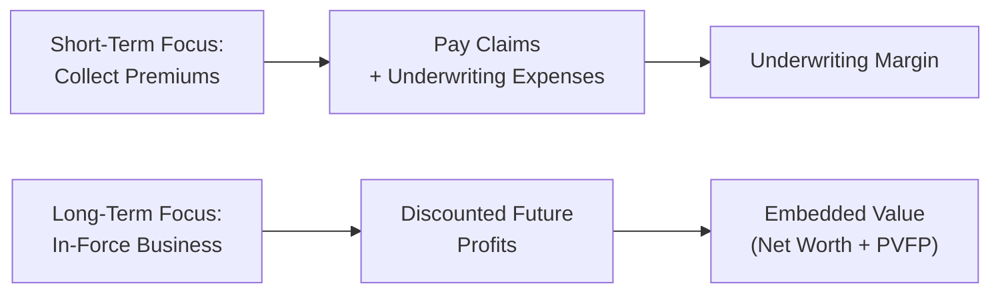

## Introduction

Ever wonder how an insurance company really makes money? Sure, they collect premiums, pay out claims, and (hopefully) invest capital wisely. But if you dig into insurers’ financial statements, you’ll quickly spot two key measures that give a glimpse into the heart of the operation: the underwriting margin and embedded value (EV). Underwriting margin is all about how well an insurer is doing on its core business—taking in premiums and paying claims. Embedded value, on the other hand, is the big picture of long-term value creation, especially for life insurers who juggle multi-decade policy commitments and uncertain future assumptions. In the following sections, we’ll break these down in detail, share a few personal anecdotes, and show you how they fit within your broader financial analysis toolkit for banks and insurance companies.

## Underwriting Margin: The Core of Insurance Profitability

### Definition and Calculation

The underwriting margin is straightforward in concept yet powerful in its insights. It essentially measures how profitable the insurance business is after accounting for claims and the essential costs of underwriting. Formally:

Underwriting Margin = (Premiums – Claims – Underwriting Expenses) / Premiums

• Premiums: The total amount received from policyholders for coverage.  
• Claims: The amount the insurer pays out to policyholders for covered losses.  
• Underwriting Expenses: The costs tied directly to evaluating, pricing, and issuing policies (e.g., underwriting staff salaries, agent commissions, overhead).

The fraction we get at the end is the proportion of premium income that remains after settling claims and paying for underwriting operations. Higher margins typically mean the insurer is pricing its policies sufficiently above claims costs and operational expenses. 

#### A Quick Example

Let’s say a property and casualty (P&C) insurer collects total premiums of $100 million, and throughout the year they pay $60 million in claims while incurring $20 million of underwriting expenses:

Underwriting Margin  
= (100 – 60 – 20) ÷ 100  
= 20 ÷ 100  
= 20%

This 20% underwriting margin indicates the core underwriting function is, at least on the surface, profitable. That’s a good sign for day-to-day stability.

### Interpreting the Margin: Why It Matters

When you see a healthy underwriting margin, you know the insurer’s fundamental approach to risk management, pricing, and claims handling is generally sound. If that margin trends downward—perhaps from 20% to 10% over a few years—it can raise red flags about underpricing risk, increased claims frequency or severity, or rising expenses. 

I recall chatting with a friend who worked in the underwriting department of a regional insurer. One day, he told me how a single bad storm season had completely wrecked their expected underwriting margin for the year. Their combined ratio (a related metric often used in P&C insurance) soared above 100%. That’s just a fancy way of saying claims and expenses exceeded all premium income. So yes, real-world events can knock underwriting margins off track. That’s why analyzing multi-year trends of underwriting margins can be more illuminating than looking at a single year in isolation.

### Common Pitfalls and Points to Watch

• Catastrophic (CAT) Losses: Large-scale events—like hurricanes—spike claims in a short window. An insurer may appear very profitable one year and severely unprofitable the next.  
• Under-reserving: Sometimes, claims reserves (the money set aside for expected future payouts) might be underestimated. That temporarily inflates the underwriting margin, only to correct downward in later periods.  
• Expense Allocation: Administrative or investment expenses can mistakenly be classified as underwriting or vice versa, skewing margin analysis.  

## Embedded Value (EV): Peering into the Future

### What Is Embedded Value?

Underwriting margins generally look at performance on a shorter horizon. Embedded value (EV), however, is all about the long game, particularly for life insurers. It represents the present value of future expected profits from in-force insurance business (policies already sold and active) plus an adjusted net asset value.

You might think, “Huh, can’t we just use standard accounting statements for that?” Well, IFRS or US GAAP might not fully capture the long-term profitability of life policies that can stretch decades. That’s where EV steps in. It’s an actuarial-based measure that sums up the insurer’s “net worth” with the projected future profit streams on policies already on the books.

### Components of Embedded Value

Conceptually, we can view EV as:

• Adjusted Net Asset Value  
• Plus: Present Value of Future Profits on In-Force Business

Check out the following visual representation of EV’s basic structure:

```mermaid
flowchart LR
    A["Adjusted Net Asset Value"] + B["Present Value of Future Profits on In-Force Business"] --> C["Embedded Value (EV)"]
```

- A["Adjusted Net Asset Value"]: This is the insurer’s net assets, adjusted for intangible items or any needed fair value adjustments.  
- B["Present Value of Future Profits"]: Spreads the future streams of profit from existing policies out over time, discounting them back to today.  

So if an insurer’s adjusted net asset value is $200 million, and the PV of future profit on in-force business is $500 million, the embedded value is $700 million.

### Importance for Life Insurers

Life insurers promise coverage for potentially decades, facing uncertain mortality, morbidity, and policy lapses. EV tries to account for these uncertainties, factoring in interest rates, discount rates, projected policy lapses, and more. By looking at changes in EV over time, analysts can see if the insurer is generating profitable new business, whether assumptions are realistic, and how sensitive the overall portfolio is to the many variables that swirl around life insurance.

#### Key Assumption Areas

• Mortality/Morbidity Rates: Overly optimistic mortality assumptions can inflate EV, but real-world conditions might differ.  
• Lapse Rate: If more policyholders terminate early than expected, the future profit stream shrinks, lowering EV.  
• Expenses and Overheads: High expense loads reduce future profit margins.  
• Discount Rate: Higher discount rates reduce the present value of future profits; lower discount rates boost EV, so the choice of rate can significantly influence reported EV.

## Market Consistent Embedded Value (MCEV)

While traditional embedded value is based on internal assumptions, some insurers and regulators have transitioned to Market Consistent Embedded Value (MCEV), which uses market-based discount rates and assumptions, aiming to align insurance valuations with “fair value” or “mark-to-market” principles. MCEV can reduce some of the guesswork by grounding calculations more firmly in observable market data—like bond yields and option prices that reflect the cost of guarantees.

## Tracking EV Over Time: EV Earnings and New Business Value

### EV Earnings

Insurance companies often publish an “operating EV earnings” figure. This metric typically removes the impact of market movements to show the underlying performance of the in-force business. Positive operating EV earnings suggest the policies in force have performed better than or as expected; negative figures might suggest claims are higher than expected or that mortality assumptions were too optimistic.

### New Business Value (NBV)

EV isn’t just about the old policies. To measure the value created by freshly sold policies over a certain period, insurers will calculate New Business Value (NBV). Combining NBV with changes in the value of in-force business plus experience variances and assumption updates provides a comprehensive picture of how an insurer’s overall embedded value evolves over time.

## Practical Example: Simple Embedded Value Calculation

Let’s run through a hypothetical to see how it might work, in very simplified form:

• Adjusted Net Asset Value (ANAV): $300 million.  
• Projected Future Premiums from In-Force Policies: $1 billion (over many years).  
• Projected Future Claims and Expenses: $900 million.  
• Projected Future Profits (un-discounted): $1 billion – $900 million = $100 million.  
• Assume a discount rate of 5%, and the present value of future profits (PVFP) = $80 million.  

Hence, the total EV = $300 million + $80 million = $380 million.

Now, if we changed the discount rate to 6%, the present value of that $100 million might drop closer to $75 million, bringing the EV to $375 million. So small changes in assumptions can lead to material swings.

## Real-World Considerations

### Impact of IFRS 17 or US GAAP Updates

Regulations like IFRS 17 try to standardize how insurers measure their liabilities, and in many aspects, such regulations approach the concept of future profitability and how best to reflect it on current statements. However, even with IFRS 17 or US GAAP changes, embedded value or MCEV metrics may still give management and analysts a deeper look at profitability not visible in statutory or traditional accounting measures. 

### Changes to Demographics and Medical Advances

I remember reading about how improvements in healthcare—like newly available drugs or procedures—affected the longevity of certain insured populations, pushing life insurers to reexamine their mortality assumptions. A small improvement in life expectancy can create huge waves in the present value of future policy liabilities. This is more or less the “experience variance” at play. If folks are living longer, insurers might be paying out for longer durations (for annuities) but might also collect more premiums in the meantime (depending on the product). These shifting realities show up in embedded value updates.

### New Product Design

Insurers constantly develop new products—like variable universal life insurance or certain rider options. The profit profile of these new products might differ substantially from existing lines. EV analysis can highlight the potential value of these new lines and whether or not the company is effectively expanding its business.

## Best Practices and Pitfalls

1. **Maintain Consistency in Assumptions**  
   If you’re analyzing multiple insurance companies, ensure you’re aware of each one’s assumption sets—mortality rates, discount rates, lapse rates, etc. They might differ by region, regulatory environment, or even company-specific experience data.

2. **Sensitivity Analyses Are Key**  
   Conducting “what-if” scenarios on discount rates, mortality, and lapse rates is critical. This reveals how stable or volatile the EV might be under changing market conditions.

3. **Don’t Overlook Management’s Discretion**  
   In underwriting margin calculations, managers might shift certain expenses or reserve estimates. For EV calculations, they might choose a higher discount rate or more optimistic mortality assumptions. Always keep an eye on any potential bias that can creep into these numbers.

4. **Market Consistent vs. Traditional Approaches**  
   MCEV adds transparency by tying valuations to observable market data, but it’s not foolproof. Market prices themselves can be volatile. In times of crisis, MCEV might swing drastically due to market dislocations.

## Diagram: Underwriting Margin vs. Embedded Value

Here’s a simple flowchart illustrating how underwriting margin and embedded value operate in two distinct time frames:



• Underwriting Margin (left branch) zeroes in on year-to-year or shorter-term performance.  
• EV (right branch) projects multi-year results and adds them to current net assets for a fuller picture.

## Conclusion: Putting It All Together

Underwriting margin and embedded value provide two angles on insurance company performance—near-term risk pricing and long-term profitability. If underwriting margins are consistently positive, it generally signals core strength in pricing and risk selection. Meanwhile, a healthy and growing embedded value indicates the insurer’s in-force business is set to generate robust future profits, especially if those assumptions stand up to scrutiny. Combine these insights with other financial statement analysis techniques (including ratio analysis, segment reporting, and stress testing), and you’ve got yourself a powerful toolkit for dissecting insurers’ financial health.

So the next time someone asks, “Which insurance companies are most likely to thrive over the next decade?” you can talk about underwriting margin, embedded value, and the assumptions that drive them. You’ll be that friend who “gets” the long-term perspective. It’s a fantastic place to be.

## References and Further Reading

• CFO Forum, “Principles of Embedded Value Reporting,” a key resource for understanding embedded value methodologies.  
• Atkinson, D.B. & Dallas, J., “Life Insurance Products and Finance,” an in-depth guide on embedded value calculations and product considerations.  
• International Actuarial Association (IAA), MCEV Methodology Papers: <https://www.actuaries.org/>  
• For more on IFRS 17, see IFRS Foundation’s official site: <https://www.ifrs.org/>  
• Official CFA Institute Curriculum for further readings on insurance company financial analysis.

## Test Your Knowledge: Underwriting Margins and Embedded Value Analysis



### 1. Which of the following best describes the underwriting margin?

- [ ] The ratio of premiums collected to total assets
- [x] The ratio of (Premiums – Claims – Expenses) to Premiums
- [ ] The ratio of investment income to net premiums
- [ ] The ratio of claims paid to total liabilities

> **Explanation:** Underwriting margin is calculated as (Premiums – Claims – Underwriting Expenses) / Premiums. It indicates the profitability of the core insurance function.

### 2. Which one of the following statements about embedded value (EV) is most accurate?

- [ ] EV only reflects an insurer’s net assets
- [x] EV includes adjusted net assets plus the present value of profits on in-force business
- [ ] EV is merely a fancy name for statutory equity
- [ ] EV excludes future profits from existing policies

> **Explanation:** Embedded value looks beyond net assets and captures the present value of in-force business. This is critical for long-term insurance profitability.

### 3. A life insurer calculates an embedded value by using a high discount rate. This will typically:

- [ ] Increase the present value of future profits
- [x] Decrease the present value of future profits
- [ ] Not affect the insurer’s liabilities
- [ ] Have no impact on the insurer’s net worth

> **Explanation:** A higher discount rate reduces the present value of future cash flows, thereby decreasing the embedded value.

### 4. What is one clear benefit of Market Consistent Embedded Value (MCEV)?

- [ ] It can be computed without any market data
- [ ] It disregards economic assumptions
- [x] It ties the valuation of liabilities and future profits to observable market prices
- [ ] It eliminates the need for discounting cash flows

> **Explanation:** MCEV aligns embedded value calculations with real-world market data, improving comparability and consistency.

### 5. Which of the following would most likely increase an insurer’s underwriting margin?

- [x] Enhancing risk selection, leading to fewer claims
- [ ] Dramatically reducing discount rates on future profits
- [x] Cutting underwriting costs through efficient automation
- [ ] Excluding reinsurance premiums from the calculation

> **Explanation:** Fewer claims and lower underwriting expenses both increase the numerator of (Premiums – Claims – Expenses). Changes to discount rates affect EV, not underwriting margin. Reinsurance’s effect depends on net premiums vs. net claims.

### 6. When evaluating an insurer’s underwriting margin over time, you should be most cautious about:

- [x] Reserving practices that may understate claim liabilities
- [ ] Short-term interest rate fluctuations
- [ ] Commission structures that increase premium volume
- [ ] All claims being perfectly predictable

> **Explanation:** Under-reserving can artificially inflate underwriting margin in the short run, calling into question the margin’s reliability.

### 7. New Business Value (NBV) in embedded value analysis is best described as:

- [ ] The present value of all historical policy profits
- [x] The present value of future profits from newly sold policies
- [ ] The difference between claims paid and premiums received
- [ ] A metric specific to property & casualty insurance

> **Explanation:** NBV isolates the contribution to EV from new policies sold during a period, reflecting how profitable the new business is.

### 8. Which factor directly affects both underwriting margins and embedded value?

- [x] Higher than expected claim frequency
- [ ] Changes in statutory tax rates only
- [ ] Changes in bond yields (with no other assumption updates)
- [ ] Historical cost depreciation policies

> **Explanation:** Higher claim frequency reduces underwriting margins and can alter the EV assumption for future claims. Bond yields are more closely related to discount rates for EV, and taxes or depreciation do not directly affect underwriting margin.

### 9. Experience variance in embedded value analysis refers to:

- [x] The difference between actual performance and the assumptions used
- [ ] The difference between new business and in-force business
- [ ] A measure of only the lapse rates
- [ ] A component of underwriting margin

> **Explanation:** Experience variance captures deviations in actual mortality, lapse, expenses, etc., when compared to the original assumptions underlying EV.

### 10. True or False: A significant drop in the underwriting margin always means the insurer’s embedded value will also decline.

- [x] True
- [ ] False

> **Explanation:** Generally, a persistently lower underwriting margin signals deteriorating performance, likely reducing future expected profits and eventually the embedded value—though the magnitude of impact depends on other factors, such as investment income and changes in assumptions.


