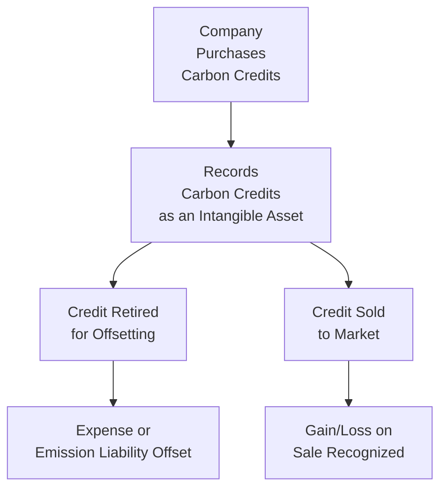

## Understanding Potential ESG Liabilities and Intangible Assets

It’s no secret that ESG (Environmental, Social, and Governance) factors are playing an ever-growing role in financial analyses. You might have already seen that companies with robust sustainability initiatives can reap benefits like enhanced brand loyalty—and, well, sometimes also face risks like lawsuits and reputational damage if they don’t follow through. When it comes to the financial statements, ESG considerations can introduce intriguing perspectives on intangible assets (like carbon credits or brand reputation) and potential liabilities (like carbon offset obligations). In this section, we’ll dive into how these items can surface in a company’s balance sheet, income statement, and cash flow statement, while highlighting both the opportunities and pitfalls for analysts.

## Key ESG Intangibles: Carbon Credits and Beyond

Carbon credits are often the poster child for ESG-related intangible assets. However, we shouldn’t forget other intangible benefits and risks that might not always turn up in a straightforward manner on a company’s books. For instance, philanthropic pledges, brand reputation, and regulatory compliance obligations are all relevant to an ESG-driven analysis. Let’s explore each in turn.

### Carbon Credits as Intangible Assets

Carbon credits represent the right to emit a certain volume of greenhouse gases (GHGs); they can be purchased in regulated or voluntary markets—or awarded to companies for achieving verifiable emissions reductions. Under IFRS, carbon credits are typically recognized as intangible assets if they meet the usual criteria for intangible assets (e.g., identifiable, controllable, and expected to provide future economic benefits). US GAAP has similar requirements, though the details can vary.

• Acquisition Cost vs. Fair Value:  
  – Some firms record carbon credits at acquisition cost.  
  – Others, especially those in jurisdictions allowing revaluation, might opt for periodic fair value measurement.  
  – Whichever method is chosen, companies must ensure consistency with local standards (IFRS or other GAAPs).

• Disposal and Usage:  
  – If credits are sold, the difference between the carrying value and sale proceeds is typically recognized as a gain or loss on the income statement (see also Chapter 2, “Analyzing Income Statements”).  
  – Credits retired (used to offset emissions) often move out of intangible assets with no direct proceeds, resulting in expense recognition or charge against relevant emission-related liability.

• Uncertain Pricing and Volatility:  
  – Voluntary carbon markets can be less regulated, which means pricing can swing a lot.  
  – Analysts should watch out for volatility that may require revaluation adjustments, especially under IFRS 13 or ASC 820 (if the fair value method is used).  

Below is a quick visualization of how carbon credits can flow through a firm’s financial statements:

## Potential Liabilities from ESG Commitments

Aside from carbon credits, businesses may find themselves with significant ESG-related liabilities—especially if they commit to emission caps or philanthropic pledges but cannot fulfill those promises.

### Liabilities from Emission-Reduction Contracts

If a company contracts to deliver a specified volume of carbon offsets to a counterparty (or under a regulatory scheme) but then struggles to secure enough carbon credits, it could be on the hook for damages or penalties. These obligations may need to be accounted for under IFRS 9/IFRS 15 or US GAAP equivalents depending on contract specificity.

• Contractual Obligation:  
  – A legally binding agreement to supply carbon offsets or reduce emissions might create a financial liability if non-performance leads to monetary penalties.  
  – Keep in mind that these might show up as provisions (see Chapter 3 on “Analyzing Balance Sheets” for a refresh on provisions and contingent liabilities).

• Regulatory Fines and Penalties:  
  – If local or international regulations require a company to reduce emissions and it fails to comply, the firm could face fines.  
  – Such fines, once probable and measurable, are recognized as liabilities on the balance sheet.

### Philanthropic Pledges

I remember chatting with a CFO who was super proud of his company’s big philanthropic pledge to plant thousands of trees in the next 10 years. What they didn’t realize at first is that if the commitment is indeed binding (in the sense of creating a constructive or legal obligation), part of that philanthropic pledge may need to be recognized as a liability and an expense (spread out over time, subject to specifics of the contract and accounting policies). Though philanthropic pledges aren’t your typical commercial transaction, they can signal a moral or constructive obligation enforceable by a third party or by public accountability.

• Disclosures:  
  – Watch for footnotes (see Chapter 1, “Introduction to Financial Statement Analysis”) to catch these philanthropic obligations if not recognized directly on the face of the statements.  
  – In the US, some nonprofits use specific guidance (FASB ASC 958-605), but for your typical corporation, it’s usually a matter of whether the pledge is legally binding or just aspirational.

## Intangible Benefits: Brand, Reputation, and Goodwill

Sometimes the intangible assets linked to ESG go beyond the formal definition of intangible assets on the balance sheet. Think about a company that invests heavily in sustainable supply chains, workforce diversity, and community relations. Those initiatives might cultivate a positive brand image, loyalty, or reduce regulatory risk. But intangible brand benefits can be tricky to measure:

• Brand Equity:  
  – A consistent record of fulfilling sustainable promises can enhance brand value.  
  – While IFRS or US GAAP do not usually allow internal brand creation costs to be capitalized, that brand can still factor into long-term future earnings potential or potentially become part of Goodwill if acquired in a business combination.

• Reputational Risks and Contingent Damages:  
  – Negative ESG events (like large-scale environmental damage) can quickly devalue brand perception, leading to intangible costs that analysts must weigh.  
  – If negative publicity shortens product lifespans or shrinks customer demand, expect to see intangible write-downs in tests for asset impairment. Even if intangible brand value is not recognized on the books, broader impairment impacts could show up on goodwill or other intangible assets.

## Measuring ESG Intangibles: Major Accounting Approaches

Let’s circle back to how these intangible ESG assets—particularly carbon credits—might be measured. IFRS (IAS 38) and ASC 350 under US GAAP govern intangible asset recognition and measurement. Although carbon credits are not singled out in older standards, accounting bodies and practice guides often point to one of the following approaches:

• Cost Model (IAS 38):  
  – Assets carried at cost, minus accumulated amortization or impairment losses.  
  – Straightforward, but might not reflect market fluctuations in carbon credit prices.

• Revaluation/Fair Value Model (IFRS 13):  
  – Permits periodic revaluation to reflect changes in fair value, as long as an active market or reliable valuation method exists (IFRS 13/ASC 820).  
  – This can introduce volatility in earnings if revaluation changes are booked in profit or loss.

When performing ratio analysis (see Chapter 13, “Financial Analysis Techniques”), it’s crucial for analysts to understand the measurement approach because intangible asset volatility or trend distortions can ripple through the company’s key metrics (e.g., return on assets, debt-to-equity).  

## Uncertain Forward Markets and Volatility

One reason ESG issues can be challenging is the evolution and unpredictability of carbon markets and associated regulatory frameworks (e.g., Emission Trading Schemes). A region’s approach can shift, causing carbon credit prices to spike or crumble. In turn:

• Impact on Forecasting and Valuation:  
  – Forecasting revenue, EBITDA (see Chapter 2), or free cash flow (see Chapter 4) gets trickier when carbon-credit-related income is uncertain.  
  – Scenario analysis (as explained in Chapter 16) becomes handy: you can model best-case, worst-case, and base-case estimates for carbon credit prices or philanthropic obligations.

• Fair Value vs. Market Liquidity:  
  – Thinly traded credits might have wide bid-ask spreads, complicating fair value measurement.  
  – Some companies use a combination of Level 2 or Level 3 inputs under IFRS 13/ASC 820, meaning more subjectivity in measurement (see Chapter 3 for a deeper look at fair value hierarchy).

## Common Pitfalls and Best Practices

• Pitfall: Ignoring Off-Balance-Sheet Obligations  
  – If a company signed a major ESG commitment that doesn’t meet the strict recognition criteria, you might not see it on the balance sheet—but it can still have real financial consequences. Don’t overlook footnotes or management discussion and analysis (MD&A).

• Pitfall: Overestimating Intangible ESG Benefits  
  – Sometimes companies claim intangible “ESG brand value” that they can’t back up. The result could be unrealistic valuations for M&A or flawed financial modeling.

• Best Practices:  
  – Use footnote disclosures extensively to piece together obligation details (similar to evaluating pension or lease commitments).  
  – Consider external data from sustainability rating agencies or carbon markets for supportive evidence.  
  – Encourage management to detail assumptions on carbon credit pricing or philanthropic pledge timing for better clarity.

## Practical Examples and Case Studies

• Case: A Utilities Company in a Regulated Emission Trading Scheme  
  – The firm purchased carbon credits at $20/ton. Over time, the spot price soared to $35/ton. Under a fair value model, the company recorded a revaluation gain in its income statement. Then, the next year, the price collapsed to $15/ton, forcing a revaluation loss. Investors saw big swings in reported net income, illustrating how “paper gains” or “paper losses” can overshadow underlying operating performance.

• Case: A Consumer Brand with a Major Sustainability Pledge  
  – After announcing a plan to go “net zero” by 2030, the brand discovered that certain commitments could become enforceable if they fell under new legislation. Although most of the costs would come in future years, the CFO set up a provision to reflect the probable outflow. This increased liabilities on the balance sheet, softened near-term profitability, but helped avoid regulatory fines in the future.

• Case: An Apparel Company’s Reputation Dilemma  
  – A prominent apparel company prided itself on robust labor standards. However, a supply chain scandal impacted brand perception. Even though brand equity wasn’t capitalized on the balance sheet, the event triggered a goodwill impairment test in a subsidiary that had acquired intangible brand rights. The result: the company recognized an impairment of intangible assets, revealing how reputation can erode financial statement value indirectly.

## Looking Ahead: The Evolving ESG Landscape

ESG reporting standards and expectations continue to evolve (as mentioned in earlier ESG sections of this chapter). The IFRS Foundation established the International Sustainability Standards Board (ISSB) to create consistent global disclosure standards—which may include standardized accounting and reporting around carbon credits and other ESG intangible assets. Any changes in IFRS or new local GAAP guidance can reshape how companies recognize, measure, and disclose ESG items. As an analyst, it’s vital to keep an eye on these developments:

• Standardization of Carbon Markets:  
  – Initiatives by bodies like the World Bank’s Partnership for Market Implementation aim to standardize trading and reduce fragmentation.  
  – Over time, carbon credit pricing might stabilize with better liquidity and transparency.

• Enhanced Disclosure Requirements:  
  – Regulators worldwide are zeroing in on climate-related disclosures, possibly leading to more standardized inclusion of carbon credits on the balance sheet or in the notes.  
  – Could see expansions to IFRS 7 or IFRS 9 for “green financial instruments.”

Ultimately, the more you dig into ESG disclosures, the likelier you are to spot both intangible assets and lurking liabilities that affect valuation and risk. As these items mature, we’ll probably see a broader shift toward mainstream acceptance of carbon credits and ESG intangibles in standard financial analysis.

## References and Further Reading

• Weston Anson, “Valuing Intangible Assets.”  
• World Bank Partnership for Market Implementation – Carbon Markets and Emissions Trading Schemes:  
  https://www.worldbank.org/en/programs/pmr  
• IFRS Foundation (https://www.ifrs.org/) – updates on the International Sustainability Standards Board (ISSB).  
• Chapter 2 (Analyzing Income Statements), Chapter 3 (Analyzing Balance Sheets), Chapter 13 (Financial Analysis Techniques), and Chapter 16 (Building a Company Financial Model) in this same volume for deeper exploration of intangible assets, ratio analysis, and forecasting techniques.

Anyway, that should give you plenty to think about when you analyze ESG-driven intangible assets and liabilities. Keep an eye out for those philanthropic pledges, hidden emission reduction obligations, or intangible brand value that can shape a firm’s bottom line far more than we might initially expect.

-----

## Test Your Knowledge: Potential ESG Liabilities and Intangible Assets Quiz



### 1. Which of the following circumstances is most likely to create a recognized intangible asset related to ESG on a company’s balance sheet?

- [x] Purchasing carbon credits to meet government-mandated emission requirements
- [ ] Funding community programs with no legally binding pledge
- [ ] Having a good reputation for environmental initiatives
- [ ] Publicly announcing a vague plan to reduce emissions by 2050

> **Explanation:** Purchased carbon credits meeting accounting criteria (identifiable, controllable, and providing future economic benefit) can be capitalized as intangible assets. Community programs or public announcements are typically voluntary or lacking sufficient specificity to be recognized as intangible assets.

### 2. A firm commits to deliver carbon offsets to a customer by year-end. Due to changing market conditions, the company cannot secure enough credits. What is the most likely accounting implication?

- [ ] Recognize a revaluation gain on intangible assets
- [ ] Increase goodwill on the balance sheet
- [x] Record a liability for potential penalties or damages
- [ ] Write off existing intangible assets

> **Explanation:** Failure to deliver offsets under a legally binding contract will likely result in a liability for penalties or damages.

### 3. Carbon credits on the balance sheet can be measured using:

- [x] Either cost or fair value models, depending on the applicable accounting framework
- [ ] Only historical cost
- [ ] Only fair value based on IFRS 15
- [ ] Net realizable value under IAS 2 (Inventories)

> **Explanation:** Under IAS 38, companies may measure intangible assets at cost or revaluation (fair value) if there is an active market and they choose to use the revaluation model. IFRS 15 addresses revenue from contracts, not intangible asset measurement, and carbon credits are generally not classified as inventory under IAS 2 unless they are held for sale in the ordinary course of business.

### 4. A company has pledged to donate a certain amount to environmental charities over the next five years. Under what condition might this pledge be recognized as a liability?

- [ ] The charity has excellent ESG practices
- [x] The pledge constitutes a constructive or legal obligation enforceable by a third party
- [ ] The donation is larger than 25% of annual net income
- [ ] The company uses the revaluation model for intangible assets

> **Explanation:** If a philanthropic pledge is legally binding or creates a constructive obligation that is enforceable, it may be recognized as a liability. Merely being large or beneficial to a well-regarded charity is not enough.

### 5. Why might an ESG-related brand value not appear as an intangible asset on the balance sheet?

- [ ] Because IFRS requires immediate capitalization of brand equity
- [x] Because internally developed brand equity typically does not meet capitalization criteria
- [ ] Because negative brand value is typically recognized instead
- [ ] Because brand equity is measured under IFRS 9

> **Explanation:** Brand value that is internally generated does not meet the identification and separability criteria for intangible assets and therefore is not capitalized.

### 6. How does a company typically account for the retirement of carbon credits used to offset its emissions?

- [x] The intangible asset is derecognized, and an offsetting entry reflects the emissions liability reduction
- [ ] The intangible asset is revalued upward, increasing income
- [ ] A goodwill impairment is required
- [ ] It recognizes a new intangible asset at the market value of the retired credits

> **Explanation:** Retiring carbon credits removes them from the balance sheet. Often, the offset is recorded against an emission liability or recognized as an expense, depending on prior accounting treatments.

### 7. Which of the following best describes the main risk associated with volatile carbon credit prices for a company using fair value measurement?

- [ ] The company can capitalize the fluctuation as brand equity
- [ ] There is no impact, as carbon credits cannot be revalued under IFRS
- [x] Profit or loss can become subject to large swings if the credits are revalued each reporting period
- [ ] Management is not allowed to disclose the volatility in footnotes

> **Explanation:** Under the fair value model, changes in market prices can cause material fluctuations in the company’s reported net income.

### 8. Negative publicity from an ESG scandal may indirectly require adjustments in a company’s financial statements if:

- [x] It leads to an impairment of recorded goodwill or other intangible assets
- [ ] The firm has no intangible assets recorded
- [ ] The scandal involves an unrelated third party
- [ ] Management believes no reputational damage has occurred

> **Explanation:** Negative ESG events can reduce the recoverable amount of goodwill or identifiable intangible assets, triggering an impairment charge.

### 9. A firm has recorded carbon credits at cost. During the period, the fair value of these credits tripled in a highly liquid market. Which statement is most accurate?

- [ ] The firm must revalue its carbon credits immediately
- [ ] The firm can reclassify them as inventory at the new market price
- [x] Under cost model, no fair value gain is recognized unless the firm sells or reclassifies them
- [ ] The firm cannot use the cost model for carbon credits

> **Explanation:** When an entity elects the cost model for intangible assets, it does not revalue assets upward for changes in fair value. Gains are only recognized upon disposal or other relevant transactions.

### 10. A company’s philanthropic pledge to an environmental non-profit is accounted for as a legally binding obligation. True or False?

- [x] True
- [ ] False

> **Explanation:** If a pledge meets legal or constructive obligation criteria, then the company will record a liability in its financial statements.


