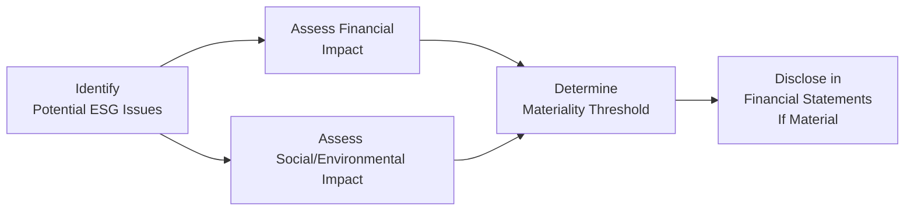

## Overview of ESG Materiality

It’s funny, but when I first started analyzing companies and their financial statements, I never gave much thought to whether environmental or social factors would drastically alter my conclusions. Sure, I’d see the occasional footnote about a big lawsuit for pollution or a workforce strike, but those seemed like isolated cases. Then one day, I worked on a client that was facing a major reputational crisis linked to a product safety recall—suddenly, the entire conversation about “what is material” changed big time. That’s what we’re here to talk about: ESG materiality. It goes way beyond just a percentage of net income or a small footnote in the annual report. It delves into changes in investor sentiment, market perceptions, or even moral outrage that can drive real financial outcomes.

In a nutshell, materiality of ESG (Environmental, Social, and Governance) issues in financial reporting concerns how these factors might impact a company’s financial health—or how the company itself impacts the environment and society. Different jurisdictions and standard-setters may define “material” differently, but the undercurrent is the same: if an ESG matter could influence stakeholder decisions (like whether or not to invest, supply, or regulate), it’s probably material.

## Double Materiality and Broader Stakeholder Impact

One concept you’ll hear a lot is double materiality, which basically signals a two-pronged view:  
• Financial Materiality: Is this ESG issue going to have a direct economic impact on the company’s financial statements?  
• Societal or Environmental Materiality: Does the company’s activity (or or lack thereof) significantly affect the broader community, planet, or other stakeholders?

A few years ago, many folks only focused on the first piece—if a risk didn’t theoretically impact immediate cash flows, it might get dismissed. Now, though, investors, regulators, and the general public pay attention to both. A company can’t simply say “This environmental mess only costs 2% of net income, so it’s irrelevant.” If that spill or compliance infraction sets a legal precedent, triggers new regulations, or leads to widespread reputational losses, it might become material faster than you can imagine.

## Key Regulatory Definitions and Standards

Materiality in ESG is guided by various frameworks. On the IFRS side, IFRS Practice Statement 2 on materiality provides a decision-making framework that encourages companies to consider both quantitative and qualitative factors. Meanwhile, the U.S. SEC guidance has historically required disclosure of material information—though there’s an ongoing debate about how explicitly ESG-related risks should appear. 

What’s interesting is that you might see slight differences in thresholds:  
• IFRS might be principle-based, prompting you to judge from the perspective of a “reasonable investor.”  
• Other jurisdictions—or even specific exchanges—could have more prescriptive rules about disclosing climate risks, workforce safety metrics, or executive compensation structures.  

## Collaborating to Identify ESG Materiality

Determining material ESG items isn’t a one-person job. In practice, the finance team should collaborate with sustainability officers, legal counsel, and investor relations to assess not just numerical significance, but also reputational or operational risk. A few key steps in the collaboration process:

1. Brainstorm Potential ESG Topics: Brainstorm with sustainability officers or internal ESG committees to see what is surfacing in the industry or region.  
2. Legal and Regulatory Input: Check if there’s any active or imminent litigation, or if new regulations might impose additional disclosures or fines.  
3. Investor Relations Feedback: If major investors start querying the company about, say, carbon emissions, that’s a sign the issue might be material.  
4. Board and Governance Oversight: Governance risk (like insufficient board independence) can blow up if left unchecked. You want a strong board that understands emerging ESG considerations.

Proper documentation of each step helps create an audit trail, ensuring you can later show how you arrived at a materiality determination.  



## How ESG Events Affect Financial Statements

Sometimes, ESG events that initially look minor can have huge implications. Let’s say a mining company faces an environmental contamination lawsuit. You might start with just a legal provision for the cleanup cost. But if the press coverage erodes public trust—or the local government cancels the company’s license—that’s a far bigger financial hit.

Here’s how ESG events might alter financial statement items:

• Impairments: If a business segment becomes unproductive or is forcibly closed due to environmental damages, the related assets may need impairment.  
• Contingent Liabilities: Pending legal battles or regulatory fines can necessitate disclosures or provisions in the notes.  
• Changes in Revenue Recognition: Product recalls or negative brand perception might reduce sales or require refunds that affect top-line revenue.  
• Liabilities from Restoration Obligations: In mining or oil and gas, decommissioning or environmental reclamation costs can skyrocket and must be recognized under IFRS or US GAAP.  

### Quick Example

Imagine a beverage company that sources a key ingredient from a region with water scarcity. If that company’s water usage starts causing friction with local communities, it could face operational obstacles, protests, or forced shutdown of certain wells. That’s an ESG factor that, while not strictly numeric at first, can rapidly escalate into lost revenue or forced capital expenditures for new water-treatment solutions. Suddenly, you have a financially material event.

## Sector-Specific Watchpoints

Different sectors face unique ESG considerations. Mining and energy companies often worry about restoration liabilities and environmental remediation. Tech companies might deal with data privacy (S in ESG) or supply chain labor conditions. Each sector might have specific guidance or commonly accepted best practices. 

For instance, IFRS 6 addresses exploration and evaluation of mineral resources, requiring disclosures that could overlap with environmental obligations. Meanwhile, industries dealing with big supply chains (like retail or electronics) might adopt integrated reporting frameworks to highlight labor standards, carbon footprints, and product safety.

## Integrated Reporting and Material ESG Topics

Integrated Reporting (IR) merges financial and sustainability reporting into a single holistic narrative. Instead of burying ESG data in a separate Corporate Social Responsibility (CSR) report that nobody reads, integrated reporting ensures that all stakeholders can see a company’s strategy, performance, and prospects in context. When you open an IR from a forward-thinking company, you’ll often find a robust “Materiality Matrix” pinning down the issues that matter most to both the company and its broader community.

In many cases, the integrated report will signal emerging topics long before the annual financial statements do. If a firm’s integrated report starts highlighting climate risks or data privacy, you might see those risks eventually show up as provisions or disclosures in the main statements. Keep an eye on these integrated or sustainability supplements—they’re typically a few steps ahead of the standard financials in capturing intangible or newly developing concerns.

## Evolving Attitudes Among Investors and Standard-Setters

It’s no secret that mainstream investors pay more attention to ESG factors today than they did a decade ago. Even large institutional investors may deliver questionnaires on corporate governance or environmental data, and your answers can influence the firm’s cost of capital. In response, standard-setters are also pushing for clearer ESG disclosures. The IFRS Foundation has launched the International Sustainability Standards Board (ISSB), which aims to create a global baseline for sustainability-related reporting. Meanwhile, the U.S. SEC has proposed rules requiring climate-related disclosures in filings. 

What does this mean for you as an analyst? The definition of “material” is dynamic, shaped by market sentiment, investor perception, and regulatory momentum. Something that wasn’t deemed material a few years ago—like climate risk—might be considered critical today.

## Practical Formula: Determining Materiality Thresholds

While materiality is often described as “what matters to users,” finance folks still like to anchor it in numbers. A common approach is to set a baseline threshold, say α% of net income, above which an impact is considered material. You could represent that as:


\text{Materiality}_{\text{financial}} = \alpha \times \text{Net Income}


But let’s be honest: that formula is only your starting point. Qualitative factors can override numeric thresholds if an ESG issue carries a disproportionate reputational or operational risk.

## Best Practices and Common Pitfalls

• Document Your Process: Jot down notes, meeting summaries, and rationales for including or excluding certain ESG factors. This helps your external auditor understand your thought process.  
• Avoid “Check the Box” Mentality: Materiality is not purely about some formulaic cutoff.  
• Stay Ahead of the Curve: Keep up with what mainstream investors, industry associations, and regulators define as relevant.  
• Resist the Urge to Minimize: It’s tempting to downplay a possible environmental liability to avoid spooking investors, but under-disclosure can backfire if regulators or class-action lawyers come knocking.

## Personal Reflection

I once saw a consumer goods company nearly overlook a major supplier labor issue because the direct financial cost was small. Then, a major civil society group launched a campaign that slashed brand loyalty. Sure enough, the stock price tumbled, and they had to quickly reassess how to disclose supplier conditions as a potential risk factor. The moral of the story is that if a stakeholder can change your fortunes, it’s material, no matter how trivial it looks on your balance sheet at first glance.

## Example: Python Snippet for ESG Data Parsing (Optional)

Sometimes you’ll have to parse through huge CSR or integrated reports for relevant data. A quick script could help you find keywords or flagged issues:

```python
import csv

def scan_esg_reports(file_path, keywords):
    alerts = []
    with open(file_path, 'r', encoding='utf-8') as f:
        reader = csv.reader(f)
        for row in reader:
            line = " ".join(row).lower()
            for kw in keywords:
                if kw.lower() in line:
                    alerts.append((row, kw))
    return alerts

esg_alerts = scan_esg_reports('sustainability_data.csv', ['carbon', 'lawsuit', 'recall'])
print("Alerts found:", esg_alerts)
```

Yeah, it’s just a toy example, but I’ve found that simple scripts can save hours of manual data searching when you suspect certain ESG trouble spots.

## Exam Tips for Materiality of ESG Issues

• Focus on the notion of double materiality. Remember that both financial and societal impacts matter.  
• Brush up on current trends in ESG standard-setting, especially IFRS Practice Statement 2 and any relevant SEC guidance.  
• Be prepared for scenario-based questions. You might be asked to apply a principle-based approach when deciding whether to treat an ESG factor as material.  
• Don’t forget the intangible angles (reputation, investor sentiments). Sometimes a case study question might revolve around potential brand damage.  
• In essay-type questions, show you can weigh both quantitative thresholds and qualitative aspects, referencing IFRS or other guidance.  
• Make sure you understand how to identify potential liabilities (e.g., environmental or legal provisions) that should be disclosed or recognized in the financial statements.

## References

• International <IR> Framework:  
  https://www.integratedreporting.org/  

• IFRS Practice Statement 2 on Materiality:  
  https://www.ifrs.org/  

• Materiality in Corporate Governance by Justin O’Brien (Legal and Financial Perspectives)  

• Additional Reading on ESG Disclosures:  
  - “ESG Simplified: The Essential Guide to Sustainable Investing,” by Mark Freedman  
  - “Corporate Governance and ESG: Scorecards and Best Practices,” by Kevin J. Eckerle  

## Test Your Knowledge on ESG Materiality



### Which statement best illustrates the concept of “double materiality” in ESG reporting?

- [ ] It focuses only on the financial impact of ESG issues on a company.
- [ ] It defines materiality strictly by a numerical threshold of operating income.
- [x] It considers both financial impacts on the company and the company’s external impact on society/environment.
- [ ] It applies solely to legal compliance issues and mandatory disclosures.

> **Explanation:** Double materiality involves looking at both short- and long-term financial impact on the firm and the broader effect on external stakeholders.

### Under IFRS Practice Statement 2, what is the primary objective when determining materiality?

- [ ] To set a hard percentage threshold for net income changes.
- [x] To identify and disclose information that could reasonably influence the decisions of primary users of financial statements.
- [ ] To ensure standardized ratios across industries.
- [ ] To meet the minimum regulatory requirements across all jurisdictions.

> **Explanation:** IFRS Practice Statement 2 guides companies to consider both quantitative and qualitative aspects that could influence user decisions.

### In assessing whether an environmental fine is material for financial statements, which factor could override a small monetary value?

- [x] Potential reputational impact leading to a drop in long-term sales.
- [ ] Difficulty in calculating the exact cleanup costs.
- [ ] The company’s public relations campaign against the fine.
- [ ] Whether it occurred in a different business segment.

> **Explanation:** Even if the direct cost is low, reputational harm can create larger, indirect impacts that elevate materiality.

### When analyzing ESG disclosures of a food manufacturing company, which scenario most likely indicates a material issue?

- [x] Supplier labor abuse allegations that threaten to halt production and erode brand trust.
- [ ] An isolated mention of higher-than-average electricity usage in one facility.
- [ ] A statement that employees prefer a change in corporate uniforms.
- [ ] A minor editorial error regarding the sustainability policy date.

> **Explanation:** Labor abuse allegations can directly affect the production process, brand integrity, and regulatory scrutiny, elevating them to a material ESG concern.

### Which best describes the relationship between ESG events and contingent liabilities?

- [ ] ESG events can never lead to contingent liabilities due to their optional nature.
- [x] Certain ESG events, like pending environmental lawsuits, may create contingent liabilities that require disclosure or recognition.
- [ ] ESG events only influence the asset side of the balance sheet.
- [ ] ESG events must be realized before any accounting treatment is considered.

> **Explanation:** ESG factors, such as lawsuits or regulatory fines, can create potential obligations that companies must record or disclose when the event is probable or reasonably estimable.

### Why might the concept of “materiality” evolve over time for a given ESG issue?

- [ ] Markets and investor expectations remain constant, making adjustments unnecessary.
- [x] Shifting regulatory, social, or investor attitudes can elevate or lower the significance of specific ESG topics.
- [ ] Once set, materiality thresholds cannot be changed.
- [ ] Only external auditors have the authority to reclassify materiality thresholds.

> **Explanation:** Investor sentiment, regulatory changes, and societal awareness can all transform what’s considered “material” over time.

### In collaborative materiality assessment for ESG, which stakeholder group is most crucial for understanding legal ramifications?

- [ ] Sales and Marketing teams
- [ ] HR Department heads
- [ ] IT Infrastructure managers
- [x] Legal counsel and/or compliance officers

> **Explanation:** Legal counsel is vital for understanding regulatory risks, potential litigation, and compliance issues that significantly influence materiality decisions.

### A beverage company faces water scarcity issues in its supply chain. Which is the most likely cause for deeming this an ESG material issue?

- [ ] No cause for alarm if it only slightly increases operational expenses.
- [x] Water scarcity could jeopardize production and create reputational concerns with local communities.
- [ ] Regulators rarely intervene in water usage matters.
- [ ] Competitors also have the same problem, so it must not be material.

> **Explanation:** Water scarcity can severely affect a beverage company’s operations and local relations, making it material from both financial and stakeholder perspectives.

### Which best characterizes the collaboration process when identifying ESG materiality?

- [x] It involves multiple departments (finance, legal, sustainability) to capture different impacts and risks.
- [ ] It is handled solely by the CFO to maintain confidentiality.
- [ ] It focuses primarily on marketing claims of sustainability.
- [ ] It relies exclusively on an annual board vote regarding ESG disclosure.

> **Explanation:** Effective ESG materiality assessment is cross-functional, ensuring that all relevant insights (legal, operational, financial, reputational) are integrated.

### True or False: Under-disclosure of ESG risks might lead to regulatory scrutiny and potential reputational damage.

- [x] True
- [ ] False

> **Explanation:** If a company omits or downplays ESG risks deemed material, it can face inquiries from regulators and stakeholders, ultimately harming its reputation.


