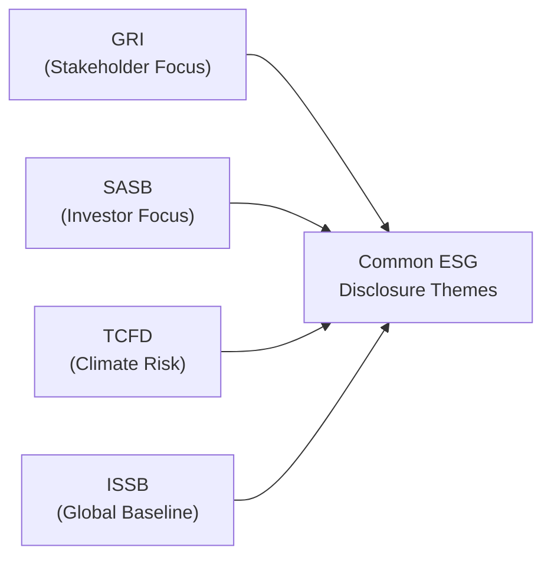

## Introduction

It feels like just a few years ago companies might have squeezed ESG information into a tiny corner of their annual report—or maybe not reported it at all. Now, wow, it’s practically front and center. In today’s world, stakeholders, regulators, and, yes, even your neighbor who invests casually in index funds, are pushing companies to tell us more about their environmental impact, social programs, and governance practices. This shift has led to a surge in reporting frameworks—GRI, SASB, TCFD, <IR>, and the relatively new IFRS Sustainability Disclosure Standards by the ISSB—to name a handful. 

But if you’re new to ESG disclosures, you might wonder: Why so many frameworks and which ones matter most for financial analysis? In this section, we’ll give you a guided tour of the major standards, show you how they differ, and talk about the push for alignment and convergence. We’ll also chat about how CFOs and analysts reconcile multiple reporting formats and ensure that the data stays consistent across them.

## Understanding the Core Frameworks

When you mention sustainability or ESG reporting, you’ll often hear abbreviations thrown around: “GRI,” “SASB,” “TCFD,” and so on. Each one has a slightly different flavor and focus:

### Global Reporting Initiative (GRI)

GRI is like the grandfather of sustainability reporting. Created well before ESG was a buzzword, the GRI Standards aim to help companies report on a wide array of sustainability topics—not just the ones that are financially material. If your friend says, “My company does GRI reporting,” they’re likely covering a range of environmental, social, and governance indicators that matter to a broad group of stakeholders, from local communities to global NGOs. 

• Scope: Broadly focuses on both financial and nonfinancial impacts.  
• Approach: Stakeholder-based materiality (for instance, what’s material to the public, not just investors).  
• Common Use Case: Corporate responsibility or sustainability reports that highlight social impact, carbon footprint, community engagement, supply chain labor standards, and more.

### Sustainability Accounting Standards Board (SASB)

SASB is laser-focused on financial materiality. Founded with the idea that publicly listed companies should disclose ESG data most relevant to investors, SASB developed industry-specific standards. For example, an airline will face different environmental risks than a consumer tech firm, so SASB outlines metrics that respond to each sector’s unique challenges. 

• Scope: Industry-specific—oil companies measure one set of metrics, banks measure another.  
• Approach: Investor-focused materiality (which ESG matters could affect enterprise value?).  
• Common Use Case: Supplemental disclosures alongside traditional financial statements. Analysts often cross-check these metrics when building or adjusting valuation models.

### Task Force on Climate-related Financial Disclosures (TCFD)

The TCFD is all about climate. It zeroes in on climate-related risks and opportunities that can have a major impact on a firm’s financial performance. If you’re concerned about how a massive storm could drain local supply chains or how a greenhouse-gas regulation might erode a company’s margins—this is your framework. 

• Scope: Climate (transition risks, physical risks, governance, strategy, and risk management).  
• Approach: Forward-looking, encouraging scenario planning (such as analyzing a 2°C warming scenario).  
• Common Use Case: Climate-focused disclosures, integrated into annual or sustainability reports. TCFD is often a must-have for companies seeking to reassure investors that they are prepared for climate change.

### International <IR> Framework

While you may have heard less about <IR> in mainstream chatter, the International Integrated Reporting Framework emphasizes how financial and nonfinancial resources (like social capital, natural capital, and human capital) drive value creation over time. Some organizations produce an “Integrated Report” that merges typical financial statements with narrative discussions about intangible assets and broader ESG considerations.

• Scope: Integrated <IR> approach to how a firm creates sustainable value over time.  
• Approach: Emphasizes connectivity between financial and nonfinancial information.  
• Common Use Case: Offering a holistic report that explains how all capitals (financial, manufactured, human, social, relationship, natural, and intellectual) interplay to generate future returns.

### IFRS Sustainability Disclosure Standards (ISSB)

The IFRS Foundation established the International Sustainability Standards Board (ISSB) to harmonize all these sustainability frameworks (at least this is part of the longer-term aim). The ISSB’s initial drafts, known as IFRS S1 (General Requirements for Disclosure of Sustainability-related Financial Information) and IFRS S2 (Climate-related Disclosures), propose a global baseline for ESG reporting. Analysts often get excited about the prospect of having a single, consistent set of rules because it simplifies cross-border comparisons.

• Scope: Broad sustainability matters, with IFRS S2 drilling specifically into climate.  
• Approach: Investor-focused, designed to align with IFRS financial statements.  
• Common Use Case: In time, IFRS S1 and S2 may become the default global standard (especially if regulators in many countries adopt or reference these standards).

## Mapping out the Regulatory Landscape

Beyond voluntary frameworks, there’s a growing wave of regulations requiring ESG disclosures. The European Union is leading the charge with directives like the Non-Financial Reporting Directive (NFRD) and, more recently, the Corporate Sustainability Reporting Directive (CSRD). Even if your company is not in the EU, if it sells goods or services there, it might get pulled into those reporting requirements. It can be a headache—trust me, I’ve witnessed finance teams scramble to figure out which data they need to collect to stay compliant.

Elsewhere, different countries have their own flavors of regulations. The U.S. has historically leaned more on voluntary guidelines, though momentum is picking up, particularly through pending SEC climate disclosure rules. Regardless of where you sit, the key is to keep track of any national or regional developments—these can shift quickly, and for larger, multinational companies, you’d better believe each region’s rules can create extra reporting complexities.

## Why These Frameworks Matter for Financial Statement Analysis

Sometimes colleagues ask me, “ESG frameworks—aren’t they just PR documents?” The short answer: Not anymore. ESG frameworks integrate into the core of financial and risk analysis in ways many of us never expected.

• Customer Demand & Brand Reputation: Consumers want ethically sourced products. A miss on labor practices might lead to boycotts—or big revenue losses.  
• Cost of Capital: Lenders are also looking at climate risks. If your business model is in a high-carbon sector with no credible transition plan, you might see higher borrowing costs or trouble getting loans.  
• Operational Efficiency: Resource usage metrics (like water or energy) highlight where you can cut costs, which ties directly to the bottom line.  
• Regulatory Risk: Noncompliance can lead to a range of fines or restrictions.  

If you look at big institutional investors, many now incorporate ESG metrics into their valuation models—a sort of extended fundamental analysis. ESG frameworks standardize key data so that you can cross-compare how, for instance, one mining company is tackling community impacts relative to another.

## Aligning Your Analysis to a Chosen Framework

Few companies adopt every framework. Some may choose GRI plus TCFD. Others might combine SASB metrics with integrated reporting elements. When analyzing ESG disclosures, you’ll want to:

• Identify Framework(s) Used: Understand which frameworks the company aligns with, and check the extent of alignment (partial or full compliance).  
• Assess Data Completeness: Are they reporting all the metrics recommended by their chosen framework, or are they skipping some that might reveal vulnerabilities?  
• Compare Industry Peers: Benchmark the same SASB metric or TCFD-related risk analysis across companies. Using frameworks helps ensure you’re comparing apples to apples.  

To visualize how different frameworks converge or overlap in their focus (stakeholder-centric vs. investor-centric, or broad ESG vs. climate-specific), you can use a diagram like the one below.

In this simplified diagram, note that all frameworks feed into common ESG themes, just from different angles (stakeholders, industry, climate, or broad global approach).  

## Reconciling Multiple Frameworks

It sounds messy, but many companies do reference multiple frameworks. For instance, they might use the TCFD’s four-pillar structure (Governance, Strategy, Risk Management, Metrics & Targets) for climate disclosures and also adopt SASB’s industry-specific metrics to reveal financially material factors. Meanwhile, they might tag on GRI standards to appeal to broader stakeholder concerns outside purely financial metrics.

If you see this in practice, pay careful attention to definitions—SASB might define “employee turnover” differently than GRI, or TCFD might require a certain scenario analysis that the other frameworks don’t. Some quiet confusion can happen when numeric data or KPIs appear inconsistent simply because they were measured under different frameworks. Analysts often need to reconcile or note these discrepancies for a more reliable comparison.

## Evolving Standards and Convergence

The big buzzword you’ll hear is “convergence”—the drive to unify or at least harmonize these frameworks so that companies don’t have to do quadruple the work. The ISSB is a major step forward: IFRS S1 for general sustainability and IFRS S2 for climate are designed to blend the best parts of TCFD, SASB, and more into a single baseline. Over time, we may see more alignment, fewer acronyms, and hopefully less confusion for companies and investors alike.

However, keep in mind that frameworks are also living documents. Each year, boards overseeing GRI, SASB, TCFD, or ISSB might release updates. That’s just part of the deal with ESG—society’s expectations shift, and so do standards.

## Best Practices in Using ESG Frameworks

1. Map Your Materiality: Start by deciding which metrics are material. If you’re a resource-extraction firm, environmental metrics likely rank highest. A consulting firm might care more about workforce diversity.  
2. Ensure Data Consistency: Establish a single data governance process so that the same ESG data points are consistent across frameworks, investor decks, and integrated reports.  
3. Monitor Regulatory Changes: If you operate in Europe, keep a close eye on the CSRD. If you’re in the U.S., watch out for potential new SEC climate disclosure rules.  
4. Audit and Assurance if Possible: More companies are seeking third-party assurance on pieces of their ESG data, which can boost credibility.  
5. Transparency on Framework Selection: If using multiple frameworks, explain how they interrelate and where metrics might differ. This clarity helps analysts interpret data more accurately.  

## ESG Disclosure Quality and Analyst Considerations

Both the CFA Institute and IFRS Foundation highlight that disclosure quality is about accuracy, clarity, and completeness. It’s so easy (and tempting) for a company to tout a few success stories while ignoring bigger issues. High-quality disclosure usually means presenting both positive and negative aspects: that’s a sign of good faith. 

• **Accuracy:** Are disclosures (e.g., greenhouse gas emissions) verified, or are they rough estimates?  
• **Clarity:** Is the disclosure well-organized, maybe with a clear index referencing GRI or SASB metrics?  
• **Completeness:** Do they discuss major ESG impacts, or only highlight the easy wins?  

In practice, you can do a quick “red flag” check. If a firm says it follows TCFD but omits scenario analysis or climate-related risk discussions, you might question whether it’s genuinely applying the framework’s core recommendations.

## Real-World Anecdote

A friend of mine worked at a large consumer goods company that proudly declared it was “following GRI.” But when you flipped through the sustainability section, it was basically just marketing with a few disclaimers. The metrics were all over the place, and they selectively cited only the GRI metrics that made them look good. As an analyst, you’ve got to scrutinize whether the company is fully aligned or cherry-picking. If you’re building an ESG model, partial, inconsistent metrics can lead to big mistakes in risk assessment or scoring.

## Practical Example: Mapping SASB to GRI

Let’s say you’re analyzing a retail company that’s providing data for both GRI and SASB:

• SASB might ask for store-level water usage, focusing on how that usage might affect operating costs and long-term profitability in water-stressed regions.  
• GRI might ask for more general disclosures on water usage in line with public or community impact, including how the brand is managing water scarcity at local sites.  

You might see slightly different boundary definitions (facility-level vs. corporate-level) or slightly different time frames for measuring water consumption. An analyst might have to unify these numbers or note differences in the footnotes.

## References for Further Exploration

• IFRS Sustainability Standards:  
  https://www.ifrs.org/issued-standards/  

• GRI Standards:  
  https://www.globalreporting.org/standards/  

• SASB Standards:  
  https://www.sasb.org/standards/  

• Task Force on Climate-related Financial Disclosures:  
  https://www.fsb-tcfd.org/  

• EU CSRD Overview:  
  https://ec.europa.eu/info/business-economy-euro/company-reporting-and-auditing/company-reporting/corporate-sustainability-reporting_en  

If you want a deeper dive, consider reading official guidance documents from each standard. Also, many business courses and online tutorials walk you through the steps of applying these frameworks in real-world contexts.

## Final Exam Tips

• Don’t forget that exam questions about ESG frameworks often ask you to differentiate between a stakeholder approach (GRI) vs. an investor approach (SASB).  
• Be ready to interpret how partial compliance might affect comparability across firms.  
• Watch out for “trick” questions referencing TCFD scenario analysis or the IFRS S2 climate disclosures. You need to know the core pillars of TCFD and the basics of IFRS sustainability guidelines.  
• Time management: Make sure you quickly map any question on ESG to the relevant framework. Avoid getting lost in the countless details.  
• Expect queries on how these frameworks overlap and how that impacts data reconciliation or reliability for investment analysis.

-----

## Test Your Knowledge: ESG Disclosure Frameworks and Standards



### Which of the following sustainability frameworks primarily emphasizes stakeholder-based materiality?  
- [x] Global Reporting Initiative (GRI)  
- [ ] Sustainability Accounting Standards Board (SASB)  
- [ ] Task Force on Climate-related Financial Disclosures (TCFD)  
- [ ] IFRS Sustainability Disclosure Standards  

> **Explanation:** GRI is known for stakeholder-based materiality, focusing on the interests of broad stakeholder groups rather than exclusively on financially material factors.

### According to SASB, disclosures should primarily focus on:  
- [ ] All possible ESG issues affecting the public, regardless of industry  
- [x] Financially material ESG issues relevant to a specific industry  
- [ ] Supply chain metrics mandated by law in the EU  
- [ ] Governance structures centered on board composition  

> **Explanation:** SASB wants industry-specific disclosures that are financially material to investors, reflecting each industry’s unique environmental, social, and governance risks and opportunities.

### A company claims alignment with TCFD but fails to conduct scenario analysis. What is most likely the main concern for analysts?  
- [ ] The company’s inability to comply with GRI standards  
- [ ] The company’s additive approach to the <IR> Framework  
- [x] The credibility of its climate risk disclosures  
- [ ] The fact that TCFD does not address climate issues  

> **Explanation:** Scenario analysis is a core recommendation of the TCFD. Without it, the credibility and completeness of the company’s climate-related risk disclosures are in question.

### What is one central goal of the new ISSB (International Sustainability Standards Board) under IFRS?  
- [x] Establish a global baseline of sustainability reporting standards  
- [ ] Eliminate stakeholder-based materiality from all frameworks  
- [ ] Replace national financial reporting standards  
- [ ] Focus exclusively on marketing metrics  

> **Explanation:** The ISSB aims to provide a unified global baseline of sustainability disclosures that builds on existing frameworks like TCFD and SASB.

### Under the GRI framework, “completeness” in reporting refers to:  
- [x] Ensuring that all relevant ESG impacts (both positive and negative) are disclosed  
- [ ] Publishing reports in multiple languages for maximum accessibility  
- [x] Disclosing only investor-centric metrics that affect share price  
- [ ] Setting up a third-party assurance team  

> **Explanation:** “Completeness” means covering the full range of material topics and outcomes—both favorable and unfavorable—so that stakeholders get a balanced view of the organization’s impacts.

### When a company references both SASB and GRI reporting in its annual filings, analysts should primarily:  
- [ ] Ignore SASB because it is narrower in scope  
- [ ] Recalculate the figures under IFRS S2  
- [x] Reconcile definitions to understand any differences in reported metrics  
- [ ] Disregard these frameworks because they are voluntary  

> **Explanation:** Each framework can define metrics differently. Analysts must reconcile or map definitions to avoid confusion and maintain comparability across different disclosed metrics.

### The CSRD (Corporate Sustainability Reporting Directive) is best described as:  
- [x] An EU directive that sets out more comprehensive sustainability reporting requirements  
- [ ] A voluntary guideline for international banks  
- [x] A healthcare directive that addresses consumer protection  
- [ ] An investor-led framework specific to greenhouse gas reporting  

> **Explanation:** The CSRD is an EU initiative that expands and strengthens sustainability reporting requirements for companies, not a voluntary guideline or a healthcare directive.

### Which framework is primarily recognized for its climate-specific focus and scenario analysis approach?  
- [ ] ISSB  
- [x] TCFD  
- [ ] GRI  
- [ ] SASB  

> **Explanation:** TCFD (Task Force on Climate-related Financial Disclosures) zeroes in on climate-related risks and opportunities, emphasizing scenario analysis as a crucial tool.

### The IFRS S1 standard, as proposed by the ISSB, can be characterized as:  
- [x] Covering general requirements for sustainability-related financial information  
- [ ] Focusing solely on workplace diversity metrics  
- [ ] Providing new accounting guidelines for intangible assets  
- [ ] Replacing local GAAP for all financial reporting  

> **Explanation:** IFRS S1 is a draft standard that addresses general sustainability-related financial disclosures, intended to complement IFRS S2, which focuses on climate-specific matters.

### True or False: Convergence among ESG frameworks means that companies will soon have zero need to monitor updates from multiple standards.  
- [x] True  
- [ ] False  

> **Explanation:** In theory, the aim of convergence is to reduce the complexity and overlap among multiple frameworks, though in practice, organizations may still track updates to ensure comprehensive coverage and compliance.


