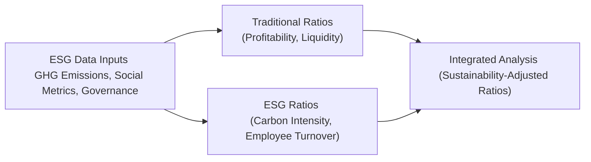

## Overview

ESG (Environmental, Social, and Governance) factors are no longer just a nice footnote in annual reports—they’re becoming mainstream drivers of a company’s valuation, financial performance, and overall market perception. If you’ve ever looked at a company’s financial statements and thought, “Well, these ratios look great, but I wonder if that big litigation cost from a carbon emissions lawsuit is hidden somewhere,” you’re already on the right track to integrating ESG into your ratio analysis. In this section, we’ll explore how to modify or supplement traditional ratio and trend analysis with ESG data, highlight potential pitfalls, and discuss the strengths and limitations of ESG-enhanced financial metrics.

## Linking ESG Factors to Traditional Financial Ratios

Most of us are comfortable with standard ratio categories like liquidity, profitability, solvency, and efficiency. The idea now is to enrich those categories by overlaying ESG considerations like greenhouse gas intensity, employee turnover, or sustainability metrics.

### Common ESG Metrics for Ratio Analysis

• Greenhouse Gas (GHG) Intensity: Measures carbon emissions relative to a specific input (e.g., CO₂ tons per million dollars of revenue).  
• Employee Turnover Rate: Reflects talent retention and corporate culture quality (e.g., turnover as a percentage of total employees).  
• Controversy Score: Aggregates the frequency and severity of negative ESG events like product recalls, labor disputes, or environmental spills.  
• Water Usage per Unit of Production: Indicates efficiency of water usage, especially in resource-intensive industries.  
• ESG Fines or Write-Downs: Any penalties or asset impairments that arise from environmental or social mishaps, such as pollution fines.

### Integrating ESG Metrics with Traditional Ratios

Sometimes, achieving meaningful results is as simple as adding ESG numerators or denominators to classical formulas. For example:

1. Return on Sustainability Investment (ROSI) =  
   (Net Income + ESG-Driven Savings) / Average Equity  

   Where “ESG-Driven Savings” might include cost reductions from energy efficiencies or lower insurance premiums due to improved risk profiles.

2. Adjusted Net Income for ESG Charges =  
   Net Income − ESG−related Fines − Provisions for Environmental Liabilities  

   This figure then flows into your profitability ratios, so that you can evaluate core earnings power excluding adverse ESG impacts.

#### Visual Overview

Below is a simple Mermaid diagram to illustrate the interplay between ESG data inputs, traditional ratio analysis, and the final integrated metrics.

## Absolute vs. Relative ESG Measures

In ESG analysis, you often encounter absolute measures like total CO₂ emissions. But a large absolute emission figure doesn’t necessarily mean the firm is a big polluter relative to its peers. Enter “relative measures,” such as CO₂ per unit of revenue or per unit of production. These types of intensity ratios reveal how efficiently a company operates.

• Absolute Carbon Emissions:  
  A manufacturing plant may produce 10 million tons of CO₂. That sounds huge, but a competitor might produce 12 million tons for a similar level of output.  
• Relative Carbon Emissions (Carbon Intensity):  
  If the first plant emits 1 ton of CO₂ per 1,000 units produced, while the competitor emits 2 tons, the first plant is relatively more efficient, even if its total emissions are close to the competitor’s.

By pairing absolute and relative measures, you get a more nuanced picture of environmental performance, so you don’t end up praising or penalizing a firm purely on raw numbers.

## ESG Events and Anomalies in Financial Ratios

ESG events—like natural disasters, major strikes, product recalls, or large-scale layoffs—can produce abrupt, sometimes misleading, changes in a company's financial ratios. If you see an unusual dip or spike in profitability or liquidity, you might suspect:

• Product Recall: Could drive up costs (warranty claims, returns, lost sales).  
• Strike or Labor Dispute: May elevate costs from temporary workforce or create operational disruptions.  
• Natural Disaster: Might lead to restructuring expenses, insurance claims, or asset write-downs.

When you identify these anomalies, consider adjusting the company’s ratios by removing one-time ESG-related costs or by normalizing the data. This approach might provide a clearer view of the ongoing “business as usual” performance, while maintaining awareness of recurring ESG risks.

## Adjusting Ratios for ESG-Related Fines or Write-Downs

Let’s say a chemical company faces a significant fine for accidental discharge of waste. Traditional ratio analysis might show a troubled bottom line or a spiking leverage ratio that quarter. By deducting the fine from net income, you see the underlying operational metrics more transparently. However, ignoring ESG fines entirely might mask the fact that repeated violations reveal deeper governance issues.

### Adjusted EBIT Margin

Adjusted EBIT = EBIT + ESG Fine (If treated as non-recurring)  
Adjusted EBIT Margin = Adjusted EBIT / Revenue  

Note that if these ESG fines are becoming the “new normal,” you’ll want to reflect them in your core analysis to prevent underestimating risk.

## Investigating Correlations: ESG Performance, Cost of Capital, and Volatility

There is growing evidence that firms with strong ESG performance may benefit from a lower cost of capital over time. Why?

1. Insurance Premiums: Companies with robust environmental controls often pay lower premiums, reducing overhead.  
2. Investor Sentiment: Firms perceived as “sustainable” might enjoy greater demand for their equity, driving up the stock price and lowering the company’s cost of new equity finance.  
3. Operational Resilience: A well-managed supply chain can weather disruptions better, thus reducing cash flow volatility.

On the flip side, poor ESG performance can mean higher volatility in returns (think lawsuits, product recalls, or protests), which can spook investors and lenders alike. Monitoring changes in a company’s controversy score alongside metrics such as beta or standard deviation of returns can offer insights into how ESG issues influence market risk.

## Tracking ESG Trends Over Multiple Periods

Trend analysis is especially important in ESG, because positive changes in environmental impact or social policies might not happen overnight. It’s helpful to:

• Evaluate carbon intensity each year to see if the firm is becoming more or less efficient over time.  
• Monitor employee turnover and see whether management interventions—like improved training and benefits—are sticking.  
• Check water usage trends in a water-scarce region. Failing to improve could signal future supply constraints or regulatory challenges.

A “leading indicator” approach can also help: If you see repeated environmental claims or rising community opposition, that might presage higher costs or even a forced plant shutdown. Incorporating these forward-looking signals can enrich your ratio and trend analysis beyond the strictly historical view.

## ESG as an Early Risk Indicator

Imagine you’re analyzing a large mining operation. Sure, their profit margins might look robust right now, but if local communities are constantly protesting or suing the firm over pollution concerns, that’s an early sign of risk. You might see these warnings in:

• News Mentions: Frequent negative headlines can drive up the firm’s “controversy score.”  
• Regulatory Investigations: Potential for fines or required modifications to operations.  
• Social Media Sentiment: Furious local communities or activist groups can raise the specter of reputational harm.

By integrating these soft signals into your financial analysis, you might identify a ticking time bomb well before it explodes in the official financial statements.

## Communicating ESG Findings

When you communicate ESG metrics, keep it consistent with the same thoroughness you apply to financial results. That might mean including standardized charts or tables that detail metrics like:

• Greenhouse Gas Intensity (year over year)  
• Employee Injury Rates (compared to industry benchmarks)  
• Water Usage per Unit of Output (quarterly trend)  
• Fines or Legal Contingencies (ongoing or settled)

Standard definitions and consistent measures across periods allow apples-to-apples comparisons. Without them, you risk confusion or skepticism from stakeholders (“Are these metrics real or just marketing spin?”).

## Best Practices and Common Pitfalls

• Best Practice – Consistency: Use standardized ESG ratios and keep definitions the same each reporting period.  
• Best Practice – Contextualization: Present relative measures (e.g., carbon intensity) alongside absolute measures to capture the full picture.  
• Best Practice – Reconciliation: Provide clear reconciliation of adjusted metrics—for instance, show how you went from net income to “ESG Adjusted Net Income.”  

• Pitfall – Greenwashing: Some firms may emphasize the few ESG data points that look good while omitting the bigger negative aspects.  
• Pitfall – Overlooking Materiality: Not all ESG factors are equally relevant to all industries. Overemphasizing immaterial metrics can mislead your analysis.  
• Pitfall – Comparability Challenges: Different ESG scoring agencies use different methodologies, so comparing two companies’ scores might be more complicated than it looks.

## Quick Case Study: Hypothetical Manufacturing Company

Suppose we have a fictional firm, Sustaino-Tech Inc., which produces eco-friendly packaging material. They’ve reported a significant increase in net income this year. However, they also incurred an ESG fine for failing to meet a new air quality regulation. Let’s see how we might adjust their performance metrics:

1. Original EBIT = $300 million  
2. ESG Fine = $20 million (treated as a one-time cost, though repeated fines might not be “one-time”)  
3. Adjusted EBIT = $300 million + $20 million = $320 million  
4. Adjusted EBIT Margin = $320 million / $2,000 million in revenue = 16%

If you left out the ESG fine, the firm’s EBIT margin would have been 15%. By including and clearly labeling the adjustment, you highlight the difference between pure operational results and penalized costs.

### Does ESG Affect Their Liquidity?

Look at the quick ratio:

Quick Ratio = (Cash + Marketable Securities + A/R) / Current Liabilities

If Sustaino-Tech Inc. had to pay the entire $20 million fine immediately, that reduces their cash position. So, you might see a dip in the quick ratio. This direct link between an ESG penalty and short-term liquidity underscores why ESG events matter for everyday ratio analysis.

## Exam Tips for ESG-Enhanced Financial Analysis

• Focus on Materiality: For exam questions, emphasize the ESG factors most pertinent to the company’s industry.  
• Compare Over Time: Show how ESG data might shift the direction of trend analysis—particularly if new regulations or controversies appear.  
• Justify Adjustments: Be ready to explain why you’ve decided to adjust or not adjust for certain ESG events or fines.  
• Watch the Questions on Correlations: The exam might ask how strong ESG profiles relate to cost of capital or share price volatility.

## Glossary

• Greenhouse Gas Intensity: Measures CO₂ emissions or equivalents per unit of output or revenue, signaling how efficiently a firm uses resources.  
• Carbon Intensity: Similar to greenhouse gas intensity, but specifically focuses on carbon dioxide (CO₂).  
• Adjusted Net Income: Net income minus unusual or nonrecurring charges, including ESG-related charges or litigation.  
• ESG Trend Analysis: Evaluating how a firm’s ESG performance metrics evolve over time.  
• Controversy Score: Reflects the frequency/severity of negative ESG events (e.g., product recalls, legal cases).  
• Sustainability Ratios: Ratios designed specifically to track a company’s ESG performance (e.g., water usage per product, carbon emissions per mg of product).  
• Leading Indicator: A measure that signals potential future impacts (e.g., climbing controversy scores might precede negative financial outcomes).  
• ESG Scoring Agencies: External firms that rate companies’ ESG performance, such as MSCI or Sustainalytics.

## References and Further Reading

• Friede, G., Busch, T., & Bassen, A. (2015). “ESG and Financial Performance: Aggregated Evidence from More Than 2000 Empirical Studies.” Journal of Sustainable Finance & Investment.  
• MSCI ESG Ratings: https://www.msci.com/our-solutions/esg-investing/esg-ratings  
• CFA Institute (Most Recent Edition). “ESG Integration in Corporate Valuation,” from the CFA Institute curriculum.  
• Sustainalytics, “Methodology Overview for ESG Ratings,” at https://www.sustainalytics.com  

-----

## Test Your Knowledge: Integrating ESG in Ratio and Trend Analysis



### 1. Which of the following best represents a relative ESG measure?

- [ ] Total carbon emissions of 2 million tons in FY 2025.  
- [x] Carbon emissions per $1 million of revenue.  
- [ ] An ESG fine of $10 million paid.  
- [ ] Number of product recalls in 2025.  

> **Explanation:** Relative measures, such as “carbon emissions per $1 million of revenue,” normalize the data and reveal efficiency, unlike the absolute measure of total emissions.

### 2. A company facing repeated environmental fines for wastewater discharge wants to show a “cleaner” profitability metric. Which is the most appropriate step?

- [ ] Exclude the fines entirely from all reporting.  
- [ ] Capitalize the fines as intangible assets.  
- [x] Identify and highlight Adjusted EBIT or Adjusted Net Income excluding the fines, but disclose them.  
- [ ] Recognize the fines as prior period costs.  

> **Explanation:** Firms often use adjusted metrics (e.g., Adjusted EBIT) to isolate nonrecurring events, but they must clearly disclose them, especially if the events are repeated.

### 3. Analyzing employee turnover over multiple periods as an ESG metric can help:

- [x] Spot trends in labor costs and organizational efficiency.  
- [ ] Eliminate the need for cash flow analysis.  
- [ ] Reduce the importance of profit margin analysis.  
- [ ] Replace all standard financial ratios.  

> **Explanation:** Tracking employee turnover helps assess the sustainability of the workforce, which can affect labor costs and productivity over time.

### 4. A firm’s greenhouse gas intensity decreases yearly. This most likely indicates:

- [x] Improved emissions efficiency relative to output.  
- [ ] A larger absolute carbon footprint despite higher efficiency.  
- [ ] Greater production volume with no change in emissions.  
- [ ] Higher ESG fines.  

> **Explanation:** A downward trend in greenhouse gas intensity typically signals the firm is producing fewer emissions per unit of output, implying greater efficiency.

### 5. If a major product recall leads to a spike in warranty expenses for a car manufacturer, how should an analyst treat this for ESG-adjusted ratio analysis?

- [ ] Ignore the recall and focus on normal operating performance.  
- [x] Consider adjusting the income statement by highlighting the recall as an ESG-related event that distorts profitability.  
- [ ] Postpone analyzing the recall until next year’s filings.  
- [ ] Add the recall costs to cost of goods sold permanently.  

> **Explanation:** Product recalls may reflect broader governance or supply chain management issues, so an ESG-adjusted view might itemize them separately to gauge operational sustainable profit.

### 6. When a firm’s controversy score repeatedly increases over consecutive quarters, the best interpretation is:

- [x] There could be rising reputational or financial risks tied to ESG issues.  
- [ ] The company is fully compliant with all regulations.  
- [ ] The controversy score has no effect on the firm’s future cash flows.  
- [ ] The controversy score only affects intangible assets.  

> **Explanation:** An increasing controversy score indicates growing ESG-related negative publicity or events, which can translate into higher risks or costs down the line.

### 7. Which of the following might signal a lower cost of capital for a company with strong ESG performance?

- [x] Lower insurance premiums and favorable borrowing terms from lenders.  
- [ ] Consistently high employee turnover rates.  
- [x] Investor sentiment shifting toward sustainable assets, increasing stock demand.  
- [ ] Lack of internal controls around environmental standards.  

> **Explanation:** Investors and lenders often perceive ESG-compliant firms as less risky, leading to potentially reduced financing costs. High turnover and poor internal controls can have the opposite effect.

### 8. A firm is heavily criticized on social media for unfair labor practices. Which best describes the role of this as an ESG indicator?

- [x] A leading indicator of potential future strikes or lawsuits.  
- [ ] A trailing indicator that has no further impact on the company.  
- [ ] An event that relieves the company of regulatory burdens.  
- [ ] A sign of increased asset turnover.  

> **Explanation:** Negative coverage for labor disputes may forecast future disruptions or financial impacts, making it an important “leading indicator.”

### 9. Why is it important to disclose and reconcile ESG adjustments in financial statements?

- [x] To provide transparency on how numbers shifted from GAAP metrics to ESG-adjusted metrics.  
- [ ] To hide negative environmental or social impacts from investors.  
- [ ] To inflate profits artificially.  
- [ ] To remove all references to the original GAAP figures.  

> **Explanation:** Clear reconciliation ensures stakeholders understand how adjustments were made and builds confidence in both traditional and adjusted numbers.

### 10. True or False: A decline in absolute carbon emissions always indicates a company is becoming more environmentally efficient.

- [x] True  
- [ ] False  

> **Explanation:** Generally, lower absolute emissions do suggest lesser total environmental impact, but it’s also essential to look at relative measures. Still, in straightforward terms, a decline in absolute emissions is frequently interpreted as improved environmental performance.



-----

**Final Exam Tips**  
1. Materiality Counts: Focus on ESG metrics that truly matter to a company’s operations and avoid burying exam answers in irrelevant data.  
2. Show Both Angles: When presenting ratio analysis, mention both the “as reported” figures and any ESG-adjusted metrics.  
3. Justify Your Adjustments: Examiners often want to see not just the adjusted figure but also a reasoning for why these adjustments are or aren’t warranted.  
4. Keep an Eye on Trends: ESG data is particularly powerful over multiple reporting periods. Link your findings to potential future scenarios or risks.  
5. Time Management: ESG questions may involve reading extra details about controversies or fines. Organize your answer quickly to address the main points.  

By integrating ESG into ratio and trend analysis, you can uncover risks and opportunities that might stay hidden when focusing only on traditional financials. It’s a powerful way to gain a more holistic view of a firm’s performance and long-term viability.
