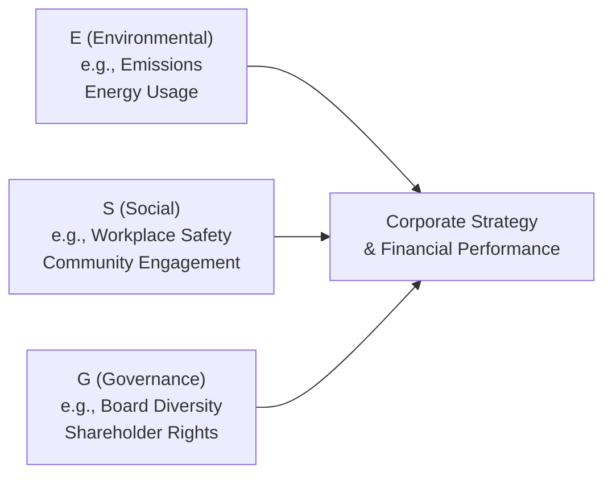

## Introduction

Corporate reporting practices around environmental, social, and governance (ESG) metrics have changed dramatically over the past decade—perhaps more than many of us ever expected. For a lot of companies, ESG used to be a few lines in an annual report talking about, say, a small carbon reduction initiative or a philanthropic project. These days, it’s so much broader and deeper, encompassing everything from greenhouse gas (GHG) emissions to board diversity, gender pay equity, data privacy safeguards, and so on. It’s also become a key discussion point for investors, regulators, and, let’s be honest, some very vocal activists online. This article explores the evolution of corporate ESG reporting, the metrics companies emphasize, and how we can evaluate the reliability and consistency of these disclosures.

Strong familiarity with ESG reporting is crucial in financial statement analysis. Not only can it provide insights into a company’s potential risks and opportunities, but it can also indicate the overall quality of the company’s management and strategy. In practice, the ability to interpret ESG performance metrics is becoming a desirable skill for financial analysts and portfolio managers. You’ll likely see scenario-based questions in which you have to assess how changes to a company’s carbon-emissions goals might affect its long-term liabilities, or whether board diversity could influence the quality of corporate governance and stewardship—both of which align with the CFA Program’s emphasis on integrated thinking.

## Common ESG Reporting Structures

When analyzing how companies present ESG information, you’ll find a range of reporting structures:

• Annual reports: Some companies integrate ESG highlights directly into their annual financial statements. It’s generally a high-level summary of achievements, goals, and maybe a couple of key performance indicators (KPIs).  
• Sustainability reports: These standalone documents—often called “Corporate Sustainability Reports” (CSRs)—offer a more detailed breakdown of ESG performance. They might feature data on water usage, ethical sourcing, labor practices, or community engagement.  
• Integrated reports: According to the glossary, an integrated report is a combined financial and ESG-focused report that aims to present a holistic view of a company’s performance. I still remember the first time I came across an integrated report. It felt almost futuristic—like someone finally realized finance and sustainability topics belong in the same conversation.  

No single model is universally mandated worldwide, but several large markets are now encouraging or requiring more robust disclosures. The European Union’s Corporate Sustainability Reporting Directive (CSRD), for instance, has been pushing for more standardized ESG disclosures, while the International Sustainability Standards Board (ISSB) is rolling out new frameworks that aim to do for sustainability reporting what IFRS did for financial reporting.

## Environmental (E) Metrics

Environmental metrics often emphasize how companies interact with the natural environment and manage climate-related risks. The most common disclosures involve:

• Greenhouse Gas (GHG) Emissions (Scope 1, 2, and 3):  
  – Scope 1: Direct emissions from owned/controlled operations.  
  – Scope 2: Indirect emissions from the generation of purchased electricity, steam, or heating.  
  – Scope 3: All other emissions resulting from a company’s value chain (upstream and downstream).  

• Energy Usage: This might show consumption of electricity from renewable vs. nonrenewable sources and efforts to reduce overall energy intensity.  
• Water Consumption and Waste Management: Some industries, like extractives or heavy manufacturing, highlight water usage, wastewater treatment, recycling efforts, and hazardous waste disposal.  
• Net-Zero Commitments: A pledge to reduce greenhouse gas emissions by a specified date, often offsetting any remaining emissions. You may see interim targets or resource allocations to illustrate how they plan to achieve these goals.  

As a financial analyst, you want to see how the company quantifies these items—especially if they shift over time. For example, if a firm suddenly changes the boundary conditions for its Scope 3 emissions data, that may trigger a jump or a drop that impacts the firm’s reported carbon footprint. Consistency is key, and changes to definitions or measurement methods should be fully disclosed.

## Social (S) Metrics

Social metrics focus on how companies manage relationships with employees, suppliers, customers, and their communities:

• Workplace Safety Incidents: Typically reported as the number of accidents or near-misses per some unit (e.g., per 200,000 hours worked). This can offer insights into a company’s operational excellence and culture of safety.  
• Health and Safety Incidents: Similar to above but may extend to product-safety issues or consumer recalls.  
• Employee Engagement and Turnover: Some companies track turnover rates, employee satisfaction surveys, or average training hours per employee.  
• Community Engagement: Might disclose philanthropic contributions, volunteer hours, or partnerships with local communities.  
• Diversity, Equity, and Inclusion (DEI): This includes data on workforce demographics, gender pay equity, and inclusive policies. Sometimes, the company extends diversity data to the board level—often referred to specifically as “Board Diversity.”

The more detail a company provides, the clearer the picture of its social performance. For instance, we can gauge whether a firm invests in employee development by checking training hours or average training expenditure per employee. We can also see how well the company fosters an inclusive culture by analyzing data on minority representation at different levels of the organization. 

## Governance (G) Metrics

Governance metrics address the structures and processes a company uses to direct and manage itself:

• Board Composition and Independence: Is the board majority independent? What’s the level of diversity, in terms of gender, age, experience, and ethnicity?  
• Executive Compensation: How is pay aligned with performance? Are ESG targets integrated into executives’ bonus structures?  
• Shareholder Rights and Voting Structures: Are the shares equally weighted, or is there dual-class share ownership?  
• Ethics and Anti-Corruption Policies: Does the company provide data on corruption-related fines or policy breaches?  
• Risk Management Frameworks: This can include details on committees overseeing ESG or climate risks and whether they have decision-making authority.

Good governance often underpins strong environmental and social performance. When you see robust risk management structures and regular, transparent reporting to stakeholders, that’s usually a sign that the company takes ESG seriously. On the other hand, if significant controversies or fines keep cropping up, that might hint at a deeper governance or cultural problem.

## Evaluating Consistency and Year-Over-Year Comparability

Consistency is sometimes overlooked, but it’s huge. Maybe you’ve encountered a scenario in which a company said: “Great news! We reduced our emissions by 20% from last year!” But then you dig in and realize they changed their measurement approach or sold a high-emissions business unit. If the methods or organizational boundaries change significantly, year-over-year comparisons might mislead stakeholders. This is why it’s critical to read the footnotes or methodology sections of ESG disclosures.  

Key steps for evaluating consistency include:  
• Checking if the base year has changed for greenhouse gas targets.  
• Identifying whether new acquisitions or divestitures occurred, potentially altering the consolidated boundary.  
• Noting any shifts from one reporting framework to another (for instance, from GRI Standards to SASB).  
• Verifying if restatements of prior-year data are labeled and explained.  

If there’s a lack of clarity, you might consider it a red flag or at least assign lower reliability to the reported data. The CFA Program often emphasizes transparency in financial statements, and the logic also applies to ESG. Assurance from an external party, even if it’s limited assurance, can improve confidence in the data.

## External Assurance and “Limited Assurance”

ESG data audits are performed by specialized consultants or accounting firms. An ESG Data Audit might provide “limited assurance” that the company’s disclosures are plausible and free from major misstatements. More rigorous is “reasonable assurance,” which is closer to a traditional financial statement audit. However, obtaining reasonable assurance is more expensive and requires thorough documentation and stronger internal control processes around ESG data capture.

So why does assurance matter? Well, it’s all about reliability. If a company says it has “been verified by an external assurance provider,” read carefully whether this is limited or reasonable assurance. Typically:

• Limited Assurance: The auditor concludes nothing has come to their attention that suggests the data is materially misstated.  
• Reasonable Assurance: The auditor actively checks various aspects and asserts that the statements are likely accurate within a specified threshold, akin to a financial audit opinion.  

For analysts, *some* third-party validation is usually better than none because it suggests the company has processes to measure and monitor ESG performance. However, you absolutely need to check the scope of the work. Sometimes it’s just the greenhouse gas numbers that are assured, while other elements—like board diversity or data on workplace safety—may not be audited.

## Reference to Recognized Reporting Frameworks

A key question: Does the company align with recognized frameworks like Global Reporting Initiative (GRI) Standards, the Sustainability Accounting Standards Board (SASB), or the newly established International Sustainability Standards Board (ISSB) guidance? Many large corporations will proudly proclaim compliance or alignment with, say, GRI or SASB. Others might use the Task Force on Climate-related Financial Disclosures (TCFD) guidance, focusing on climate risk management and governance structures.

Framework alignment makes your job easier when you’re comparing one company’s ESG disclosures to another’s. A company that rigorously follows SASB might present industry-specific metrics that are more comparable with direct peers. While no single framework is universally adopted (not yet, anyway), the increasing push toward standardization signals that comparability is coming to the forefront.

## Balanced Reporting: The Good and the Bad

A robust ESG disclosure typically includes both positive achievements and negative developments. Companies that selectively highlight only the “good news” while burying data on regulatory fines, controversies, or operational accidents in footnotes should be approached with caution. Balanced reporting not only indicates honesty and transparency but also helps analysts accurately gauge risk exposures.

For example, a mining company that discloses improvements in water recycling rates but omits that it faced a major safety incident in the past year might be signaling a lack of transparency. Thorough readers of financial statements (and exam candidates) look out for that kind of selective reporting.

## Peer Comparisons and Industry Averages

Contextualizing ESG metrics against industry peers is extremely valuable. Let’s say you’re evaluating carbon-intensity data (tons of CO₂ per unit of revenue) in the cement industry. Without an industry benchmark, you’re somewhat in the dark about whether a particular cement giant’s carbon profile is typical, better, or worse than average.  

Many ESG data providers, like MSCI ESG Research or Sustainalytics, produce benchmarking data comparing firms to sector peers. If the company itself doesn’t provide such comparisons, you can often piece it together from publicly available studies or aggregator databases. A relatively low net promoter score (NPS) or a high employee turnover rate might be alarming in the tech sector but could be more common in high-stress industries like investment banking. Always place the number in context.

## Forward-Looking Statements and Net-Zero Goals

Companies increasingly include forward-looking statements about climate strategies or net-zero pledges. However, we’ve all seen lofty proclamations that lack the specifics—things like “We pledge to be carbon neutral by 2050!” followed by very little detail. As an analyst, you need to see if they provide milestones, capital expenditure requirements, or timeline details on how these goals will be achieved. A net-zero commitment without any resource allocation or operational roadmap may simply be “greenwashing.”

Look for:  
• Defined interim targets (e.g., 30% reduction by 2030).  
• Budget allocations for new technology or process improvements.  
• Changes to product mix or supply chain management to reduce carbon footprint.  
• Plans to purchase carbon offsets and the credibility of those offset programs.  

Forward-looking information can also carry disclaimers similar to those used in financial forecasts. Be sure to distinguish between aspirational statements and fully embedded strategic plans.

## Making Use of ESG Diagrams

Sometimes, a visual representation helps clarify how a company organizes ESG oversight or aligns ESG strategy with financial performance. Below is a simple Mermaid.js flowchart illustrating the interplay between environmental, social, and governance factors, plus how they feed into the overall corporate strategy.

You can imagine diving deeper into each pillar and linking specific metrics (like Scope 1 emissions) to the strategic goals, then establishing key performance indicators for each. These diagrams can help new or prospective investors quickly see the “big picture” of how ESG is integrated.

## Pitfalls, Challenges, and Best Practices

• Greenwashing: Companies tout questionable achievements that, upon closer analysis, don’t hold up.  
• Shifting Definitions: Emissions data or demographic metrics might be redefined, complicating year-over-year comparisons.  
• Data Gaps: Some regions have fewer regulatory mandates on ESG, leading to incomplete disclosures.  
• Overemphasis on One Dimension: Sometimes, corporations funnel resources into the environmental aspect while neglecting social or governance areas.  
• Lack of Internal Controls: Many companies are still building out robust internal processes for ESG data collection.  

Best practices to overcome these issues typically involve setting standardized definitions, employing external assurance, adopting internationally recognized frameworks, and ensuring consistent audits or data verifications.

## Ties to CFA Exam Scenarios

Expect exam questions that blend ESG data interpretation with traditional financial analysis. For instance:

• A question might show you partial sustainability metrics and ask you to calculate the cost of capital adjustment if certain environmental risks become material.  
• Or you may be required to identify which data changes affect the comparability of current-year metrics with prior years.  
• There could be a scenario in which you have to judge how robust the board’s oversight is and how that might affect the firm’s future risk exposure.

In constructed-response questions, you might need to propose actions the firm could take to improve the reliability of ESG information, such as adopting a recognized reporting framework or obtaining third-party assurance.

## Practical Takeaways

As analysts, it’s critical to:

• Scrutinize definitions: Because metrics can vary across industries and frameworks.  
• Look for external assurance: Especially if limited or reasonable assurance is mentioned in the notes.  
• Examine forward-looking statements: Separate actual milestones and data from mere aspirational statements.  
• Compare with peers: A metric means little unless you have an industry benchmark or competitor data.  
• Verify consistency: Check how the company handles restatements and changes in methodology.  

And don’t forget: a truly balanced ESG report will talk about both successes and setbacks in the same breath. Selective reporting of only “the good news” can be a big red flag.

## References and Further Reading

• Solomon, J. (2020). Accountability and Reporting in Corporate Governance. (Discusses the evolution of corporate governance and reporting practices, including ESG).  
• KPMG Survey of Sustainability Reporting: https://home.kpmg/xx/en/home/insights.html (Global research on the current trends in sustainability disclosure).  
• Global Reporting Initiative (GRI) Standards: https://www.globalreporting.org/  
• Sustainability Accounting Standards Board (SASB): https://www.sasb.org/  
• Task Force on Climate-related Financial Disclosures (TCFD): https://www.fsb-tcfd.org/  

And if you’re hungry for more technical depth, consider exploring the International Sustainability Standards Board (ISSB) draft standards, which aim to standardize ESG disclosures globally.

---

## Test Your Knowledge: Corporate ESG Reporting and Metrics Quiz



### In which type of document do companies typically combine both financial and ESG performance into a single, holistic view?

- [ ] Annual Financial Statement
- [x] Integrated Report
- [ ] Sustainability Report
- [ ] Proxy Statement

> **Explanation:** An Integrated Report merges financial information with ESG data to offer a comprehensive look at the organization's performance and strategy. While some annual reports contain ESG measures, they are generally not as holistic as an Integrated Report.

### A mining company reports a significant drop in its total emissions after selling one of its subsidiaries. Which of the following describes the main concern for analysts regarding this disclosure?

- [ ] The sale suggests the company is at higher risk of emission-related fines.
- [x] The sudden drop might not reflect an actual improvement in environmental performance.
- [ ] The data is unlikely to be verified by external auditors.
- [ ] The mining company likely adopted a new net-zero policy.

> **Explanation:** Changes from selling a subsidiary can alter a company's “organizational boundary.” This can artificially reduce total emissions. Analysts should check whether the emissions drop stems from genuine reductions or changes in the company’s structure.

### What is the primary difference between “limited assurance” and “reasonable assurance” in the context of ESG data?

- [x] “Limited assurance” involves a lower level of rigor and a negative assurance statement.
- [ ] “Limited assurance” is performed only by internal audit departments.
- [ ] “Reasonable assurance” completely guarantees no data errors exist.
- [ ] “Reasonable assurance” is not recognized by any external accreditation body.

> **Explanation:** Limited assurance uses a negative assurance approach, meaning no evidence of material misstatements was found. Reasonable assurance is more thorough, akin to a traditional audit, and requires deeper scrutiny.

### If a company prominently discloses a new renewable energy project but omits mention of recent fines for safety violations, what concern might this raise for analysts?

- [x] Potential greenwashing
- [ ] Data immateriality
- [ ] Positive net-zero progress
- [ ] Industry misalignment

> **Explanation:** Omitting negative developments (e.g., safety fines) while highlighting positive environmental achievements can signal greenwashing or selective disclosure. Analysts value balanced reporting.

### Which of the following frameworks primarily focuses on industry-specific sustainability metrics?

- [ ] TCFD
- [ ] GRI
- [x] SASB
- [ ] CDSB

> **Explanation:** The Sustainability Accounting Standards Board (SASB) develops industry-specific metrics. TCFD focuses on climate risk disclosure, while GRI provides universal guidelines, and CDSB (Climate Disclosure Standards Board) addresses mainstream reporting of climate information.

### A forward-looking statement about a company’s goal to achieve net-zero emissions by 2040 is most useful when:

- [x] It includes interim targets and details on capital expenditure allocation.
- [ ] It references broad commitments without specific milestones.
- [ ] The company publishes no data to avoid liability.
- [ ] The statement focuses exclusively on Scope 2 emissions.

> **Explanation:** For analysts, a net-zero pledge must be backed by concrete plans (milestones, budgets, specified Scope 1, 2, and 3 targets). Vague statements or omission of certain emissions scopes diminish the credibility of the pledge.

### An analyst examining a company’s ESG metrics notices that the company changed its methodology for calculating Scope 3 emissions. Which of the following is most important to confirm?

- [x] Whether the company restated prior-year data or at least explained the impact of the change.
- [ ] Whether the methodology is now aligned with IFRS 15 for revenue recognition.
- [ ] If the CFO has signed off on the new methodology in their forward-looking statements.
- [ ] Whether the previous methodology was included in the annual report’s footnotes.

> **Explanation:** Year-over-year comparability is essential. If the company changes a methodology, restating past data or clearly explaining the differences is critical for valid analysis.

### What is a common advantage of referencing peer comparisons or industry averages in ESG reporting?

- [ ] It reduces the need for external assurance.
- [x] It helps contextualize whether a company’s metrics are strong or weak relative to competitors.
- [ ] It allows companies to omit negative data without detection.
- [ ] It is only relevant for heavily regulated industries.

> **Explanation:** Peer comparisons and industry averages make ESG data more meaningful and help analysts gauge relative performance. Without context, raw metrics may not reflect whether performance is good, average, or poor.

### Why might an analyst be cautious if a company reports dramatic improvements in occupational safety but also notes an acquisition of another firm?

- [ ] Occupational safety is an immaterial ESG factor for all industries.
- [ ] The acquired firm’s data typically must be excluded from the original firm’s safety data.
- [x] Changes in the overall organizational boundary might affect comparability of safety metrics.
- [ ] The data indicates immediate synergy benefits.

> **Explanation:** An acquisition can alter the organizational boundary, making direct comparisons of pre-acquisition and post-acquisition safety data potentially misleading.

### True or False: “Balanced reporting in ESG means including both achievements and challenges in the disclosures.”

- [x] True
- [ ] False

> **Explanation:** Balanced ESG reporting covers positive outcomes (e.g., reduced emissions, enhanced diversity) and negative events (e.g., fines, controversies). Omitting the negative might signal selective disclosure or greenwashing.


