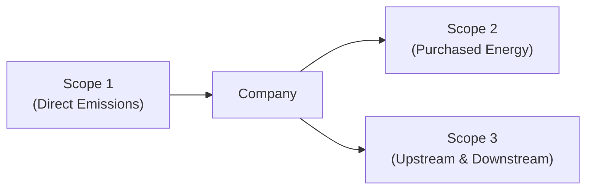

## Key Concepts in Carbon Emissions Reporting

Sometimes, when folks first see the term “carbon emissions,” they picture plumes of smoke coming right out of the factory chimneys—well, that’s part of it, but there's so much more. Carbon emissions reporting has evolved into a highly structured, standards-driven process that influences everything from investment decisions to corporate strategy. Let’s walk through some of the crucial ideas and frameworks that help analysts and stakeholders grasp this topic, especially in the context of financial statement analysis.

### Scope 1, Scope 2, and Scope 3: Defining the Boundaries

One of the most helpful ways to categorize emissions is by “Scope,” a concept introduced by the Greenhouse Gas (GHG) Protocol, a widely adopted framework for quantifying and managing greenhouse gas emissions.

• Scope 1 (Direct Emissions): These come right from sources owned or controlled by the organization, like on-site fuel combustion or a company’s fleet vehicles. Imagine a manufacturing plant burning natural gas for its operations—those emissions are Scope 1.

• Scope 2 (Indirect Emissions from Purchased Energy): These primarily relate to the electricity (or steam, or heating/cooling) that a company buys and uses. Even though the company may not be generating those emissions on-site, they’re still responsible for the consumption of that energy.

• Scope 3 (Other Indirect Emissions): This is the big catch-all category. It covers emissions up and down the value chain—everything from the goods a company purchases to the disposal of the product at the end of its life. Think about the shipping of raw materials, employee commuting, or the distribution and use of a final product.

A quick personal anecdote: The first time I tried to reconcile a Scope 3 inventory for a medium-sized tech company, I was blown away by how many data points we had to gather—shipping logs, vendor carbon footprints, packaging disposal, you name it. Scope 3 can be challenging, but it also provides the richest insights into a company’s overall environmental impact.

Below is a simple diagram illustrating the relationships among the three Scopes:



Each arrow points to the entity or scope boundary under consideration, emphasizing that Scope 1 stems from direct operational activities, Scope 2 is purchased energy brought into the company, and Scope 3 extends outward to the entire supply chain and product lifecycle.

### Calculating Emissions: The GHG Protocol and Emission Factors

Companies often rely on the GHG Protocol as their blueprint for measuring carbon emissions. It supplies guidelines on defining organizational boundaries, standardizing emission factors, and ensuring consistent year-over-year reporting.

• Emission factors are typically expressed in kg or metric tons of CO₂-equivalent (CO₂e) per activity unit. For example, a company might use a factor of, say, 0.233 kg CO₂/kWh to estimate how much carbon dioxide is emitted by its electricity consumption.

• Maintaining consistent boundaries is key. If a company changes its organizational structure—by acquiring or disposing of a subsidiary, for instance—it must adjust its emissions inventory accordingly, so users can compare apples to apples over multiple periods. This is somewhat akin to restating historical financial statements after a merger or reclassification to maintain comparability.

• Methods for data collection can vary. Some organizations have sophisticated software platforms that automatically capture operational data (electricity usage, fleet fuel consumption, shipping records) and apply relevant emission factors. Others rely on manual data entry and vendor invoices.

Python can be a handy tool for analyzing carbon data. For instance:

```python
import pandas as pd

data = {
    'Activity (kWh)': [10000, 15000, 12500],
    'Emission Factor (kg CO2/kWh)': [0.233, 0.233, 0.233]
}

df = pd.DataFrame(data)
df['Emissions (kg CO2)'] = df['Activity (kWh)'] * df['Emission Factor (kg CO2/kWh)']
df['Emissions (metric tons CO2)'] = df['Emissions (kg CO2)'] / 1000

total_emissions = df['Emissions (metric tons CO2)'].sum()
print("Total Emissions (mtCO2):", total_emissions)
```

This snippet calculates total carbon emissions for consecutive periods (or distinct operational sites) based on energy usage data and a uniform emission factor. It’s a simplified example, obviously, but it shows how you might automate the process of gathering raw usage data and converting it into carbon footprints.

## Assurance and Verification of Emissions Data

“Can we actually believe these numbers?” That’s a natural question if you’re a financial analyst or investor. This is where independent assurance steps in. Assurance standards—like ISAE 3410 for greenhouse gas statements—parallel the role of external auditors in financial reporting. They offer a level of comfort that carbon data is “fairly stated” or “plausible.”

• Third-party verifiers (often accounting firms or specialized sustainability consultancies) will audit the methodologies, check input data, and ensure the company’s approach aligns with recognized frameworks (GHG Protocol, TCFD recommendations, etc.).  
• Similar to reading an auditor’s opinion in a company’s annual report, you can look for a carbon assurance statement. It might detail whether the assurance is “reasonable” (i.e., relatively robust) or “limited” (less comprehensive).

If an organization invests in more advanced assurance, it might employ specialized technology to trace data sources in real-time. However, cost can be a limiting factor, and smaller companies may only seek basic third-party reviews.

## Offsets, Renewable Energy Credits, and Mitigation Strategies

An integral part of carbon accounting is how a company attempts to reduce or neutralize its footprint. You might see these key terms:

• Carbon Offsets: Credits purchased to mitigate emissions by financing projects that reduce or sequester carbon elsewhere (like reforestation or renewable energy projects in developing nations).  
• Renewable Energy Credits (RECs): Certificates affirming that energy was generated from renewable sources. Companies purchase RECs to claim that the electricity they consume has a lower carbon footprint.  
• Carbon Capture and Storage (CCS): Technologies that capture CO₂ directly from industrial processes or the atmosphere, storing it underground or repurposing it for other uses.

From a financial perspective, offsets and RECs can be accounted for as intangible or inventory-like assets, depending on the standards followed (IFRS, US GAAP) and the specific arrangement. If a company invests significantly in these instruments, the associated costs or capitalized amounts might appear on the balance sheet or within intangible assets.

## Potential Financial Statement Implications

### Carbon Taxes, Liabilities, and Future Regulations

In many jurisdictions, carbon taxes or cap-and-trade programs are either in place or being considered. Under such programs, companies might face a tax on each ton of CO₂e they emit. From a financial statement perspective:

• Provisions or liabilities may need to be recognized for expected future carbon taxes or penalties.  
• If carbon pricing is on the horizon, a company may have to factor that into its cost of goods sold (COGS), overheads, or the intangible assets they hold (e.g., carbon credits).

Symbols like “Carbon Tax Payable” or “Emission Liabilities” might appear in the notes to the financial statements. In Chapter 9 (Off-Balance-Sheet Items) of this volume, we delve deeper into circumstances where certain environmental liabilities can be disclosed but not always recognized on the balance sheet. For instance, a regulatory change that triggers probable future carbon taxation might lead to a contingent liability disclosure rather than a direct liability if there’s significant uncertainty regarding timing or amount.

### Carbon Credits as Intangible Assets

When a company purchases carbon credits, IFRS often requires them to be either recognized as intangible assets or “inventory for compliance,” depending on the intended use (whether for compliance offset or for resale). US GAAP has no comprehensive, single standard specifically for carbon credits, so companies may treat them similarly to indefinite-lived intangible assets or as inventory.  
• If intangible, they might not be amortized but tested for impairment.  
• If carried as inventory, they’re expensed when surrendered or sold.

The choice of accounting treatment can affect profitability metrics, the balance sheet structure, and performance ratios (see Chapter 13 for ratio analysis). Investors need to be aware of these policy elections to get a true sense of the entity’s financial position.

## Comparing Reported Emissions to Industry Norms

An analyst’s job often includes comparing a company against its peers. Carbon intensity metrics could be stated in terms like “metric tons of CO₂e per unit of production” or “per million dollars of revenue.” If a company’s carbon intensity is significantly higher than industry norms, that could mean they:

• Have an inefficient production process.  
• Operate in a region with a more carbon-intensive energy grid.  
• Have a different organizational boundary that includes certain emissions many peers do not report.

It’s crucial to confirm that all companies use consistent boundary definitions and emission factors or at least to adjust the data so that comparisons are meaningful. Remember, even in financial analysis, you wouldn’t compare net income from a business that includes major joint ventures off the balance sheet with another that fully consolidates them—so consistency is everything when analyzing carbon disclosures.

## Strategic Measures for Mitigating Emissions

Companies increasingly set science-based targets to align with the Paris Agreement’s goal of limiting global temperature rises. From an investment perspective, if a company invests heavily in:

• Energy efficiency: Upgrading to LED lighting, more efficient machinery, or improved HVAC systems.  
• Renewables: Installing on-site solar arrays or contracting for wind power through power purchase agreements.  
• Carbon capture: Exploring advanced technologies to capture emissions at large-scale facilities.

These initiatives might result in large capital expenditures or intangible R&D efforts, leading to unique financial statement impacts. The potential for new intangible assets or the revaluation of existing assets to incorporate “green value” is an emerging area of debate among analysts.

## Best Practices for Financial Analysis of Carbon Data

• Reconcile reported data year over year. Make sure changes in scope or methodology are highlighted by management in disclosures (often found in sustainability reports or in the notes to the accounts).  
• Look for external assurance statements (ISAE 3410 or local equivalents). This ensures at least a basic level of reliability.  
• Assess the organization’s readiness for carbon regulation. Does the firm mention potential carbon taxes, cap-and-trade schemes, or climate-related litigation risk?  
• Consider the effect on key ratios. Emission liabilities or intangible assets for carbon credits can distort certain solvency or liquidity ratios if not clearly disclosed.  
• Cross-check with other sources. Sometimes, rating agencies or independent data providers release emissions data or climate-risk scores that can confirm or challenge a firm’s official statements.

## Exam Tip: Handling an Emissions Disclosure Question

When analyzing a company’s carbon emissions data for the exam—in either an item set or essay question—be prepared to:

• Identify the differences between Scopes 1, 2, and 3.  
• Comment on how a change in organizational boundaries might affect trend analysis.  
• Suggest how carbon credits or offsets might be recognized under IFRS vs. US GAAP.  
• Propose adjustments to financial statements if carbon taxes become probable liabilities.  
• Evaluate consistency of the reporting framework (GHG Protocol compliance, third-party assurance, etc.).

Time management is also key. Don’t spend too long on tangential issues like the exact science behind carbon capture. In most exam scenarios, the focus will be on the financial statement impacts, the risk disclosures, and the consistency of data.

## References

• GHG Protocol Reports: https://ghgprotocol.org/  
• PwC, Deloitte, and other Big Four consulting publications on carbon assurance best practices.  
• IFRS and US GAAP Guidance on Intangible Assets (e.g., IAS 38, ASC 350).  
• ISAE 3410: “Assurance Engagements on Greenhouse Gas Statements.”  
• Task Force on Climate-related Financial Disclosures (TCFD) recommendations available at https://www.fsb-tcfd.org/

---

## Practice Questions: Carbon Emissions Reporting and Assurance Quiz



### Which framework is most commonly used worldwide for measuring and managing greenhouse gas emissions?

- [ ] International Public Sector Accounting Standards (IPSAS)
- [x] GHG Protocol
- [ ] Basel III Framework
- [ ] TCFD

> **Explanation:** While the TCFD provides disclosure recommendations, the GHG Protocol is the most widely used framework for quantifying and managing Greenhouse Gas (GHG) emissions.

### “Scope 2” emissions refer to which of the following?

- [ ] Indirect emissions from a company’s upstream supply chain
- [ ] Direct emissions controlled by the company itself
- [x] Indirect emissions from purchased electricity, steam, or heating
- [ ] Emissions from employee commuting

> **Explanation:** Scope 2 emissions arise from the generation of purchased electricity, steam, heating, or cooling consumed by the reporting company.

### What is one key reason companies seek third-party assurance on carbon emissions data?

- [x] Increase the credibility of reported emissions
- [ ] Achieve better marketing outcomes only
- [ ] Reduce official carbon taxes
- [ ] Satisfy IFRS 9 for financial instruments

> **Explanation:** Independent assurance (e.g., ISAE 3410) boosts stakeholder confidence by verifying the accuracy and completeness of emissions data.

### When a firm acquires carbon credits for use in offsetting its own emissions, how might these be accounted for under IFRS?

- [ ] As an impaired financial asset
- [ ] Always recognized as property, plant, and equipment
- [ ] Treated as a financial derivative instrument
- [x] Potentially classified as intangible assets or inventory

> **Explanation:** Under IFRS, carbon credits may be classified as intangible assets or inventory, typically depending on whether the entity intends to retire them or re-sell them.

### Which scenario exemplifies a Scope 3 emission source?

- [ ] Combustion of fossil fuels in the company’s owned factory
- [ ] Electricity purchase from a local grid
- [x] Emissions from suppliers transporting raw materials
- [ ] Natural gas used in on-site heating

> **Explanation:** Upstream and downstream transportation within a company’s value chain typically falls under Scope 3 emissions.

### A carbon tax becomes probable in a jurisdiction in which a company operates. How might the company reflect this in its financial statements?

- [x] Recognize a provision or contingent liability, depending on certainty
- [ ] Classify carbon tax payments as intangible assets
- [ ] Omit any disclosures, as carbon taxes are immaterial
- [ ] Reclassify the entire cost as research expense

> **Explanation:** IFRS and US GAAP require a provision or contingent liability if a future cost is probable and can be reliably estimated. If uncertainty remains, disclosure in the notes may suffice.

### Why might two companies that operate in the same industry report significantly different carbon emission totals?

- [x] They could define operational boundaries differently
- [ ] One might have to disclose only Scope 1 and 2
- [x] They might use different emission factors or measurement standards
- [ ] They must be using IFRS for one and US GAAP for the other

> **Explanation:** Two correct items here: (1) Different operational boundaries can drastically change what is tallied in the carbon inventory. (2) Discrepancies can also stem from varied emission factors and reporting frameworks. IFRS vs. US GAAP by itself does not typically cause large divergences in reported carbon totals; it more so influences classification on the balance sheet.

### Offsets and RECs typically function as which of the following within an organization’s carbon management strategy?

- [x] Mechanisms to mitigate or neutralize remaining emissions
- [ ] Guarantee that the company has zero emissions
- [ ] Replacements for standard financial capital
- [ ] Obligations that must be disclosed as debt

> **Explanation:** Offsets and RECs allow organizations to reduce their net emissions profile by investing in external carbon reduction projects or renewable energy sources.

### From a financial analysis perspective, what is the primary concern when a company changes its carbon measurement methodology?

- [x] Comparability of data across periods
- [ ] Paperwork burden for the audit team
- [ ] Difficulty meeting IFRS 15 standards
- [ ] Minimizing the corporate tax rate

> **Explanation:** Changes in methodology complicate year-over-year comparability. Investors and analysts want consistent measurement to accurately evaluate trends in carbon performance.

### True or False: Carbon Capture and Storage (CCS) technologies always eliminate the need for companies to track Scope 3 emissions.

- [ ] True
- [x] False

> **Explanation:** Even if CCS significantly reduces direct (Scope 1) emissions, companies still have Scope 3 impacts (e.g., supply chain, product disposal, etc.) that remain relevant for reporting and disclosure.


