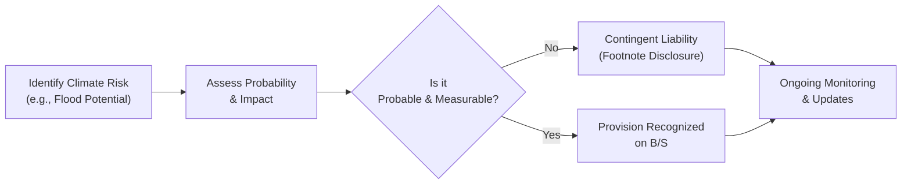

## Introduction

Climate-related contingencies and provisions might sound, at first glance, like just another checkbox item in the corporate disclosure process. But climate change is increasingly shifting companies’ risk profiles in ways that can be both sudden (extreme weather events) and gradual (regulatory transitions or habitat changes). If you’ve ever worried that the picturesque seaside property on a company’s balance sheet might become a liability when sea levels rise—yep, that’s precisely the sort of climate-related contingency we’re talking about.

In traditional financial reporting, contingencies often revolve around issues like lawsuits, regulatory fines, or guaranteed obligations. Climate-related contingencies, on the other hand, involve potential future outflows triggered by the physical and transitional effects of a changing climate. These can include property damage from storms, wildfires, or floods, higher costs related to carbon taxes, or even litigation regarding greenhouse gas emissions. No matter which side of the fence you’re on—analyst, company executive, or investor—recognizing these risks and properly accounting for them is no longer optional.

## Distinguishing Climate-Related Contingencies from Traditional Contingencies

Traditional contingent liabilities include lawsuits, contract disputes, or product warranty claims. For example, a pharmaceutical company might face a potential lawsuit settlement, or a manufacturing firm might brace for a product recall. With climate-related contingencies, the triggers often look very different. You might see:

• Flooded manufacturing facilities.  
• Wildfire damage in certain geographic regions.  
• Legal actions due to alleged negligence in emissions management.  
• Potential remediation costs if a company’s pollutants contributed to environmental damage.

Below is a simple table contrasting basic examples:

| Type of Contingency        | Example                                         | Trigger                                         |
|----------------------------|-------------------------------------------------|-------------------------------------------------|
| Typical (Lawsuits, etc.)   | Product liability claims, Patent disputes       | Consumer complaints, patent infringement claims |
| Climate-Related            | Flood remediation, Emissions-related litigation | Extreme weather events, New carbon regulations  |

Most accounting standards, be it IFRS or US GAAP, require firms to disclose contingencies if a future outflow is probable and can be estimated reliably. Climate risks follow the same logic. The difference is that some climate scenarios might have a longer time horizon, with potential liabilities unfolding over many years. This can complicate the question: “Is it probable?” or “Can we measure it?” Additionally, advanced climate modeling (e.g., flood or storm surge simulations) can be integral in determining the potential costs.

## Legal Disclosure of Climate-Related Contingencies

It’s one thing if your company’s office building is in a hurricane zone—it’s another if regulators or citizen groups bring a lawsuit claiming that you failed to adapt facilities as climate risks grew more obvious. In my early career, I remember reading an annual report that mentioned “unusually high rainfall” in a region. The company glossed over it as a minor event. But within a few years, the same region had multiple floods, incurring massive cleanup costs. Eventually, investors pressed management for more clarity. This is the sort of climate risk that was once largely overlooked but now frequently lands in the “Environmental Matters” or “Legal Contingencies” section of financial statements.

Legal disclosures related to climate change may include:

• Claims alleging negligence, where a firm’s emissions or lack of preventive measures caused damage.  
• Actions by regulators enforcing new emissions caps or pollution standards (Climate Legislation Liability).  
• Suits from communities or local governments seeking compensation for climate adaptation costs.

The key accounting question here usually revolves around IFRS (IAS 37, “Provisions, Contingent Liabilities and Contingent Assets”) or equivalent guidance under US GAAP (ASC 450, “Contingencies”). Analysts should look closely at these footnotes. If you see a mention of “emissions-related lawsuits” or “remediation obligations,” that’s a major clue on how climate change might be influencing a firm’s financial health.

## Provisions for Adverse Weather Events and Natural Catastrophes

Climate change has been associated with an increased frequency or intensity of extreme weather events. Whether or not that’s definitively proven in every instance, many insurers (and re-insurers) are charging higher premiums, and property owners in coastal or wildfire-prone areas are wrestling with coverage limitations. Consequently, companies operating in high-risk regions may establish Natural Catastrophe Provisions—essentially, an earmarked fund for damage that might arise from storms, floods, or other disasters.

Let’s illustrate with a hypothetical scenario:

1. A coastal energy company obtains cat bonds (Catastrophe Bonds) to transfer some of the risk of hurricane damage to investors.  
2. Additionally, it sets aside an internal reserve (a Natural Catastrophe Provision) in line with IFRS or US GAAP disclosure requirements if there’s a probable storm cost that can be reasonably estimated.  
3. The firm discloses these items in its notes as part of its risk management strategy, acknowledging that if a major hurricane hits, losses could exceed the cat bond coverage.

These provisions aren’t idle fluff. They signal that the corporation recognizes the possibility of major climate-related disruptions, and it’s setting aside resources to cushion that blow.

## Ephemeral Assets: Water Rights and Drought-Prone Regions

Certain companies rely on water usage rights, perhaps for manufacturing or agricultural processes. In times of drought, these rights can become questionable, or at least more difficult and expensive to maintain. As a result, companies might face:

• Reduced operating capacity if water supplies run low.  
• Added costs to purchase water from alternate sources.  
• Potential legal challenges from local communities or regulators if usage is viewed as excessive or harmful.

These realities create climate-related contingencies where a firm could be compelled to invest in new water infrastructure or pay fines for overuse—both of which involve future outflows. Under IFRS or US GAAP, if the outflows are both probable and estimable, a provision may be required.

## Link to Property Valuations and Stranded Assets

Here’s where it can get tricky: You see an enticing piece of real estate on a coastal area. It’s currently valued at millions. However, with sea levels rising, that property may eventually face flooding or require expensive flood defenses. This possibility might lead the asset to become a “Stranded Asset”—an asset rendered obsolete or severely devalued as a result of climate shifts or related regulations. If new rules restrict coastal zoning or if insurance companies leave the area, the property’s carrying value may need reevaluation, potentially leading to an impairment.

• IFRS 13 (Fair Value Measurement) or ASC 820 may require fair value adjustments if available market data suggests a decline in value.  
• IFRS (IAS 16 for Property, Plant and Equipment) or US GAAP (ASC 360 for Property, Plant, and Equipment) also address impairments when the carrying amount exceeds the recoverable amount.  

As an analyst, watch for property owners with major coastal footprints. If they’re disclosing high valuations without factoring possible climate impacts, that’s a potential red flag. You might not see an immediate lawsuit or remediation cost, but it’s definitely a risk lurking in the background—particularly if local regulations or insurance markets shift rapidly.

## Climate-Related Insurance Premiums and Coverage Changes

We all know that insurance can help transfer risk (Risk Transfer). But as climate hazards intensify, some insurers are either raising premiums to keep pace or exiting markets. This can leave companies vulnerable to large uninsured losses. Indicators you might see:

• Disclosure that a firm’s coverage for flood or wildfire risk is significantly limited compared to the past.  
• A sharp year-over-year increase in insurance costs, indicating rising climate-related risk perceptions by insurance providers.  
• Shift to alternative financing methods (e.g., cat bonds, self-insurance programs) to handle potential extreme events.

If these insurance changes threaten a firm’s liquidity or solvency, that risk should appear in the MD&A (Management’s Discussion & Analysis) or in risk factors. Remember, if the company expects to incur large uninsured costs—in the event of a damaging climate catastrophe—this might necessitate a higher level of contingent liability disclosure or specific provisioning.

## Emerging Climate Regulations and Potential Outflows

Transition Climate Risks include those arising from the shift to a lower-carbon economy. A company that emits greenhouse gases might face significant carbon taxes or be required to install new pollution control technology. Under IFRS or US GAAP guidelines, if regulators have announced (and begun implementing) stricter pollution limits and the company’s compliance costs are foreseeable, a provision might be established for them.

Consider a power utility with older, coal-fired plants. Because of new climate legislation liability or stricter emissions rules:

1. They might have to spend on modernization (Resiliency Measures) or risk paying hefty fines.  
2. If closure is the cheaper option, those plants become stranded assets—further fueling the need for write-downs or revaluations.  

Just as lawsuits might be contingent liabilities, so too are potential outflows (fines or upgrades) from unfinalized climate regulations. For instance, if legislation is widely expected to pass but awaiting final approval, management might disclose it as a contingency with an explanatory footnote regarding the potential financial impact.

## Utilizing External Climate Risk Analytics

While analyzing climate issues might feel overwhelming, many third-party providers now offer climate modeling and scenario-based stress tests. Companies can consult these studies to evaluate rainfall patterns, sea-level rise, and other climate projections. As an analyst, you can cross-reference:

• The location of a firm’s key plants or properties to identify if they overlap with high-risk floodplains or hurricane zones.  
• The exposure of a company’s supply chain to climate disruptions, such as drought or extreme winter conditions.  
• Regulatory climate “hot spots” where new carbon pricing or emissions limits are emerging rapidly.

These external analytics help transform intangible risks into more quantifiable figures—for instance, calculating an estimate of how often a facility might flood over the next few decades. If that risk is “probable” and measurable, it moves out of the purely hypothetical realm and into the territory of recognized or disclosed liabilities.

## Climate Contingencies: A Conceptual Flow Diagram

Below is a simple conceptual Mermaid diagram showing how an identified climate risk can progress to a recognized provision or remain a disclosed contingency.

In practice, IFRS or US GAAP require frequent re-assessment. New data—like updated climate models, or recent changes in precipitation patterns—might push a contingency from the “mere disclosure” category into the “actual provision” category, or vice versa.

## Strategies and Best Practices for Climate Disclosures

1. Clear Footnote Explanations: Companies often place climate-related contingencies alongside other environmental liabilities. Analysts should look for explicit references to climate events or new regulations.  
2. Stress Testing: Many firms are beginning to adopt scenario analysis to gauge the financial toll of severe weather or transition risks. These details might appear in the MD&A.  
3. Holistic ESG Reporting: Some corporations publish separate sustainability or integrated reports. Cross-referencing these with the annual financial statements can uncover consistency (or inconsistency) in climate risk disclosure.  
4. Involving External Experts: Employing climate scientists, meteorologists, or specialized engineering consultants can help refine probability estimates and cost ranges.  
5. Thorough Governance and Monitoring: The board or a special ESG committee might oversee climate-related risks. If you see references to “Risk Transfer," “Catastrophe Bonds,” or “Resiliency Measures” in a corporate governance section, it’s wise to connect those dots back to any recognized provisions.

## Practical Example: Flood Damages and Litigation Risk

Suppose Company X owns a major facility near a river that has historically been prone to flooding, but only once every two decades. Recent climate data suggests the region might now expect a major flood every five years. Company X faces three overlapping risks:

1. Physical Risk (Flood Damage): The factory may suffer direct damage. In previous floods, the repair costs were significant.  
2. Insurance Coverage Shortfall: The insurer just notified Company X that flood coverage is now drastically reduced.  
3. Regulatory Liabilities: Local authorities introduced a directive requiring factories near water bodies to construct protective barriers. Noncompliance will result in fines.

After conferring with external experts, Company X determines it’s “probable” that a flood is likely in the near future and costs for building protective barriers are reliably estimable. Under IFRS or US GAAP, a provision for compliance with the new directive could be recognized if it’s a constructive or legally enforceable obligation. Meanwhile, the additional risk of direct flood damage might go into a contingent liability note, unless it’s so imminent and quantifiable that it too meets the threshold for a provision.

## The Role of Catastrophe Bonds and Risk Transfer

Catastrophe bonds (cat bonds) allow companies (or insurers) to transfer risk of a disaster to bondholders: if a specified catastrophe occurs, the company can use investor capital for recovery, while bondholders lose out on principal. This can mitigate some climate-related burdens on the company’s balance sheet. Analysts should:

• Look for disclosures about cat bond triggers (e.g., “Category 4 storm within 50 miles of the facility”).  
• Assess whether the coverage is broad enough or if a portion remains unhedged.  
• Evaluate whether the cat bond arrangement still leaves the firm with partial liabilities if the event surpasses certain thresholds.

## Exam Relevance and Practical Considerations

From an exam standpoint, climate-related contingencies intersect with multiple financial reporting areas—contingencies, provisions, property valuations, and so on. The examiner may ask you to differentiate between a scenario that triggers a recognized provision versus one that remains a disclosed contingency. You could be required to evaluate how future regulatory changes might transform intangible climate risk into a recognized liability. Or you might see a case study analyzing how a coastal real estate firm addresses potential flood damage under IFRS or US GAAP guidelines.

Potential pitfalls include:

• Failing to correctly assess probability and measurability, leading to misclassification of climate costs.  
• Overlooking how multi-year changes in weather patterns can escalate a “remote” risk into a probable event.  
• Ignoring the interplay between climate disclosures in sustainability reports and the actual financial statements—there can be big surprises if they’re inconsistent.

## References for Further Exploration

• Managing the Risks of Extreme Events and Disasters to Advance Climate Change Adaptation, IPCC.  
• UNEP FI (United Nations Environment Programme Finance Initiative) Publications on Climate Risk Disclosures: https://www.unepfi.org/  
• IFRS (IAS 37) and US GAAP (ASC 450) standards on provisions and contingencies.  
• IFRS (IAS 16, IAS 36, IFRS 13) and US GAAP (ASC 360, ASC 820) for asset impairments and fair value measurements.  

## Final Exam Tips

• Memorize the difference between probable vs. possible climate events and which ones require a provision.  
• Be prepared to interpret short case studies illustrating a potential climate liability (e.g., new carbon taxes).  
• Practice identifying relevant footnote disclosures—often key details are tucked away there.  
• Integrate scenario analysis frameworks into your approach; exam questions might involve hypothetical regulatory changes or extreme weather data.  
• Keep in mind that climate issues often cut across multiple chapters in financial reporting—property, insurance, intangible asset considerations, and more.

------------------------------------------------------------------------------------------

## Test Your Knowledge: Climate-Related Contingencies and Provisions



### Which of the following is most accurately classified as a climate-related contingency?

- [ ] A product warranty obligation for electrical equipment that fails in humid environments.
- [x] Potential liabilities arising from floods predicted to increase due to climate change.
- [ ] Refund obligations for unsold inventory in a consignment arrangement.
- [ ] Long-term lease payment obligations related to an office building in a safe location.

> **Explanation:** Typical product warranties or refunds are standard business contingencies. Climate-related contingencies specifically stem from the physical or regulatory impacts of climate, such as floods or storms.

### Which circumstance might lead to a recognized provision rather than a mere contingency disclosure?

- [ ] A regulatory proposal that is unlikely to be enforced.
- [x] A probable storm exposure with reliably measurable clean-up costs.
- [ ] A lawsuit with remote probability of success.
- [ ] A possible flood once every 200 years with highly uncertain damage estimates.

> **Explanation:** An event must be both probable and its cost reasonably estimable to justify a recognized provision. Probable storms with measurable costs fulfill that criterion.

### How do stranded assets typically arise in a climate change context?

- [ ] They result from abrupt changes in currency exchange rates.
- [ ] They stem from normal depreciation of fixed assets over time.
- [x] They arise from regulatory or market shifts rendering assets obsolete or devalued.
- [ ] They are the outcome of standard operating expenses that exceed budget.

> **Explanation:** Stranded assets occur when regulatory changes, market shifts, or climate impacts make certain assets—often fossil fuel-based—infeasible or unprofitable, thus suddenly devaluing them.

### Why might a water-intensive manufacturer in a drought-prone region be required to disclose a climate-related contingency?

- [x] Potential legal fines or purchasing additional water at elevated prices.
- [ ] Lower risk of legal liability due to decreasing precipitation.
- [ ] Automatic coverage by standard general liability insurance policies.
- [ ] Guaranteed government subsidies for water usage in drought periods.

> **Explanation:** Water scarcity can force the firm to pay hefty fines or buy more expensive water. If it’s probable and estimable, it could require disclosure or even a provision.

### Which outcome is most likely if a firm cannot obtain affordable insurance coverage for wildfire risk?

- [x] The firm could face higher uninsured losses and might need to disclose this in financial statements.
- [ ] The firm will automatically receive government coverage that replaces private insurance.
- [x] The firm may explore cat bonds as a risk-transfer alternative.
- [ ] The firm has no obligation to disclose anything related to wildfire risk.

> **Explanation:** Losing affordable coverage can result in significantly higher uninsured losses, requiring mention in risk disclosures. Firms might turn to alternatives such as catastrophe bonds (two answers are correct here).

### Which key factor differentiates climate-related contingencies from many traditional contingencies?

- [x] They often involve longer-term horizons and evolving scientific or regulatory data sets.
- [ ] They are always recognized as balance sheet liabilities immediately.
- [ ] They do not require footnote disclosures.
- [ ] Their estimated costs are typically immaterial to financial statements.

> **Explanation:** Climate contingencies often develop over an extended period and depend on scientific projections and/or unfolding regulations, unlike many immediate, event-driven traditional contingencies.

### A coastal power utility invests in protective infrastructure to comply with new flood-safety regulations. How might this investment appear in the financial statements?

- [x] Possibly as a recognized provision if the obligation to build is enforceable and probable.
- [ ] Always as a direct offset to retained earnings.
- [x] Potential capital expenditure if it improves or extends the facility’s life.
- [ ] As intangible asset amortization over a short period.

> **Explanation:** If the company has a legal or constructive obligation and the outflows are probable and can be reliably estimated, a provision might be recognized. In some cases, the protective infrastructure might also count as a capital expenditure, improving the asset.

### Why do users of financial statements benefit from management’s explicit references to external climate risk analytics?

- [x] Such references help quantify potential climate liabilities and exposures more reliably.
- [ ] It ensures that climate risks are never recognized as provisions.
- [ ] It eliminates the need for footnote disclosures about climate-related litigation.
- [ ] It prevents auditors from reviewing climate risk forecasts.

> **Explanation:** External analytics can provide robust data and modeling techniques, offering tangible estimates. This transparency aids users in understanding climate-related financial exposures.

### In climate-related legal actions, why is the determination of probability often challenging?

- [x] Because the link between specific emissions and specific damage is complex and may require scientific proof.
- [ ] Because climate-related cases are always dismissed.
- [ ] Because governments do not allow climate lawsuits.
- [ ] Because accounting rules ignore climate litigation.

> **Explanation:** Proving that a company’s emissions caused or contributed to particular damage can be scientifically and legally complex, making the probability assessment more nuanced.

### Climate transition risks refer to:

- [x] Risks linked to changing policies, markets, and technologies in moving toward a low-carbon economy.
- [ ] Physical damage to buildings from hurricanes or floods.
- [ ] Legal claims about personal injury unrelated to climate affairs.
- [ ] Losses arising from typical business cycles.

> **Explanation:** Transition risks are the financial exposures linked to evolving regulatory, technological, or market dynamics as economies shift toward decarbonization.


