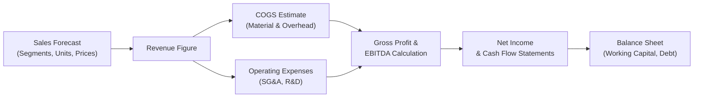

**Overview**  
Sales projections often form the backbone of pro forma financial statements, and—let’s be honest—if you’ve ever tried forecasting sales, it can feel like an art as much as a science. Developing sales-based pro forma statements is crucial because it drives most other elements in your financial model. Everything from cost of goods sold (COGS) to operating expenses, working capital needs, and capacity expansion is, in one way or another, linked back to the expected sales trajectory. In this section, we’ll explore strategies to forecast sales across different product lines and segments, incorporate seasonality, interpret macroeconomic signals, and document your assumptions so that the resulting pro forma statements are both rigorous and transparent.

I remember once working with a small manufacturing firm that was introducing three new product lines. They had limited historical data for those products, which made forecasting tricky. We ended up segmenting each line, applying a combination of regression-based forecasts for the existing lines, and using a market-share approach for the new products. Let’s jump in and see how you might pursue a similar path—minus the frustration.

**Gathering and Analyzing Historical Data**  
Before you dive into fancy forecasting methods, collect at least 3–5 years of sales data, ideally more if it’s available. Treat this historical data like gold:  
• It reveals trends, growth rates, turning points, and seasonality.  
• It helps calibrate the relationship between sales volume and price changes.  
• It provides the baseline from which you’ll do any regression or market analysis.

Beyond internal records, consider external data sources—industry benchmarks, research publications, or macroeconomic indicators. If you’re in a retail-driven business, general consumer confidence indices or GDP growth might give clues about future demand. In a B2B context, industrial production metrics or commodity price movements might be more relevant. The whole point is to see how external factors correlate with your own performance.

**Segmenting Sales**  
A single aggregate “total sales” figure might be too broad to capture nuances. For example, if you’re analyzing a large consumer electronics firm, do you lump together smartphones and home appliances? Probably not. You’ll want to split sales by region, product line, distribution channel, or any other logical category. This way, you can apply assumptions that are appropriate for each. Maybe you expect a 10% growth in emerging markets but a more modest 2% in developed markets. Similarly, a newly launched product might have an entirely different growth trajectory than your mature best-sellers.

Segmenting helps you:  
• Pinpoint which products/regions might need heavier marketing spend.  
• Adjust forecasts for currency fluctuations.  
• Identify which products might be more vulnerable to supply chain disruptions.

In short, segmentation adds depth and flexibility to your model. It also shows where you might want to perform sensitivity or scenario analysis—like toggling high- vs. low-growth assumptions in emerging markets to see the impact on overall sales.

**Forecasting Approaches**  
The forecasting method you choose often depends on your data availability and how your business operates. Here are a few commonly used methods:

- **Trend Analysis**  
  This involves identifying patterns in historical data. You might take a simple average growth rate, or you could spot cyclical trends. Trend analysis is straightforward but could be too simplistic if the company or industry is facing structural changes.  

- **Regression Analysis**  
  Here, you attempt to identify relationships between sales and one or more independent variables (e.g., disposable income, demographic shifts, or competitor pricing). If you have enough data points and the right modeling techniques, regression can be powerful. But keep in mind that not all relationships are stable over time, and you might need to do stress testing to see how robust your regression is.  

- **Market Share-Based Forecasting**  
  If you’re operating in a well-tracked industry, you might use overall market size forecasts and then estimate how your share of that market evolves. This approach requires solid industry data—perhaps from official trade groups or widely used analytics—and a clear rationale for how your market share will grow (or shrink).  

- **Bottom-Up Build**  
  Sometimes you’ll forecast unit sales by region or product, multiply by price per unit, and sum everything up. This is sort of a “micro-level” approach, which might be better if you have internal data on capacity constraints or forward orders from big clients.  

- **Multimethod Blend**  
  In many real-world cases, you’ll combine methods. You could rely on a top-down approach to set an overall cap for total sales based on GDP or industry growth, then divvy it up by product line. Or you might use regression in stable segments and scenario-based logic in uncertain ones.

No single approach is inherently best. The key is to test any method you choose with historical data to see if it would have reasonably predicted actual past results. If it fails drastically, you need to refine your assumptions or try another approach.

**Incorporating Seasonality and Macro Considerations**  
Most businesses don’t have uniform sales throughout the year—there might be holiday spikes, summer slumps, or cyclical patterns related to harvest seasons in agriculture-based industries. If you ignore these patterns, your monthly or quarterly statements won’t match actual cash flows, and that could lead to flawed decisions about working capital or labor needs.

You can incorporate seasonality by analyzing the percentage contribution of each month or quarter to the annual total. For instance, if historical data shows that Q4 accounts for 40% of annual sales in a holiday-driven retail chain, then you’d ramp up the Q4 forecast accordingly.

In addition to seasonality, keep an eye on macro indicators that can seriously affect demand:  
• GDP growth, unemployment rates, or consumer confidence for retail.  
• Commodity prices or manufacturing indices for industrial products.  
• Interest rates for big-ticket items reliant on financing (like cars or homes).  

If you see signals of an oncoming recession, you might lower your sales growth assumptions to plan for slower demand. On the flip side, expansionary fiscal or monetary policies might bolster consumer spending and raise your forecast. The trick is to integrate these macro perspectives in a way that is transparent and justifiable.

**Cross-Checking with Management Guidance**  
Management guidance can be a goldmine—assuming it’s offered in good faith and reasonably accurate. Many publicly traded companies provide periodic forecasts during earnings calls or in their annual reports. This might include predicted revenue ranges, specific growth goals, or details on upcoming product launches and marketing campaigns.

Use that guidance as a sanity check. If your forecast suggests 15% growth when management expects 5%, it’s time to reconcile the difference. Are you overestimating volumes or underestimating potential pricing pressure from competitors? Likewise, if your forecast is significantly more pessimistic than management’s, dig into the reasons. You’re either accounting for risks they overlooked, or you might be missing some strategic moves they plan to implement.

**Documenting Assumptions**  
As you build your pro forma statements, carefully record each assumption. Think of it like a “user manual” for your financial model. This documentation might include:

• Price growth estimates: “We expect average sales prices to rise by 3% per year due to moderate inflation and premiumization strategies.”  
• Volume growth drivers: “We forecast 5% unit growth in Asia-Pacific due to new distribution networks in Vietnam and the Philippines.”  
• Market share changes: “Anticipate a 1% annual increase in market share in North America due to enhanced marketing campaigns.”  
• Macro influences: “Our baseline GDP growth assumption for major markets is 2.5% annually.”  

Why is this so important? Because if your model is to be used by others—or revisited six months later by you—you’ll want to know exactly why you assumed what you did. This also helps you update inputs quickly whenever new data or changes in company strategy arise.

**Building a Simple Illustrative Example**  
Below is a brief—and yes, somewhat simplified—example of how you might structure the forecasting process. Let’s suppose a small tech accessories firm has historically sold smartphone cases in two major regions: North America (NA) and Europe (EU). We have the following historical annual sales (in thousands of units):

| Year | NA Sales (units) | EU Sales (units) |
|-----:|-----------------:|-----------------:|
| 2021 |           1,500  |            600   |
| 2022 |           1,650  |            660   |
| 2023 |           1,820  |            720   |
| 2024 |           2,000  |            800   |
| 2025 |           2,200  |            880   |

Suppose the average selling price (ASP) is $10 in NA and $12 in EU, with a projected 2% annual ASP increase. We forecast volume in NA will grow at 10% per year for the next two years before stabilizing at 6% afterward, while the EU region grows at a consistent 8%.

We can compute the next two years’ volume forecasts like so (just focusing on volumes):

• NA 2026 volume = 2,200 × (1 + 0.10) = 2,420  
• NA 2027 volume = 2,420 × (1 + 0.10) = 2,662  
• EU 2026 volume = 880 × (1 + 0.08) = 950  
• EU 2027 volume = 950 × (1 + 0.08) = 1,026  

ASP for 2026 in NA = $10 × (1 + 0.02) = $10.20  
ASP for 2027 in NA = $10.20 × (1 + 0.02) = ~$10.40  

You then multiply volume by ASP (and possibly factor in local currency exchange rates if needed). Next, you can incorporate additional categories for new product lines or expansions. Finally, these sales results feed into the rest of your pro forma statements—determining estimated revenue, cost of goods sold, operating expenses, and so on.

**Visualizing the Flow**  
Below is a small Mermaid diagram illustrating how the sales forecast flows through to other statements:

From this, it’s pretty clear: everything originates with sales. If your sales forecast is off, your entire pro forma financial model can veer in the wrong direction.

**Common Pitfalls and Nuances**  
• **Overreliance on Linear Growth**: Markets rarely move in a straight line. Plan for fluctuations.  
• **Ignoring External Shocks**: A sudden regulatory shift or supply chain disruption can alter sales drastically.  
• **Underestimating Competition**: If a competitor undercuts your prices, it could change your market share assumptions overnight.  
• **Lack of Documentation**: Failure to record assumptions makes your model far less useful for others and for future you.  
• **Conflicting Timelines**: If your marketing campaign starts mid-year, factor that into your monthly/quarterly splits.

**Conclusion and Final Exam Tips**  
When you’re studying for the CFA® exam—particularly Level I—understanding sales-based pro forma statements gives you a practical leg up in any financial analysis or modeling question. Here are a few parting words of advice:

• Match your sales forecast horizon to the strategic timeline of the firm.  
• Build in scenario analyses to handle uncertainty (e.g., best case, base case, worst case).  
• Always tie your forecast back to well-documented assumptions.  
• Check for consistency across different segments, especially if management has strategic initiatives in the pipeline.

Remember, the CFA exam often tests your ability to integrate various aspects of financial data—so be prepared to show how a sales forecast impacts other pro forma items, from labor costs to capital expenditures. Good luck, and happy modeling!

**References**  
- Benninga, S. (2014). Financial Modeling (4th ed.). MIT Press.  
- Damodaran, A. (2012). Investment Valuation: Tools and Techniques for Determining the Value of Any Asset. Wiley.  
- “Sales Forecasting: A Historical and Managerial Perspective,” The Journal of Business Forecasting.  
- Deloitte Insights, PwC Deals publications, and other corporate finance advisory resources.

## Test Your Knowledge: Developing Sales-Based Pro Forma Forecasts



### Which of the following best describes the primary reason to begin financial modeling with a sales forecast?

- [x] Sales typically drive most subsequent items in pro forma statements.
- [ ] Sales are the easiest to estimate with absolute precision.
- [ ] Inflation data is rarely used for other elements of the forecast.
- [ ] Working capital depends only on capital expenditure budgets.

> **Explanation:** A robust pro forma model usually starts with sales, because sales levels determine COGS, operating expenses, and even cash flow needs.

### When segmenting sales for forecasting, which factor is LEAST important?

- [ ] Product line variations
- [x] The company’s internal color scheme
- [ ] Geographic regions
- [ ] Distribution channels

> **Explanation:** While product lines, geographical distinctions, and distribution channels can all significantly affect sales projections, a company’s internal color scheme has no direct impact on sales data segmentation.

### In market share-based forecasting, analysts typically rely on:

- [x] The total addressable market and the company’s share within it.
- [ ] The assumption that historical growth will remain perfectly constant.
- [ ] A top-down approach that ignores micro-level sales data.
- [ ] Exclusive focus on competitor financial statements.

> **Explanation:** Market share-based forecasting starts with an estimated market size and then calculates the firm’s portion of that market.

### Which of the following is the MOST appropriate action if your forecasted sales growth (15%) significantly deviates from management guidance (5%)?

- [ ] Ignore the difference and trust your own model.
- [x] Investigate each set of assumptions to reconcile the discrepancy.
- [ ] Assume your model is wrong and adopt management’s figure.
- [ ] Increase the projected selling price to meet management’s guidance.

> **Explanation:** A large discrepancy calls for a deep dive into assumptions. Perhaps management has unrevealed information, or your model missed changes in the market.

### A bottom-up build approach to forecasting sales often involves:

- [x] Forecasting unit sales at a granular level and multiplying by unit price.
- [ ] Multiplying the industry’s total sales by a guessed market share.
- [ ] Only considering next quarter’s macroeconomic forecasts.
- [ ] Calculating revenue from past profit margins.

> **Explanation:** By calculating volumes for each segment or unit and multiplying by the assumed price, a bottom-up build forecasts revenue in detail.

### Trend analysis is likely to be the weakest approach when:

- [ ] Historical data is plentiful.
- [ ] The firm’s environment is stable.
- [x] A structural shift or major disruption has occurred.
- [ ] Small incremental changes occur consistently.

> **Explanation:** If the external or internal environment drastically changes, relying on the historical trend can be misleading.

### Seasonality is MOST relevant in which scenario?

- [x] Sales vary widely between different times of the year.
- [ ] The firm only sells a single product in a uniformly stable industry.
- [ ] The company’s operations run on a fixed annual schedule with no variation.
- [ ] Staff turnover is high during holidays.

> **Explanation:** Seasonality pertains to recurring patterns in demand or sales volumes throughout the year. Retail holiday surges or agricultural harvest seasons are typical examples.

### What is a key benefit of segmenting sales forecasts by region?

- [x] It allows more precise application of different growth rates or market factors.
- [ ] It ensures the model ignores currency exchange rates.
- [ ] It prevents any form of macroeconomic influence.
- [ ] It replaces the need for historical data.

> **Explanation:** Different regions can have unique growth rates, competitive landscapes, and economic drivers. Segmentation helps refine the forecast.

### Including macroeconomic indicators in a sales forecast is most appropriate when:

- [x] The product demand is strongly correlated with economic trends.
- [ ] Management declines to provide any guidance.
- [ ] You don’t have historical data or competitor information.
- [ ] You are trying to reduce complexity in the model.

> **Explanation:** If demand moves in tandem with macro factors (e.g., GDP, interest rates), integrating these indicators can significantly improve a forecast.

### A pro forma statement that is sales-driven primarily focuses on:

- [x] Projected revenues that dictate various cost and expense assumptions.
- [ ] Past cash flows that dictate future stock prices.
- [ ] Eliminating all risk by applying guaranteed assumptions.
- [ ] Micro-level budgeting for corporate headquarters only.

> **Explanation:** The essence of a sales-driven pro forma statement is that revenue forecasts shape the rest of the financial projections, from COGS to net income and beyond.


