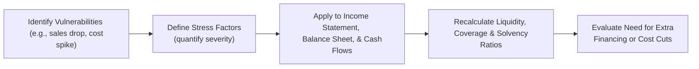

## Introduction
Have you ever worried about a sudden drop in your company’s sales—like out of the blue, your top customers simply vanish? It’s not a comfortable feeling. A friend of mine who runs a mid-sized manufacturing firm once confided in me that he used to spend late nights thinking about all the what-ifs. What if raw material costs spike next quarter? What if freight expenses go haywire? He was trying to figure out how his company’s cash flow would hold up in those scenarios, but it felt like guesswork.

Enter cash flow stress testing in forecasts. It’s the process of taking your carefully built financial model—your best estimates of future operations—and pummeling it with severe yet plausible changes in key drivers. The purpose? To see if the model (and the company, for that matter) can withstand adverse events. In a sense, it’s like teaching your financial model to survive in the wild. Stress testing helps you gauge if the business can cope with a steep sales decline, big interest rate hikes, or other nasty surprises without toppling over.

## Purpose of Cash Flow Stress Testing
The main point behind stress testing is to reveal potential cracks in your company’s liquidity or solvency under harsh conditions. In real life, events like credit squeezes, recession-driven demand drops, or even currency turmoil can blindside businesses. By applying stress factors, you see how each piece of your forecast stands up when things don’t go according to plan. 

Stress testing also helps you:
• Confirm if your company has sufficient liquid buffers—like cash or short-term investments—to continue paying suppliers and covering debt when revenues tank.  
• Figure out whether you’ll need emergency financing—maybe a bank line of credit or a quick injection of equity—to stay afloat and avoid shortfalls in worst-case scenarios.  
• Identify which areas are most vulnerable, guiding you toward contingency plans like trimming discretionary expenses, deferring expansion, or renegotiating debt terms.  

This exercise ties closely to Chapter 13 on ratio analysis, because once you’ve hammered your statements, you’ll re-check critical ratios like the liquidity coverage ratio (LCR) or the interest coverage ratio—just to see if they weaken beyond acceptable thresholds.

## Key Steps in Stress Testing
Performing cash flow stress tests typically involves selecting one or more adverse scenarios and then layering those conditions across your financial model. Since we’re at a high-level vantage point, let’s walk through how this all happens:

Identify Critical Vulnerabilities  
It’s kind of like scanning your environment for threats. A manufacturer might worry about a 30% revenue decline if a key sector enters a slump. A retailer could fret over sudden cost spikes in sourcing. A bank (cross-reference Chapter 14 for bank-specific stress testing) would be more concerned about credit defaults. Either way, you want to pick the vulnerabilities that would cause the greatest damage—things like revenue hits, margin compression, unfavorable forex movements, or interest rate surges.

Define the Stress Factors  
Next, you quantify these vulnerabilities in a scenario. This might look like:
• A 30% drop in sales volume starting in Q2.  
• A 2% jump in interest rates on variable-rate debt.  
• A 15% depreciation in your local currency if your purchases are in USD but your functional currency is something else.  

Apply Stress to Financial Statements  
This is where the real modeling magic happens. You systematically apply those changes across your income statement, balance sheet, and statement of cash flows (see Chapter 4 on detailed cash flow analysis). For example, if your revenue declines by 30%, your contribution margin will decline drastically, which hits your operating cash flow. You might also assume you’ll stretch accounts payable or that you’ll renegotiate supplier terms once you realize your inflows are shrinking.

Measure Liquidity and Solvency  
After the dust settles, check if you remain cash-flow-positive under these bleak conditions. Common metrics that come into play include:
• Liquidity Coverage Ratio (LCR): Do you hold enough liquid assets to meet short-term obligations?  
• Interest Coverage Ratio: Will you have enough earnings (EBIT, EBITDA, or operating income depending on preference) to service your debt when interest expenses rise or profits fall?  
• Debt-to-Equity Ratio: Are you at risk of breaching debt covenants due to a ballooning debt load or a shrinking equity base?  

Depending on your results, you’ll see if you’re okay or if you’re at risk of imminent liquidity crunch.

## Evaluating the Results
Let’s say your model reveals that under a 30% sales drop scenario, your cash flow from operations turns negative in six months. In that scenario, you might discover you need an immediate capital infusion of $1 million to avoid default on payables. That’s a vital takeaway. 

Often, the next step is to figure out how the firm can adapt if push comes to shove:
• Could you cut discretionary expenses like marketing, travel, or certain R&D efforts?  
• Is it feasible to scrap or delay some capital expenditures until conditions stabilize?  
• Could you lease assets rather than buying them outright in order to conserve cash?  

Stress testing results open up all these strategic conversations. They also guide you to your Plan B, or even a Plan C, if things get worse than initially imagined.

## Case Study in Action
Imagine we have a fictional company, Gamma Retail Inc. in the personal electronics space. They’re reliant on cyclical consumer demand. Suppose they build a five-year forecast in which normal sales growth is 10% annually, margins are stable at 40%, and they have a $2 million line of credit at a 5% variable interest rate. Everything looks rosy in the base scenario.  

Now we apply some stress:
• A 25% decline in sales starts in Year 1, continuing through Year 2.  
• Variable interest rates increase by 300 basis points, rising from 5% to 8%.  
• Management attempts to cut discretionary expenses by 10% to respond.

Let’s shift to some quick numbers:

Base Scenario (Year 1):
• Revenue: $10,000,000  
• Gross Profit: $4,000,000 (40% margin)  
• Operating Expenses (Discretionary + Fixed): $2,000,000  
• EBIT: $2,000,000  
• Interest Expense: $100,000 (Line of credit usage at 5%)  
• Net Income: $1,900,000  

Operating Cash Flow: Initially forecast at $1,950,000 (slight difference due to depreciation/timing adjustments).  

Stressed Scenario (Year 1):
• Revenue: $7,500,000 (25% drop)  
• Gross Profit: $3,000,000 (still a 40% margin, but on lower revenue)  
• Operating Expenses: $1,800,000 (10% cut from $2M discretionary portion)  
• EBIT: $1,200,000  
• Interest Expense: $160,000 (the rate is now 8% on the line of credit—usage might also go up if the firm is drawing additional funds to cover shortfalls)  
• Net Income: $1,040,000  

Operating Cash Flow might drop to around $1,100,000 (assuming depressed inflows and slightly reduced outflows due to cost cuts). That’s still positive, but it’s a steep drop from nearly $2 million. Gamma Retail Inc. might survive this scenario—barely. But in a more severe scenario (like a 40% drop in sales plus a bigger interest rate hike), operating cash flow could even go negative.

In the event of negative operating cash flow, the company must figure out if they can draw more funds from their line of credit or if they need emergency financing. This is precisely the signpost that stress testing helps you see.

## Visualizing the Steps
Below is a simple Mermaid diagram illustrating the flow from identifying vulnerabilities to evaluating results:



This flow captures the big-picture approach and the typical order of operations when performing a stress test.

## Additional Considerations
It’s not just about short-term survival. Prolonged stress scenarios might strain a company’s solvency, leading to covenant breaches on long-term debt. Chapter 9 on off-balance-sheet items can be relevant if the company relies on factoring or other structured finance solutions that might conceal exposures. Meanwhile, if the firm is multinational (discussed in Chapter 11), currency swings can complicate stress testing because you might see translation losses or gains. 

In certain industries, such as banking or insurance, stress testing takes on a more formalized regimen (also reference Chapter 14). Regulators enforce rigorous stress test frameworks to ensure institutions can meet obligations under major economic downturns. While non-financial companies may not be required to follow the same rules, it’s often wise to borrow concepts from those frameworks—like the Basel Committee’s guidelines.

## Overcoming Common Pitfalls
A few pitfalls can hamper any well-intentioned stress test:

• Overly Mild Scenarios: If your “stress” scenario is too timid, you risk a false sense of security. Aim for severe but plausible.  
• Inconsistent Assumptions: Stress factors must be consistently applied. If revenues drop dramatically, cost of goods sold might shift, working capital dynamics will change, and so on.  
• Poor Timing Assumptions: Real cash inflows and outflows rarely move in lockstep with IFRS or US GAAP-based accruals. Timing matters—a big chunk of working capital can come due before you realize your new sales are collapsing.  
• Ignoring Strategic Responses: Your model should reflect at least a partial management response—like cost-cutting or CapEx deferrals—because in reality, management will try to adapt.  

If you keep these pitfalls in mind, your stress tests become more reality-based, and that’s when they genuinely help you prepare.

## Practical Example of Setting Up Stress in a Spreadsheet
Occasionally, people ask about using programming approaches. You could write code in Python or R to run hundreds of stress scenarios (Monte Carlo style). But let’s keep it simple here with an easy snippet of Python just to illustrate:

```python
import pandas as pd
import numpy as np

# 'Revenue', 'Cost_of_Goods_Sold', 'Operating_Expenses', 'Interest_Rate', etc.

scenarios = {
    'Mild_Scenario': {'Revenue_Shock': -0.1, 'Interest_Shock': 0.02},
    'Severe_Scenario': {'Revenue_Shock': -0.3, 'Interest_Shock': 0.03}
}

def stress_test(df, scenario):
    df_stressed = df.copy()
    df_stressed['Revenue'] *= (1 + scenario['Revenue_Shock'])
    df_stressed['Interest_Rate'] += scenario['Interest_Shock']
    # Recalculate interest expense, net income, etc.
    df_stressed['Interest_Expense'] = df_stressed['Debt'] * df_stressed['Interest_Rate']
    # Return the updated DataFrame
    return df_stressed

base_df = pd.DataFrame({
    'Revenue': [10_000_000],
    'Cost_of_Goods_Sold': [6_000_000],
    'Operating_Expenses': [2_000_000],
    'Debt': [1_000_000],
    'Interest_Rate': [0.05], # 5%
})

for name, scenario in scenarios.items():
    result = stress_test(base_df, scenario)
    print(f"{name} results:\n", result)
```

This snippet just shows how you might systematically create multiple stress scenarios programmatically. In practice, you’d expand it to recalculate all relevant lines on the income statement, balance sheet, and statement of cash flows.

## Strategic Responses
If your stressed scenario highlights significant cash shortfalls, you might consider these levers:

• Deferring CapEx. By pushing back expansion projects, you keep more cash on hand.  
• Selling Non-Core Assets. This might free up liquidity if you have idle real estate or underused machinery.  
• Leaning on Revolving Credit Lines. Additional borrowing might plug the gap, but watch out for the interest coverage ratio—especially if rates spike.  
• Renegotiating Vendor Terms. Sometimes, you can extend payment terms, effectively borrowing from suppliers.  

These can be refined further by evaluating the trade-offs—like damaging supplier relationships, losing growth opportunities, or incurring higher financing costs.

## Summary and Exam Relevance
Cash flow stress testing is one of those areas that can look technical but is actually central to real-world corporate finance. It’s not just for big banks and insurance companies dealing with complex regulatory frameworks; it’s for any organization wanting to simulate how they’d handle an economic punch to the gut.

On your CFA exam—or, more specifically, as you practice with scenario-based questions—you could see vignettes where a firm’s financial performance is tested under adverse conditions. You might be asked to interpret liquidity and solvency ratios post-stress or to recommend strategic responses. In the constructed-response format, you might have to illustrate how you’d run a stress test on a stylized set of financial statements. The better you understand the steps, the easier it is to deliver a solid, coherent answer.

Remember to keep everything consistent (from revenue to cash flows) when applying stress, or you’ll get incomplete or misleading results. As you wrap up your exam preparation, keep in mind that stress testing is also about thinking critically: “If this variable changes drastically, what does it do to liquidity and capital structure?” That mindset is gold for any CFA candidate seeking real-world relevance.

## References and Further Reading
• Basel Committee on Banking Supervision. Various guidelines on stress testing (helpful if you want advanced stress methodologies).  
• “Enterprise Stress Testing: Approaches and Techniques,” Risk.net, for detailed articles and applied research.  
• Tuck School of Business (Dartmouth) case studies on organizational liquidity crises, offering real-world examples and data sets.  
• Cross-reference Chapter 14 for industry-specific stress tests (banks, insurance).  
• Chapter 13 for ratio analysis (liquidity, solvency, and profitability metrics).

## Test Your Knowledge: Cash Flow Stress Testing Scenarios



### Which of the following best describes the primary benefit of stress testing a company’s cash flow forecast?

- [ ] It guarantees accuracy of the forecast in all market conditions.
- [ ] It ensures the company will never face liquidity problems.
- [x] It reveals potential vulnerabilities and liquidity shortfalls under adverse circumstances.
- [ ] It eliminates the need to perform ratio analysis.

> **Explanation:** Stress testing is about assessing how a company’s cash flow might respond to severe market movements or operational shocks, helping identify liquidity or solvency risks before they materialize.

### In a stressed scenario involving a sudden 30% drop in revenue, which ratio would most likely be affected first?

- [x] Interest coverage ratio
- [ ] Return on equity
- [ ] Quick ratio
- [ ] Dividend payout ratio

> **Explanation:** A sharp drop in revenue directly hurts operating earnings, reducing the ability to cover interest expenses (i.e., interest coverage ratio). Over time, other ratios might be affected too, but interest coverage is often one of the earliest indicators of distress.

### Why is it important to apply stress factors consistently across all financial statements?

- [ ] To highlight only positive impacts on the income statement.
- [ ] To comply with IFRS but not necessarily US GAAP.
- [x] To avoid incomplete or misleading results when analyzing the impact of changes.
- [ ] To keep the forecast simple.

> **Explanation:** Inconsistent assumptions across the income statement, balance sheet, and cash flow statement may lead to contradictory conclusions and undermine the test’s validity.

### Which of the following is a recommended strategic response if stress testing shows a large cash deficit?

- [ ] Increase discretionary expenses to boost marketing efforts.
- [ ] Maintain all capital expenditures to preserve growth metrics.
- [x] Defer non-essential capital expenditures until conditions improve.
- [ ] Ignore the stress test results to keep management confident.

> **Explanation:** Cutting or deferring non-essential CapEx can conserve cash during adverse times. This is one of the most straightforward strategies when a stress test highlights imminent liquidity issues.

### What is one common pitfall in cash flow stress testing?

- [x] Using overly mild adverse scenarios that don’t reflect realistic downturns.
- [ ] Overstating the severity of the scenario.
- [ ] Including sensitivity analysis in the model.
- [ ] Scaling expenses with revenues.

> **Explanation:** If stress scenarios are too mild, the company might underestimate the true level of risk. Stress tests should reflect severe yet still plausible conditions.

### When modeling a 2% increase in interest rates in a stress scenario, what is the key direct effect on the income statement?

- [ ] Lower operating margin.
- [x] Higher interest expense.
- [ ] Higher EBITDA.
- [ ] Reduced depreciation expense.

> **Explanation:** A rise in interest rates directly raises the interest expense, reducing net earnings. The other items can be indirectly impacted, but the immediate effect is felt in interest expense.

### A company’s stress test indicates that cash flow from operations will turn negative in four months. Which of the following is the best immediate option?

- [x] Secure additional financing or maintain a credit line to cover shortfalls.
- [ ] Run another forecast without stress factors.
- [ ] Discontinue evaluating liquidity metrics.
- [ ] Acquire another company to boost revenue.

> **Explanation:** When a stress test shows an imminent negative operating cash flow, the firm typically needs financing or must make drastic changes to restore liquidity before the situation becomes unmanageable.

### In which document are off-balance-sheet exposures (like certain leases or factoring arrangements) most likely to become apparent under stress?

- [ ] Proxy statement
- [ ] Management discussion of intangible assets only
- [x] Footnotes or disclosures in the financial statements
- [ ] Marketing flyers

> **Explanation:** Off-balance-sheet items, including certain leases or factoring agreements, are usually disclosed in the notes to the financial statements. These become critical areas of concern when performing stress tests.

### A negative shock to a company’s foreign currency revenue of 20% would:

- [ ] Automatically increase the interest coverage ratio.
- [ ] Have no impact on the cash flow statement.
- [x] Reduce both reported revenue and operating cash flows if the company’s functional currency remains unchanged.
- [ ] Eliminate the need for hedging.

> **Explanation:** A drop in foreign currency revenue would decrease the company’s revenue when translated into the functional currency and would likely reduce cash inflows, impacting operating cash flow.

### True or False: Stress testing is only necessary for large financial institutions subject to Basel regulations.

- [x] True
- [ ] False

> **Explanation:** Trick question alert! Actually, the correct answer is “False.” All types of companies can benefit from stress testing to understand and plan for adverse scenarios. Even though large banks are mandated to do so, smaller firms also find value in this practice.



