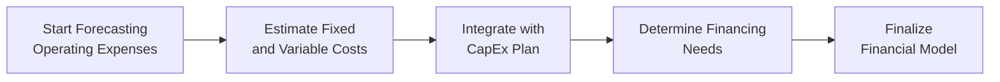

## Introduction

Forecasting the major expense categories of a firm—operating expenses, capital expenditures (CapEx), and financing costs—is a key step in building a robust company financial model. Whether you’re managing a multi-asset portfolio or simply underwriting a single equity investment, getting these forecasts right is critical to effective valuation, performance measurement, and risk assessment. In this article, we’ll delve into best practices for forecasting expenses, linking each item to its underlying drivers, and integrating all these elements into a cohesive pro forma model. Although these concepts can feel a bit, well, daunting at first, a structured approach will often reveal patterns you can apply across different companies and industries.

We’ll discuss common pitfalls—like ignoring inflation or forgetting to update financing assumptions—so you can avoid errors that might easily lead to suboptimal investment or portfolio decisions. Remember to reference Chapter 2 (Analyzing Income Statements) for insights into measuring expenses recognized in the income statement, Chapter 3 (Analyzing Balance Sheets) for examining the balance sheet impact of CapEx, and Chapter 4 (Analyzing Statements of Cash Flows) for the roots of financing cash flow analysis.

## Forecasting Operating Expenses

Operating expenses typically include Cost of Goods Sold (COGS), Selling, General & Administrative (SG&A) costs, Research & Development (R&D), and other line items tied to the firm’s day-to-day operations. A precise forecast hinges on separating fixed from variable costs and identifying the drivers behind each category.

### Fixed vs. Variable Costs

Some companies have high fixed costs—think depreciation on a manufacturing plant, property rent, or long-term service contracts. Others rely more on variable costs—like raw materials in a production process or direct labor that scales with output. In practice:

• Fixed costs tend not to fluctuate with changes in production or sales volume. Examples: real estate leases, certain IT systems, long-term multi-year software licenses.  
• Variable costs move in tandem with volume or usage. Examples: raw materials for manufactured goods, direct hourly labor, and commission-based selling expenses.

Identifying which costs are fixed and which are variable will help you model each expense with greater precision. For instance, you might forecast direct labor (variable) as a simple function of projected production volumes. Meanwhile, you might forecast corporate overhead (fixed) by building in an estimated annual increase for inflation.

### Inflation and Cost Pressures

Forecasting expenses without factoring in inflation (or wage growth) can quickly cause your model to drift from reality—especially in multi-year projections. If inflation is stable—say averaging 2–3%—your main risk is underestimating COGS or SG&A by a modest margin every year. But don’t forget that some economies experience elevated inflation rates (discussed in Chapter 3, section 3.10 on High-Inflation Environments). In those environments, your wage assumptions might balloon enough to significantly impact margins and valuations.

### Efficiency Improvements and Cost Savings

Firms may engage in cost-saving programs—renegotiating supplier contracts, improving process automation, or centralizing procurement. For forecasting, it’s helpful to build these improvements into your baseline scenario and run a sensitivity or scenario analysis to see if the actual savings deviate from your assumption. I once built a corporate model for a firm that planned on “efficiency improvements” to slash operational costs by 15%. Let’s just say we discovered that the synergy was not as immediate as management claimed. The lesson? It’s safer to stagger the year-over-year cost improvement rather than assume the entire cost reduction shows up in the next financial period.

### Linking Operating Expenses in the Pro Forma Income Statement

Each operating expense category can be tied to relevant drivers:

• COGS: Often expressed as a percentage of sales or a function of production volume (especially if you have a standard cost card for raw materials).  
• SG&A: Commonly a mix of a fixed portion (office rent, overhead staff) plus a variable component (e.g., commissions, marketing tied to sales).  
• R&D: Typically tied to product pipeline goals, expansions, or “innovation budgets.” Some firms have stable R&D budgets, while others ramp up significantly to support new projects, making quarterly or semiannual patterns relevant.  

Keep in mind that under IFRS, certain development costs can be capitalized once technical feasibility is established (see IFRS references in Chapters 2 and 6). Under US GAAP, R&D costs generally remain expenses in the period incurred.

## Forecasting Capital Expenditures (CapEx)

Capital expenditures are funds that firms invest in physical or intangible assets expected to provide benefits for multiple periods. Properly estimating CapEx can have a big impact on both your pro forma balance sheet and your long-term projections for growth potential.

### Maintenance vs. Growth CapEx

• Maintenance CapEx is spending required to sustain current operations, replace worn-out equipment, and keep assets functioning.  
• Growth CapEx is discretionary spending aimed at expanding capacity—like opening new production lines, upgrading technology infrastructure to handle more data, or purchasing additional facilities to serve new regions.

When forecasting, it’s wise to break CapEx into these two categories. Maintenance CapEx often can be approximated as a percentage of depreciation (some analysts assume it’s roughly equal to depreciation, although that might be simplistic). Growth CapEx, on the other hand, hinges on the firm’s strategic plan—investment in new technology or building out a product line. Always correlate your CapEx assumptions with future revenue growth assumptions to ensure internal consistency.

### Timeline, Payment Schedules, and Intangible Assets

Large capital projects frequently unfold over multiple quarters or even years. That means you might forecast the project cost of, say, $20 million, but you’ll schedule the outflows over six or eight quarters to reflect the actual pace of spending. If the firm invests in intangible assets—like software or licenses—confirm local accounting standards for recognition and amortization. IFRS allows intangible assets to be capitalized if they meet certain criteria, while under US GAAP, many software development costs can be capitalized once technological feasibility is established.

### Integrating CapEx into the Model

On the pro forma balance sheet, CapEx increases the firm’s Property, Plant & Equipment (PP&E). Meanwhile, in the income statement, you’ll see higher depreciation expenses once those assets are in use. And in your cash flow statement (Chapter 4), CapEx is reflected under cash outflows from investing activities. Maintaining these linkages is crucial so that each line item remains consistent across all reporting statements.

## Forecasting Financing

Recognizing a company’s future funding needs is essential for understanding the overall leverage, interest expense, and potential dilution that might affect equity-holders. In portfolio management contexts, financing decisions can affect a firm’s beta, cost of capital, and ultimately, the discount rate used in valuations.

### Debt vs. Equity

• Debt Financing: Firms raise funds by issuing bonds or taking loans from banks. This introduces interest expense (which reduces net income) and future principal repayments. Under IFRS or US GAAP, the classification of debt in the balance sheet depends on maturity (current vs. noncurrent) and structure (convertible bonds, notes).  
• Equity Financing: Issuing new shares raises capital without creating a contractual obligation to repay. However, existing shareholders face potential dilution of ownership and earnings per share.

When incorporating financing assumptions, consider your target debt-to-equity ratio or the coverage ratios you aim to maintain. CFOs often weigh cost vs. flexibility in deciding between these two sources of financing—an important perspective if you are analyzing capital structure for a multi-asset or multi-company portfolio.

### Interest Expense, Covenants, and Capital Structure Constraints

Project interest expense by multiplying the outstanding debt balance by the assumed interest rate. If the firm uses a floating rate, you might tie it to forecasted market interest rates or a benchmark index (e.g., LIBOR or SOFR plus a spread). Don’t forget any contractual principal payments. Also, remain mindful of debt covenants—if forecasting a substantial downturn in operating cash flow, you need to verify covenant compliance and ensure your default or restructuring scenario is realistic.

### Timing of Financing

A well-built model shows not just whether new debt or equity capital will be raised, but also when. If the firm is planning a major round of equity financing in Q3 of next year, you can encode that both in the equity line of your balance sheet and in the incremental interest savings from not having to borrow as much. Similarly, if you expect short-term bridging loans, your model should reflect interest expense and principal repayment in the relevant periods.

## Putting It All Together

Accurately forecasting operating expenses, CapEx, and financing involves linking each item to the drivers you’ve established (volume, sales growth, cost of capital, etc.). Once integrated into your pro forma statements, the data reveal a coherent picture of future performance and risk. 

Below is a simplified conceptual diagram that shows how forecasting these elements typically flows through a financial model:

Each step influences the other. For instance, the operating expense forecast might signal insufficient cash flow, driving up financing needs if a new expansion is planned. Meanwhile, if the CapEx plan is trimmed, the firm might scale back financing requirements, which in turn reduces interest expense.

### Illustrative Example: Linking Expenses, CapEx, and Financing

Imagine a mid-size manufacturing firm with annual sales of $100 million. Management is projecting a 10% annual sales growth for the next three years, but the team needs an upgraded production facility to handle the extra volume:

• Operating Expenses:  
  – Variable Expenses (COGS): Assume 60% of sales. Each year, you multiply forecast sales by 0.60. Then you tack on a 2% inflation factor, so your baseline COGS for year 2 might be 60% of new sales × 1.02.  
  – Fixed Expenses (SG&A): You might hold them constant at $8 million annually but add an inflation factor of 3%. So year 1 is $8 million, year 2 is $8.24 million, and so forth.  
• CapEx:  
  – Maintenance: Estimated at $3 million yearly (keeping existing machinery operating).  
  – Growth: A new production line costing $12 million in total. You decide the payments will be $4 million for each of the next three years.  
• Financing:  
  – Initially, the firm’s CFO decides to use 50% debt and 50% equity to fund the $12 million expansion. This leads to $6 million in new debt. If the interest rate is 5%, your interest expense from that new debt is $300,000 annually. The other $6 million is raised by issuing new equity, which modestly dilutes existing shareholders but avoids additional interest expense.

By tracking these items in your pro forma balance sheet and income statement, you see how the net income and EPS get affected each year. If the firm chooses more debt (say 70% vs. 50%), your interest expense and leverage would increase, possibly affecting the firm’s credit metrics and cost of capital. For a candidate in a CFA Level III exam setting, scenario analyses and capital structure optimization (perhaps with a Weighted Average Cost of Capital approach) highlight the real trade-offs in managing growth vs. financial stability.

## Best Practices and Pitfalls

• Consistency: Ensure that each forecast assumption—sales growth, production volume, and CapEx schedules—ties together. Inconsistent assumptions inevitably distort the model and lead to inaccurate valuations.  
• Sensitivity Analysis: Always run multiple scenarios—e.g., slow vs. fast sales growth, high vs. low interest rates. This reveals how sensitive the model is to key inputs and might highlight hidden vulnerabilities.  
• Overoptimism: Watch out for unrealistic efficiency savings or wage assumptions. If a company claims a 20% cost reduction in a single year, you might want to spread that improvement out over multiple periods or challenge the assumption altogether.  
• Financing Triggers: If your model calls for large debt raises, watch for potential covenant breaches. Reach into the footnotes and MD&A (Management Discussion & Analysis) statements to find clues about existing debt terms.

## Conclusion

Forecasting operating expenses, CapEx, and financing requires a mix of art and science—art in judging management’s strategic claims and science in methodically quantifying cost drivers, inflation factors, covenant restrictions, and capital structure decisions. When done well, these forecasts help you build a dynamic model that not only measures a firm’s growth prospects but also shines a spotlight on potential constraints. Keep in mind how each line item interacts across the three major financial statements, and never neglect the qualitative aspects—like corporate strategy or industry trends.

In short, your forecasts for expenses, investments, and financing should integrate seamlessly, enabling a comprehensive macro-to-micro viewpoint on the firm’s future. This sets the stage for robust valuation, ratio analysis, or performance assessment of the company within any multi-asset portfolio. If you can weave these threads together effectively, you’ll likely have a solid foundation for tackling complex investment decisions.

## References and Further Reading

- Petersen, C., & Fabozzi, F. (2012). The Analysis and Use of Financial Statements. Wiley.  
- Gitman, L.J., & Zutter, C.J. (2014). Principles of Managerial Finance. Pearson.  
- CFO Magazine: Real-time discussions of corporate capital allocation, financing strategy, and cost management.  
- IFRS Foundation: Standards on capitalizing development, intangible assets, and other IFRS guidance (www.ifrs.org).  
- FASB Accounting Standards Codification (ASC): Guidance on US GAAP for intangible assets, R&D, and financing (www.fasb.org).

--------------------------------------------------------------------------------

## Test Your Knowledge: Forecasting Expenses, CapEx, and Financing



### In forecasting operating expenses, which of the following is most appropriate for a cost that scales directly with production volume?

- [ ] Treat the cost as entirely fixed.
- [x] Treat the cost as a variable expense.
- [ ] Treat the cost as an extraordinary item.
- [ ] Recognize it only after capitalization.

> **Explanation:** Costs that fluctuate with output should be treated as variable expenses. Examples include raw materials and direct labor tied to production levels.

### Which best describes why a forecaster might separate maintenance CapEx from growth CapEx?

- [ ] Only growth CapEx appears in the cash flow statement.
- [ ] Maintenance CapEx is typically capitalized, growth CapEx is not.
- [x] Maintenance CapEx sustains current operations while growth CapEx expands capacity.
- [ ] Maintenance CapEx is depreciated, while growth CapEx is expensed in the forecast period.

> **Explanation:** Maintenance CapEx is used to keep existing assets in working order, whereas growth CapEx focuses on expanding or upgrading capacity.

### If a firm is projecting a major facility upgrade that spans over three years, how might this typically be reflected in the financial model?

- [ ] Expense the entire amount in the first year.
- [x] Spread the CapEx over several quarters or years to match the project schedule.
- [ ] Record the upgrade cost as a footnote only.
- [ ] Recognize the cost as R&D expense.

> **Explanation:** Large projects often have staggered payments. The model should allocate capital outflows across the actual timeline of spending.

### In forecasting interest expense associated with new debt, which variable is most crucial?

- [ ] Dividend growth rate.
- [x] The outstanding principal balance and interest rate.
- [ ] Daily stock price changes.
- [ ] The firm’s retained earnings.

> **Explanation:** Interest expense is driven primarily by the interest rate and the amount of debt outstanding throughout the forecast period.

### What is the greatest disadvantage of raising capital exclusively through equity issuance?

- [x] Existing shareholders may face dilution of ownership.
- [ ] The firm must pay regular principal repayments.
- [ ] Interest expenses increase.
- [ ] Covenants may restrict future borrowing.

> **Explanation:** Debt typically involves interest and covenants; equity issuance may dilute existing shareholder stakes.

### Under a high-inflation environment, which cost category is most vulnerable to sudden changes?

- [ ] Depletion expenses.
- [x] Labor-intensive operating expenses with significant wage components.
- [ ] Historical goodwill amortization.
- [ ] Tax liabilities.

> **Explanation:** Labor-intensive expenses usually track wage inflation. In a high-inflation environment, wage increases significantly impact operating costs.

### A firm plans to expand into new international markets, anticipating a large marketing push. This marketing outlay would most likely be forecasted:

- [ ] As part of maintenance CapEx.
- [x] As an increase in variable SG&A or another relevant operating expense item.
- [ ] As intangible asset amortization.
- [ ] As restricted cash on the balance sheet.

> **Explanation:** Marketing outlays are typically captured under operating expenses (SG&A). They’re variable in nature if linked to sales or expansion.

### Which of the following could trigger revisions to your CapEx forecast?

- [ ] Seasonal fluctuations in intangible asset values.
- [ ] Change in the firm’s inventory turnover ratio.
- [x] Management’s updated strategy on capital projects or unexpected liquidity constraints.
- [ ] The prior year’s tax adjustments.

> **Explanation:** Revised corporate strategy (e.g., cancellations or expansions) or liquidity shortfalls can significantly alter capital spending plans.

### If a firm’s model reveals that internal cash flow won’t cover planned CapEx, what is the standard course of action?

- [ ] Cease all CapEx investments immediately.
- [ ] Increase dividends to attract new investors.
- [ ] Reduce operating expenses drastically.
- [x] Seek external financing (debt or equity) or optimize capital allocation.

> **Explanation:** Most firms, when short of internal funds, turn to external financing or re-evaluate capital allocation to align with available resources.

### A low interest coverage ratio in a pro forma model suggests:

- [x] The firm’s ability to meet interest payments from earnings is weak.
- [ ] Strong growth potential due to advanced R&D.
- [ ] Under-leveraging the company’s balance sheet.
- [ ] Effective cost management in SG&A.

> **Explanation:** Interest coverage is a key indicator of financial health. A low ratio indicates that earnings may not comfortably cover interest expenses, raising default or covenant breach risk.


