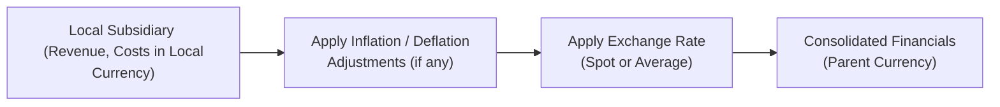

## Introduction and Motivation

I remember talking to a colleague who was new to forecasting, and she was a bit surprised when her cost assumptions—originally built on a “steady-state” basis—slowly drifted off course. Why? Because the model overlooked small but consistent inflation creep in the cost of raw materials. This is so common that it’s practically a rite of passage for first-time financial modelers. Whether it’s zeroing in on annual inflation rates, grappling with unexpected deflationary spells, or factoring in exchange rate swings in your consolidated statements, we all have to figure out how to bend our financial models to account for a shifting economic reality.

Below, we’ll walk through practical ways to adjust for inflation or deflation, plus best practices for dealing with multi-currency environments. We’ll also explore how to handle hyperinflationary scenarios under IFRS (especially IAS 29) and see how companies might hedge or otherwise manage currency risk. By the end, you’ll be able to integrate these factors into your forecasts more effectively, improving the quality of your company financial model.  

## Integrating Inflation into Financial Models

### Identifying Inflation-Prone Inputs
When we think of inflation-adjusted forecasting, the first step is to figure out which line items are most vulnerable to price increases. In a typical income statement:  
• Cost of Goods Sold (COGS): Raw materials, direct labor, and overhead can all be impacted by inflation.  
• Operating Expenses (SG&A): Salary increases, rent, utilities, and marketing expenses often rise with consumer price indices (CPIs).  
• Capital Expenditures (Capex): Supplier prices for machinery or technology upgrades may increase over time.  

In practice, you don’t want to blindly assume the same inflation rate across all cost inputs. Often, labor inflation might be 2–3%, while raw materials could rise 5–7%, especially in industries where commodity prices spike. It’s realistic to segment your expense projections by cost category and region (if the company operates globally) so that you can apply distinct inflation assumptions to each.  

### Adjusting Revenue Projections
Revenue is typically affected by inflation if a company can pass higher costs along to customers without losing volume. If your firm’s pricing power is strong, you might reflect rising prices in your sales forecasts. Conversely, if competition is tight, passing on cost increases could be tough, leading to margin compression. It’s helpful to conduct sensitivity analyses here:  

1. Baseline scenario: moderate inflation (e.g., 2–3% per year).  
2. Upside scenario: higher inflation, with partial or full cost pass-through.  
3. Downside scenario: higher inflation plus limited pass-through.  

Those scenarios improve your ability to see potential margin outcomes.  

### Non-Uniform Inflation Across Regions or Products
Companies operating internationally can face varying inflation rates by region, especially in emerging markets. Suppose your firm sells electronics in both a high-inflation environment (e.g., certain South American countries) and a low-inflation zone (e.g., Western Europe). You’d likely forecast distinct inflation paths per region, then roll them up to your consolidated financial statements.  

For product-specific inflation, let’s say some specialized proprietary parts can have cost structures that diverge from general CPI. You might build a custom index for such items—maybe you track steel prices or microchip-specific cost indices.  

### Hyperinflationary Environments (IAS 29)
Now, let’s talk hyperinflation, one of the trickiest aspects of international accounting. Hyperinflationary economies exhibit extremely high inflation rates (e.g., 100%+). Under IFRS, IAS 29 mandates that financial statements in hyperinflationary economies be restated to reflect the effects of inflation. This often involves:  
• Using a general price index to restate nonmonetary items, such as property, plant, and equipment, at the current purchasing power.  
• Adjusting income statement items to reflect the average inflation rate over the reporting period.  
• Translating any local currency amounts at the closing exchange rate when consolidating into the parent’s financial statements (per IAS 21).  

For forecasting, you’d incorporate these curb-level adjustments to gauge how hyperinflation might alter your local currency numbers—especially if you’re modeling a foreign subsidiary that must eventually consolidate into the home office statements.  

As a quick personal aside, I once encountered a scenario where a South American subsidiary saw annual inflation rates of 200%. We had to restate the financial statements monthly based on official price indices. The calculation was time-consuming, but ignoring these rules would have dramatically overstated real profits: the local currency was plummeting in value, so the raw nominal numbers were meaningless without indexation.  

## Modeling Deflationary Conditions

### Pricing Pressures and Revenue
Deflation—meaning a sustained drop in general price levels—can be especially harmful if companies can’t maintain stable volumes or if they’re forced to lower prices. A prime example might be a high-tech industry with rapid cost declines due to technological innovation. The model should reflect a negative price effect on revenue. Even if your sales volumes are growing, total revenue might not rise much if your product pricing is under continuous downward pressure.  

From an operational standpoint, it’s worth double-checking break-even points and making sure you don’t automatically assume stable margins. Lower prices at stable output can erode margins significantly, so your focus might shift to cost containment or scale expansions that offset deflationary impacts.  

### Cost Savings in Input Prices
Deflation isn’t always doom and gloom. If your key inputs suddenly become cheaper, that might brighten your margin forecast. When building your model, you might see the average cost of raw materials decrease anywhere between 1–2% yearly, leading to a gradually declining COGS figure.  

On the flip side, you have to worry about possible demand declines that accompany deflation, which in turn might hurt revenue volumes. Thus, it’s wise to keep an eye on macroeconomic indicators—like interest rates, GDP growth, or consumer sentiment—that historically align with deflationary environments.  

### Stress Testing Scenarios
When forecasting in a deflationary context, scenario analysis is fundamental. Don’t just stick to a single deflation rate; consider:  
• Mild deflation: –1% to –2% in core product prices.  
• Deep deflation: –4% or more, reflecting an economic crisis scenario.  

Next, see how each scenario affects your coverage ratios. In a heavy deflation environment, even if interest rates might head near zero, falling revenue could threaten short-term liquidity, especially for firms with high fixed costs or debt obligations.  

## Currency Exchange Rate Effects

### Forecasting Exchange Rates
For multinational companies, it’s often insufficient to assume a constant exchange rate. You might reflect expected changes in currency pairs—like USD/EUR, GBP/EUR, or USD/HKD—depending on the geographic composition of the firm’s operations. Some modelers rely on forward exchange rates (derived from currency futures or forward contracts) as a baseline. Others prefer macroeconomic forecasts based on interest rate differentials or purchasing power parity (PPP).  

The important thing is consistency: if you expect the euro to depreciate by 5%, reflect that not only in the revenue line for your European subsidiary but also in the cost lines denominated in euros, your repatriation of profits, and any debt or hedging instruments denominated in euros.  

### Translating vs. Remeasuring Foreign Currency
In financial statements, IFRS (IAS 21) distinguishes between translation and remeasurement. The method you use depends on the entity’s functional currency. If your foreign operation’s functional currency is the local currency, you’d typically:  
1. Translate the foreign subsidiary’s assets and liabilities at the closing exchange rate.  
2. Translate income statement items at the average rate for the period (approximation).  
3. Record translation differences in other comprehensive income (OCI).  

However, if the local currency isn’t the functional currency, you might need to remeasure first. This is common when the primary economic environment is actually the parent’s currency or a third “stable” currency. Don’t forget that forecasting consolidated statements means you have to build in expected exchange rate changes for each foreign subsidiary.  

### Hedging Strategies
If the company uses hedging instruments like forward contracts, currency options, or cross-currency swaps, these must be woven into your forecasts. For instance, if you’re projecting six months of forward currency hedges at a known exchange rate, then for that period your forecast is locked in at that hedge rate. After the hedge expires, you revert to your baseline or updated spot/forward assumption.  

Let’s imagine a multinational technology firm that sells globally in numerous currencies, with functional operations in USD. If they hedge 50% of their euro exposure for the next year at EUR 1.05 = USD 1, you’ll want to incorporate that locked rate for half of the euro-denominated transactions. The remainder remains subject to market fluctuations.  

### Example: Multi-Subsidiary Currency Forecast
Let’s consider Company ABC, with three subsidiaries:  
1. USA subsidiary (USD functional)  
2. Europe subsidiary (EUR functional)  
3. Brazil subsidiary (BRL functional, high inflation)  

In your model, you might have:  
• USA subsidiary: All line items in USD, minimal currency translation needed.  
• Europe subsidiary: Project sales and costs in EUR, forecast average EUR/USD rates for each quarter.  
• Brazil subsidiary: Because of high inflation, you might apply inflation indexing for local statements (IAS 29 if hyperinflationary) and then use the closing spot rate for retranslation.  

You’d then consolidate these statements, factoring in currency translation differences (with some recognized in OCI).  

Below is a simple conceptual flow of how currency exposures feed into consolidated statements:

In reality, each subsidiary’s revenue and cost assumptions loop back as actual figures come in, adjusting your forecast if inflation or currency conditions shift faster than expected.  

## Incorporating Best Practices

### 1. Use Tiered Inflation/Deflation Assumptions
Try to segment your forecast’s inflation/deflation assumptions by major expense category or region. This goes a long way toward making your model realistic.  

### 2. Conduct Sensitivity and Scenario Analysis
We can’t say this enough: run multiple scenarios using different inflation, deflation, and exchange rate assumptions. This approach is championed throughout the CFA curriculum because it helps identify how vulnerable your model is to external shocks.  

### 3. Keep an Eye on Hedging Maturities
Ensure that your hedging instruments are scheduled correctly in your model. Sometimes that forward contract or swap has an unexpected settlement date that might overlap in the middle of a fiscal quarter.  

### 4. Watch Out for Unbalanced Model Errors
One of the biggest pitfalls is forgetting to apply exchange rates and inflation uniformly across your statements. For example, adjusting costs for inflation but forgetting to do so for revenue can lead to improbable margin expansions or contractions.  

### 5. Consider Local Regulatory Requirements
Different countries have unique inflation indexing rules or regulatory limitations on how foreign currency transactions must be reported. For instance, some jurisdictions impose official exchange rates that differ from market rates, especially in times of capital controls.  

## Potential Pitfalls and Challenges

• Overlooking supply chain disruptions. If inflation is partly driven by supply chain bottlenecks, you might see a lag in cost pass-through that your model does not capture.  
• Using outdated economic data. With inflation rising or falling quickly, outdated CPI or exchange rate assumptions can lead to significantly inaccurate forecasts.  
• Failing to restate hyperinflation properly. If your company invests or operates in a hyperinflationary environment, incorrectly applying IAS 29—and the related rules—can distort both the local and consolidated results.  
• Mismatching the hedged portion. Hedging only partially covers your exposure, so forgetting to split the hedged and unhedged exposures in your model might inflate your forecast’s stability.  

## Practical Example of an Inflation-Adjusted Model

Let’s briefly walk through a hypothetical scenario:

• The ABC Corporation expects 4% revenue growth in normal terms, but the economy is seeing 3% annual inflation. The firm can pass on roughly 70% of cost increases.  
• Raw material costs historically represent 20% of sales; wages around 10% of sales. The remainder is overhead.  
• These raw materials are especially sensitive to inflation, so you apply a 5% inflation assumption. Labor might match CPI at 3%.  
• On the revenue side, you incorporate roughly 2% price increases (70% pass-through of 3% inflation).  

Your model might look like this (simplified for demonstration):

Year 1 (Current):
• Sales: \$1,000  
• Raw Materials (20%): \$200  
• Labor (10%): \$100  
• Other Overhead (10%): \$100  
• Operating Income: \$600  

Year 2 (Forecast with inflation pass-through):
• Price pass-through on revenue: 2% → New revenue = \$1,000 * (1 + 0.04 + 0.02 synergy from pass-through?) Actually, the 4% is normal growth plus 2% inflation pass-through. There’s some care needed, but let’s approximate.  
• Let’s indicate a combined effect for clarity: You might combine your normal real growth (4%) plus partial price inflation (2%) for total 6% top-line growth → \$1,060.  
• Raw Materials: They increase 5% (inflation) minus 70% pass-through offset. Actually, we might keep it simpler: raw materials cost at 20% of the new sales with the partial pass-through effect.  
• The logic can get intricate, and this is why scenario analysis is crucial.  

In a real model, you’d break these out in detail. The important takeaway is that each line item sees a separate inflation rate, and your revenues incorporate partial pass-through based on your best estimate of the company’s pricing power.  

## Exam Relevance and Tips

In a CFA exam context, especially in essay or item set questions related to financial modeling, you might be asked:  
• How to adjust forecast assumptions for an inflationary spike.  
• The appropriate exchange rates to translate or remeasure foreign subsidiaries.  
• The effect on key ratios—like profit margin or interest coverage—if inflation or currency movements deviate from baseline assumptions.  

It’s common for exam questions to provide partial data about inflation or exchange rates and ask you to recast a company’s projected financial statements. You’ll need to identify which items are most sensitive to inflation or currency swings, then walk through the calculations step-by-step.  

A quick tip: if you see “functional currency” references in a scenario, confirm if the entity’s local currency is indeed the functional currency. If not, remeasurement steps might apply before the final translation. Don’t jump to the conclusion that it’s always translation with differences in OCI.  

## References and Further Reading

• IAS 21, “The Effects of Changes in Foreign Exchange Rates,” and IAS 29, “Financial Reporting in Hyperinflationary Economies.”  
• Bodie, Z., Kane, A., & Marcus, A.J. (2019). Investments. McGraw Hill.  
• World Bank’s Global Economic Prospects and IMF’s World Economic Outlook for macroeconomic forecasts.  
• CFA Institute, CFA® Program Curriculum, on foreign exchange risk management and inflation/deflation case studies.  

-----------------------------

## Test Your Knowledge: Inflation, Deflation, and Currency Effects Quiz



### When adjusting a financial model for inflation, which statement is most accurate regarding line items?

- [ ] All cost categories should use the same uniform inflation rate.
- [ ] Revenue lines should remain unchanged irrespective of inflationary trends.
- [x] Different cost inputs and revenue segments may need distinct inflation rates for realistic projections.
- [ ] Inflation rarely impacts wages or labor expenses.

> **Explanation:** Not all input categories are equally sensitive to price changes. Wages, raw materials, and overheads can each respond differently to inflation, requiring nuanced assumptions.

### A company operating in multiple countries wants to forecast currency movements for the coming year. Which approach is a common way to anticipate exchange rate changes?

- [ ] Assume the historical exchange rate remains constant.
- [x] Use forward currency rates or purchasing power parity estimates as a forecasting baseline.
- [ ] Translate all local currencies into the home currency at a single average annual rate without adjustments.
- [ ] Eliminate any local currency forecasting since it’s unpredictable.

> **Explanation:** Forward currency rates or PPP-based estimates are widely recognized methods to incorporate reasonable forecasts of currency movements into financial modeling.

### Under IAS 29, when a company’s functional currency is in a hyperinflationary environment, what treatment is typically mandated?

- [x] Restate nonmonetary items and equity accounts using a general price index.
- [ ] Immediately convert all monetary items into the parent’s presentation currency.
- [ ] Only revenue items are restated for hyperinflation.
- [ ] Disclose hyperinflation in footnotes but keep historical cost accounting intact.

> **Explanation:** IAS 29 requires that entities restate financial statements by applying a general price index to maintain current purchasing power in hyperinflationary contexts.

### Which of the following best describes the concept of “functional currency”?

- [ ] It is the currency in which financial statements are presented to external stakeholders.
- [x] It is the currency of the primary economic environment in which an entity operates.
- [ ] It must always match the home currency of the parent company.
- [ ] It is any stable currency designated by management for convenience.

> **Explanation:** The functional currency is determined by the economic environment that primarily influences the entity’s sales prices, costs, and financing, per IAS 21.

### In a deflationary environment, which factor might enhance operating margins for certain companies?

- [ ] Rising input prices.
- [ ] A widespread increase in consumer spending.
- [x] Reduced raw material costs if product pricing power remains stable.
- [ ] Higher wages driven by inflation indexing.

> **Explanation:** If input costs fall while the company can maintain stable selling prices, margins might actually expand in a deflationary scenario.

### A firm forecasts that its local inflation rate will be 5% next year, but it can pass only 60% of cost increases to customers. What is the approximate effective price increase on the company’s products relative to the prior year?

- [x] 3%
- [ ] 5%
- [ ] 1.5%
- [ ] 60%

> **Explanation:** Passing along 60% of the 5% cost increase translates into roughly 3% effective price growth (0.60 × 5%).

### Management is deciding between remeasurement and translation for a foreign subsidiary. Under IFRS, which factor primarily drives this choice?

- [x] Whether the local currency is the subsidiary’s functional currency.
- [ ] The historical volatility of the local currency over the past five years.
- [ ] Management’s discretion on presentation style.
- [ ] The average inflation rates for the country in question.

> **Explanation:** The functional currency determination is key. If the local currency is indeed the functional currency, use translation under IAS 21. If not, remeasurement occurs before consolidation.

### A company has entered into forward contracts to hedge 50% of next quarter’s projected foreign currency cash inflows at a known rate. How should this be reflected in the forecast?

- [x] Use the locked-in forward rate for 50% of the inflows, with the other 50% subject to spot rate projections.
- [ ] Apply the forward rate uniformly to 100% of inflows.
- [ ] Ignore the forward contract, as derivative instruments are seldom used in operating forecasts.
- [ ] Switch to the average annual exchange rate for modeling convenience.

> **Explanation:** Only the hedged portion is secured at the forward rate. The remainder still depends on the spot or forward assumption that management chooses for unhedged exposures.

### In projecting statements for a multi-subsidiary structure, which statement is most accurate about exchange rate fluctuations?

- [x] Each foreign subsidiary’s revenues and costs must be converted at relevant expected rates, then consolidated into the parent currency.
- [ ] A single static exchange rate is acceptable for all subsidiaries if the parent’s functional currency is the USD.
- [ ] Translation differences should be directly added to retained earnings on the consolidated balance sheet.
- [ ] Foreign operations should not be modeled individually; use a high-level aggregate for all of them.

> **Explanation:** The recommended approach is to carefully convert each subsidiary’s figures into the parent currency, applying expected exchange rates. Consolidation then captures currency translation differences in other comprehensive income.

### True or False: In a hyperinflationary environment, skipping inflation restatement for nonmonetary assets can significantly distort real financial performance.

- [x] True
- [ ] False

> **Explanation:** Failing to restate assets in line with hyperinflationary accounting rules can inflate or deflate values incorrectly, misrepresenting the company’s true financial position.


