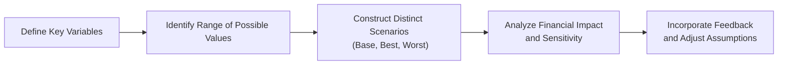

## Introduction

So, you’ve just wrapped up your initial forecasts for a brand-new financial model—complete with projected sales, expenses, and multiple lines of assumptions. Feels good, right? Maybe you have that slight tingle of excitement. I’ve been there, sitting in a conference room, turning a swirl of sales projections, marketing estimates, and cost data into a neat, color-coded spreadsheet. But here’s the thing: the moment we get comfortable is usually when behavioral biases sneak in. It’s almost comical how easily overconfidence or anchoring can sabotage our well-intentioned financial projections.

In this section, we’ll discuss some of the most common behavioral biases that can derail even the most capable analyst. We’ll also explore practical ways to mitigate them, with scenario analysis as one of the most powerful tools in the financial modeler’s arsenal. This discussion will tie closely to other chapters—particularly when we want to stress test (Chapter 14) or do sensitivity analysis (Chapter 16.5)—because an accurate forecast often means weaving together both human judgment and systematic checks.

## Key Behavioral Biases

Behavioral biases are those pesky tendencies we all have that color our judgments. They might prompt us to overvalue information we like, or cling too tightly to an initial guess. Let’s look at how each of these biases might show up in forecasting and scenario analysis.

### Overconfidence Bias

Overconfidence bias refers to overestimating the accuracy of your data or your ability to predict outcomes. It’s like saying, “My forecast is definitely right,” even in the face of uncertain market conditions. Overconfident analysts might:

• Underestimate risks or downside scenarios.  
• Omit contingency plans because they “feel sure” about their best-case assumptions.  
• Dismiss opposing viewpoints too quickly.

I remember once forecasting monthly revenue growth for a tech startup that had just launched a new subscription service. I was so convinced by the team’s hype and early traction that I neglected the possibility of a big slowdown post-launch. Sure enough, that slowdown happened. Overconfidence can happen to all of us—especially if we’re proud of our data or the line of logic we used to arrive at the forecast.

### Anchoring Bias

Anchoring bias happens when we fixate too heavily on initial information—like the first data point or a prior period’s results—and fail to adequately adjust for new insights. If you see an initial company valuation at $500 million, you might inadvertently cling to that number, even if subsequent analysis suggests the business is worth closer to $400 million.

In financial modeling, anchoring can happen if we base revenue assumptions on last year’s 10% growth, then apply a small 1–2% tweak without truly challenging whether that historical growth is relevant for the future. Or we anchor on last quarter’s operating margin, ignoring major changes in input costs. The residual effect of the anchor can be so strong that we fail to incorporate the broader economic environment or changes in the competitive landscape.

### Confirmation Bias

Confirmation bias is the classic “I only want to see what makes me right” phenomenon. We tend to select evidence that supports our hypothesis—say, we believe a new product will be a hit—while minimizing or ignoring signs of trouble. If you’ve built a scenario stating the product will grow 50% annually, you might ignore contrary signs like surveys showing most consumers prefer a competitor’s product or that churn metrics are creeping upward.

In forecasting, confirmation bias manifests as selective acceptance of positive data—such as strong pilot-program results—and downplaying contradictory data, like high customer acquisition costs. This bias is dangerous because it can create a one-sided gathering of evidence, rendering the entire forecast’s foundation shaky.

## Why These Biases Matter

Anyone who has taken a broad look at corporate bankruptcies, missed earnings targets, or big M&A flops will see examples of these biases in action. Overconfidence might cause a firm to overpay for an acquisition. Anchoring might keep an analyst from revising earnings expectations, even after negative news. Confirmation bias might lead a CFO to adopt only the best-case scenario, ignoring signals of an economic downturn.

From an exam perspective—especially in the context of the CFA curriculum—recognizing these biases and explaining how to mitigate them can be tested in both item-set and short-answer questions. The real-world lesson is straightforward: If you can’t spot these biases in your own analysis, your carefully built model can be humdrum at best, and dangerously misleading at worst.

## Mitigating Behavioral Biases

So how can we combat these biases without turning our day-to-day work into a never-ending self-doubt spiral? Here are a few practical suggestions:

• Structured Forecasting Process: Document your assumptions, methods, and sources for each step of your forecast. It might sound like extra paperwork, but it acts as a “bias firewall.” Whenever you or a colleague reviews the reasoning, you can spot leaps in logic more easily.  
• Cross-Functional Reviews: Bring in people from different departments—like marketing, operations, and finance. They each have distinct perspectives, and they can question your assumptions in ways you haven’t considered. This one’s a bit humbling, but crucial.  
• Contrarian/Worst-Case Scenarios: Force yourself to imagine extreme downsides. What if a major customer bails? What if the economy goes into recession? By explicitly confronting the “worst” data and narratives, you reduce the chance that you’re missing major pitfalls.  
• Bias-Spotting Checklists: Some organizations create a short checklist (e.g., “Did we get enough data from external sources? Have we evaluated negative evidence thoroughly?”). It’s a quick tool for sanity checks and ensures that each forecast iteration has built-in protective measures.

## Scenario Analysis: A Systematic Approach

Scenario analysis is a powerful technique to guard against biases while also providing richer insight into how your financial results might vary under different conditions. Rather than relying on a single point estimate, you create multiple “what if” versions of your model. Typically, you’ll see at least three:

• Base Case: Your most likely assumptions for growth, cost, etc.  
• Optimistic (or Best-Case) Scenario: Demand is higher, cost pressures are lower, or the macro environment is more favorable.  
• Pessimistic (or Worst-Case) Scenario: A confluence of negative events—rising commodity costs, new competition, economic contraction, you name it.

If you want to get fancy, you might assign probabilities to each scenario. For instance, if you believe the chance of the pessimistic scenario is 30%, you can estimate an expected value for certain performance metrics. There’s no strict rule on how many scenarios you should build. Some analysts do five or more (e.g., best-case, near-best, base, near-worst, worst-case). The key is to vary your assumptions enough to reveal a range of plausible outcomes.

Below is a simplified flowchart showing the scenario analysis steps:



### Linking to Other Chapters

• Chapter 14 (Financial Analysis of Banks and Insurance Companies) deals with stress testing for financial institutions—an advanced form of scenario analysis focused on extreme cases.  
• Chapter 16.5 (Sensitivity and Scenario Analysis in Financial Models) goes deeper into parametric changes in your forecasting inputs.  
• Chapter 4.11 mentions cross-referencing scenario analysis with stress testing. Understanding these ties helps underscore that scenario planning is relevant throughout your financial statement analysis journey.

## Practical Example

Let’s do a quick hypothetical:

Imagine you’re forecasting net income for a mid-sized manufacturing company that produces electric motors. You’ve got last year’s net income of $25 million, and you’re initially projecting 10% growth because, well, it grew 10% last year. That’s the anchor. Double-check if you’re possibly falling for anchoring bias. Maybe raw material costs are expected to increase. Perhaps a competitor has launched a cheaper motor overseas. A contrarian scenario might set growth at just 1%. Meanwhile, a bullish scenario might assume rapid sales expansion to new overseas markets, pegging growth at 15%.

Your scenario outcomes might look like this:

• Worst-Case: 1% revenue growth, 3% cost inflation → net income $23 million  
• Base Case: 6% revenue growth, 2% cost inflation → net income $26 million  
• Best-Case: 15% revenue growth, 1% cost inflation → net income $33 million  

Even a quick table like that can spark important discussions. Are we overestimating the best-case scenario because we’re overconfident in global expansion? Are we ignoring data that suggests an economic slowdown in the biggest market?

## Incorporating a Contrarian Perspective

It’s usually helpful to have at least one scenario that feels, well, a bit painful. That’s your contrarian scenario. I’ve been in strategy meetings where someone who’s a pro at playing devil’s advocate almost always ended up injecting more realism into the forecasts. By systematically challenging the consensus, you reveal hidden assumptions and reduce groupthink.

If we cross-reference “contrarian perspectives” with risk management frameworks taught throughout the CFA Program, you’ll see repeatedly how challenging group assumptions is one of the best ways to spot blind spots. This approach is also relevant for income tax forecasting (Chapter 8) when tax rates or deferred liabilities could unexpectedly change. Meanwhile, for companies with global operations (Chapter 11), exchange rates can shift drastically—perfect fodder for contrarian scenario planning.

## Handling Behavioral Biases in Scenario Analysis

In scenario analysis, the biggest risk is building multiple scenarios but still failing to challenge the underlying biases. For instance, if you anchor on last quarter’s performance, you might set growth rates that differ by only a small margin across best vs. worst scenarios. Overconfidence might creep in if you treat your base-case scenario with too much certainty. And confirmation bias can prompt you to find reasons why your best-case scenario is actually “most likely,” even if the data doesn’t support that conclusion.

### Structured Approaches to Mitigation

• Group Workshops: Gather relevant departments to develop and vet scenario assumptions. Encourage them to poke holes in each other’s logic.  
• External Research: Supplement your internal judgments with third-party market outlooks to cross-check assumptions.  
• Historical Back-Testing: Look at how your company or industry performed in past downturns and upcycles. This can keep your scenarios grounded in reality.  
• Documented Rationale: Keep a written record of how you arrived at your assumptions, along with alternative assumptions you rejected and why.  

## Using Forecast Tools and Python Snippets

Some finance teams employ Python (or R, or specialized forecasting software) to generate Monte Carlo simulations. For instance, you could set up a quick script:

```python
import numpy as np

growth_rates = np.random.normal(loc=0.06, scale=0.02, size=10000)  # mean 6%, stdev 2%
cost_inflation = np.random.normal(loc=0.02, scale=0.01, size=10000)  # mean 2%, stdev 1%
starting_net_income = 25_000_000

results = starting_net_income * (1 + growth_rates - cost_inflation)

mean_income = np.mean(results)
worst_case = np.percentile(results, 5)
best_case = np.percentile(results, 95)

print(f"Mean net income: ${mean_income:,.0f}")
print(f"Worst-case (5th percentile): ${worst_case:,.0f}")
print(f"Best-case (95th percentile): ${best_case:,.0f}")
```

Though this snippet is just a simplified illustration, it demonstrates how you can model thousands of “mini-scenarios.” You can incorporate other variables (like foreign exchange rates, interest rates, or commodity prices) to build a richer picture. By quantifying many outcomes, you naturally confront your biases because the simulation exposes a distribution of possible results, not just a single guess.

## Best Practices and Common Pitfalls

• Best Practice: Always try to “falsify” your model’s assumptions. Ask, “Under what conditions would this entire estimate be wrong?”  
• Pitfall: Using scenario analysis but applying only small parameter changes (e.g., 9% vs. 10% vs. 11% growth) so that your final results barely differ. This reveals more about anchoring bias or overconfidence than actual scenario analysis.  
• Best Practice: Use structured protocols—like a scenario planning template. Describe each scenario’s macroeconomic assumptions, competitor moves, and internal operational shifts.  
• Pitfall: Confusing scenario analysis with sensitivity analysis. Sensitivity analysis changes one variable at a time, whereas scenario analysis changes multiple variables in tandem to provide a holistic view.  

## Implications for Financial Reporting Analysis

While forecasting is usually forward-looking, many of our assumptions tie back to historical financial statements. Overconfidence may cause us to ignore subtle red flags in the balance sheet (Chapter 3) or income statement (Chapter 2). Confirmation bias can lead us to accept questionable revenue recognition (Chapter 2.1) at face value. Anchoring bias might result in misjudging the effect of new accounting rules (like IFRS vs. US GAAP differences, Chapter 1.4). Realistically, robust scenario analysis helps us remain vigilant about possible challenges in the firm’s reported financials.

## Final Exam Tips

From an exam standpoint, you should be prepared to:

• Identify examples of biases (overconfidence, anchoring, confirmation) in short vignettes or item sets.  
• Explain how these biases affect forecasting processes and scenario analysis.  
• Suggest specific methods to mitigate biases, such as cross-functional reviews or structured scenario plans.  
• Discuss how scenario analysis can be applied to different sections of the financial statements (income statement, balance sheet, cash flow statement).  
• Reconcile scenario analysis with any recognized frameworks for stress testing (particularly relevant in more advanced chapters, but introduced here at Level I).

Remember, the CFA exams often feature scenario-based questions that test your ability to spot biases within a narrative. Practice reading through a fictional CFO’s statements, identifying overly optimistic or anchored forecasts, and formulating an unbiased approach.

## References and Further Reading

• Kahneman, D. (2011). Thinking, Fast and Slow. Farrar, Straus and Giroux.  
• Montier, J. (2010). The Little Book of Behavioral Investing. Wiley.  
• CFA Institute’s resources on behavioral finance and biases in investment decision making.  
• Review Chapters 2, 3, and 4 for deeper dives into income statement, balance sheet, and cash flow considerations that connect with forecasting assumptions.  
• Chapter 14 for advanced stress testing and scenario design, particularly relevant to financial institutions.

---

## Test Your Knowledge: Behavioral Biases and Scenario Analysis Quiz



### Which bias involves overestimating the accuracy of one’s forecasts?

- [ ] Anchoring bias
- [ ] Confirmation bias
- [x] Overconfidence bias
- [ ] Status quo bias

> **Explanation:** Overconfidence bias leads analysts to believe their estimates are more accurate than they actually are.  

### In forecasting, which best describes the danger of anchoring?

- [x] Clinging too strongly to initial data or prior results
- [ ] Ignoring current data when it contradicts a long-term trend
- [ ] Using multiple scenarios to evaluate forecast variability
- [ ] Overly focusing on negative outcomes to remain cautious

> **Explanation:** Anchoring bias occurs when initial information—such as a previous estimate—forms a strong reference point that skews subsequent judgments.  

### Which method specifically helps reduce confirmation bias?

- [ ] Relying solely on historical averages
- [ ] Using only internal company data
- [ ] Eliminating worst-case scenarios to streamline forecasts
- [x] Conducting cross-functional reviews to challenge assumptions

> **Explanation:** Cross-functional reviews encourage diverse viewpoints that can highlight overlooked or contradicting data, helping to counter confirmation bias.  

### Suppose an analyst always sets optimistic revenue forecasts without reviewing external market data. Which bias is most likely present?

- [ ] Anchoring bias
- [x] Overconfidence bias
- [ ] Herding bias
- [ ] Mental accounting bias

> **Explanation:** Overconfidence bias is evident when the analyst’s subjective certainty in their own forecast overrides thorough external validation.  

### Which of the following is a defining feature of scenario analysis?

- [x] Changing multiple variables simultaneously
- [ ] Focusing only on one key variable at a time
- [ ] Avoiding any extreme market assumptions
- [ ] Strictly relying on historical data to create future estimates

> **Explanation:** Scenario analysis shifts multiple variables in tandem to reflect different possible futures, rather than altering just one assumption.  

### In a scenario analysis, assigning probabilities to each case is useful because:

- [x] It allows you to estimate an expected value outcome.
- [ ] It guarantees accuracy of the final forecast.
- [ ] It automatically eliminates behavioral biases.
- [ ] It prevents negative outcomes from occurring in real life.

> **Explanation:** By assigning probabilities, analysts can weight each scenario to calculate an overall expected value or outcome range, although it doesn’t fully remove biases.  

### What is one recommended strategy to mitigate anchoring bias?

- [x] Use historical back-testing and fresh external data points
- [ ] Disregard worst-case scenarios for simplicity
- [ ] Accept initial assumptions as “best guess”
- [ ] Adopt only the base-case scenario

> **Explanation:** Anchoring bias can be mitigated by collecting and analyzing additional data that challenges initial assumptions.  

### What is a potential pitfall of scenario analysis when biases persist?

- [ ] It converts forecasts into reality.
- [ ] It eliminates all financial risk.
- [x] Scenarios might differ superficially but share the same anchor or optimism.
- [ ] It removes the need for cross-functional reviews.

> **Explanation:** If biases remain unchecked, scenarios may look different numerically but could still over-rely on the same overly optimistic or anchored assumptions.  

### Which practice most effectively ensures that forecasts consider both internal and external viewpoints?

- [ ] Interviewing only senior management
- [x] Utilizing cross-department collaboration and external research
- [ ] Restricting input to the accounting department
- [ ] Only conducting desk research on internal cost trends

> **Explanation:** Gaining cross-department input and external market insights fosters well-rounded forecasts, reducing reliance on biased, siloed views.  

### The primary purpose of a contrarian perspective in scenario analysis is to:

- [x] Challenge groupthink and encourage exploration of negative outcomes
- [ ] Reinforce existing assumptions
- [ ] Confirm the base case as the most probable
- [ ] Settle disputes with external stakeholders

> **Explanation:** Adopting a contrarian viewpoint helps identify blind spots and ensures thorough consideration of downside risks that the consensus might overlook.  


