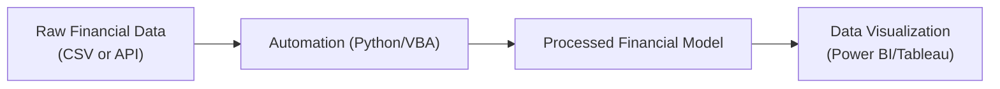

## Introduction

So, have you ever spent hours—maybe even days—copying data from multiple spreadsheets into one giant workbook, worried you might have made a million tiny errors along the way? Well, you’re not alone. A while back, I remember rummaging through a monstrous Excel model just to fix one row for a depreciation schedule that threw off the entire forecast. That’s when it hit me: “Why am I doing all this by hand?” And that’s where automation and data visualization tools step in, supercharging your financial modeling processes and giving you more time to think strategically. Let’s explore how to set this up so you don’t feel like you’re lost in a web of manual tasks.

Effective financial modeling requires current, accurate data—and a user-friendly way of interpreting it. As discussed earlier in this volume, the quality of inputs (e.g., IFRS vs. US GAAP differences, revaluation effects from Chapter 6, or segment disclosures from Chapter 1) directly influences the reliability of your forecast. Automation lets you pull data from reliable sources with minimal manual intervention, while data visualization helps you or your stakeholders make sense of complex trends. Ultimately, combining both can significantly reduce errors and, frankly, help you keep your sanity.

## Why Automation Matters

You might be wondering, “What exactly can I automate?” The short answer: nearly anything repetitive that doesn’t require a judgment call. For instance, pulling historical financial statements from a dataset or an external database, collating company performance metrics from XBRL feeds (see Chapter 1.10 for more on XBRL), or rolling forward your model to reflect a new quarter of data. These activities can be scripted with VBA macros in Excel or with more robust programming languages like Python.

An added bonus is that automation also promotes better version control and transparency. Instead of searching for which analyst changed a single assumption in a labyrinth of worksheets, you can store your scripts in a repository (e.g., GitHub or a private hosting environment) that logs every single update. This is crucial for accountability, especially when your final outputs feed into investment recommendations that might appear in a board meeting or an investor roadshow.

## Key Tools and Techniques

### Spreadsheet Macros

• Macros are particularly handy in Excel. You can record your exact keystrokes or code repetitive tasks in VBA (Visual Basic for Applications).  
• Useful for tasks like refreshing pivot tables, pulling daily exchange rates, or generating standardized charts that highlight changes in net income, EBIT, or free cash flow.  
• One personal tip: name your macros descriptively. Something like “ImportIncomeStatementAPI” is way more helpful than “Macro15.” Trust me, you’ll thank yourself six months down the line.

### Python Scripting

• Python is widely used in data science and finance for its powerful libraries like pandas (for data manipulation) and NumPy (for numerical computations).  
• Finance folks often automate the retrieval of financial statements from APIs—like pulling 10-K or 10-Q data from EDGAR or other data providers—to feed into a forecast model.  
• If you recall from Chapter 4 and the statement of cash flows, Python can quickly parse multi-year or multi-entity data, run transformations (e.g., converting operating leases to capitalized leases under IFRS 16 adjustments for comparability), and then seamlessly push data into your modeling tool.

Below is a quick snippet in Python showing how you might import data from a CSV or an API endpoint and merge it into a single dataset:

```python
import pandas as pd

historical_data = pd.read_csv('historical_financials.csv')

# api_data = pd.read_json('https://api.example.com/company/financials')

combined_data = pd.concat([historical_data]) 

combined_data['Revenue_USD'] = combined_data['Revenue'] * combined_data['FX_rate']

print(combined_data.head())
```

### Version Control

• Large models evolve: you might apply new IFRS rules for intangible assets (Chapter 3.2) or incorporate new assumptions about discount rates for a pension plan (Chapter 7.2).  
• Tools like Git or Subversion track each change. This is not just for software developers—it’s fantastic for any team-based environment.  
• You can roll back to a previous version of the model if something breaks. That’s a lifesaver when your boss calls you at midnight claiming the model “just exploded.”

## Data Visualization Approaches

Spreadsheets alone can be dense, so turning raw numbers into intuitive visuals is crucial. Visual aids are powerful in uncovering anomalies, correlations, and trends that static tables can’t always easily reveal.

### Charts and Graphs

• Start with basic column or line charts that track revenue growth and operating margins over time.  
• Use a color-coded approach—how about green for positive margin expansions, and red for that dreadful margin compression?  
• If your model extends to foot traffic data for a retailer, a scatter plot can quickly show relationships between marketing spend and in-store sales.

### Heat Maps and Pivot Tables

• Heat maps highlight outliers or high-concentration risks in a color gradient. They’re extremely useful if you’re analyzing large data sets from multiple segments (check Chapter 1.8 on segment reporting).  
• Pivot tables can be automated too (using macros) to instantly summarize, for example, revenue by region or product line. If you refactor or reclassify certain revenue streams (as discussed in Chapter 2.6 regarding operating vs. non-operating items), pivot tables make it easy to reflect those changes on the fly.

### Professional Dashboarding Tools

• If entire teams need to view data simultaneously, or if you want to integrate real-time data streaming from multiple sources, consider specialized software like Microsoft Power BI or Tableau.  
• These platforms allow interactive dashboards with slicers, dynamic filters, and clickable charts. Perfect for management presentations: the CFO can filter your forecast in real-time by geography or business line and see immediate changes in the top-line or bottom-line forecast.  
• They also integrate with Python or R scripts for advanced analytics—like predicting future earnings based on historical patterns or macroeconomic indicators (see Chapter 16.7 for integrating macro-factors).

Below is a simple Mermaid.js flowchart illustrating how automated data feeds into a visualization dashboard:



## Benefits of Automation & Visualization

• Efficiency Gains. When I first automated a large forecasting model, I cut my update time from a full day to just 15 minutes. No more copy-paste mania.  
• Real-Time Updates. Want to see what happens if your cost of capital or risk-free rate changes? Adjust one cell, and watch it ripple through dashboards in seconds.  
• Error Reduction. Manual data entry is prone to mistakes—especially if you’re dealing with lengthy IFRS or US GAAP reconciliations. Automated imports and transformations keep that risk in check.  
• Clear Stakeholder Communication. Upper-level execs or outside investors typically prefer visuals to dense spreadsheets. Color-coded indicators and intuitive charts lead to better decision-making.

## Potential Pitfalls to Watch For

• Overreliance on Automation. Automated processes may mask issues if the underlying data feed is incorrect. Always do sense checks.  
• Lack of Documentation. If no one documents how these automated scripts or macros work, the model can quickly turn into a “black box.”  
• Version Conflicts. If you fail to merge changes properly in Git or don’t maintain consistent references in your workbook, you could end up with conflicting versions of your forecast.  
• Inadequate Controls. The CFA Institute Code and Standards emphasize diligence and reasonable care. Automation can be an asset, but you must ensure that appropriate controls and oversight are in place (e.g., periodic reviews, validations against external data).

## Putting It All Together

Ultimately, automation and data visualization tools create a robust ecosystem for financial modeling. In practice, you might:

• Use Python scripts to fetch the latest quarterly IFRS 1 adoption changes for a newly listed subsidiary.  
• Convert or restate these statements into your primary reporting currency.  
• Push the cleansed data automatically into an Excel-based model or a data visualization tool like Tableau.  
• Generate real-time dashboards for your team to see how key metrics (like operating margin, capital expenditures, or free cash flow) are trending.  
• Save everything in a version-controlled environment to ensure accountability and easy rollbacks.

Applications abound—whether you’re analyzing a single company’s financial performance or building a consolidated model for a multinational group. Getting comfortable with these tools is increasingly vital as the financial industry continues to embrace digital transformation.

## Glossary

• Automation: Using software tools to handle repetitive tasks with minimal human intervention.  
• Macros (Spreadsheet): Custom scripts or recorded actions that automatically perform repeated tasks in a program like Excel.  
• API (Application Programming Interface): A communication protocol that allows different software platforms to interact and share or retrieve data.  
• Power BI/Tableau: Advanced business intelligence platforms that connect with multiple data sources for interactive dashboards and reporting.  
• Dashboard: A user interface that summarizes and visualizes critical data points, often in real time, to facilitate quick decision-making.

## References and Further Reading

• Walkenbach, J. (2019). Excel VBA Programming for Dummies.  
• Chen, C. (2017). Information Visualization: Beyond the Horizon. Springer.  
• Python resources on DataCamp or Kaggle for tutorials on data import and financial modeling.  
• CFA Institute. (2023). CFA Program Curriculum Level I, Financial Reporting and Analysis. CFA Institute.

---

## Test Your Knowledge: Automation and Data Visualization in Financial Modeling



### Which of the following is the primary advantage of incorporating automation into your financial model using Python or VBA?

- [ ] It eliminates all human decision-making.  
- [x] It reduces manual tasks and lowers the risk of transcription errors.  
- [ ] It ensures your model is always free of logical errors.  
- [ ] It guarantees IFRS compliance automatically.

> **Explanation:** Automation helps reduce repetitiveness and mitigate human error, but it does not replace critical judgment or guarantee compliance on its own.

### Which software tool is best known for creating visually interactive dashboards that integrate data from various sources?

- [ ] Git  
- [ ] Python  
- [x] Tableau  
- [ ] Excel macros

> **Explanation:** Tableau (and Microsoft Power BI) specialize in connecting to multiple data sources to produce dynamic dashboards.

### A key benefit of version control systems (e.g., Git) for financial models is:

- [x] Tracking changes so you can revert to prior versions if errors arise.  
- [ ] Allowing unlimited data import from any API.  
- [ ] Guaranteeing that management will adopt the model.  
- [ ] Automatically reclassifying IFRS vs. US GAAP statements.

> **Explanation:** Version control logs all changes, enabling teams to roll back easily if something breaks or if you need to compare versions.

### When designing a data visualization, why might color coding be particularly useful?

- [x] It highlights patterns or red flags at a glance.  
- [ ] It makes the revenue numbers disappear.  
- [ ] It is required by IFRS 13 for fair value disclosures.  
- [ ] It expands the chart beyond available space.

> **Explanation:** Color coding calls attention to outliers or critical changes (e.g., negative margins highlighted in red), enabling quick scanning.

### In an automated workflow, what is the typical role of an API?

- [x] It allows software to retrieve or exchange data programmatically.  
- [ ] It acts as a hardware device that prints balance sheets.  
- [ ] It replaces macros entirely.  
- [ ] It enforces IFRS lease accounting standards.

> **Explanation:** APIs provide a standardized way for applications to communicate data, contributing to seamless automation setups.

### Which of the following is a recommended practice when automating model refreshes?

- [x] Retaining a sense check or manual review step.  
- [ ] Deleting all previous versions.  
- [ ] Switching off all pivot tables.  
- [ ] Restricting your model only to offline data.

> **Explanation:** Even with automation, you need periodic checks to ensure the data feed and transformations are correct.

### Heat maps are most commonly used to:

- [x] Identify data outliers or high concentrations via color gradients.  
- [ ] Replace normal charts with text-based overlays.  
- [x] Summarize future IFRS rules.  
- [ ] Remove the need for segment disclosures.

> **Explanation:** By varying color intensity, heat maps help you pinpoint unusually high or low values quickly.

### A potential pitfall of using professional dashboarding tools like Power BI is:

- [x] Overreliance on visuals if underlying data quality is poor.  
- [ ] Mandatory improvements in data accuracy.  
- [ ] Automatic IFRS vs. US GAAP reconciliation.  
- [ ] Enhanced risk of macros.

> **Explanation:** While dashboards look great, they still rely on accurate, validated data. If the data feed is flawed, the dashboards will mislead.

### An example of a minor but useful automation in Excel is:

- [x] A macro that refreshes all pivot tables and charts on one click.  
- [ ] Printing the entire workbook every time a cell changes.  
- [ ] Overwriting formulas with static values upon file open.  
- [ ] Converting a pivot table into a PDF repeatedly.

> **Explanation:** By automating pivot table refresh, you ensure your data visualizations update seamlessly without manual intervention.

### Using a dashboard to review forecasts in real time helps stakeholders primarily by:

- [x] Providing immediate feedback on how changes in assumptions impact outcomes.  
- [ ] Ensuring macros are never used.  
- [ ] Hiding disclaimers on IFRS adjustments.  
- [ ] Guaranteeing a company’s performance improves.

> **Explanation:** Real-time dashboards let you see the direct effect of adjusting key inputs—like interest rates or tax assumptions—enabling quick and informed discussions.


