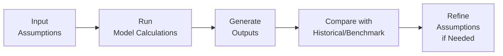

### Introduction
Model validation and documentation might feel like housekeeping tasks (and, well, sometimes they can be), but trust me, they’re absolutely critical to ensuring your financial model is more than just a fancy spreadsheet. When I first started building models, I was so focused on the “cool” part—forecasting revenue or linking the income statement to the balance sheet—that I neglected a good chunk of the validation steps. Then reality struck: without proper checks, scenario testing, and bulletproof documentation, my model occasionally gave me nonsense results—like predicting more cash flows than the total projected market size. Oops.

In a real-world finance setting—especially if you’re working with IFRS or US GAAP–aligned statements to influence multi-million (or billion) dollar decisions—you need more than guesswork. You need structure, discipline, and traceability. And if you’re preparing for the CFA exam, keep in mind that validating and documenting your model can show up in multiple question forms, often in scenario-based prompts or item sets addressing risk controls and reliability of analyses.

Below, we’ll explore how to approach model validation tests, how to document your assumptions so that they’re easy to track (and easy to critique!), and which pitfalls to avoid. We’ll also weave in references to relevant chapters—like Chapter 14 for stress testing, Chapter 16.5 for sensitivity analysis, and Chapter 2 for income statement fundamentals—should you need a refresher on revenue and expense recognition impacts.  

### Model Validation Techniques
A model’s integrity hinges on whether its outputs make sense in light of historical data, industry benchmarks, and hypothetical stress scenarios. Let’s walk through the essentials:

#### Comparing Model Outputs vs. Historical Data (Back-Testing)
One of the simplest ways to see if your financial model is on the right track is to compare it against actual historical performance. Suppose you have three years of real revenue data, and your model also projects those same past periods (it’s normal to maintain a “history + forecast” approach in your model).  

• If your model predicted 10% revenue growth in Year 2, but the actual figure ended up being -5%, you need to find out what’s driving the discrepancy. Was it an assumption about sales volumes? A miscalculated formula for pricing changes?  
• By identifying these errors or oversights early, you can refine your logic for future projections. Sometimes, the mismatch might be legitimate (e.g., your model can’t account for an extraordinary event), but you still want to note it so decision-makers understand any inherent limitations.

Back-testing is frequently used not just for corporate models but also for risk models, as you might see in a big bank’s Value at Risk (VaR) calculations. While the context differs, the principle—compare predicted vs. actual—remains the same.

#### Cross-Verification with Industry Benchmarks
Ever hear folks say “That margin is too high. Are you sure your cost assumptions are correct?” They’re probably doing a quick benchmark check in their head. Because certain metrics—like gross margin or EBITDA margin—tend to fall within predictable ranges for specific industries, you should test them against peers’ data or industry averages.

• For example, if you’re modeling a SaaS (Software-as-a-Service) company, a 90% gross margin might be feasible, but a 90% operating margin would set off alarm bells.  
• If your competitor analysis (see Chapter 13 for ratio analysis) reveals that all major players in your space post operating margins of 15–20%, you should reconcile why your model is showing 30%. Maybe you’re missing certain operating expenses or underestimating marketing costs.

#### Scenario Testing and Stress Testing
Scenario tests examine how your model behaves under varying assumptions—like changes in interest rates, commodity prices, or foreign exchange rates. Stress tests sharpen the lens by pushing scenarios to extremes. Consider applying:

• Economic recessions: Assume a significant drop in consumer demand over a certain time horizon.  
• Supply chain breakdown: See how cost of goods sold or inventory levels would be affected if your main supplier doubles its prices.  
• Regulatory changes: In some industries, a minor tweak in policy can wreak havoc—or provide an unexpected uplift.

For a quick illustration, you might run something like this in Python:

```python
import numpy as np

base_revenue = 1_000_000  # One million
growth_scenarios = [0.05, -0.02, 0.10]  # A set of plausible (and not-so-plausible!) growth rates

scenario_results = {}
for idx, growth in enumerate(growth_scenarios, start=1):
    scenario_revenue = base_revenue * (1 + growth)
    scenario_title = f"Scenario {idx} (Growth={growth*100:.1f}%)"
    scenario_results[scenario_title] = scenario_revenue

for scenario, revenue in scenario_results.items():
    print(f"{scenario}: ${revenue:,.2f}")
```

Although this is just a simplified snippet, it helps you see how slight changes in assumptions can lead to materially different outcomes. Chapter 16.5 digs deeper into advanced scenario and sensitivity analyses, including parallel shifts in interest rates or multi-variable changes.

Below is a simple visual flow of how validation typically fits into your overall modeling cycle:



This loop continues until you—and stakeholders—are satisfied your model is “close enough” to reality or that any discrepancies are clearly understood.

### Documentation Essentials
Proper documentation is the unsung hero of financial modeling. It keeps you sane, helps others follow your logic, and ensures that six months from now (or six years from now), folks can revisit your file and actually make sense of it. 

#### Version History
Any decent financial model needs version control. Even if you’re operating solo:

• Keep track of changes to assumptions (e.g., interest rate updated, discount rate changed, new revenue data).  
• Tag major revisions so you can revert if a new update breaks something.  

Cloud-based systems or corporate networks might store daily “snapshots” of your workbook, but it’s still best practice to keep a notes tab or a log within the file. If adopting advanced version control systems, you can mirror software development approaches (like Git), but even a simple “v1.0, v1.1, v2.0” naming convention can work wonders.

#### Labeling and Cell Comments
I once co-inherited a model from an external consultant that had a cell with a monstrous formula referencing 20 different tabs. It was so complex that I spent two days deciphering it… only to find that the final output was basically a simple ratio. If they’d added cell comments, or a short text note referencing the relevant assumption, I would have saved a whole weekend.

• For each significant formula, especially those mixing multiple references (e.g., revenue from Tab A, discount rate from Tab B, sensitivity factor from Tab C), consider adding a comment.  
• If your modeling software supports it, you can also use data tags.  
• Create a separate assumptions tab that spells out: “Cell X in the operating expenses tab is referencing inflation data in the macro tab.”

#### Structured Assumption Summaries
Your entire model can revolve around 5–10 key assumptions, like:  
• Growth rates (domestic and international)  
• Discount rates (WACC, cost of equity, incremental borrowing rates)  
• Operating margins (normalized vs. expansion strategy)  
• Rate-of-return assumptions for short-term investments or overdraft interest for working capital needs  

Having all these in one structured assumptions sheet helps ensure you don’t lose track—especially if RBC (Revenue Based on “C”) was once pegged at 5% growth and you changed it to 7%, but forgot to mention it anywhere. This is also critical for IFRS 1 or US GAAP first-time adoption adjustments (see Chapter 1.12 and 1.15), as you might end up doing restatements or revaluations that rely heavily on consistent assumptions.

### Common Pitfalls
Now let’s talk about where things commonly go off the rails. These are more than small mistakes—they’re the big issues that can derail not only your analysis but also your reputation as a modeler:

#### Insufficient Stress Testing
You’ve done your baseline scenario, maybe you’ve toggled a few assumptions, but have you truly tested the extremes? If not, your leadership could end up overrelying on rosy projections. In Chapter 14, we explore how banks test extreme conditions like liquidity crunches or massive credit defaults. While you might not be modeling a bank, the concept of “big shocks” is universally relevant.

#### Poor Labeling
Unclear references are the bane of every model auditor’s existence. This can include cryptic abbreviations, references to nonexistent data, or simply poor organization (like having the revenue formulas in 10 different tabs). The best approach is to keep your logic centralized and your labeling consistent.

#### Overly Complex Formulas
Yes, spreadsheets let you nest 10, 20, maybe 30 functions in a single cell, but that doesn’t mean you should. A simpler approach is typically to break complex formulas into multiple lines or multiple helper cells, so each step is transparent. The more complicated the formula, the higher the chance for error—and the harder it is for an external reviewer to check your work.

### Glossary
• **Model Validation**: The process of ensuring a financial model’s logic, data, and assumptions accurately represent real-world or intended scenarios.  
• **Back-Testing**: Comparing a model’s historical predictions with actual past results to gauge accuracy and reliability.  
• **Stress Test**: Subjecting the model to severe but plausible assumptions (like a major recession or a supply shock) to see how it performs under extreme conditions.  
• **Version Control**: A system (informal or formal) to track changes over time, so you can always roll back to earlier iterations if something breaks.  
• **Auditability**: The ease with which a third party can review, understand, and verify a model’s logic and calculations.

### Final Exam Tips
• Be ready to describe how you’d validate a model’s logic in a constructed-response question. The exam might present a scenario with suspicious growth rates and ask you to pinpoint errors or propose improvements.  
• Anticipate item set questions that test your understanding of documentation. For instance, a question might show partial references or incomplete labeling and ask you to identify the risk or needed fix.  
• Memorize key IFRS vs. US GAAP differences in how certain line items (like intangible assets or deferred taxes) might be forecast. Testing your model consistency with these standards is crucial.  
• Practice stress testing. The exam loves hypothetical “What if GDP falls by X%?” prompts.  
• Keep track of your time—model validation or documentation questions can become surprisingly detailed, but you only have so many minutes per question set.

### References
• Rajan, R., & Reichelstein, S. (2009). “Modeling and Measuring Cost of Capital.” Journal of Accounting Research.  
• PwC’s “Best Practices in Financial Modeling” resources (search for PwC financial modeling guidelines).  
• The Institute of Management Accountants (IMA) has publications on model governance and internal controls.  
• Chapter 1 for IFRS adoption guidelines, particularly IFRS 1.  
• Chapter 13 for ratio analysis frameworks and competitor benchmarking methods.  
• Chapter 14 for stress testing financial institutions.  
• Chapter 16.5 for deeper insights on scenario analysis and sensitivity testing.

## Test Your Knowledge: Model Validation & Documentation Best Practices



### Which of the following best describes the purpose of back-testing in financial modeling?

- [ ] It compares actual results in future periods with a baseline scenario.  
- [x] It compares historical model predictions with known past outcomes.  
- [ ] It ensures that benchmark data is more accurate.  
- [ ] It replaces stress testing and scenario analysis.  

> **Explanation:** Back-testing is the process of comparing a model’s past predictions (for periods that have already occurred) with actual historical results to examine the model’s accuracy.

### What is a key danger of failing to stress-test a financial model?

- [ ] Underestimating potential positive outcomes.  
- [x] Overlooking severe but plausible negative scenarios.  
- [ ] Increasing overvaluation of intangible assets.  
- [ ] Forgetting to record scenario versions in a notes tab.  

> **Explanation:** Without stress-testing, you may miss significant risks if the economy or the firm faces extreme conditions, resulting in incomplete or misleading projections.

### What should documentation of a significant formula typically include?

- [x] A clear note or cell comment explaining references and assumptions.  
- [ ] Only a reference to IFRS or US GAAP guidelines.  
- [ ] Automatic updates to all competitor analysis sheets.  
- [ ] Data tags hidden in a separate, encrypted file.  

> **Explanation:** Proper documentation means providing enough detail for someone else (or your future self) to understand what a formula does and how it’s connected to other parts of the model.

### Why might overly complex formulas be a problem?

- [ ] They reduce the total number of cells in a workbook.  
- [x] They can obscure logic and increase error risk.  
- [ ] They automatically lead to more accurate forecasts.  
- [ ] They disable version control functionality.  

> **Explanation:** Long, nested formulas can be opaque, making it much harder to spot errors or validate assumptions. Simpler, step-by-step calculations are generally safer.

### Which of the following is an example of proper version control in financial modeling?

- [x] Maintaining a revision log indicating changes in discount rates and assumptions.  
- [ ] Saving newly revised files with random names like final_version_really_final.xls.  
- [x] Using a systematic naming convention (e.g., v1.0, v1.1, etc.) for your models.  
- [ ] Storing all data in a single monolithic tab.  

> **Explanation:** Proper version control involves both a systematic naming approach and a revision log to track all updates. This ensures you can revert to older versions if issues arise.

### What is one benefit of including an Assumptions tab in your spreadsheet?

- [x] It centralizes all key inputs for easier auditing.  
- [ ] It replaces the historical data tab entirely.  
- [ ] It ensures the model can’t be edited by third parties.  
- [ ] It halts computation in the baseline scenario.  

> **Explanation:** Consolidating your key assumptions in a single tab keeps them visible and allows both you and reviewers to quickly assess and modify them without hunting through multiple tabs.

### When validating your model by comparing to industry benchmarks:

- [x] You check margins, growth rates, or ratios against peers to see if outcomes are reasonable.  
- [ ] You ignore differences in business models.  
- [x] You make adjustments if your model diverges significantly for no apparent reason.  
- [ ] You only focus on intangible asset valuations.  

> **Explanation:** Benchmark comparisons help you quickly identify outlier results in your model that may be caused by unrealistic assumptions or calculation errors.

### How does auditability impact a financial model?

- [x] It enhances the ease with which another party can verify and trust your model.  
- [ ] It replaces the need for robust stress testing.  
- [ ] It ensures your model can be published without disclaimers.  
- [ ] It removes the need for IFRS compliance.  

> **Explanation:** Auditability is about transparency and clarity, letting others trace logic and confirm your assumptions quickly.

### What is the benefit of labeling each significant formula or approach in a financial model?

- [x] It allows others to understand and verify your approach without confusion.  
- [ ] It guarantees future earnings growth.  
- [ ] It is required only if using IFRS.  
- [ ] It automatically reduces your model’s size.  

> **Explanation:** Clear labeling helps reviewers and stakeholders verify calculations and confirm the integrity of the model’s logic.

### True or False: A “stress test” in financial modeling relates exclusively to testing for massive increases in a company’s revenue.

- [x] True  
- [ ] False  

> **Explanation:** Actually, stress tests often focus on severe negative outcomes (like demand drops or cost spikes), but the question’s phrasing can be tricky; if your model scenario is a “massive increase in revenue” to see if the model breaks, that is also a form of stress test—albeit a positive extreme.


