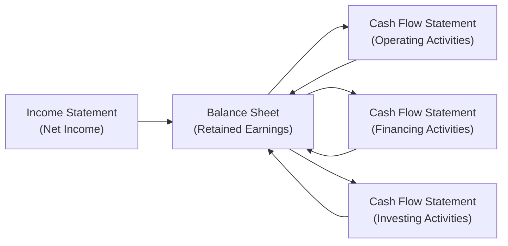
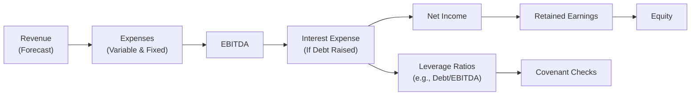

## Introduction
Building a robust financial model can feel a bit intimidating at first—kind of like staring at a huge jigsaw puzzle without the final picture. But once you see how each piece fits together, it’s actually pretty logical. In this section, we’ll walk through a step-by-step forecast example and discuss capital structure adjustments along the way. We’ll keep it practical, so you can apply these ideas whether your company is a tech startup or a big manufacturing firm.

Here’s what we’ll cover:

• Setting up a simple three-statement model (income statement, balance sheet, cash flow statement).  
• Linking historical data to future forecasts.  
• Projecting revenue, expenses, working capital, and capital expenditures.  
• Making sure depreciation, amortization, and interest tie back to your capital structure changes.  
• Validating your output so that everything stays balanced.  

At the end, you’ll see how changing your debt or equity financing can shape the entire forecast. And yes, the dreaded circularity of interest expense is part of the fun, but we’ll keep it manageable.

## Initial Model Setup
The foundation of any strong model lies in the three primary financial statements:

• Income Statement: Summarizes revenue and expenses to arrive at net income.  
• Balance Sheet: Shows a snapshot of assets, liabilities, and equity at a specific date.  
• Cash Flow Statement: Reconciles how changes in the balance sheet and income statement affect the company’s cash position.

One quick anecdote: I once tried to help a friend model a small coffee chain’s performance for the next five years. We forgot to link net income to retained earnings and spent hours scratching our heads about why the balance sheet wouldn’t balance. So trust me—double-check your statements flow together properly before diving deeper.

### Linking Statements
In a properly linked Excel or spreadsheet model:  
• Net Income from the Income Statement flows into Retained Earnings on the Balance Sheet.  
• Depreciation and amortization, as well as changes in working capital, appear on the Cash Flow Statement as noncash add-backs or uses of cash.  
• Financing activities, like issuing new equity or taking on debt, show up in the financing section of the Cash Flow Statement but also adjust the Balance Sheet for additions to equity or increases in liabilities.

Below is a small diagram illustrating the typical flow:

Notice how changes in the balance sheet (Retained Earnings, debt, equity, and fixed assets) loop back into the cash flow statement, ensuring everything stays connected.

## Revenue Forecast
Any good forecast starts with the top line—revenue. In practice, you might forecast this using growth rates, market share analysis, or client-by-client pipeline details.

• Historical Approach: If the company’s been around for a while, you can look at historical growth rates and make educated guesses (e.g., revenue grows at 10% per year).  
• Bottom-Up Approach: For instance, if you’re forecasting a coffee chain, you might estimate weekly sales per store, multiply by the number of stores, and then project the result forward by factoring in new store openings.  
• Scenario Analysis: Maybe have a “Bull” scenario (ambitious growth), “Base Case,” and “Bear” scenario (conservative growth). This is particularly helpful if the environment is uncertain.

In IFRS or US GAAP (ASC 606), you’d want to consider contract-based revenue recognition or distinct performance obligations if it’s a complex business. For a simple forecast, we usually assume recognized revenue matches the cash inflows well enough for big-picture modeling.

## Expense Forecast
After revenue, you predict costs. It’s helpful to split them into:

• Variable Costs: These move roughly in proportion to revenue (e.g., materials, direct labor).  
• Fixed Costs: These stay relatively constant in the short term (e.g., rent, certain administrative salaries).

When I coached a friend modeling a bakery, we discovered that flour, sugar, and direct labor soared with each new store, but the bakery’s main office rent didn’t move at all initially. So it’s pretty important to figure out which costs strain your business as it grows.

Some modelers also factor in inflation or efficiency improvements over time (e.g., maybe the business gets volume discounts if it orders more supplies).

## Working Capital
Working capital is current assets minus current liabilities. In any forecast, you need to track:

• Accounts Receivable: Are customers paying faster or slower?  
• Inventory: Is it piling up or do you have a lean supply chain?  
• Accounts Payable: How long do you have to pay suppliers?

If revenue increases, typically receivables and inventory go up. That means more cash is “tied up.” Conversely, you may also owe more to suppliers, which can offset the cash needs.

In a typical approach, you’d forecast each line item (receivables, inventory, payables) as a proportion of revenue or cost of goods sold. If your company is working to optimize its supply chain, you might keep inventory days stable or even reduce them.

## Capital Expenditures
Capital expenditures (CapEx) show up under investing activities on the Cash Flow Statement but also increase fixed assets on the Balance Sheet. Meanwhile, depreciation from those assets reduces net income on the Income Statement over time.

We often divide CapEx into:  
• Maintenance CapEx: Just enough spending to keep existing assets functional.  
• Growth CapEx: Brand-new projects, expansions, and capacity increases.

If you know the timeline for expansions or equipment replacements, plug that in year by year. For instance, if you forecast a new manufacturing line in year two, you might see a big spike in CapEx that year—then the new line’s depreciation hits the income statement over its useful life.

## Capital Structure Adjustments
Now for the fun part—factoring in new debt or equity. This step can cause a bit of a mental swirl, so take it slow (I remember a time I forgot to update the interest expense line after a big debt issuance and ended up with that infamous “circular reference” error in Excel).

### Adding Debt
When the company issues new debt, watch for:  
• An increase in long-term liabilities on the Balance Sheet.  
• New interest expense on the Income Statement.  
• The principal cash inflow in the financing section of the Cash Flow Statement.

Remember that interest expense typically depends on the average debt balance over the period. Modelers often assume interest is paid at the end of the year or daily, but consistency matters—pick one approach and stick with it.

### Issuing Equity
Issuing new shares:  
• Raises additional paid-in capital or common stock line on the Balance Sheet.  
• Doesn’t normally introduce new interest expense (though it will dilute existing shareholders).  
• Appears as a positive financing cash flow on the Cash Flow Statement.

Projection models sometimes skip complexities like share-based payments or multiple share classes. But in real life, if you have convertible debt or warrants, you’d want to reflect the possible future dilution or additional interest.

## Depreciation & Amortization
Depreciation is how you allocate the cost of tangible fixed assets over their useful lives; amortization is the parallel concept for intangible assets (like patents or software). Typically:

1. Forecast future CapEx.  
2. Estimate a depreciation schedule (usually straight-line or maybe an accelerated method).  
3. For intangibles, figure out an appropriate amortization period.

Link your CapEx forecast to your depreciation lines. For assets you already have, base depreciation on the historical schedule. For new assets, you start depreciating them in the year they go into service.

## Finalize Cash Flow
Let’s bring it all together on the Cash Flow Statement. This statement is grouped into:

• Cash Flow from Operating Activities (CFO): Starts with net income, adds back noncash expenses (depreciation, amortization), and adjusts for working capital changes.  
• Cash Flow from Investing Activities (CFI): Includes CapEx, proceeds from asset sales, investments in affiliates, etc.  
• Cash Flow from Financing Activities (CFF): Debt and equity financing inflows and outflows, dividends, and share repurchases.

Once you’ve established the beginning cash balance, you apply the cumulative effect of CFO, CFI, and CFF to arrive at your ending cash balance. Double-check that your ending cash flows through to the balance sheet. If it doesn’t, you might have an error in your linkages.

## Validate Output
A well-built model should have a few tests:

• Does the Balance Sheet Balance? (Assets = Liabilities + Equity)  
• Have you captured all the major noncash items on the Income Statement in the Cash Flow Statement?  
• Are you consistent with your interest expense forecasts and the average debt balances?  
• If you have any lender covenants (e.g., Debt/EBITDA can’t exceed 4.0x), do they hold in your forecast?

Check your coverage ratios, your leverage metrics, and any other constraints you might have. If something looks out of line—like your interest coverage ratio dropping below 1x—then you might need to tweak your capital structure assumptions or reevaluate your forecast for profitability.

## Integrating the Final Model
Once your model is flowing properly, you can build flexible scenarios. For example, have a simple dropdown or “switch” that toggles between:

• No Additional Debt: All growth is funded via retained earnings and existing resources.  
• Debt Raise Scenario: Introduce new debt in Year 2, adjust interest expense.  
• Equity Raise Scenario: Inject new equity capital.  
• Combination: A mixture of new debt and an equity injection.

For each scenario, watch how the Debt/EBITDA ratio changes, or how diluted EPS changes if you issue new shares. Meanwhile, track how the new funds impact expansion plans, capital expenditures, and ultimately net income.

It’s also a good idea to summarize your Key Performance Indicators (KPIs), such as EBITDA margin, Return on Invested Capital (ROIC), and Debt/EBITDA ratio, in a small dashboard. That way, you (and maybe your colleagues or lenders) can quickly see the big picture.

This diagram shows how raising debt directly impacts interest expense, which then impacts net income and your leverage metrics. Meanwhile, changes in retained earnings help update total equity. It all ties together.

## Glossary
Working Capital: Current assets minus current liabilities; an indicator of liquidity for day-to-day operations.  
Debt/EBITDA: Leverage ratio measuring debt size relative to operating cash flow.  
Retained Earnings: Accumulated net income minus dividends over the life of the company.  
Leverage Metrics: Ratios (debt ratio, debt to equity, debt/EBITDA) that quantify the extent of debt financing.  
Intangible Assets: Non-physical assets like patents, trademarks, or software.  
Covenant Constraints: Financial conditions imposed by lenders, such as maximum leverage or minimum coverage ratios.

## Final Exam Tips
• Practice building a mini three-statement model from scratch—there’s just no better way to learn.  
• Double-check your additions and subtractions of noncash items in the Cash Flow Statement.  
• Being precise on interest expense assumptions is crucial. Decide whether to use the beginning balance, average balance, or ending balance—then stick to it.  
• Keep your model flexible. Use scenario toggles or separate input cells for growth rates, new debt, or equity raises.  
• Watch out for the “circular reference” error if you end up linking interest directly to the final cash balance (some folks use iterative calculations or break the link by approximating interest on the prior period’s balance).

## References and Further Reading
• Day, A. (2022). Mastering Financial Modeling in Microsoft Excel. Financial Times Guides.  
• Cornell, B., & Damodaran, A. (2022). Valuing ESG: Doing Good or Sounding Good?  
• See also Chapters 14 (“Financial Analysis of Banks and Insurance Companies”) and 15 (“ESG Considerations in Financial Statement Analysis”) for additional insights on capital structure influences in specialized sectors and ESG context.

## Test Your Knowledge: Financial Modeling and Capital Structure Adjustments



### When constructing a basic three-statement model, which statement typically provides the starting point for forecasting?

- [ ] Balance Sheet
- [ ] Cash Flow Statement
- [x] Income Statement
- [ ] Statement of Shareholders' Equity

> **Explanation:** Most models start with revenue and cost projections on the Income Statement, which then flow into the Balance Sheet and Cash Flow Statement linkages.

### Which of the following best describes how additional debt affects the financial statements?

- [ ] It reduces net income immediately but does not impact interest expense.
- [x] It increases liabilities on the Balance Sheet and creates interest expense on the Income Statement.
- [ ] It has no effect on the Balance Sheet but increases the Cash Flow from Operations.
- [ ] It decreases Debt/EBITDA ratio automatically.

> **Explanation:** When issuing new debt, the principal amount increases liabilities, and the related interest expense decreases net income, also flowing through the Cash Flow Statement’s financing section.

### Which of the following is considered a noncash item that is typically added back to net income in the operating section of the Cash Flow Statement?

- [ ] Dividend payments
- [x] Depreciation expense
- [ ] Interest expense
- [ ] Tax expense

> **Explanation:** Depreciation is a noncash charge that reduces net income but does not directly reduce cash, so it's added back under operating cash flow.

### In forecasting working capital, if a company’s revenue is expected to grow significantly, which working capital component often increases in proportion to revenue?

- [x] Accounts Receivable
- [ ] Retained Earnings
- [ ] Treasury Stock
- [ ] Depreciation

> **Explanation:** Revenue growth usually means you’ll bill more customers; if they don’t pay immediately, Accounts Receivable will rise along with sales.

### Which of the following best describes maintenance CapEx?

- [ ] Capital expenditures used to fund entirely new product lines
- [ ] Capital expenditures that are omitted for intangible assets
- [ ] Capital expenditures under IFRS only
- [x] Capital expenditures required to keep current operations and equipment running

> **Explanation:** Maintenance CapEx refers to spending that allows existing capital assets to remain operational at current capacity, in contrast to growth CapEx used for expansions.

### A major concern when changing the capital structure by issuing additional debt is:

- [ ] Lowering the company’s cost of capital in every scenario
- [x] Violating lender covenants if leverage gets too high
- [ ] Increasing the number of shares outstanding
- [ ] Eliminating intangible assets

> **Explanation:** New debt can push up leverage ratios and risk breaching covenants if the company’s cash flows can’t support higher interest expenses or if specific financial thresholds are exceeded.

### If a company issues new equity, which of the following statements is true?

- [x] The financing section of the Cash Flow Statement shows a cash inflow.
- [ ] The liabilities section of the Balance Sheet increases by the value of new equity.
- [x] Additional paid-in capital or common stock line increases in the Balance Sheet.
- [ ] Interest expense on the Income Statement rises proportionally.

> **Explanation:** Equity issuance results in a positive cash flow under financing; it also increases equity on the Balance Sheet. It does not raise liabilities or interest expense.

### Why might a modeler create multiple scenarios (e.g., optimistic, base case, and pessimistic) in a financial forecast?

- [ ] To confuse shareholders
- [ ] To meet IFRS requirements
- [x] To account for different assumptions and uncertainties in revenue, costs, and capital structure
- [ ] To avoid linking the statements together

> **Explanation:** Scenario analysis helps capture a range of plausible outcomes by adjusting key assumptions like revenue growth, interest rates, or capital raises.

### Which ratio is a common measure of leverage used in covenant checks?

- [ ] Current Ratio
- [x] Debt/EBITDA
- [ ] Effective Tax Rate
- [ ] Free Cash Flow Yield

> **Explanation:** Debt/EBITDA is a frequently used leverage metric to assess the extent of a company’s indebtedness relative to its operating cash flow.

### A key step to validate that your model is accurate is to ensure:

- [x] The Balance Sheet balances (Assets = Liabilities + Equity).
- [ ] Net income is a fixed percentage of sales.
- [ ] The Equity section is negative.
- [ ] Depreciation is set to zero.

> **Explanation:** Confirming the Balance Sheet balances is one of the simplest and most critical checks for internal consistency in a three-statement financial model.


