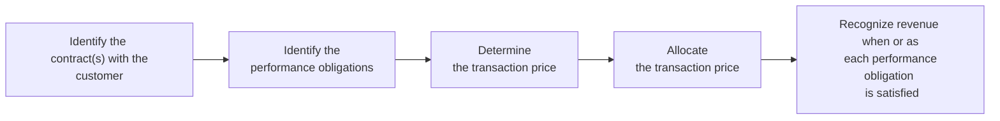

## Overview

Revenue Recognition is, frankly, one of the most critical and sometimes trickiest areas in financial reporting. It sits right at the heart of an entity’s reported performance—after all, revenue is often a primary measure that analysts and investors watch like a hawk. Yet revenue recognition rules can get complicated because businesses can enter into all sorts of wild and wonderful contracts with their customers. Sometimes, there’s just one product delivered at a single point in time. Other times, there are multiple deliverables or uncertain outcomes—like rebates, discounts, or variable consideration that can change the total amount your company is entitled to receive.

Under both IFRS 15 and the converged US GAAP standard ASC 606, revenue is recognized upon the satisfaction of performance obligations. If you’ve spent any time flipping through corporate annual reports or diving into financial footnotes, I suspect you’ve seen references to that “five-step model.” We’ll talk about that in detail, but let me just say: once you understand it (and yes, it might take some time to really let it sink in), everything else about revenue recognition starts to make a lot more sense.

## The Five-Step Model

To get the conversation going, let’s look at the five-step model for revenue recognition as laid out in IFRS 15 and ASC 606. This model ensures that revenue is recognized in a manner that depicts the transfer of promised goods or services to customers in an amount that reflects the consideration to which the entity expects to be entitled.



### 1. Identify the Contract(s)

Why does everything start with the contract? Because we want to ensure we have enforceable rights and obligations—basically, a robust understanding of the arrangement. If there are no enforceable rights (or if it’s a handshake deal without typical commercial terms), you might not have a valid contract for accounting purposes. 

• A contract must have commercial substance  
• Each party’s rights regarding goods or services must be identifiable  
• Payment terms must be identifiable  
• It must be probable that the entity will collect the consideration it’s entitled to

In my own experience, I remember analyzing a small software firm that made a big deal about “contracts” in their financial statements. It turned out these “contracts” were more like pilot agreements with customers who had no real obligation to pay. That created an issue for step one: the firm recognized revenue too early because they treated these pilot programs like binding sales contracts.

### 2. Identify the Performance Obligations

Performance obligations are distinct goods or services (or bundles of goods or services) promised in a contract. You know how you can buy a smartphone, and the price includes both a physical device and some service arrangement for support? That’s a classic scenario with multiple performance obligations.

A distinct good or service must be unique in the sense that it’s either sold separately, or it could be sold separately given the market’s offerings, and it’s not highly interdependent with other deliverables in the contract. If I were talking with a friend about it, I'd say: “Think of it like buying a meal in a restaurant. The appetizer, entrée, and dessert are all separate items from the contract’s perspective if you can buy them separately, but if the price is all combined—for instance, in a tasting menu—maybe they aren’t distinct in that arrangement.”

In a professional setting, we often need to parse out each performance obligation carefully. Otherwise, we might recognize revenue too early for obligations that haven’t really been fulfilled. This is an area where errors can pop up if a company wants to inflate its immediate revenues.

### 3. Determine the Transaction Price

The transaction price is the amount you expect to receive from the customer in exchange for delivering the goods or services. Sounds simple, right? But watch out for the dreaded “variable consideration,” which includes things like rebates, discounts, volume bonuses, or penalty clauses. Those uncertainties mean you have to estimate the total transaction price accurately at contract inception and then revise your estimate if conditions change.

IFRS 15 and ASC 606 require that you determine this transaction price in a way that includes the effect of:  
• Variable consideration  
• Significant financing components (e.g., if payment is deferred beyond normal credit terms)  
• Noncash consideration (e.g., if a customer pays you in shares or in some other noncash medium)  
• Consideration payable to a customer (e.g., if you pay the customer back for something like a marketing arrangement)

Be on guard for companies that might overestimate transaction price early or shift forward additional revenue that depends on the occurrence of future events. If you see disclaimers in the footnotes revealing that a big chunk of the contract price is contingent on performance bonuses or outcome-based measures, it might be time to read deeper.

### 4. Allocate the Transaction Price

That total transaction price is then allocated to the distinct performance obligations in proportion to their stand-alone selling prices. If you’re dealing with a smartphone contract that includes the device and a service plan, guess what? Each one has its own fair value. So you’d allocate, say, 60% of the contract price to the device and 40% to the service plan if that’s how their stand-alone selling prices break out.

Let’s do a super quick numeric example in KaTeX. Suppose:  
(1) Device’s stand-alone selling price: \$600  
(2) Service plan’s stand-alone selling price: \$300  
(3) Total: \$900  
(4) Contract price: \$800  

We need to allocate the \$800 proportionately:


\text{Allocation to device} = \frac{600}{600 + 300} \times 800 = \frac{600}{900} \times 800 = 533.33



\text{Allocation to service} = \frac{300}{900} \times 800 = 266.67


Hence, we recognize revenue for each performance obligation based on these allocated amounts as we satisfy those performance obligations. This is important if the device is handed over at contract inception and the service is provided over time.

### 5. Recognize Revenue When (or As) Each Performance Obligation is Satisfied

Finally, the big reveal: you recognize revenue over time if (a) the customer simultaneously receives and consumes the benefits, (b) the entity’s work creates or enhances an asset the customer controls, or (c) the entity’s performance doesn’t create an asset with an alternative use, and the entity has an enforceable right to payment for work to date. Otherwise, you recognize revenue at a point in time (e.g., when the product is delivered, and control passes to the customer).

A good mental trick: ask if the product or service is basically “taken” by the customer at each stage. If yes, that’s typically an over-time recognition scenario. If not, you wait until a distinct moment in time.

In some building contracts, for instance, you might see partial revenue recognized each month as work is completed, reflecting the continuous transfer of control. But for a big single transaction, like delivering, say, a specialized machine, revenue might only be recognized once the machine is installed, tested, and accepted by the customer.

## Distinguishing Principal vs. Agent

One question that often pops up is “Who’s actually selling the goods or services—are you the principal or an agent?” A principal recognizes revenue at the gross amount paid by the customer and separately shows the cost of sales. By contrast, an agent only recognizes the net fee or commission. This is an area that can get manipulated, because presenting your revenue in a “gross” fashion might make your top line look bigger and more impressive, though your margin might be smaller.

For instance, if you’re hosting an online marketplace, you might merely facilitate transactions between third-party sellers and buyers. In that scenario, typically, you’re an agent, not the principal. Watch out for footnotes describing third-party involvement or a company disclaiming any risk and control over the product prior to transfer to the end user. That’s a big hint they might have to record net revenue.

## Common Pitfalls and Warning Signs

Revenue is notorious for being one of the most manipulated figures in financial reporting. Why? It’s the star of the show and often the easiest measure to influence, especially where estimates or significant judgments are applied.

• Accelerated revenue recognition: A company might record revenue upfront before delivery is complete or before the customer obtains control.  
• Misclassification of principal vs. agent: Reporting gross revenue instead of net, inflating the top line.  
• Fictitious revenue: Obviously the worst scenario—fabricating sales that never happened.  
• Overly optimistic estimates of variable consideration: Overstating the transaction price from performance bonuses, promotional funds, or contingent revenue.

Analysts should do a deep read of the notes to the financial statements. I often head straight for the revenue recognition policy footnote. I’ll check if the company has multiple performance obligations in a single contract. Are there massive returns or warranties? Is a big chunk of the recorded revenue from uncertain, variable portions? All these factors matter.

### Python Snippet for Simple Calculation

Suppose you want to do a quick check on the allocation of transaction price across various obligations. You might do something in Python like this:

```python
performance_obligations = {
    'Hardware': 600,
    'Service': 300,
    'Delivery': 100
}

contract_price = 850

total_selling_price = sum(performance_obligations.values())

allocations = {}
for obligation, price in performance_obligations.items():
    ratio = price / total_selling_price
    allocations[obligation] = ratio * contract_price

print("Allocated amounts:", allocations)
```

In essence, you’re applying the same logic from our earlier example, but in code. This might be helpful in your own modeling if you’re an analyst crunching data or if you just want to check a company’s reported allocations.

## Over Time vs. Point in Time

We touched on this earlier, but it’s worth emphasizing. For revenue recognized over time, the entity measures progress toward complete satisfaction of a performance obligation. This often involves methods like output methods (e.g., units produced, time elapsed) or input methods (e.g., costs incurred as a proportion of total expected costs). Over time recognition is typical for service contracts, construction or engineering projects, and certain software arrangements.

However, if the contract doesn’t meet the criteria for over-time recognition, you must wait until control passes at a single point in time. Usually, that’s when you physically deliver the product, the customer has legal title, and the entity has a right to payment.

## Collectibility Criteria

If there’s doubt about whether you’ll get paid, well, that’s a big red flag. IFRS 15/ASC 606 require that it be probable you’ll collect the amount of consideration. If the specific contract says the customer only needs to pay if they continue to be satisfied, well, that might raise doubts about whether the arrangement is enforceable. 

Also, if a customer’s credit risk is extremely high, you could be stuck with an uncollectible balance that never translates into real revenue. In practice, if collectibility is not probable, you might have to wait to record any revenue until you actually receive the cash or the uncertainty is resolved.

## Variable Consideration

Variable consideration is another fun area (fun, that is, if you like detective work). This includes refunds, price concessions, volume discounts, and performance bonuses. Companies must estimate the amount of variable consideration using either:

• The “Expected Value” method: Weighted average of possible outcomes.  
• The “Most Likely Amount” method: Single most likely outcome of the contract.  

Then you incorporate a constraint, only including the portion of the variable consideration you can confidently conclude won’t get reversed in future periods. If you see a scenario like a big marketing co-op arrangement or complicated performance-based bonus, be sure to see how the company is applying these estimation methods. Are they accounting for them too optimistically?

## Industry Applications and Real-World Scenarios

• Software Industry: Companies that offer software licenses plus support services typically have multiple performance obligations. They might recognize license revenue at the point when they provide access to the software, but support services might be recognized evenly over time.  
• Construction: Many construction and real estate developers apply over-time recognition, using percentage-of-completion. Keep an eye on contract modifications that might affect revenue.  
• E-Commerce & Online Marketplaces: Distinguish if the company is the principal (owns the inventory or has control over setting prices and controlling the goods) or if they’re just an intermediary. The difference drastically changes revenue presentation.  
• Media and Advertising: Often deals with variable consideration (like performance-based metrics: “We’ll pay you \$X per ad impression after 1 million viewers,” etc.).

## Potential Threats and Manipulations

It’s worth repeating: revenue is a prime “target” for manipulations. A few key red flags include:

• Sudden, unexplained changes in recognition policies—especially if they result in earlier recognition of revenue.  
• Inadequate disclosures about performance obligations or the nature of the transaction pricing.  
• Large, one-off arrangements that significantly boost top-line results toward year-end.  
• Rapidly rising accounts receivable well beyond normal credit terms or typical industry norms.  

As we’ll discuss in a broader context in section 2.10 (Classification Shifting and Earnings Management), if an entity has an incentive to meet short-term earnings targets or impress investors, they may push the boundaries on revenue recognition.

## Practical Tips for Analysts

1. Carefully review footnotes: If the footnotes are vague or incomplete regarding revenue recognition policy, that’s your first sign something might be hidden.  
2. Understand industry norms: Each sector has typical practices for timing and measurement of revenue. Deviations can signal legitimate strategic differences—or attempts at manipulation.  
3. Compare statements over time: If you see changes in contract terms, new performance obligations, or dramatic shifts in revenue growth that aren’t explained by an actual surge in demand, do some deeper digging.  
4. Use ratio analysis: Check how changes in revenue line up with changes in accounts receivable, deferred revenue, and other balance sheet items. Sudden mismatches could be a red flag for questionable recognition.  
5. Watch for agent vs. principal: A reclassification from gross to net can cause major shifts in revenue numbers yet have minimal effect on net income.  

## Best Practices When Applying IFRS 15 and ASC 606

• Document performance obligations and how you allocate consideration in each contract.  
• Monitor modifications to existing contracts—these can alter how revenue is recognized mid-stream.  
• Update estimates for variable consideration regularly.  
• Maintain robust internal controls around contract review and authorization.  

On the exam front, you’ll want to be comfortable with how each step in the five-step model might show up in scenario-based questions. You might get a question about a software firm bundling multiple services, or a question about real estate developers. Remember the key principle: revenue is recognized to depict the transfer of promised goods or services in an amount that reflects the consideration expected.

## Cross-References

For deeper insights into how revenue recognition interacts with other financial statement components, you can see:

• 2.2 (Expense Recognition and Capitalization vs. Expensing) to understand the interplay of costs and revenue timing.  
• 2.3 (Nonrecurring Items and Accounting Policy Changes) to see how changes in revenue recognition policies can create nonrecurring shifts in the income statement.  
• 2.10 (Classification Shifting and Earnings Management) for a broader discussion on how some companies might attempt to manipulate their revenue or expense classifications.

## Conclusion

Revenue recognition may look straightforward at first—“Hey, you sell something, you record revenue”—but in reality, it’s often a nuanced process with a lot of judgment calls. Knowing the five-step model is one thing, but applying it properly with an eye on variable consideration, principal vs. agent status, and timing can quickly get complicated.

If you’re studying for the CFA exam or working in financial statement analysis, I’d say this: pay close attention to the details in footnotes, think carefully about whether revenue truly matches the economic substance of transactions, and always, always watch for areas where management might push the envelope.

Because, well, let’s be honest: revenue is often the largest and most visible number in the income statement. Where there’s big visibility, there’s big temptation to get creative. Being able to spot potential “creativity” can make you a formidable analyst—and the type of professional who can truly add value by seeing beyond the headlines.

## References & Further Reading

• IFRS 15, “Revenue from Contracts with Customers”: https://www.ifrs.org/issued-standards/list-of-standards/ifrs-15-revenue-from-contracts-with-customers/  
• FASB ASC 606, “Revenue from Contracts with Customers”: https://fasb.org  
• CFA Institute Investment Series: “International Financial Statement Analysis” by Thomas R. Robinson et al.  
• “Financial Shenanigans” by Howard Schilit – great resource for spotting misreporting.  

## Test Your Knowledge: Principles of Revenue Recognition Quiz



### Under IFRS 15 and ASC 606, which of the following represents the final step in the five-step revenue recognition model?

- [ ] Determine the transaction price.  
- [ ] Allocate the transaction price to performance obligations.  
- [x] Recognize revenue when (or as) the performance obligations are satisfied.  
- [ ] Identify the contract with the customer.

> **Explanation:** The final step (step 5) is to recognize revenue when or as performance obligations are satisfied, which is after identifying the contract, identifying performance obligations, determining the transaction price, and allocating it.

### Which of the following is most likely an example of variable consideration under the new revenue recognition standards?

- [ ] Fixed price for a single hardware unit.  
- [x] A performance bonus contingent upon achieving certain sales milestones.  
- [ ] A standard subscription with monthly billing set at a fixed rate.  
- [ ] A one-time initial setup fee with no adjustments.

> **Explanation:** Variable consideration includes aspects like bonuses, rebates, or refunds. These amounts can fluctuate based on future outcomes or performance metrics.

### When an entity is acting as an agent rather than a principal in a transaction:

- [x] It should present revenue at the net amount (commission or fee received).  
- [ ] It should present revenue at the gross amount of the sale.  
- [ ] It can choose whether to record revenue at net or gross.  
- [ ] It is not allowed to recognize any revenue.

> **Explanation:** Agents only report the net fee or commission, as they do not control the goods or services before transferring them to customers.

### Under the five-step model, allocating the transaction price involves:

- [ ] Identifying whether significant financing components exist.  
- [ ] Recognizing revenue as each performance obligation is satisfied.  
- [x] Splitting the total consideration among performance obligations based on stand-alone selling prices.  
- [ ] Combining all performance obligations into a single revenue line.

> **Explanation:** Once you determine the transaction price, you allocate it to each distinct performance obligation based on their relative stand-alone selling prices.

### Which factor is most indicative of revenue recognition over time?

- [x] The customer simultaneously receives and consumes the benefits as the entity performs.  
- [ ] Control of the asset passes at a single point in time.  
- [ ] The entity can redirect the asset to another customer at any point.  
- [ ] The transfer of control is not enforceable by the contract.

> **Explanation:** Over-time recognition is appropriate if the performance creates or enhances an asset the customer controls, or the customer simultaneously receives benefits of the service.

### In applying IFRS 15/ASC 606, if collectibility is not probable:

- [x] Revenue cannot be recognized until the uncertainty is resolved or payment is received.  
- [ ] Revenue should still be recognized once the contract is signed.  
- [ ] Revenue is recognized immediately but restricted in the balance sheet.  
- [ ] The entity records the revenue at a discount rate.

> **Explanation:** The standards require that collectibility be probable for a contract to be valid under IFRS 15/ASC 606. If not, revenue recognition is typically delayed.

### A contract includes multiple performance obligations. The best way to allocate the transaction price to these obligations is to:

- [ ] Use the cost-to-cost method.  
- [ ] Recall that each performance obligation always gets the same proportion.  
- [ ] Estimate the transaction price based on management’s preference.  
- [x] Use the relative stand-alone selling prices of each performance obligation.

> **Explanation:** The transaction price must be allocated to each performance obligation proportionally based on stand-alone selling prices to ensure faithful representation of the economics.

### Which of the following red flags might signal potential revenue manipulation?

- [ ] A stable distribution of revenue across all periods in line with industry norms.  
- [x] Sudden changes in revenue recognition policies that lead to earlier recognition of sales.  
- [ ] A balanced approach to disclosing variable consideration.  
- [ ] Lower-than-average accounts receivable growth compared to revenue.

> **Explanation:** A sudden change in policy that boosts immediate revenue without transparent explanations may indicate aggressive revenue recognition or manipulation.

### Principal vs. agent classification primarily affects:

- [ ] The recognition timing of revenue.  
- [x] The presentation of revenue (gross vs. net amounts).  
- [ ] Whether collectibility is probable.  
- [ ] The enforceable rights and obligations in a contract.

> **Explanation:** Principal vs. agent considerations affect how the revenue is presented on the income statement—gross for principal and net for agent.

### The "most likely amount" method for estimating variable consideration:

- [x] Uses a single most probable outcome based on the contract.  
- [ ] Splits all possible outcomes into a weighted average.  
- [ ] Is not allowed under IFRS 15/ASC 606.  
- [ ] Always leads to the highest revenue figure.

> **Explanation:** When variable consideration is estimated, an entity can choose either the expected value approach (weighted average) or the most likely amount method, picking whichever best predicts the amount of consideration to be received.


