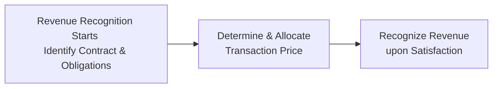

Let’s take a closer look at some of the most common differences that linger between IFRS and US GAAP, even after the major revenue recognition convergence projects. We’ll talk a bit about revenue recognition, expense recognition (including intangible development costs and R&D), LIFO vs. other inventory costing methods, and a few other fun items like stock-based compensation. Believe me, I’ve seen a few interesting footnotes in my day—some that nearly made me do a double-take.

## Broad Overview of Convergence

When the IASB (International Accounting Standards Board) teamed up with the FASB (Financial Accounting Standards Board), they aimed to cut down on major differences. IFRS 15 and ASC 606 aligned the core five-step revenue recognition model, which we explore throughout Chapter 2 in more detail. But you know how these things go: even close siblings can have minor differences in their habits.

### Minor Gaps that Remain

• Licensing revenue timing: IFRS 15 and ASC 606 differ slightly on whether certain licenses are recognized at a point in time or over time—particularly for intellectual property arrangements (e.g., software licenses).  
• Collectibility threshold: IFRS focuses on whether it’s probable an entity will collect consideration for goods or services. US GAAP demands a higher level of assurance, requiring a significant probability that the entity will collect.  
• Contract modifications and variable consideration: The overall concepts are aligned, but certain detail-level guidance (especially for contract modifications) can diverge.  
• Presentation nuances: IFRS and US GAAP may require slightly different disclosures even if the recognition outcome is similar.

Sometimes, it feels a bit like reading two editions of the same novel—both stories match up for the most part, but certain paragraphs are rearranged or use different phrasing. Anyway, let’s dive deeper.

## Key Differences in Revenue Recognition

### The Five-Step Model in IFRS 15 vs. ASC 606

Both IFRS 15 and ASC 606 follow the same five-step approach:

1. Identify the contract(s) with a customer.  
2. Identify the performance obligations in the contract.  
3. Determine the transaction price.  
4. Allocate the transaction price to each performance obligation.  
5. Recognize revenue when (or as) entity satisfies a performance obligation.

However, the details can cause a bit of confusion. Let’s illustrate a high-level overview in a simple flowchart:

Even though IFRS 15 and ASC 606 basically share this same structure, real-world application differences pop up in areas such as:

• Collectibility Assessment:  
  – IFRS 15: “Probable” means more likely than not (typically >50% chance).  
  – ASC 606: “Probable” is significant and often interpreted as higher than 75% or so, depending on practice guidance and precedent.

• Extended Payment Terms:  
  – Under IFRS, an extended payment arrangement may adjust the transaction price to reflect the time value of money if it’s significant.  
  – Under US GAAP, a similar approach applies; however, the interpretation of when financing components become “significant” could differ slightly in practice.

### Implementation Guidance: Licensing Revenue

The tricky part is licensing intellectual property—like software, branded media, or music. IFRS 15 and ASC 606 classify licenses as either “right to use” (point-in-time recognition) or “right to access” (over-time recognition). The subtlety is how each standard sets out to evaluate if a contract provides ongoing or static IP rights. In typical practice, the results converge, yet you might see slight differences when revenue is recognized, especially if the contract wording leaves room for interpretation.

## Key Differences in Expense Recognition

Expense recognition has always been a bit more varied between IFRS and US GAAP. Let’s highlight a few big-ticket items.

### R&D Costs

Here’s the big confession: whenever I see a footnote about R&D under IFRS, I perk up. IFRS (IAS 38) allows development costs to be capitalized if they meet certain criteria: technical feasibility, intention to complete, probable future economic benefits, ability to measure costs reliably, etc. By contrast, US GAAP (ASC 730) typically expenses all R&D when incurred, with narrow exceptions (like software development after technological feasibility is established).

This difference can create noticeable variance in two companies’ income statements—particularly if you’re analyzing a tech or pharma company. One might capitalize a portion of its development costs, thereby increasing net income, while the other, following US GAAP, might expense the whole lot, depressing net income (but potentially leading to lower future amortization charges).

### Intangible Development Costs

Under IFRS, intangible development costs can remain on the books as assets if certain “technical and commercial feasibility” conditions are met. US GAAP remains more conservative; generally, intangible asset expenditures are expensed right away, unless specifically addressed by other standards (e.g., software for sale or internal use).

So, as an analyst, do watch for footnotes disclosing intangible assets recognized under IFRS. Ask yourself if the same assets would exist under US GAAP—or if they would show up in R&D expense.

### LIFO vs. Other Inventory Costing Methods

Sometimes my friends ask me, “Wait, IFRS and LIFO—don’t they go together?” Actually, IFRS (IAS 2) does not permit LIFO (Last In, First Out). US GAAP still does. Historically, many US companies used LIFO primarily for tax benefits, but they’re less common nowadays because LIFO can complicate financial statement comparisons if your global peers are exclusively using FIFO or Weighted Average.

If you see LIFO in a US financial statement, remember to look at how that impacts reported cost of goods sold (COGS). During an inflationary period, LIFO leads to higher COGS and lowers net income. Under IFRS, that’s not an option, so cross-company comparisons may be trickier. This is a big flag on the radar for folks who do ratio analysis or cross-border valuations.

### Component Depreciation

IFRS requires component depreciation. That means if you have a big machine with major parts that wear out at different rates, you’re expected to depreciate each component separately. US GAAP allows but does not require this approach. In practice, many US companies still do it all in one chunk. The difference can affect how quickly depreciation is recognized for more short-lived parts.

For instance, if a US-based manufacturer lumps everything together, total depreciation expense might be smoothed over time. An IFRS-based competitor might accelerate depreciation for certain specialized components. That’s subtle, but in expansions or capital-intensive businesses, these differences cause shifts in profitability metrics.

## Stock-Based Compensation Differences

Ah, stock-based compensation—where finance, HR, and accounting cross paths in a swirl of vesting schedules and fairness opinions. IFRS (IFRS 2 Share-Based Payment) and US GAAP (ASC 718) have largely aligned fundamental concepts: measure the fair value of the awards, recognize expense over the vesting period, classify them as equity or liability depending on settlement features.

But the details matter. Some IFRS vs. US GAAP differences might show up in:

• Measurement dates for modifications and cancellations.  
• Classification as equity vs. liability if certain conditions can lead to cash settlement.  
• Treatment of performance vs. market conditions.  

Chances are you’re not going to see jaw-dropping divergences in the recognized amounts, but if you’re analyzing a start-up with lots of stock options, these small differences can accumulate.

## Practical Tips for Analysts

1) Read the Footnotes: Always check if the company is providing a reconciliation between IFRS and US GAAP. Foreign private issuers in the US often have to present or at least discuss significant GAAP differences.  
2) Consider Industry Norms: Tech vs. manufacturing vs. services might emphasize different areas—R&D, intangible assets, or the presence of LIFO inventory.  
3) Cross-Refer to Segment Reporting: If they do “segment reporting” (Chapter 1.8), see whether different segments might have unique recognition policies.  
4) Watch Out for Revised Standards: The IFRS and FASB folks are known to refine these standards from time to time. Keep an eye out in the annual reports for a “Recently Issued Accounting Standards” section.  

## Case Study Example

Picture a mid-sized biotech firm, ExploraPharm Inc., that’s IFRS-compliant. They have a new wonder drug in development, and they capitalize a portion of their development costs once they pass the technical feasibility threshold. Meanwhile, their US GAAP-compliant rival, PillQuest, expenses all R&D up front. In terms of net income, ExploraPharm might show higher net income in earlier years by deferring some costs as intangible assets. But guess what? They’ll have higher amortization expense in later years once the drug is commercialized. PillQuest might display more volatile early-year earnings, but later, it won’t have that amortization “headwind.”  

Is one approach more “accurate”? Hard to say. But as an analyst, you want to know these differences so you can compare apples to apples when evaluating companies side by side.

## Simple Formula Illustrations

We often model the effect of capitalizing vs. expensing development costs:

Let:

• D = Total Development Costs  
• CapPortion = Portion of D capitalized under IFRS  
• ExpensedIFRS = D – CapPortion  
• ExpensedGAAP = D (since typically no capitalization under US GAAP)

So under IFRS, short-term reported expense might be ExpensedIFRS, and in future years, additional amortization arises from CapPortion. Under US GAAP, short-term expense is simply D, with no future amortization (apart from software or other rare exceptions).

## Potential Pitfalls and Challenges

• Over-Reliance on IFRS/GAAP Convergence: Don’t assume that all differences are gone after IFRS 15/ASC 606. Always verify licensing and other subtle areas.  
• R&D Capitalization: IFRS requires you to exercise judgment on intangible projects’ feasibility. Management might be too optimistic, leading to aggressive capitalization.  
• LIFO vs. FIFO Comparisons: If a US firm still uses LIFO, be sure to evaluate how that influences gross margins especially in inflationary cycles.

## Encouragement for Further Exploration

If you’re curious and want to expand beyond this chapter, jump to Chapter 2.12 (IFRS 15 vs. ASC 606 Comparative Overview), where we do a deeper dive into how revenue gets recognized under these two standards. For intangible asset details, see Chapter 6.4. Keep an eye out for cross-references to pension expense differences under IFRS vs. US GAAP in Chapter 7.9 too, because these frameworks can overlap in surprising ways.

Anyway, this is good stuff. It can be a lot to digest at first, but I promise it’s worth the journey—especially when you realize how these tiny differences can affect valuations and buy/sell decisions for your client portfolios.

## References

• Joint IFRS-FASB Convergence Projects:  
  – https://www.ifrs.org/projects/  
  – https://www.fasb.org/projects  
• IAS 38 on Intangible Assets and IFRS 2 on Share-Based Payment.  
• “Wiley IFRS 2023” by PKF International.  
• “GAAP Guide” by CCH Wolters Kluwer.  
• Chapter 1.4 in this Volume for a broader background on IFRS vs. US GAAP.  

## Test Your Knowledge: IFRS vs. US GAAP Revenue and Expense Recognition



### Which of the following best describes the primary difference in assessing collectibility under IFRS 15 vs. ASC 606?

- [ ] IFRS uses a higher threshold of certainty than US GAAP.  
- [x] US GAAP typically requires a higher level of assurance for collectibility to be deemed probable.  
- [ ] Neither framework addresses collectibility.  
- [ ] Both frameworks require a near-certain level of collectibility.  

> **Explanation:** IFRS 15 uses a “probable” threshold (generally >50% likelihood), while US GAAP under ASC 606 typically leans on a more stringent threshold for collecting consideration.

### In which scenario might a company recognize higher short-term income under IFRS compared to US GAAP?

- [ ] When the company expenses all development costs immediately for new product lines.  
- [ ] When using LIFO cost flow assumptions for inventory valuation.  
- [x] When capitalizing development costs for intangible assets that meet feasibility criteria.  
- [ ] When accounting for cash flow hedges.  

> **Explanation:** IFRS allows capitalization of development costs once certain criteria are met, which can reduce expenses in the current period and increase reported income.

### Why might an IFRS reporter have more refined depreciation charges for property, plant, and equipment compared to a US GAAP reporter?

- [x] IFRS requires component depreciation for significant parts of an asset separately.  
- [ ] IFRS uses a single, uniform depreciation method across all assets.  
- [ ] US GAAP forbids any form of component depreciation.  
- [ ] Under IFRS, depreciation is not required.  

> **Explanation:** IFRS mandates component depreciation, ensuring that each significant component is depreciated over its own useful life. US GAAP permits it but doesn’t require it.

### Which of the following inventory costing methods is not permitted under IFRS?

- [ ] FIFO (First In, First Out)  
- [ ] Weighted Average Cost  
- [x] LIFO (Last In, First Out)  
- [ ] Specific Identification  

> **Explanation:** IFRS does not allow LIFO, while US GAAP permits it (despite its declining popularity).

### A biotech company reports under IFRS and capitalizes certain development costs. Its US GAAP competitor likely:

- [x] Expenses those same development costs under normal R&D rules.  
- [ ] Capitalizes all R&D as intangible assets.  
- [x] Reports higher R&D expense earlier due to US GAAP requirements.  
- [ ] Has no R&D expenses at all.  

> **Explanation:** Under US GAAP, R&D costs are generally expensed as incurred. IFRS allows capitalization of development costs once specified feasibility criteria are met, creating differences in timing and magnitude of expenses.

### After implementing ASC 606, a US company must ensure which of the following to recognize revenue?

- [x] That collectibility of consideration is probable.  
- [ ] That the performance obligation is not distinct.  
- [ ] That there is no variable consideration.  
- [ ] That it uses the completed-contract method only.  

> **Explanation:** ASC 606 explicitly requires that collectibility of consideration is probable before revenue can be recognized.

### Under IFRS, a software license is considered a “right to access” if:

- [x] The licensee is granted ongoing updates or improvements to the IP throughout the license period.  
- [ ] The customer has a one-time right to use the software in perpetuity.  
- [x] The licensor performs routine, substantive activities that significantly affect the IP’s utility over time.  
- [ ] The license is only for offline usage.  

> **Explanation:** IFRS 15 (similar to ASC 606) determines an over-time recognition if the license provides continuous access and updates. A “right to use” is recognized at a point in time.

### What is the main motivation behind IFRS requiring the disclosure of significant judgments in revenue recognition?

- [x] To provide transparency about management’s estimates and assumptions.  
- [ ] To relieve auditors of their professional skepticism requirements.  
- [ ] To allow managers to keep certain information confidential.  
- [ ] To make financial statements shorter.  

> **Explanation:** IFRS tries to enhance transparency by requiring disclosures around critical judgments, giving stakeholders better insight into management’s decision-making process.

### One difference that persists regarding licensing revenues is:

- [x] The timing of recognizing revenue for “right to use” vs. “right to access” licenses sometimes varies in application.  
- [ ] IFRS does not allow licensing revenues to be recognized at all.  
- [ ] US GAAP requires all licensing revenues to be recognized only at contract inception.  
- [ ] Both IFRS and US GAAP forbid variable consideration in licensing contracts.  

> **Explanation:** While both IFRS 15 and ASC 606 have broadly similar guidelines, subtle distinctions can persist in how certain licenses are classified and the timing of revenue recognition.

### True or False: Under US GAAP, stock-based compensation must always be classified as an equity instrument.

- [x] True  
- [ ] False  

> **Explanation:** US GAAP generally records employee stock-based compensation as equity, though certain modifications or settlement features can create liability classification. IFRS has largely converged here but can diverge in details for certain schemes.


