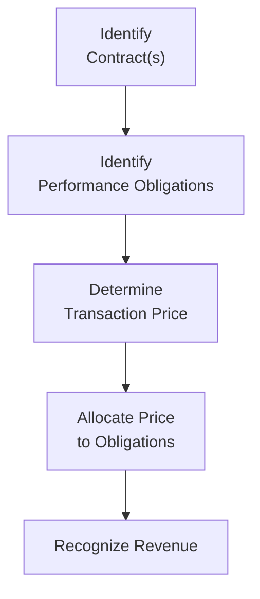

## Overview of the Framework

Revenue recognition is—for many folks—one of the most visible and sometimes tricky parts of financial reporting. Back in the day, we had quite a few scattered rules that differed significantly across industries and geographies. Then IFRS 15 (International Financial Reporting Standard) and ASC 606 (the corresponding US GAAP standard) entered the scene, with a goal basically to unify how companies determine the amount and timing of revenue recognized. You might see references to the “five-step model,” and that’s not just a catchy name: it’s a foundational approach shared by both standards.

They do share a similar spirit, but IFRS 15 and ASC 606 do exhibit subtle variances. We’ll explore the core principles of these frameworks, highlight their similarities, and point to the occasional differences you want to watch out for as you analyze financial statements. And, by the way, please note that references to these standards abound, so if you see them being cited in footnotes or accounting policy notes, it’s a good sign that the company is paying attention to these guidelines.

## Core Principles and the Five-Step Model

To set the stage, both IFRS 15 and ASC 606 revolve around a principles-based methodology (rather than rigid rule-based prescriptions). They converge on five fundamental steps:

1. Identify the contract(s) with the customer.  
2. Identify the performance obligations in the contract.  
3. Determine the transaction price.  
4. Allocate the transaction price to the performance obligations.  
5. Recognize revenue when (or as) a performance obligation is satisfied.

In practical terms, we’re basically asking: Who is our customer? What exactly are we promising to deliver? How much are we charging in total? How do we split that total among the goods or services we’re promising? And then, finally, when do we say we’ve done enough to claim the right to that revenue?

It might help to think of a simple example: imagine a software company selling an annual license that includes technical support services for one year. IFRS 15 and ASC 606 direct the company to figure out the separate components (license and support) as separate performance obligations if certain distinctiveness criteria are met, figure out the total price, allocate that price, and then recognize revenue as each obligation is satisfied over time. That might sound straightforward, but let me tell you, the details can get complicated—especially for multi-deliverable arrangements or subscription-based services that renew automatically.

## Subtle Differences in Collectibility

One area where you might see a difference is in how each framework deals with collectibility. Both IFRS 15 and ASC 606 use the concept of whether it is “probable” that the entity will collect the consideration from the customer. However, the notion of “probable” can be interpreted a bit differently in IFRS and US GAAP circles.

• Under IFRS 15, “probable” typically aligns with the idea of “more likely than not,” which can be interpreted as having a probability threshold of just over 50%.  
• Under ASC 606, “probable” aligns with a higher threshold that is often associated with a likelihood of 75% or 80%, depending on prior judicial interpretations and established precedents in US GAAP.

That said, for practical purposes, the difference might not be that large in day-to-day accounting, but it can come into play in borderline cases or in industries and regions where collectibility is dicey.

## Presentations of Contract Assets and Liabilities

Contract assets and contract liabilities—now that’s a topic that sometimes makes the best accountants slip up if they’re rushing. A contract asset represents the entity’s right to consideration in exchange for goods or services that have been delivered but not yet billed (or not yet unconditional). A contract liability is the flip side: payment has been made, or is due from the customer, but the goods or services haven’t yet been delivered.

Even though the concepts are the same, IFRS 15 might use slightly different terminology or grouping in disclosures compared to ASC 606. But ultimately, both ask for classification along the lines of:

• Contract assets (sometimes net of impairment)  
• Contract liabilities (often referred to as “deferred revenue” in older parlance)  

If you peek at a company’s balance sheet footnotes, you might see these line items, and it’s important to check that the narrative behind them is consistent: Did the company actually deliver? Was the performance obligation met? Or are we waiting for a future date?

## Industry-Specific Guidance

While IFRS 15 and ASC 606 share an overarching structure, each standard offers additional commentary—or, in the case of US GAAP, specific subtopics—for industries like software, real estate, and entertainment. That’s usually the place where you see some divergences. For example, certain licensing arrangements or real estate sales might be recognized a bit differently. A classic scenario is software licensing, where IFRS 15 might not offer quite as many sub-rules as ASC 606 historically did when it comes to multiple-element arrangements or software upgrades.

The best advice is to look carefully at each major industry’s specific guidance and see how the “performance obligation” concept applies. If you’re analyzing a real estate development company, for instance, you want to check how they define “continuous transfer of control” to the customer (since that affects whether revenue is recognized over time or at a point in time). If they’re using IFRS 15 vs. ASC 606, the general approach is the same, but the little footnotes or interpretational notes might matter.

## Practical Expedients and Transitional Relief

There are a few places where IFRS 15 and ASC 606 let companies use practical expedients to simplify implementation. For instance, they can choose certain short-cut methods for small contracts or for the timing of commission expense recognition. Similarly, the transition from older standards (IAS 18 or the pre-ASC 606 guidance) to the new ones included a few optional ways to adopt, like full retrospective vs. modified retrospective approaches.

If you see references to a “modified retrospective approach,” it typically means the company only adjusted the opening retained earnings for the earliest period presented, rather than restating all prior years. That can create a little noise in the financial statements. As an analyst, it’s worth reading the footnotes to see how they handled the transition, because it might cause comparability hiccups in year-over-year figures.

## Judgments and Estimates

One hallmark of these standards is that they require managers to exercise judgment in areas such as:

• Identifying performance obligations that are distinct (and not just part of a “bundle”).  
• Estimating variable consideration (like refunds, rebates, or performance bonuses).  
• Determining stand-alone selling prices for allocating transaction price.  

Both IFRS 15 and ASC 606 want robust disclosures about these judgments. If you’re an analyst, you should check those disclosures to see how the company arrived at its revenue numbers. Time spent analyzing management’s assumptions often pays off, especially in complex arrangements. Spotting unusual changes in estimates or performance obligations from one period to another can reveal potential revenue management or “stuffing the channel” tactics.

## Simple Revenue Recognition Example

Let’s illustrate with a scenario that I once saw at a small software startup:

The startup sells a one-year subscription service for $1,200 ($100 per month). It also bundles a one-time setup or onboarding service that retails for $300 if purchased separately. The subscription alone, if purchased stand-alone, usually goes for $1,000 per year. Here’s the typical approach under IFRS 15 or ASC 606:

1. Identify the contract: The contract is the subscription agreement plus the onboarding.  
2. Identify performance obligations: (1) The subscription service, and (2) The onboarding service, since each is delivered separately and is distinct.  
3. Determine the transaction price: $1,200 total.  
4. Allocate the transaction price:  
   - Stand-alone prices: Subscription = $1,000, Onboarding = $300, total is $1,300 if purchased separately.  
   - Allocation ratio: Subscription gets 1,000/1,300 of the $1,200 = about $923.08, Onboarding gets 300/1,300 of the $1,200 = about $276.92.  
5. Recognize revenue:  
   - The $276.92 is recognized when the onboarding service is complete (likely at a point in time).  
   - The $923.08 is recognized ratably over the 12-month subscription period.  

Notice how both IFRS 15 and ASC 606 would handle it practically the same way. No huge difference, but that’s the typical scenario. Analysts should verify that the timing of revenue recognition is consistent with the entity’s obligations and that the allocation is done fairly.

## Diagram: The Five-Step Model

Below is a simple Mermaid diagram illustrating the logical flow for revenue recognition under IFRS 15 and ASC 606:

The shape seems straightforward, but each node can contain nuances that shape how revenue hits the income statement.

## Potential Pitfalls and Red Flags

• Over-Aggressive Allocation: If you see a firm pushing too much of the transaction price into items that are recognized earlier, watch for possible earnings management.  
• Large Contract Asset Balances: Could mean the firm is booking revenue quickly without having unconditional billing rights. Why? Are they sure they’ll collect?  
• Capitalizing Costs vs. Expensing Them: Many companies can capitalize certain contract acquisition costs (e.g., sales commissions) and amortize them over the contract period. If you see big swings in these capitalized amounts, you might suspect changes in policy or more liberal judgments.  
• Industry-Specific Shenanigans: For example, real estate companies that record revenue under “percentage of completion” methods might differ in how they interpret “continuous transfer.” Validate those assumptions.  

## Common Disclosures to Focus Upon

• The share of revenue recognized at a point in time vs. over time.  
• Methods used to measure progress for performance obligations satisfied over time (e.g., input vs. output methods).  
• The nature and amount of variable consideration, if any (like refunds or rebates).  
• Significant judgments in determining the timing of satisfaction and the transaction price.  
• The composition of contract balances (assets vs. liabilities).

## Exam Tips and Best Practices

From a CFA exam standpoint (and, of course, real-life investing decisions), it’s always good to:

• Compare year-over-year changes in contract balances and see if they align with top-line trends.  
• Understand the main performance obligations in a company’s business model. If they drastically changed how they define these obligations, it might signal a change in how they time revenue or manage earnings.  
• Keep an eye out for differences in IFRS vs. US GAAP reports. In many cross-listed companies, their 20-F filing (if they’re also listed in the US) might highlight reconciling items.  

Ultimately, IFRS 15 and ASC 606 have merged global revenue recognition in a big way. The subtle differences won’t necessarily rock the boat, but it’s wise to be aware of them so you can catch the finer points of a company’s reported revenue streams.

## Further Resources

• Official IFRS 15 Standard:  
  https://www.ifrs.org/issued-standards/list-of-standards/ifrs-15-revenue-from-contracts-with-customers/  

• FASB ASC 606 Compilation:  
  https://www.fasb.org  

• KPMG “Revenue Issues In-Depth” and PwC “Revenue from Contracts with Customers” for more examples and industry applications.  

• Chapter 1, Section 1.5 (Sources of Information for Analysis) for tips on reading and interpreting financial disclosures.  

• Chapter 2, Section 2.1 (Principles of Revenue Recognition) for the fundamentals of the revenue recognition framework.  

• For specialized considerations, see Chapter 12 (Financial Reporting Quality) on how revenue recognition policies can be manipulated or misused.

## Final Exam Strategies

• Always consider the big picture: Are the recognized revenues aligning with the company’s actual sales or deliveries?  
• Look closely at disclosures around contract additions, modifications, and any large lumps in revenue recognized at once.  
• Pay attention to the breakouts of contract liabilities vs. contract assets. Are they ballooning? Are they unusual?  
• Use your knowledge of the five-step model to work systematically through any item set or constructed-response question that addresses revenue. They might ask you to identify which step is in question or how to allocate a transaction price.  

Remember, at the heart of IFRS 15 and ASC 606 is that rhetorical question: “When and how much revenue can the company rightfully recognize for the good or service provided?” Master that, and you’re set.

--------------------------------------------------------------------------------

## Sample Exam Questions on IFRS 15 vs. ASC 606



### Determining When to Recognize Revenue
- [ ] Revenue is always recognized upon signing the contract.
- [ ] Revenue must be recognized at inception for the full contract price.
- [x] Revenue is recognized when or as performance obligations are satisfied.
- [ ] Revenue is recognized only when cash is collected.

> **Explanation:** Both IFRS 15 and ASC 606 specify the five-step model, culminating in recognizing revenue when an entity satisfies a performance obligation. Signing a contract alone isn’t enough; the firm must deliver goods or services.

### Collectibility and Revenue Recognition
- [ ] IFRS 15 has no collectibility threshold, while ASC 606 sets a 100% certainty threshold.
- [x] Both IFRS 15 and ASC 606 use a “probable” threshold but may interpret it differently.
- [ ] Only IFRS 15 includes a collectibility criterion for revenue recognition.
- [ ] In IFRS 15, collectibility is irrelevant to revenue recognition.

> **Explanation:** Both standards use “probable” to determine collectibility, but in practice, IFRS and US GAAP may use slightly different probability thresholds (IFRS commonly views “probable” as >50%, whereas US GAAP might imply a higher threshold).

### Identifying Distinct Performance Obligations
- [ ] Both IFRS 15 and ASC 606 ignore bundled arrangements.
- [x] Both IFRS 15 and ASC 606 require companies to identify each distinct good or service.
- [ ] Performance obligations are optional under ASC 606.
- [ ] IFRS 15 never separates performance obligations in a bundled contract.

> **Explanation:** Both standards require identifying the distinct performance obligations to ensure proper revenue allocation and recognition when those obligations are satisfied.

### Allocation of the Transaction Price
- [ ] Under ASC 606, all revenue is allocated equally among performance obligations.
- [ ] Under IFRS 15, allocation is based on a random assignment.
- [x] Under both IFRS 15 and ASC 606, allocation is based on stand-alone selling prices.
- [ ] Under IFRS 15 and ASC 606, no allocation is needed if multiple goods/services are bundled.

> **Explanation:** Both standards require allocating the total transaction price to each performance obligation based on relative stand-alone selling prices when the obligations are deemed distinct.

### Contract Assets and Liabilities
- [x] Represent timing differences in billing vs. satisfying performance obligations.
- [ ] Are only recognized under IFRS 15.
- [x] Typically disclosed separately for clarity.
- [ ] Have no implications for analyzing working capital.

> **Explanation:** Contract assets arise when an entity has performed but not yet has an unconditional right to consideration, and contract liabilities reflect advanced billings or collections. They are important in working-capital analysis and are disclosed in both IFRS 15 and ASC 606.

### Industry-Specific Guidance
- [x] May create slight differences in application under IFRS 15 vs. ASC 606.
- [ ] Is the same across all industries for both IFRS and US GAAP.
- [ ] Applies only to software and technology sectors.
- [ ] Always overrides the five-step model if there’s a conflict.

> **Explanation:** Both standards include industry-specific discussions (especially in the US GAAP codification). Such guidance can lead to variations in how the five-step model is interpreted for certain industries.

### Practical Expedients
- [x] Are allowed by both IFRS 15 and ASC 606 to ease implementation.
- [ ] Are only offered under ASC 606.
- [x] Include simplifications for short-term contracts or incremental costs of obtaining contracts.
- [ ] Do not affect comparability of financial statements.

> **Explanation:** Practical expedients (e.g., expense certain contract costs immediately if the amortization period is one year or less) exist under both standards. They do help with implementation but can slightly affect cross-company comparability if they choose different expedients.

### Transition Methods
- [x] Include both full retrospective and modified retrospective approaches.
- [ ] Are mandated to be full retrospective for ASC 606 only.
- [ ] Are optional for IFRS 15, but mandatory for ASC 606.
- [ ] Do not require any disclosures about prior-year adjustments.

> **Explanation:** Both standards allow similar transition approaches, often called full retrospective and modified retrospective. Companies must disclose the chosen approach and its effects on prior periods.

### Disclosure Requirements
- [x] Emphasize judgments and estimates in applying the five-step model.
- [ ] Have been removed in the latest amendments.
- [ ] Are only required under IFRS 15, not ASC 606.
- [ ] Are non-essential, purely optional notes.

> **Explanation:** Both standards require extensive disclosures, particularly around the judgments made in identifying performance obligations, allocating prices, and determining whether revenue is recognized at a point in time or over time.

### True or False: IFRS 15 and ASC 606 Have Fully Eliminated All Revenue Recognition Differences
- [x] True
- [ ] False

> **Explanation:** While IFRS 15 and ASC 606 reduced disparities tremendously, there remain slight differences in interpretations, probability thresholds, and industry-specific guidance. Many consider them to be “substantially converged,” but not perfectly identical.


