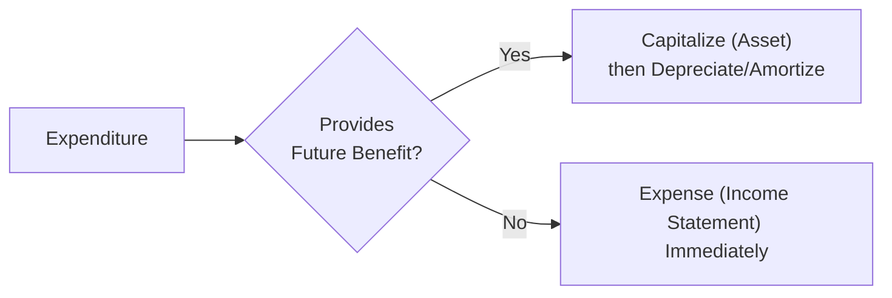

## Background and Context

We’ve all had those moments, right? You see a company’s financial statements, and you wonder if they’re being totally honest about their expenses. I remember once working with a small tech startup where the co-founder kept telling me to “just record that cost as an asset.” That’s when I paused and thought, “Uh, maybe we should check the rules.” You see, deciding when to expense a cost right away or to record it on the balance sheet (capitalizing it) can dramatically impact reported profits and the overall financial picture. Let’s explore how this works in practice and how these decisions shape the income statement.

## Expense Recognition and the Matching Principle

Perhaps you’ve heard of the “matching principle”? In financial reporting, it’s really a big deal. The matching principle is about pairing expenses with the revenues they help generate. Under accrual accounting, companies seek to record expenses in the same period as the income that those expenses support. This approach ensures that financial statements show a more accurate depiction of profitability.

• If a cost clearly benefits multiple future periods, it’s capitalized (subject to specific criteria).  
• If it only benefits the current period, companies typically expense it in full right away.

So, for instance, if you buy office supplies that are used up quickly, well, that’s straightforward: expense those right now. But if you buy a building or develop a new technology that will (hopefully) produce income for years, you’re dealing with an asset. That’s the essence behind capitalization vs. expensing.

## Capitalization vs. Expensing At a Glance

In simple terms, “capitalizing” an expenditure means recording it as an asset on the balance sheet—like a new building or intangible technology that’s expected to provide future economic benefits. “Expensing” is recording it straight on the income statement as a cost. The decision can dramatically affect reported net income, return on assets, and numerous other key financial metrics.

Below is a high-level flowchart illustrating the typical choice process:



### Future Economic Benefit

Per IFRS and US GAAP, an expenditure that meets the definition of an asset (i.e., something that will generate future economic benefits) should generally be capitalized. For instance, purchasing a piece of machinery that will produce goods for the next decade is a good candidate for capitalization. After capitalization, the cost will be depreciated (or amortized, if intangible) over its useful life.  

But what if you’ve got a routine maintenance cost—like an oil change for a delivery truck? That helps maintain the current usefulness of the asset but doesn’t extend its life significantly. Hence, it’s usually expensed. Thinking about the difference between improvements (capitalizable) vs. maintenance (expense) is one of the first steps in deciding how to treat a cost.

## IFRS vs. US GAAP Perspectives

While IFRS and US GAAP are aligned on many conceptual points, let’s talk about some differences:

• Research & Development (R&D): Under US GAAP, most research costs must be expensed when incurred, while certain development costs for internal-use software can be capitalized once you’ve established technical feasibility. IFRS, meanwhile, allows the capitalization of development costs when specific criteria, such as technical feasibility and probable future economic benefits, are met.  

• Intangible Assets: Both IFRS and US GAAP require the recognition of intangible assets if they meet criteria regarding control and future benefits. However, IFRS is sometimes more flexible in handling intangible asset revaluations (although revaluation of intangibles is rare unless an active market exists). Under US GAAP, intangible revaluation on the upside is generally not permitted.  

• Software Development: Let’s say your new app is nearly market-ready, and you’re incurring additional development costs for final debugging. Under US GAAP, these can often be capitalized after “technological feasibility” is established. IFRS doesn’t use the exact term “technological feasibility,” but the concept is roughly similar, focusing on the stage at which the intangible asset is likely to generate future revenue.

At a high level, the principle remains: if you can demonstrate future economic benefits with a level of certainty and the costs can be measured reliably, IFRS and US GAAP typically allow capitalization. Otherwise, expense it.

## Influence on Key Ratios and Financial Statements

Capitalization can inflate income in the short run because instead of recording an entire cost in the current period, a portion is pushed to future periods (via depreciation or amortization). Over time, though, those capitalized costs show up as depreciation charges in subsequent income statements. 

Analysts should consider the following:

• Profitability Ratios: Capitalizing expenses can boost net profit margin in early periods.  
• Return on Assets (ROA): If you capitalize, you increase the asset base on your balance sheet. Combined with potentially higher operating income in the short term, your ROA metrics may appear skewed up or down depending on the relative effect on the numerator vs. the denominator.  
• Cash Flow: Interestingly, total cash flow across the life of the asset remains the same, but the classification in the cash flow statement can differ. For example, capitalized expenditures often appear in investing activities, whereas expensed costs pop up in operating activities.

### A Quick Formula Check

If an expense is capitalized, we initially record an asset. For each subsequent period, we have:


\text{Depreciation (or Amortization) Expense} = \frac{\text{Capitalized Cost}}{\text{Estimated Useful Life}}


This creates a systematic allocation of the cost over future periods. On the income statement, you’ll see smaller periodic expenses rather than a single large expense at inception.

## Real-World Examples and Practical Insights

1. R&D Scenario:  
   Suppose a pharmaceutical company invests heavily in discovering a new drug. Under US GAAP, most of that R&D is expensed. So, the income statement might look worse today while the future can appear more profitable if the drug succeeds. IFRS might allow partial capitalization if they reach certain development thresholds (e.g., demonstration of technical feasibility, potential for future economic inflows, etc.). Because of these differences, cross-comparing U.S. and European pharmaceutical firms requires a careful eye on their accounting polices for R&D.

2. Tech Startup Software Development:  
   Let’s say at one point my friend’s VR gaming startup was incurring about $2 million in development costs each quarter. They labeled these costs as intangible assets once they passed internal testing, establishing a working prototype. That improved short-term earnings (since the costs weren’t fully expensed all at once). But, watch out—those intangible assets will become subject to ongoing amortization and potentially impairment if the VR game fails to generate expected revenue.

3. Maintenance vs. Improvement:  
   A shipping company invests in a complete engine overhaul for one of its cargo vessels. If this overhaul extends the vessel’s life by another five years and significantly upgrades performance, that cost might be capitalized. By contrast, a routine inspection—like changing filters, lubricating parts—would be expensed.

## Identifying Red Flags and Earnings Management

Sometimes, a company with an eye on short-term profit might overcapitalize everyday expenses. For example, they might classify marketing spend or routine maintenance as “improvements.” Eventually, though, auditors and analysts can spot suspicious patterns. Overcapitalization can inflate profits, total assets, and future depreciation costs, but it may also undermine transparency.

### What to Watch:

• Rapid Increase in Capitalized Costs: If you see intangible assets, property, plant, and equipment jump unexpectedly, compare with the firm’s prior disclosures or industry norms.  
• Depreciation or Amortization Schedules: Are these overly long? If an asset is capitalized, but the amortization period is too optimistic, the company might be boosting near-term profits.  
• Inconsistency in Accounting Policies: If an entity changes from an aggressive expensing approach to capitalizing significantly more, question why. Are they simply reacting to new IFRS/GAAP rules, or are they trying to smooth or increase earnings?

As an analyst, you want to confirm that all costs truly meet the “future economic benefit” thresholds. Evaluating footnotes, MD&A (Management Discussion & Analysis), and segment reporting disclosures can highlight changes in capital investment or intangible asset policies.  

## Case Study: Capitalizing vs. Expensing R&D in a Software Company

Let’s imagine a hypothetical scenario: TechNova Inc. is developing a new operating system. In 2023, they spend $10 million on R&D, but only $2 million qualifies for capitalization. The financial statements reveal:

• Income Statement: R&D expense of $8 million (the rest was capitalized).  
• Balance Sheet: A new intangible asset of $2 million, representing development costs once feasibility is established.

TechNova’s net income might be noticeably higher than it would have been had they expensed all $10 million. Over the next five years, they will amortize the $2 million intangible asset, hitting the income statement in smaller, systematic increments. This approach offers a more direct alignment of costs with the revenues (assuming the system sells and the intangible asset remains valid).

## Python Snippet: Analyzing Capitalization Impact on Net Income

Here’s a quick demonstration script for those of you who like data analysis (it’s a stripped-down example):

```python
# Company A expenses all R&D immediately.

capitalized_amount = 2000000  # $2 million
total_RnD = 10000000  # $10 million
amortization_years = 5

revenue = 50000000
other_expenses = 20000000
rnd_expensed = total_RnD
net_income_A = revenue - other_expenses - rnd_expensed

# Expensed portion + Depreciation on intangible asset
expensed_portion = total_RnD - capitalized_amount
yearly_amortization = capitalized_amount / amortization_years
net_income_B = revenue - other_expenses - expensed_portion - yearly_amortization

print("Company A Net Income: $", net_income_A)
print("Company B Net Income: $", net_income_B)
```

If you run this hypothetical code, you’d see that net income for Company B in the first year ends up higher (because some portion of R&D is capitalized and only a fraction of it goes through the income statement as amortization in Year 1).

## Best Practices for Analysts

• Compare CapEx to Depreciation: If a company consistently capitalizes more than it depreciates, check whether it’s growing its asset base legitimately or possibly overcapitalizing.  
• Keep Tabs on Intangible Assets: Rapid growth in intangibles might be justified by innovative breakthroughs. Or it could be a sign of questionable capitalization.  
• Industry Benchmarking: Some industries (software, pharmaceuticals) have heavier intangible capitalization. Make sure you’re comparing like-for-like across peers.  
• Watch for Changes in Disclosure: Sudden policy shifts that result in big changes to capitalized costs can indicate an attempt to manage earnings.

## Common Pitfalls and Challenges

• Misjudging Useful Life: Overly long asset lives can lead to lower annual depreciation and inflated earnings.  
• Improper Classification of Maintenance Costs: Claiming that routine maintenance is an “asset improvement” can artificially boost net income.  
• Impairment Issues: Even if you capitalize costs correctly, you must also regularly check for impairment. If the asset’s recoverable value falls below carrying amount, an impairment loss (affecting earnings) must be recognized.

## Exam Relevance and Key Takeaways

In the CFA® Program context, you might encounter scenario-based questions where you have to determine if a certain cost should be capitalized or expensed. You may also be asked to assess how changing capital policy affects ratios, or to evaluate how a company’s approach to R&D differs under US GAAP vs. IFRS. Watch out for:

• “What if?” scenarios: The exam might give you partial data indicating that the company changed how it accounts for intangible assets. You’ll need to recast the statements or compute the effect on ratios.  
• Economic consequences questions: If a company’s net income changes significantly just because they capitalized a cost, how would that distort an investor’s perception or a creditor’s view?

Finally, let’s emphasize that while capitalization vs. expensing can sometimes seem like a minor detail, it actually can shift the entire narrative around a firm’s profitability, solvency, and future prospects.

## Further References

1. IFRS Conceptual Framework for Financial Reporting:  
   https://www.ifrs.org/issued-standards/list-of-standards/conceptual-framework/  
2. IAS 16 Property, Plant and Equipment and IAS 38 Intangible Assets:  
   https://www.ifrs.org/  
3. FASB ASC 730 Research and Development and ASC 350 Intangibles:  
   https://fasb.org  
4. “Financial Reporting and Analysis” by Revsine, Collins, Johnson, and Mittelstaedt  

Keep reading around this topic, especially if you’re curious about differences in R&D treatment or intangible asset revaluation. The more you dig, the more comfortable you’ll be identifying just where the lines are drawn between genuine capital expenditures and plain old operating expenses. Good luck out there!

## 10 Practice Questions: Expense Recognition and Capitalization Quiz



### Which principle pairs expenses with the revenues they help generate? 

- [ ] Historical Cost Principle 
- [ ] Revenue Recognition Principle 
- [x] Matching Principle 
- [ ] Current Cost Principle

> **Explanation:** The matching principle ensures that expenses are recognized in the same period as the revenues they support, reflecting true economic performance.

### Under IFRS, which of the following is most likely to be capitalized if specific criteria are met?

- [ ] General research expenses for a new medication 
- [x] Development costs after technical feasibility is established 
- [ ] Routine maintenance costs for office equipment 
- [ ] Marketing campaign expenses

> **Explanation:** IFRS allows capitalization of development costs when technical feasibility and other conditions (like future economic benefit) are met. Research and marketing typically must be expensed.

### A firm overcapitalizes routine operating costs. How would this affect the financial statements in the current period?

- [x] Overstate net income 
- [ ] Understate net income 
- [ ] Decrease total assets 
- [ ] Decrease retained earnings

> **Explanation:** Overcapitalizing routine expenses shifts costs from the income statement to the balance sheet, artificially increasing net income in the short run.

### In the initial year of capitalization, which financial statement metric is generally higher compared to expensing?

- [x] Net income 
- [ ] Depreciation expense 
- [ ] Return on equity in later periods 
- [ ] Effective tax rate

> **Explanation:** Because a portion of the cost is deferred, net income is often higher in the year of capitalization. However, depreciation or amortization expenses eventually catch up in subsequent years.

### What is a key difference between US GAAP and IFRS regarding R&D expenses?

- [x] IFRS allows capitalization of certain development costs; US GAAP typically expenses R&D 
- [ ] US GAAP capitalizes all R&D; IFRS always expenses R&D 
- [ ] Both frameworks treat all R&D costs as assets 
- [ ] US GAAP requires immediate expensing only for basic research but not for applied research

> **Explanation:** Under IFRS, development costs meeting certain criteria can be capitalized. Under US GAAP, most research and development costs must be expensed immediately.

### A manufacturing company repairs a production machine to restore it to original operating condition. Which statement is correct?

- [x] The repair cost is expensed as incurred 
- [ ] The entire repair cost is capitalized 
- [ ] The repair cost is added to goodwill 
- [ ] The repair cost is recognized as an intangible asset

> **Explanation:** Routine repairs and maintenance do not extend the machine’s useful life; thus, they must be expensed. Capitalization generally applies only to enhancements that extend its life or capacity.

### If a company selects an excessively long useful life for a capitalized asset, what is the direct short-term effect on the income statement?

- [x] Lower depreciation expense 
- [ ] Higher depreciation expense 
- [ ] Lower gross margin 
- [ ] No direct impact on earnings

> **Explanation:** An asset with a longer useful life is depreciated over more periods, leading to smaller periodic depreciation expenses and higher near-term net income.

### Which ratio is likely overstated if a company inappropriately capitalizes its operating expenses?

- [x] Net profit margin 
- [ ] Operating cash flow margin 
- [ ] Current ratio 
- [ ] Debt-to-equity ratio

> **Explanation:** By capitalizing business-as-usual expenses, net income is inflated, thereby overstating net profit margin.

### What does “future economic benefit” refer to in the context of capitalization?

- [x] The asset’s ability to generate or help generate cash flows in future periods 
- [ ] A tax advantage gained by accelerating expenses 
- [ ] An increased dividend payout in the current period 
- [ ] A guaranteed return on the capitalized asset

> **Explanation:** Future economic benefit means the asset will likely bring in financial returns (directly or indirectly) in subsequent periods, justifying capitalization.

### True or False: Overcapitalization can never result in an eventual earnings decrease in later periods.

- [ ] True 
- [x] False

> **Explanation:** Overcapitalization artificially inflates current earnings, but higher depreciation/amortization or possible impairment charges can reduce future earnings, often more severely.


