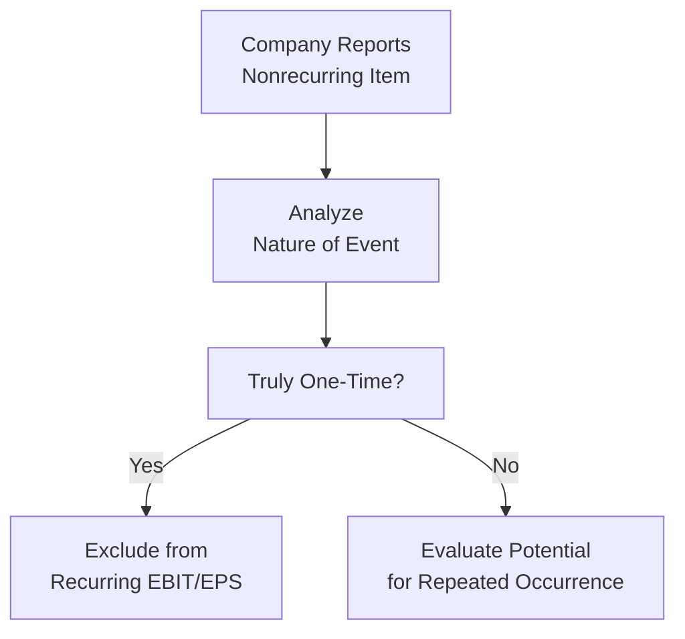

## Overview
Nonrecurring items and accounting policy changes can have a dramatic effect on how a firm’s profitability looks—especially in a given quarter or year. You might see a company boast about “adjusted EPS” or “core earnings,” conveniently excluding all these so-called “one-time” or “nonrecurring” costs and gains, which is something I’ve seen so often in practice that I sometimes wonder if those items really are “once in a lifetime.” In this section, we’ll look at how to identify what truly is nonrecurring, why it matters for analysis, and how changes in accounting policies can shift earnings from one period to another. We’ll also touch on IFRS and US GAAP rules on how to treat these adjustments, plus pointers on what to watch for in footnotes. 

## Nonrecurring Items: Definition and Significance
Nonrecurring items, sometimes labeled as unusual or infrequent items, are those presumed to occur outside the normal course of business. These might include:  
• Restructuring charges (say, costs from layoffs, closing down facilities, or discontinuing product lines).  
• Litigation settlements (like if a court orders a payment or the company sets aside a large sum for potential legal liabilities).  
• Impairment charges (non-cash expenses when assets are written down to reflect a decline in value).  
• Gains or losses from natural disasters that disrupt normal business operations.  
• One-time tax benefits or charges.  

Though IFRS and US GAAP used to provide for so-called “extraordinary items,” that category has effectively been eliminated from both frameworks. However, companies often still disclose unusual or infrequent events in separate line items within the income statement or in the footnotes.

### Why You Should Care About Nonrecurring Items
As an analyst (or an investor reading these statements), you’ll want to know whether these itemized costs or gains will keep popping up. A huge settlement related to an old environmental claim might truly be a single event—one that will never happen again. But a “restructuring charge” that surfaces every third quarter for five years starts to look like a normal operating cost that’s disguised as a one-off. This ongoing pattern might indicate management is continuously reorganizing and, well, maybe not quite telling shareholders the full story about normal operating expenses.

If you see a pattern of repeatedly high “one-time” charges, it can be a red flag. It might mean the company’s underlying performance is weaker than reported or that management is using these repeated “nonrecurring” hits to create a smoother or more favorable trend in reported earnings.

### IFRS and US GAAP: Treatment of Nonrecurring Items
Under both IFRS and US GAAP:  
• Truly nonrecurring items are generally highlighted separately on the face of the income statement or in a note.  
• There’s no longer a special “extraordinary items” category. Instead, unusual or infrequent items are broken out to provide clarity.  
• Companies must provide enough disclosure so users can understand the nature, amount, and financial effect of items that are not expected to recur.  

### Nonrecurring Items in Real-World Context
I have an acquaintance who once worked at a medium-sized manufacturing firm. They consistently labeled their repeated inventory write-downs as “nonrecurring.” Every single quarter—another big chunk. And each time, they insisted those inventory losses were unforeseeable or one-time. As you can guess, after about three to four consecutive “nonrecurring” write-downs, investors questioned whether the underlying business model was too reliant on untested product lines or if management simply needed better forecasting processes.

## Identifying and Analyzing Nonrecurring Items
From an analyst’s perspective, here’s a quick approach:

1. Validate the item’s occurrence and nature. Double-check footnotes, press releases, or management commentary. Sometimes the nonrecurring item’s explanation is hidden in the MD&A (Management Discussion & Analysis) or risk disclosures.  
2. Assess whether it really is an event that won’t happen again—like a settlement with a defunct vendor from a 10-year-old supply issue.  
3. If it’s truly a one-time event, you might consider removing it from earnings for a better sense of the company’s underlying performance, especially if you’re doing forecasting or computing valuation multiples like EV/EBIT.  
4. If you see repeated occurrences, don’t blindly exclude them. They might essentially be part of ongoing operations.  

## Common Varieties of “One-Time” Events
Some usual suspects:  

- Restructuring Charges: Often come from reorganizing staff, product lines, or production plants. The cost might be severance packages, facility closures, or asset write-downs.  
- Litigation Settlements: Company might pay a lump sum to settle a class-action lawsuit. If the business is repeatedly encountering these suits—say it’s in a high-litigation environment—then these charges might be quasi-recurring.  
- Natural Disaster Losses: A business in a hurricane-prone region might take repeated storm damage. If it’s happening every year, is it really “unusual” or should it factor into the cost structure?  

## Accounting Policy Changes
Apart from nonrecurring items, accounting policy changes can also alter the appearance of earnings. These changes might be:  
• A switch in inventory valuation method (e.g., from FIFO to weighted average).  
• A change in revenue recognition policy (for instance, adopting IFRS 15 or ASC 606 if they previously followed some older local GAAP).  
• A shift in depreciation or amortization method (from straight-line to double-declining balance, or vice versa).  

Under IFRS (particularly IAS 8 “Accounting Policies, Changes in Accounting Estimates and Errors”) and US GAAP (FASB ASC 250 “Accounting Changes and Error Corrections”):  
• Voluntary changes in accounting principles generally require retrospective application. That means recasting prior-year financial statements as if the new method had always been applied—providing more consistent comparability across periods.  
• Changes in accounting estimates, like adjusting the useful life of equipment, only affect the current and future periods (prospective). No restatement needed for prior periods.  
• Correction of errors also requires retroactive restatement.  

### Retrospective vs. Prospective Application
One of the big reasons you’ll see an asterisk in the income statement or a big bold line in the footnotes is that the company might have shifted from one accounting policy to another. Let’s say a firm changes from a cost-based approach to a fair-value approach for investment properties—a retrospective adjustment would rework prior statements to align with the new policy. This can be quite confusing for readers because the newly restated prior years’ net income, assets, and equity might differ from the numbers originally reported.  

Meanwhile, a prospective application is used for changes that are considered new estimates—for example, the estimated residual value of machinery. Since that’s not a change in policy but a revision of an assumption, the firm only updates the expense prospectively (current year onward). No messing around with prior statements.

#### Example
Consider PQR Corp. They decide to change from straight-line depreciation to sum-of-the-years’-digits method. Because this is a change in accounting principle related to how they systematically allocate an asset’s cost, IFRS and US GAAP typically require retrospective application—unless the firm can argue it’s a change in estimate. If it’s truly a shift in principle, last year’s and the year before’s financials should be recast to keep them consistent.  

In practice, you could see some interesting disclosures explaining that they can’t do a proper retrospective restatement because it’s impractical. If so, you’ll want to dig into the footnotes to see how they approximated the effect or whether they applied a modified retrospective approach from a certain date onward.

## Analytical Implications
### Impact on Earnings Quality
Nonrecurring items and accounting policy changes both have the potential to obscure which part of net income is consistently repeatable (and thus should be used when forecasting or estimating firm value). Over time, repeated so-called “one-time” items can undermine our trust in reported earnings. If a management team has a pattern of pushing normal operating costs into these “nonrecurring” buckets, the company’s core earnings might be overstated.

### Adjustments and Normalization
Analysts often calculate “normalized earnings” or “core earnings” as a measure of profitability after stripping out items considered irrelevant to future performance. This might involve:  
1. Adding back unusual charges (like a single large natural-disaster expense).  
2. Subtracting out unusual gains (like a huge one-off sale of a factory building).  
3. Reevaluating the effect of policy changes to keep the prior periods on an apples-to-apples basis.  

But be cautious: if nonrecurring items keep showing up, you may need to consider them as part of “normal” cost of doing business.  

### Managerial Incentives and Earnings Management
It’s no secret that management teams can manipulate how their earnings appear by classifying borderline items as nonrecurring. Or by timing an accounting policy change. For instance, shifting to a more aggressive depreciation method might lower near-term depreciation expense, thus boosting the next few quarters’ net income—just in time for meeting certain performance targets or covenants. This can be a big issue if not properly disclosed or understood by analysts.

In practice, good corporate governance and stringent audit procedures should limit the scope for manipulation. Still, your job as an analyst is to remain skeptical. Review the footnotes carefully—especially sections explaining the rationale for policy changes.

## Real-Life Case Study
Let’s imagine DeltaStreet Electronics, a fictional manufacturer that made a strategic pivot from consumer gadgets to industrial devices. In Year 1, they recognized a “nonrecurring” restructuring charge of $50 million to close a consumer-focused factory. In Year 2, they recorded another $40 million restructuring cost to revamp the distribution network. Then in Year 3, they recognized a $60 million impairment on intangible assets from the old consumer business. Each item was described as “nonrecurring.” But across three consecutive years, the so-called “one-time” hits added up to $150 million, and we start to wonder: Are these really nonrecurring, or is the business in a constant state of reorganization?

An astute analyst might recast the company’s three-year income statements by integrating these costs into an adjusted operating metric to see if “unstated internal chaos” is actually part of DeltaStreet’s operational routine. If so, the company’s “core” earnings would look less exciting, and the forward earnings trend might be at risk if more restructuring is around the corner.

## Cross-References
For those interested in how these items weave into the broader assessment of a company’s income statement, consider revisiting:  
- Section 2.1, where we discuss revenue principles (changes in revenue recognition can drastically alter revenues in the year of adoption).  
- Section 2.2, focusing on expense recognition (changes in depreciation policy can shift expense recognition patterns).  
- Section 12.2, where we talk about conservative vs. aggressive accounting and how “frequent nonrecurring charges” might be a sign of more aggressive earnings manipulation.

## Best Practices and Pitfalls
• Verify footnotes: Many times, the most crucial information about these items and policy changes is buried in plenty of detail.  
• Compare across peer firms: If rival companies never have repeated “one-time” hits while your company always does, that might raise questions about the business model or management cadence.  
• Evaluate the reason for an accounting policy change: A legitimate reason might be to align with a new IFRS or US GAAP standard or present a more accurate reflection of how an asset is used. A suspicious reason might be simply to boost earnings in a tough year.  
• Consistency of application: If a firm changes from FIFO to average cost one year, then from average cost to LIFO the next, that can create a lot of noise in the comparability of financial statements.

## Conclusion
Nonrecurring items and accounting policy changes each have the power to radically alter the reported bottom line. A single large litigation settlement or impairment charge might truly be a one-off event that deserves its own line item and exclusion from future earnings analysis. Yet it’s equally possible that multiple “nonrecurring” charges show a pattern of costs that are more recurring than management would like to admit. Simultaneously, changes in accounting policies—whether from new pronouncements or management choice—can shift results between different accounting periods, sometimes in unexpected ways.

Ultimately, your role as an analyst is to dig beneath the surface. If you want to judge the sustainable earnings power of a firm, you must make a thoughtful determination on what’s truly nonrecurring and how best to handle the fallout from any policy shifts. And always, always read the footnotes. It might feel like the last place you want to look, but that’s exactly where companies reveal the details that help you see the real story behind the numbers.

## References and Further Reading
• IAS 8 “Accounting Policies, Changes in Accounting Estimates and Errors”:  
  https://www.ifrs.org/  
• FASB ASC 250 “Accounting Changes and Error Corrections”:  
  https://fasb.org  
• “Accounting for Nonrecurring Items” chapter in “Intermediate Accounting” by Kieso, Weygandt, and Warfield.  

 

## Test Your Knowledge: Nonrecurring Items and Accounting Policy Changes



### Which of the following best describes a nonrecurring item?

- [ ] An expense that is recognized in every reporting period for a company under IFRS.
- [x] An unusual or infrequent event that is not expected to take place again in the foreseeable future.
- [ ] A recurring expense item that consistently appears in every interim report.
- [ ] A year-end adjusting entry that is required under IAS 8.

> **Explanation:** Nonrecurring items are those that are not part of a company’s routine operational activities. By definition, they are unusual or infrequent and not expected to continue in the future.

### Under current IFRS and US GAAP, how are “extraordinary items” reported?

- [ ] They must be disclosed in a special section of the income statement, showing net of tax.
- [ ] They must be highlighted in the auditor’s report only.
- [x] They are no longer separately classified, but unusual or infrequent items may still be presented distinctly.
- [ ] They are merged with regular operating expenses on the balance sheet.

> **Explanation:** Both IFRS and US GAAP have abolished the “extraordinary” label, so such items are not reported in a separate category. Instead, unusual or infrequent items can be disclosed to inform users about their nature and effect.

### If a company changes its depreciation method from straight-line to declining balance, how is this typically treated under IFRS or US GAAP when it qualifies as a change in accounting principle?

- [ ] It is always applied prospectively to avoid restating prior periods.
- [x] It generally requires retrospective application unless it can be justified as a change in estimate.
- [ ] It requires the use of the corridor approach under both IFRS and US GAAP.
- [ ] It mandates an immediate impairment charge under IAS 8.

> **Explanation:** Changes in accounting principles normally require retrospective restatement unless the firm can argue that the change is actually a change in accounting estimate, in which case the new method would be applied prospectively.

### Which of the following scenarios would likely indicate a genuine nonrecurring item?

- [x] A large settlement paid to resolve a 15-year-old legal case that is not related to ongoing operations.
- [ ] A continuing annual write-down of inventory labeled as “unforeseen.”
- [ ] Frequent layoff costs labeled “exceptional” each quarter.
- [ ] A decline in revenues in every holiday season.

> **Explanation:** A single settlement stemming from a long history of legal trouble that isn’t relevant to usual operations is more likely to be a one-time occurrence, whereas repeated charges or seasonal drops in revenue are not necessarily nonrecurring.

### An analyst finds that a company has reported “one-time” restructuring charges in each of the last four quarters. What might the analyst infer?

- [ ] The charges are definitely allowable as one-time under IAS 8.
- [x] The company could be disguising recurring costs as nonrecurring, raising concerns about earnings quality.
- [ ] These charges must be added back to net income to calculate free cash flow.
- [ ] The company is prohibited from disclosing these charges separately and must combine them with cost of sales.

> **Explanation:** Repeated nonrecurring charges raise questions as to whether they are genuinely one-off or part of normal operations—an issue that can affect the perceived quality of earnings.

### Which of the following best summarizes retrospective application?

- [x] A restatement of prior-period financial statements as though the new policy had always been used.
- [ ] A forward-looking adjustment that only affects current and future financial statements.
- [ ] A method to isolate extraordinary losses.
- [ ] An immediate expense recognition in the next quarter’s income statement.

> **Explanation:** When a change in accounting principle requires retrospective application, the firm reconfigures previous reports to maintain comparability, as if the new principle had always been in place.

### BetaLine Corp. has a repeated history of “one-time impairment charges.” How should analysts handle these items when forecasting BetaLine’s future earnings?

- [x] Treat them as recurring expenses if they consistently appear, unless management provides compelling evidence otherwise.
- [ ] Automatically exclude them from any forward-looking analysis.
- [x] Closely examine footnotes to understand whether they are genuinely unusual in nature.
- [ ] Accept company management’s claim that these charges are nonrecurring.

> **Explanation:** If so-called “one-time” impairments happen repeatedly, analysts should be skeptical and may include them as part of ongoing expenses in projected cash flows. Careful footnote review is crucial.

### Which statement is true about accounting policy changes under IAS 8?

- [x] Voluntary changes in accounting principle usually require retrospective application unless it is impractical to do so.
- [ ] They are always accounted for prospectively.
- [ ] If the new policy increases net income, prior statements are never restated.
- [ ] Disclosure is optional if the changes are immaterial.

> **Explanation:** Under IAS 8, an entity must account for voluntary changes in accounting principle retrospectively, restating comparatives unless it is impractical to do so. Disclosure is compulsory.

### Under IFRS, which of the following is a valid reason for not applying a policy change retrospectively?

- [x] It is impractical to determine the cumulative effect of applying the new policy to prior periods.
- [ ] A new policy leads to lower retained earnings.
- [ ] A new standard is mandated by the IFRS Foundation.
- [ ] The external auditors request prospective application.

> **Explanation:** IAS 8 states that if obtaining the necessary information is impracticable, retrospective application may be waived. Difficulty or cost alone isn’t typically enough to avoid restatement unless it genuinely can’t be done.

### Is it true that all “one-time” costs should always be excluded from an analyst’s valuation models?

- [x] True
- [ ] False

> **Explanation:** Analysts typically exclude genuinely infrequent and unusual items to estimate sustainable or normalized earnings. However, caution is needed if these “one-time” costs tend to happen repeatedly or signal aspects of normal business risk.


