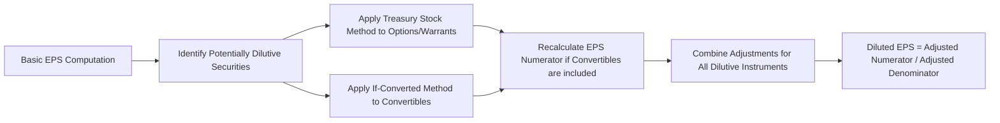

## Overview

Earnings per share (EPS) is often placed front and center in company financial reports and analyst discussions. It serves as a key indicator of profitability on a per-share basis and influences everything from equity valuations to executive compensation. Yet, despite its seeming simplicity, EPS calculations can become intricate, particularly when companies have complex capital structures involving convertible securities, warrants, or stock options. This section examines the calculation of both basic and diluted EPS under IFRS (IAS 33) and US GAAP (ASC 260), highlights critical nuances that can affect investors’ interpretations, and discusses common EPS-related pitfalls relevant to an advanced investment professional’s toolkit.

## Significance of EPS

EPS is more than just a corporate performance measure—it is a fundamental factor in equity valuation models such as the price-to-earnings (P/E) ratio and in residual income models. Financial analysts frequently rely on EPS to assess:

• Profitability Trends: By analyzing EPS growth or contraction, investors can uncover earnings momentum or deterioration.  
• Capital Structure Changes: Share buybacks, option exercises, or convertible debt conversions can all meaningfully alter EPS.  
• Management Incentives: Executive compensation often ties into EPS-based metrics, incentivizing managers to optimize (sometimes manipulate) the reported figure.

Because EPS calculations can be adjusted by corporate actions, advanced analysts must understand not only how to compute EPS but also how to critically assess disclosures about potentially dilutive securities.

## Basic EPS

Basic EPS measures the income available to common shareholders divided by the weighted-average number of common shares outstanding over a reporting period. This calculation ignores the possibility that additional shares could be created by conversion or exercise of other financial instruments.

Mathematically:


\text{Basic EPS} = \frac{\text{Net Income} - \text{Preferred Dividends}}{\text{Weighted Average Number of Common Shares Outstanding}}


• Net Income (NI) is the bottom-line profit reported on the income statement.  
• Preferred Dividends (PD) are subtracted (if any in the given period) because net income attributable to common shareholders excludes dividends payable to preferred shareholders.  
• The Weighted Average Number of Common Shares Outstanding (WASO) divides the year into segments reflecting when shares are issued or repurchased, ensuring the share count aligns with the length of time shares were outstanding.

### Process Flow for Basic EPS

### Practical Example of Basic EPS

Suppose a company reports:
• Net income of $5 million.  
• Preferred dividends of $300,000.  
• Common shares outstanding at the start of the year: 2,000,000.  
• A new equity issuance of 500,000 shares on July 1 (mid-year).  

The weighted-average shares might be calculated as follows:

• For January 1–June 30 (6 months), 2,000,000 shares outstanding.  
• For July 1–December 31 (6 months), 2,500,000 shares outstanding.  

Thus,
(2,000,000 shares × 6/12) + (2,500,000 shares × 6/12)  
= 1,000,000 + 1,250,000  
= 2,250,000 weighted-average shares.

Basic EPS becomes:


\text{Basic EPS} = \frac{5{,}000{,}000 - 300{,}000}{2{,}250{,}000} = \frac{4{,}700{,}000}{2{,}250{,}000} \approx \$2.09


## Diluted EPS

Diluted EPS adjusts the basic EPS concept by asking the question: “How many shares would exist if all the potentially dilutive instruments (e.g., stock options, warrants, convertible debt, convertible preferred stock) were converted or exercised?”

Diluted EPS represents the worst-case scenario for existing shareholders in terms of share count expansion. If the hypothetical conversion or exercise of these instruments increases the total number of shares, that generally reduces EPS. Conversely, if such conversion would be antidilutive—i.e., it would increase EPS or reduce a loss per share—those securities are excluded from diluted EPS (by global accounting standards).

Mathematically, the general formulation for diluted EPS is:


\text{Diluted EPS} = \frac{\text{Adjusted Net Income}}{\text{Weighted Average Number of Common Shares Outstanding} + \text{Incremental Shares from Dilutive Securities}}


• Adjusted Net Income may need to be tweaked if conversions reduce interest expense or alter the dividend structure.  
• The denominator includes the base WASO plus the number of shares that would arise from exercising or converting dilutive instruments.

### Key Methods for Determining Dilution

1. **Treasury Stock Method (TSM)**:  
   This method commonly applies to stock options and warrants. The TSM assumes that the option or warrant holders exercise their rights at the average market price during the reporting period. The proceeds from this hypothetical exercise are assumed to be used by the company to repurchase as many shares as possible at the same average price. Only the incremental difference between the shares issued and the shares “repurchased” enters the diluted EPS denominator.

2. **If-Converted Method**:  
   This method is used for convertible debt or convertible preferred shares. It presumes that the securities were converted into common shares at the beginning of the period (or at issuance if later). The numerator is often adjusted because interest expense (net of tax) on convertible bonds or preferred dividends would no longer apply if the bonds or preferreds had been converted.

### Flow for Diluted EPS (Conceptual)

## Potentially Dilutive Securities

1. **Stock Options and Warrants**:  
   Typically evaluated with the treasury stock method. If the strike or exercise price is below the average market price, the instrument is dilutive. If the strike price is above the market price, it is antidilutive (no incremental shares are assumed).

2. **Convertible Bonds**:  
   Evaluated with the if-converted method. The numerator is increased by the after-tax interest expense that would have been saved if the bonds had been converted. The denominator is increased by the number of shares that bondholders would receive upon conversion. If converting the bonds would raise EPS, the bonds are antidilutive and are excluded from the EPS calculation.

3. **Convertible Preferred Stock**:  
   Similar logic applies: one would remove the preferred dividend and expand the share count by the common shares from conversion.

4. **Restricted Stock Units (RSUs)**:  
   Often accounted for similarly to options. If they remain subject to vesting conditions, most standard IFRS/US GAAP approaches incorporate RSUs into diluted EPS using an assumed vesting schedule.

5. **Contingently Issuable Shares**:  
   If certain performance conditions or market conditions would be met (e.g., if net income reaches a certain threshold, the company issues additional shares to management), these might be included in the diluted EPS if the conditions are satisfied or would have been satisfied during part of the reporting period.

## Calculation Illustrations

### Example: Options with Treasury Stock Method

Assume:
• The company has 100,000 stock options outstanding with an exercise price of \$10.  
• The average market price during the year is \$15.  
• Net income is \$10,000,000, no preferred dividends.  
• Weighted average common shares outstanding (basic) is 2,000,000.  

Step 1: If the options are exercised, the company issues 100,000 shares and receives \$10 × 100,000 = \$1,000,000 in proceeds.  
Step 2: With a \$15 average price, the company can repurchase \$1,000,000 / \$15 ≈ 66,667 shares.  
Step 3: Additional shares outstanding from options = 100,000 – 66,667 = 33,333.  

Hence, the denominator for diluted EPS is 2,000,000 + 33,333 = 2,033,333 shares. The numerator (NI of \$10 million) remains the same (no interest or dividend adjustments in this scenario).

Diluted EPS becomes:


\frac{10{,}000{,}000}{2{,}033{,}333} \approx \$4.92


If the strike price had been \$17, exceeding the \$15 average market price, the options would be antidilutive, and we would omit them from the diluted EPS calculation.

### Example: Convertible Bond with If-Converted Method

Suppose the same company has \$2,000,000 par value of 10% coupon convertible bonds outstanding. Each \$1,000 bond is convertible into 50 shares of common stock. The effective tax rate is 25%. The bonds are outstanding the entire year, and net income is \$10,000,000 (no preferred dividends). Basic weighted average shares: 2,000,000.

Step 1: Interest (pre-tax) on the convertible bonds = \$2,000,000 × 10% = \$200,000. After-tax interest expense saved if converted = \$200,000 × (1 – 0.25) = \$150,000.  
Step 2: If the bonds are converted, the number of additional shares = (2,000,000 par / 1,000) × 50 = 100,000 shares.  
Step 3: Adjust the numerator for the saved after-tax interest expense: \$10,000,000 + \$150,000 = \$10,150,000.  
Step 4: Adjust the denominator: 2,000,000 + 100,000 = 2,100,000 shares.  

Diluted EPS becomes:


\frac{10{,}150{,}000}{2{,}100{,}000} \approx \$4.83


If including the bonds in the calculation had caused EPS to increase, the bonds would be antidilutive and thus excluded from the diluted EPS figure.

## IFRS vs. US GAAP Considerations

Both IFRS (IAS 33) and US GAAP (ASC 260) share the foundational approach to EPS. However, some differences or clarifications may arise:

• **Presentation**: IFRS typically requires earnings per share for continuing operations and for net income (or profit/loss) on the face of the income statement.  
• **Convertible Instruments with Embedded Features**: Classification nuances under IFRS can cause certain derivatives or embedded features to be treated differently, potentially altering the calculation of incremental shares.  
• **Practical Thresholds**: Some minor differences in applying the treasury stock method or if-converted method for specialized instruments (e.g., certain share-based payments) may lead to slight measurement differences.

In practice, advanced analysts should review the footnotes, especially for convertible bonds and share-based compensation, to confirm precise details.  

## Interpretation and Common Pitfalls

Even with accurate calculations, certain pitfalls can undermine EPS analysis:

1. **Share Buybacks**  
   Corporations repurchasing shares may artificially inflate EPS by reducing the denominator. This may mask underlying stagnation in net income. Portfolio managers often adjust for significant buybacks when reviewing temporal EPS trends.

2. **Non-GAAP Adjustments**  
   Companies frequently report “adjusted” EPS that exclude specific expenses (e.g., restructuring costs, stock-based compensation). Though these can clarify recurring performance, they can also introduce subjectivity. Analysts should reconcile adjusted figures to the GAAP or IFRS measures.

3. **Antidilutive Instruments**  
   Failing to look for details on antidilutive securities can lead to misjudging a company’s potential share count growth. For instance, if the average market price eventually increases, those once-antidilutive instruments may become dilutive in a future period.

4. **Convertible Security Timing**  
   The if-converted method usually assumes earliest possible conversion date. In real life, conversion might not happen for years, but from an EPS standpoint, we treat it as if it happened at the start of the period (for diluted EPS). 

5. **Segmenting Earnings**  
   In advanced portfolio modeling, analysts might isolate continuing operations from discontinued segments. Make sure to confirm whether the EPS in question includes outcomes from discontinued segments or extraordinary items.

## Relevance for Portfolio Management

Though EPS is commonly a Level I or II topic, advanced portfolio managers also pay close attention to EPS:

• **Valuation Impact**: Forecasted EPS often drives forward P/E multiples and is integral to equity research models.  
• **Risk Assessment**: Rapid expansions in share count or convertible funding can dilute existing shareholders’ claims to future earnings.  
• **Scenario Analysis**: In manager due diligence or M&A contexts, stress tests may investigate how new equity issuance or conversion scenarios affect projected EPS.  
• **Performance Measurement**: In equity-based compensation plans, a strong knowledge of how diluted EPS is calculated can help detect potential conflicts of interest or aggressive share-based motivations.

## Exam Tips

• **Carefully Distinguish Basic vs. Diluted**: On the exam, an item set may provide partial or incomplete data about options or convertible debt. Make sure to identify precisely which securities are dilutive and how the standard methods (treasury stock, if-converted) adjust the numerator and the denominator.  
• **Check for Adjustments to Net Income**: If convertible debt is involved, don’t forget to add back after-tax interest expense to the numerator. If convertible preferred stock is outstanding, remove preferred dividends from the numerator.  
• **Identify Antidilutive Securities**: Determine if the exercise or conversion price is above the current market price for warrants/options or if adding back interest expense plus the share impact actually increases EPS. In those cases, exclude the security from the diluted calculation.  
• **Practice Weighted-Average Share Calculations**: Weighted-average shares are often tested. Watch out for mid-year issuances, buybacks, or share splits.  
• **Reference the Footnotes**: Many exam questions hinge on disclosures about share-based compensation or convertible debt details buried in footnotes.  

## References

• IASB (2021). IAS 33 “Earnings per Share.” IFRS Foundation, https://www.ifrs.org  
• FASB (2021). ASC 260 “Earnings per Share.” https://www.fasb.org  
• CFA Institute (2022). “International Financial Statement Analysis.” CFA Institute Investment Series.  
• CFA Institute Code and Standards (most current version).  

---

## Test Your Knowledge: Basic and Diluted EPS



### For a company with a simple capital structure, which EPS figure is typically reported on the face of the income statement?

- [x] Only basic EPS
- [ ] Only diluted EPS
- [ ] Both basic and diluted EPS
- [ ] Neither basic nor diluted EPS

> **Explanation:** Organizations with no potentially dilutive securities have a “simple” capital structure, and only basic EPS is required.

### Which of the following is most likely treated using the treasury stock method when calculating diluted EPS?

- [ ] Convertible preferred shares
- [x] Stock options
- [ ] Convertible bonds
- [ ] Contingently issuable shares

> **Explanation:** The treasury stock method applies primarily to stock options and warrants. Convertible bonds and convertible preferred shares would use the if-converted method. Contingently issuable shares may follow different guidelines depending on specific conditions.

### Under the if-converted method, which of the following adjustments applies to the numerator when calculating diluted EPS for convertible bonds?

- [x] Add back after-tax interest expense
- [ ] Subtract declared dividends on common shares
- [ ] Add back stock-based compensation expense
- [ ] Add back interest expense without a tax adjustment

> **Explanation:** When assuming convertible bonds have been converted, the after-tax interest expense that would have been paid is added back to net income (since the company no longer has interest expense in that scenario).

### A company’s average market price is $30 per share, and it has 10,000 stock options outstanding with an exercise price of $20. Under the treasury stock method, how many additional shares would be added to the denominator if the company hypothetically repurchases as many shares as possible at $30?

- [ ] 10,000 shares
- [ ] 15,000 shares
- [x] 3,333 shares
- [ ] 6,667 shares

> **Explanation:** The company would receive $20 × 10,000 = $200,000 from the exercise. At $30 per share, it could buy back 6,666.67 shares (rounded to 6,667). Incremental shares = 10,000 – 6,667 = 3,333.

### If adding back the net-of-tax interest from convertible debt and the corresponding additional shares causes the EPS figure to increase relative to basic EPS, the convertible debt is:

- [ ] Dilutive
- [x] Antidilutive
- [ ] Mandatorily convertible
- [ ] Partially dilutive

> **Explanation:** If including a security in diluted EPS raises EPS instead of lowering it, that security is antidilutive and must be excluded.

### Which of the following statements best characterizes the primary difference between basic and diluted EPS?

- [x] Diluted EPS includes the impact of all potentially dilutive securities, whereas basic EPS does not.
- [ ] Basic EPS includes convertible instruments, while diluted EPS includes non-convertible debt.
- [ ] Basic EPS is only disclosed to managerial accountants, whereas diluted EPS is disclosed to shareholders.
- [ ] Diluted EPS ignores antidilutive securities, while basic EPS includes them.

> **Explanation:** Diluted EPS accounts for the conversion of all potentially dilutive securities (unless they are antidilutive), whereas basic EPS excludes them.

### Company A has 1,000,000 shares outstanding all year, net income of $4,000,000, and no preferred dividends. It has 50,000 stock options with an exercise price of $40 when the average market price of the stock is $50. What is Company A’s diluted EPS if the options are the only potentially dilutive instruments?

- [x] $3.95
- [ ] $4.00
- [ ] $4.04
- [ ] $3.84

> **Explanation:** Proceeds from the exercise = 50,000 × $40 = $2,000,000. Shares repurchased = $2,000,000 ÷ $50 = 40,000. Incremental shares = 50,000 – 40,000 = 10,000. Denominator becomes 1,010,000 shares. Diluted EPS = $4,000,000 ÷ 1,010,000 ≈ $3.96 (rounded to $3.95).

### Under both IFRS and US GAAP, how must antidilutive securities be treated when computing diluted EPS?

- [x] They must be excluded from the diluted numerator and denominator.
- [ ] They must be partially included.
- [ ] They must be accounted for in separate footnote disclosures but included in the denominator.
- [ ] They must be used only to adjust the numerator.

> **Explanation:** Both IFRS (IAS 33) and US GAAP (ASC 260) prescribe excluding antidilutive securities because their inclusion would increase EPS (or reduce a loss per share), contradicting the principle of “worst-case scenario” for existing shareholders.

### Which of the following is least likely to be considered a potentially dilutive security?

- [ ] Convertible bond
- [ ] Stock warrant
- [ ] Convertible preferred stock
- [x] Common share already outstanding

> **Explanation:** Common shares that are already outstanding do not pose further dilution; they are part of the basic EPS denominator. Bonds, warrants, and convertible preferreds are all potentially dilutive securities.

### True or False: In the if-converted scenario for convertible bonds, dividends on common shares replace the coupon payments in the numerator adjustment.

- [x] True
- [ ] False

> **Explanation:** When convertible bonds are assumed converted, the coupon payments are replaced by dividends if the bondholder converts to common equity (though the main effect typically is adding back the bond’s after-tax interest expense and increasing shares). In select structures where bond conversion terms parallel some form of dividend replacement or other settlement, you would note a shift from interest payments to common dividends. Nonetheless, in many standard instruments, interest is simply removed and net income is adjusted accordingly.


