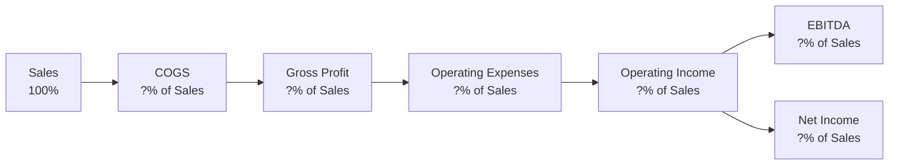

## Introduction

Imagine you’re chatting with a friend who runs a small café. They excitedly tell you, “Our sales went up 30% last month!” But when you ask about costs, their face drops: “Our cost of ingredients seems to have doubled.” You pause—how does one separate the meaningful changes from the noise in the numbers? This is exactly where common-size income statements and profitability ratios can help. By standardizing each income statement item as a percentage of revenue, you can compare performance across years or against other companies, big or small.

In the financial world—whether you’re analyzing a single company, a division, or even large multinational corporations—these tools reveal cost structure patterns, profit drivers, and how effectively management handles expenses. Let’s explore the mechanics and significance of common-size income statements and profitability ratios, blending in a few anecdotes and advanced analytical techniques.

## What Is Common-Size Income Statement Analysis?

A common-size income statement transforms each line item—like Cost of Goods Sold (COGS), Operating Expenses, and Net Income—into a percentage of total revenue (or net sales). This approach makes it super-easy to see how each cost (or profit) component stacks up against the top line. For instance, if a company’s COGS is 60% of revenue, you immediately know that 40% of revenue is left to cover all other costs, taxes, interest, and profits.

Beyond a single time period, using common-size analysis over multiple periods highlights how these percentages fluctuate. If your friend’s café has consistently kept COGS at 55% of sales for the past three years but this year it jumped to 70%, that’s a red flag. It could be a spike in ingredient costs or perhaps an operational inefficiency that needs investigation.

### Key Benefits

• Allows comparisons across companies of different sizes.  
• Spotlights trends in cost structures, margins, and overall profitability.  
• Simplifies cross-sectional analysis by standardizing line items.  
• Enhances your ability to see red flags, like unexpectedly high expenses in a given category or a sudden decline in gross margin.

### A Typical Flow

Here’s a simplified mermaid diagram illustrating how items accumulate on the income statement, all expressed relative to 100% of revenue:

When these items are expressed as percentages of revenue, we have a common-size income statement. Let’s see how that works in practice.

## Profitability Ratios

Profitability ratios help measure how efficiently a company (or project, or café, for that matter) generates profits relative to revenue. Four of the most commonly used margins are: Gross Profit Margin, Operating Margin, Net Profit Margin, and EBITDA Margin. Each margin reveals unique insights:

### Gross Profit Margin

Gross Profit Margin = (Revenue – Cost of Goods Sold) / Revenue

If I say, “Gross margin is 45%,” that means for every $1 in sales, the company keeps $0.45 after accounting for the direct costs of producing goods or delivering services. Changes here potentially hint at changes in input costs, pricing power, or even product mix (maybe the café expanded into artisanal pastries that carry higher ingredient costs).

### Operating Margin

Operating Margin = Operating Income / Revenue

Operating margin gauges how much profit is left over after deducting not only direct costs but also general administrative expenses, selling expenses, and other operating items. If operating margin is shrinking while gross margin remains stable, the culprit is often overhead costs rising faster than revenue. Alternatively, it could indicate an investment in research and development (R&D) or marketing that has yet to translate into higher sales.

### Net Profit Margin

Net Profit Margin = Net Income / Revenue

Net profit margin captures “the bottom line” relative to the top line. It accounts for every expense—interest, taxes, and all. Even well-run companies can have net margins that vary drastically year-to-year due to changes in tax laws or the firm’s capital structure (interest expense can be high if leverage is high). An improvement in a firm’s net profit margin might reflect successful debt management, favorable shifts in tax rates, or a one-time gain from an asset sale, all of which deserve a deeper look.

### EBITDA Margin

EBITDA Margin = EBITDA / Revenue

EBITDA (Earnings Before Interest, Taxes, Depreciation, and Amortization) is often considered a proxy for operational cash flow, though it’s not a perfect substitute. The EBITDA margin basically says, “Ignore non-cash charges and capital structure for a moment; are the company’s operations healthy?” It’s a go-to metric in industries with large depreciation expenses—like airlines or telecom—where booking significant depreciation can mask underlying operating performance.

## Putting It All Together

So, how does all this interplay? Let’s suppose you’re analyzing Company Zenith. You note:

• Gross Profit Margin: 35% this year, up from 32% last year.  
• Operating Margin: 15% this year, stable compared to 15% last year.  
• Net Profit Margin: 10% this year, down from 12% last year.  
• EBITDA Margin: 18% this year, up from 16% last year.  

At first glance, you see improvements in gross margin and EBITDA margin, but net margin declined. This could be due to interest expense for a new bond issuance or maybe currency exchange losses. It’s your job to assess which parts of the cost structure or capital structure are driving the changes. Ultimately, analyzing the margins in tandem with a common-size view helps you track each cost category and see which items weigh more heavily on profitability year over year.

## Practical Implementation

### Trend Analysis

A single year’s data can be misleading, so examine multiple years to spot trends. Is the company systematically improving its gross margin over the last five years, or is the improved margin just a short-lived result of promotional pricing? Did controlling overhead help maintain a stable operating margin, or was it a function of aggressive cost-cutting that might hurt product quality in the future? These are typical deeper-dive questions.

### Industry Benchmarks

Comparing your firm’s margins against peer averages or industry norms is a key step in ratio analysis. If the café’s gross margin is 65% and the industry average is 50%, you might think, “Awesome, they’re doing great.” But if that 65% is due to extremely high menu prices that might not be sustainable, you need to investigate. Likewise, a below-average margin might reflect an actual competitive disadvantage. Use commercial databases or academic resources (like Professor Damodaran’s industry cost-of-capital and margin data) to see where your company sits on the margin continuum.

### IFRS vs. US GAAP Considerations

Small differences in how IFRS and US GAAP classify certain expenses can affect the line items on the income statement. For example, some development costs might be capitalized under IFRS that might be expensed under US GAAP. These differences can cause some margin disparities when you compare a U.S. firm to a European firm. Make sure you understand how the financial statements are prepared before drawing firm conclusions.

## Potential Pitfalls

• Over-Focus on a Single Margin: Sometimes net income can be temporarily inflated by special gains, or the firm might be over-leveraged. Don’t rely on one metric alone.  
• Seasonality and One-Off Items: If you see a big margin shift in the holiday quarter, for instance, that might be normal for a retailer. A negative margin might occur in off-season periods due to lower volume.  
• Different Accounting Methods: Inventory valuation methods (e.g., LIFO vs. FIFO) can distort cost structures if you compare one company using LIFO to another using FIFO, especially in inflationary contexts.

## Real-World Example

Let’s do a quick hypothetical illustration:  
Company A generates $1,000 in revenue, with $400 in COGS, $300 in operating expenses, $100 in interest expense, and $20 in taxes. Let’s see how the common-size breakdown looks:

| Income Statement Item | Amount | % of Revenue |
|-----------------------|--------|--------------|
| Revenue              | $1,000 | 100%         |
| COGS                 | $400   | 40%          |
| Gross Profit         | $600   | 60%          |
| Operating Expenses   | $300   | 30%          |
| Operating Income     | $300   | 30%          |
| Interest Expense     | $100   | 10%          |
| Income Before Taxes  | $200   | 20%          |
| Taxes                | $20    | 2%           |
| Net Income           | $180   | 18%          |

From this table, you get:

• Gross Profit Margin = 60%  
• Operating Margin = 30%  
• Net Profit Margin = 18%  

Analyzing these margins in different years (or different companies) can reveal whether management is doing well controlling direct and indirect costs, how effectively they handle their capital structure (given the interest expense), and any quirks in their tax strategies.

## Cross-Reference

For an extended discussion on revenue recognition issues and how they affect top-line figures, see the earlier sections, particularly 2.1 Principles of Revenue Recognition and 2.2 Expense Recognition and Capitalization vs. Expensing. Also, keep chapter 13 (Financial Analysis Techniques) on your horizon, as it delves further into ratio analysis with DuPont decomposition and other advanced techniques.

## Glossary

• Common-Size Analysis: A technique for comparing line items by expressing them as a percentage of a base figure, typically revenue.  
• Margin: A profitability measure showing the ratio of profit relative to revenue (or sometimes another base).  
• Operating Leverage: The degree to which fixed costs dominate a firm’s cost structure, which magnifies changes in operating income when revenue fluctuates.  
• Revenue: Inflows from sales of goods or services, net of returns and discounts.  
• Cost of Goods Sold (COGS): Direct costs attributed to producing goods or delivering services.

## Final Exam Tips

• Don’t memorize a single formula—understand what each margin and ratio conveys about a business’s underlying operations, cost structure, and incentives.  
• On the exam, watch for answer choices that confuse one margin with another. For example, a question might show an operating margin scenario but ask for a net profit margin conclusion.  
• Practice troubleshooting big margin swings. If you spot a big jump in COGS as a percentage of revenue, be prepared to discuss possible reasons: changing supplier costs, inventory mismanagement, or a weakening product mix.  
• Use multiple years of annual reports—one year is rarely enough to confirm trends.  
• Contrast IFRS vs. US GAAP if the vignette signals that the reporting frameworks differ.  

## References

• White, Gerald I., Sondhi, Ashwinpaul C., and Fried, Dov: “The Analysis and Use of Financial Statements.”  
• CFA Institute: Official Curriculum on Ratio Analysis and Common-Size Statements.  
• Damodaran, Aswath: Data and resources available at http://pages.stern.nyu.edu/~adamodar/  

## Self-Assessment: Common-Size Income Statements and Profitability Ratios



### Which of the following best describes the purpose of a common-size income statement?

- [ ] To list all income statement items in absolute currency values for a single period
- [ ] To compare revenues to cost of capital
- [x] To express each income statement item as a percentage of revenue for easier comparison
- [ ] To measure total assets as a proportion of revenue

> **Explanation:** Common-size income statements transform absolute amounts into percentages of revenue, making it easier to compare cost structures and profitability across time and among companies of different sizes.

### If Company X’s COGS increases from 40% of revenue to 50% of revenue while gross margin declines, which factor is most likely true?

- [x] Input or raw material costs are rising relative to sales prices
- [ ] The firm’s interest expense increased
- [ ] The firm paid more in taxes
- [ ] The firm changed depreciation methods

> **Explanation:** A growth in COGS as a percentage of revenue directly impacts gross margin by increasing the direct costs of producing or delivering goods.

### Operating margin measures which of the following?

- [ ] Earnings before interest, taxes, depreciation, and amortization compared to revenue
- [ ] The ratio of net income to revenue
- [x] Profit from the firm’s core operations (operating income) as a percentage of revenue
- [ ] The proportion of R&D expenses to total sales

> **Explanation:** Operating margin looks at operating income (after overhead but before interest and taxes) as a percentage of revenue.

### Which margin is commonly viewed as a measure of the company’s “bottom line” profitability?

- [ ] Gross margin
- [ ] Operating margin
- [x] Net profit margin
- [ ] EBITDA margin

> **Explanation:** Net profit margin includes all expenses (interest, taxes, and so forth), reflecting how much net income remains from each dollar of sales.

### A sudden decline in EBITDA margin, while depreciation and taxes remain unchanged, might suggest:

- [x] Core operational inefficiencies or abrupt increases in general operating costs
- [ ] A decrease in the company’s effective tax rate
- [ ] A temporary decrease in interest expense
- [ ] A change in how intangible assets are being depreciated

> **Explanation:** Because EBITDA excludes depreciation, taxes, and interest, changes in those items wouldn’t directly alter EBITDA margin. A drop likely relates to operational factors.

### Company ABC’s gross profit margin remains stable, but its net profit margin has declined. Which scenario might best explain this?

- [x] The firm has taken on higher interest expenses
- [ ] The firm’s direct input costs have risen
- [ ] The firm’s prices have significantly increased
- [ ] The firm has changed its CFO

> **Explanation:** If net profit margin falls while gross margin is stable, factors below the gross margin line (e.g., interest expense, tax expense) might be increasing.

### Common-size income statements are particularly helpful for:

- [x] Comparing companies of different scales
- [ ] Calculating the company’s effective tax rate
- [x] Observing changes in cost structure over time
- [ ] Estimating the firm’s weighted average cost of capital

> **Explanation:** Common-size statements let you compare line-item percentages across firms (big vs. small) and track changes in each item over time. They don’t directly calculate the tax rate or cost of capital.

### Which of the following statements about margins is most accurate?

- [x] Gross margin focuses on direct costs, while operating margin includes both direct and indirect operating costs
- [ ] Operating margin excludes selling, general, and administrative expenses
- [ ] Net profit margin excludes interest and taxes to focus on core operations
- [ ] EBITDA margin typically includes interest and depreciation expenses

> **Explanation:** Gross margin deals with direct costs (COGS), whereas operating margin includes overhead and other operating expenses but excludes interest and taxes.

### To evaluate profitability across multiple years while neutralizing inflation and structural shifts, an analyst would most likely:

- [x] Assess common-size income statements and compare key margins across periods
- [ ] Compare absolute currency values for each cost item
- [ ] Use only the most recent year’s ratios
- [ ] Avoid margin analysis altogether

> **Explanation:** Common-size statements remove differences in scale or changes in nominal prices escalations, making multi-year trend analysis clearer.

### Common-size statements primarily express each item in relation to revenue. True or False?

- [x] True
- [ ] False

> **Explanation:** By definition, common-size income statements present all items as percentages of revenue (sometimes total assets for balance sheets, etc.), but for income statements, revenue is the standard base figure.


