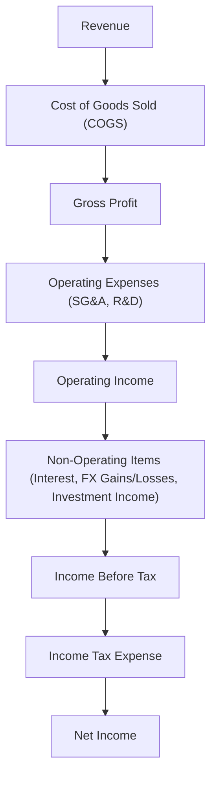
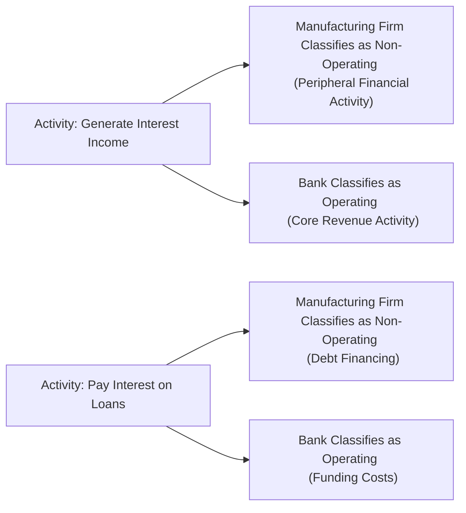

## Introduction
You know, every time I’ve tried to untangle a company’s income statement, I’ve had moments of pause over what exactly is “operating” and what is “non-operating.” Well, you’re not alone. Many analysts, even seasoned ones, spend a considerable amount of time dissecting footnotes, peer comparisons, and management discussion sections to properly reclassify items. Doing this right can be the difference between an accurate depiction of performance and a misleading impression of how the business is functioning day-to-day.

In this section, we’ll explore what “operating” vs. “non-operating” items are and why this distinction is so important for financial statement analysis. We’ll also look at how IFRS and US GAAP treat these classifications, highlight some best practices, point out pitfalls, and share tips for applying these concepts on the CFA® exam and in real-world analysis.

## Why Classify Items as Operating vs. Non-Operating?
Understanding whether a particular revenue, gain, expense, or loss is part of operating or non-operating activities is crucial for capturing the core profitability of a business. After all, if you’re evaluating a consumer goods retailer, you want the operating income to show the performance of its retail operations—how well it buys, sells, and manages inventory. But what if the same retailer invests in real estate on the side, sells a piece of property, and reports a big gain? You wouldn’t want that overshadowing the real story of how many sneakers and T-shirts it sold.

Hence, operating items are those linked to the enterprise’s primary revenue-generating activities. Non-operating items typically arise from peripheral or incidental transactions—interest expense on debt, investment gains, or losses on asset disposals, for instance.

## Core Distinctions
Below is a quick look at the primary attributes that set operating items apart from non-operating items.

- Operating Items:
  • Revenues and expenses directly tied to the main operations of the firm (e.g., cost of sales, selling, general, and administrative expenses for a manufacturer).  
  • Regular, recurring, and often predictable.  
  • Captured in an “Operating Income” or “Operating Profit” subtotal on the income statement.

- Non-Operating Items:
  • Gains, losses, revenues, or expenses from activities not central to the business (e.g., interest income for a manufacturing firm, unless that entity is a bank).  
  • Usually appear below the operating income line, or in separate sections labeled “Other Income/Expenses.”  
  • Not expected to recur frequently or systematically (though interest expense often does recur, it’s viewed as peripheral to operations in many industries).

## A Quick Personal Anecdote
I once worked with a small freight-forwarding company that had significant foreign-currency gains—almost as large as its operating income one quarter—because they happened to hold a big chunk of cash in euros, and the euro soared against their local currency. Management proudly told me how “profitable” the company was, but it became clear that this currency gain had overshadowed day-to-day performance. Now, that’s a prime example: foreign-exchange gains (or losses) typically sit in non-operating income, separate from typical freight-forwarding operations. It illustrated for me that it pays to look closer at what’s considered “operating” vs. “non-operating”—because not all “income” is created equal.

## Presentation Under IFRS and US GAAP
Both IFRS (notably IAS 1) and US GAAP (FASB ASC 225) acknowledge that companies can present operating vs. non-operating items separately. However, the standards do not strictly define “operating income.” Management and industry practice drive a lot of the classification. That means you might see different classifications for the same type of item from one company to another, which is why footnotes and auditor commentary become so important.

### IFRS Perspective
Under IAS 1 “Presentation of Financial Statements,” entities have flexibility in deciding what goes into their operating income category. IFRS does not prescribe an explicit subtotal for operating profit, giving companies leeway to set out a statement of comprehensive income that best communicates financial performance. However, IFRS does require that the statement or notes are clear enough for a user to distinguish between operating and non-operating.

### US GAAP Perspective
Similar to IFRS, US GAAP also does not mandate a strict definition of “operating income,” but it does require certain items to be separated from ongoing operational results. For example, FASB ASC 225 typically guides line-item presentation. Firms often put interest expense, dividends from investments, and other one-off gains or losses in “Other Income/Expense,” thereby keeping them out of operating income. A standard multi-step income statement in US GAAP distinctly shows “Operating Income” and “Income Before Taxes,” with the difference usually arising from non-operating items.

### Industry Nuances
One important caveat: In industries such as banking or insurance, interest income/expense is generally the bread and butter—those are “operating” items. So always double-check the nature of the business; if you’re analyzing a financial institution, you may see interest as part of operating income, consistent with their core activities.

## Anatomy of the Income Statement
Let’s visualize a simplified multi-step income statement to see how items might be located. The following Mermaid diagram shows a high-level flow:

In the above structure, “Operating Income” is the subtotal after subtracting all operating costs from revenue. “Non-Operating Items” appear after operating income and are shown as either a net gain or net expense figure, depending on the outcome. This sets the stage for “Income Before Tax,” from which tax expense is deducted to arrive at “Net Income.”

## Adjusting for Analytical Purposes
In practice, analysts typically reclassify certain income statement items to create a better “apples-to-apples” comparison across firms. For instance:

1. Interest Income for Non-Financial Firms:  
   • Often moved to non-operating because the firm’s central business is not lending money.  
   • Exceptions exist if the company extends credit to customers as part of normal operations (like a financing arm).

2. Interest Expense:  
   • Usually regarded as non-operating for non-financial entities, since it relates to financing rather than operating.  
   • In certain industries (e.g., banks), it’s an operating expense.

3. Gains or Losses on Foreign Exchange (FX):  
   • Typically non-operating, especially if they relate to incidental currency fluctuations on cash balances.  
   • May be operating if the firm’s main business is currency trading.

4. Asset Disposal Gains/Losses:  
   • Tend to be non-operating—particularly if disposals are unusual or infrequent.  
   • If the asset being sold is integral to the business on a routine basis (for example, a car dealership that sells used vehicles from its fleet continuously), at times these can lean toward operating.

5. One-Off Charges and Restructuring Costs:  
   • Usually non-operating if deemed unusual. However, repeated “one-off” restructuring charges might be reclassified by analysts as operating if management regularly uses them to shape or scale the business.  

## Might Companies Misclassify?
Absolutely. The classification between operating and non-operating items can sometimes be leveraged for earnings management. For instance, a firm might bury certain “bad” costs under an item labeled “non-operating” to inflate operating income. That’s why reading the footnotes is so, so important—particularly in industries where definitions can get murky. Chapter 12, “Financial Reporting Quality,” explores more about how unscrupulous managers can manipulate definitions to suit short-term performance targets.

## Ratio and Profitability Implications
Classifying items as operating or non-operating can drastically alter key measures such as Operating Margin, EBIT, and EBITDA. Incremental changes in these line items can impact:

• Operating Margin (Operating Income / Net Sales)  
• Return on Sales or Return on Investment  
• Coverage Ratios (e.g., interest coverage if you move interest expense from operating to non-operating)

Thus, if you reclassify certain income statement elements, it’s imperative to recalculate relevant ratios to maintain internal consistency. For instance, if you move interest income out of operating income, you may want to adjust your interest coverage ratio to reflect that change.

## Cross-Referencing Other Chapters
- For a deeper look into how these reclassifications feed into performance assessment, see Chapter 2.5 on Common-Size Statements and Profitability Ratios.  
- You might also review Chapter 12, “Financial Reporting Quality,” for more on how managers can manipulate operating vs. non-operating classification to shape perceived performance.  
- If you are building a cash flow forecast and trying to model operational performance, you might want to see Chapter 16, “Building a Company Financial Model,” especially sections on sensitivity analysis where operating vs. non-operating classification can meaningfully affect your forecasting logic.

## Practical Tips for Exam and Real-World Analysis
1. Always Investigate Footnotes: If a large portion of a firm’s reported operating income stems from an item that you suspect isn’t truly part of the core business, confirm it through footnotes or MD&A (Management Discussion and Analysis).
2. Keep Industry Norms in Mind: Remember that what’s operating for a bank might be non-operating for a manufacturing firm. 
3. Reclassify Wisely: If you decide to move an item from operating to non-operating in your analysis, document your rationale. This is especially important if you’re presenting your findings to others (or defending them in an exam answer!).
4. Watch Out for Recurring “Non-Recurring” Items: If a firm perpetually reports “one-time charges” or “unusual items” year after year, you may want to treat them as operating. 
5. Compare with Peers: Industry leaders often set the convention. If you have the time during an analysis, contrast your firm’s classification approach with that of its major competitors to maintain consistency.

## Example: Manufacturing Firm Income Statement
Below is a concise example. Let’s say we have a manufacturing company, Clearmetal Industries, with the following line items (in $ millions):

• Revenue: 1,000  
• COGS: 600  
• SG&A: 200  
• Depreciation: 50  
• Interest Expense: 10  
• Gain on Sale of Investment Property: 15  
• Income Tax (assume 25% overall rate)

Under a typical multi-step format, Clearmetal might present them as:

Revenue (Operating)                                                         1,000  
Less: COGS (Operating)                                                       (600)  
Gross Profit                                                                  400  
Less: SG&A (Operating)                                                       (200)  
Less: Depreciation (Operating)                                               (50)  
Operating Income (EBIT)                                                      150  
Add: Gain on Sale of Investment Property (Non-Operating)                      15  
Less: Interest Expense (Non-Operating)                                       (10)  
Income Before Taxes                                                          155  
Less: Income Tax (25%)                                                       (38.75)  
Net Income                                                                   116.25  

In this presentation, operating income is $150 million, while the additional $5 million (i.e., $15 million gain – $10 million interest expense) is classified as non-operating. That difference could be significant if you’re comparing operating performance across multiple firms or focusing specifically on how well the core business is run.

If you’re performing ratio analysis (see Chapter 13, “Financial Analysis Techniques”), your operating margin using the $150 million figure for operating income would be 15% ($150 / $1,000). However, if you inadvertently included the gain on the property sale in your operating income, you’d incorrectly report an operating margin of 16.5% ($165 / $1,000). That doesn’t sound like a big difference, but small percentage changes in margin can matter considerably—particularly if you’re working on multi-billion-dollar valuations or evaluating performance trends over time.

## Diagram: A Closer Look at Classification Flow
To further illustrate how a single organization might handle items differently depending on their business model, let’s consider a brief flowchart comparing two scenarios. One scenario is a manufacturing firm; the other is a bank. Notice how interest expense moves from “non-operating” to “operating” depending on the context:

This quick comparison shows just how context-dependent certain items can be.

## Common Pitfalls
- Automatically classifying “interest income” as operating or non-operating without considering the nature of the business.  
- Grouping everything that seems unusual under “unusual items,” even if these expenses crop up every other quarter.  
- Failing to adjust peer data. If a competitor is shifting certain items above or below the operating line, your comparisons might be inaccurate unless you standardize.  
- Overlooking foreign subsidiaries. Sometimes, currency translation gains or losses appear to be huge, but it might be a structural part of normal operations, for instance if the firm routinely purchases raw materials from foreign suppliers.

## Strategies to Overcome Challenges
1. Consistency is Key: If you decide that interest expense is non-operating for your firm, stick with that classification period over period, unless you have a good reason to change.  
2. Industry Benchmarks: Look at analyst reports for your firm or major players in the industry. They often publish normalized operating income, which reveals how they treat borderline items.  
3. Document Your Decision Tree: For exam purposes, if you encounter a question about classification, show your reasoning. For real-world analysis, keep a record of your classification approach so you can replicate or explain it later.  
4. Stress Test the Impact: Try “what-if” scenarios. If you moved an item from operating to non-operating or vice versa, how would operating margin or times-interest-earned shift? (We explore stress testing in Chapter 14 and Chapter 16.)

## Conclusion
Differentiating between operating and non-operating items on the income statement helps you see a firm’s true economic engine at work. In the short run, misclassifying these items might inflate (or deflate!) key performance metrics, so it pays to be meticulous. Get familiar with IFRS and US GAAP guidelines, stay alert to industry norms, and always read the footnotes. In exam scenarios—and in the real world—your insights will be more robust if you consistently define and apply operating vs. non-operating classifications.

## References for Further Exploration
• IAS 1 “Presentation of Financial Statements”: https://www.ifrs.org  
• FASB ASC 225 “Income Statement”: https://www.fasb.org  
• “Financial Reporting and Analysis” by Revsine et al.  
• Chapter 12, “Financial Reporting Quality,” in this Volume for insights on earnings manipulation.  
• Chapter 2.5 within this Volume for more on profitability ratios and margin analysis.  
• Chapter 13, “Financial Analysis Techniques,” for a deeper dive into ratio analysis.  

--------------------------------------------------------------------------------

## Test Your Knowledge: Operating vs. Non-Operating Items



### Which of the following best describes operating income for a typical manufacturer under US GAAP?  
- [ ] It includes all revenues and expenses, including interest and tax.  
- [x] It includes only those revenues and expenses directly tied to the core manufacturing process (for instance, revenue, cost of goods sold, and selling, general & administrative expenses).  
- [ ] It excludes depreciation and amortization but includes interest expense.  
- [ ] It includes one-time items and charges so long as they fall in the same accounting period.  

> **Explanation:** For a traditional manufacturing firm, operating income often captures only the costs and revenues associated with its main line of business—producing and selling goods. Interest and tax are typically excluded to focus on core profitability.

### A firm in the banking sector is most likely to classify its interest expense under which income statement category?  
- [ ] Non-operating expense, because interest expense is always below the line.  
- [x] Operating expense, because interest cost is central to a bank’s business model.  
- [ ] Non-operating expense, because it primarily reflects the cost of capital.  
- [ ] None of the above.  

> **Explanation:** For a financial institution, interest expense is integral to its operational functioning—banks borrow money at one rate and lend at another. Thus, interest expense is categorized as operating rather than non-operating.

### A firm reports foreign-exchange losses from a short-term investment in euros. The company’s primary operations are domestic retail stores. Where would an analyst typically place this item?  
- [x] As a non-operating loss, because the currency position is not part of the primary retail business.  
- [ ] As an operating loss, because all losses must be aggregated in operating activities.  
- [ ] Within cost of goods sold.  
- [ ] Within SG&A expenses.  

> **Explanation:** When the company’s main business is running domestic retail stores, foreign-exchange gains or losses from investments are generally viewed as peripheral and thus non-operating.  

### In analyzing a manufacturing company’s income statement, you see an entry labeled "Other Income" that includes a one-time gain on the sale of a warehouse. From an analyst's perspective, how should this line item typically be treated?  
- [x] As a non-operating gain, because it’s not recurring or central to manufacturing activities.  
- [ ] As operating income, because any transaction involving operational assets is operating.  
- [ ] As part of revenue, because asset sales must be recognized in the top line of the income statement.  
- [ ] It does not need to be recognized as income at all.  

> **Explanation:** Typically, a gain on the sale of a warehouse is deemed non-operating because it is not part of the frequent or core manufacturing revenues.

### If a firm routinely reclassifies recurring restructuring expenses as non-operating items, which of the following is a likely concern?  
- [x] The firm may be manipulating operating income and presenting overstated core profitability.  
- [ ] The firm is complying with industry standards.  
- [ ] The firm’s operating margin will often be lower than peers.  
- [x] Analysts will consider the restructuring expenses a stable part of the operating profile.  

> **Explanation:** Recurring “one-time” expenses can be a red flag; if they keep recurring, analysts often treat them as operational. Failing to do so might inflate reported operating income.

### For a mature manufacturing company, interest income from small, short-term investments is usually classified as:  
- [ ] Operating revenue.  
- [x] Non-operating revenue.  
- [ ] A reduction in cost of goods sold.  
- [ ] A component of SG&A.  

> **Explanation:** Unless the manufacturer has a financial-services arm as a core operation, interest income is generally peripheral and deemed non-operating.

### A multinational corporation has recurring foreign currency gains each quarter due to continuous international transactions in its core operations. In this scenario, an analyst might:  
- [ ] Ignore the gains entirely.  
- [ ] Treat them as a one-time non-operating gain.  
- [x] Consider reclassifying them to operating income, because such transactions are integral to the business.  
- [ ] Deduct them from revenue.  

> **Explanation:** If a material portion of the company’s operations inherently involves foreign exchange transactions, these gains or losses could be deemed part of everyday operations.

### Which of the following statements is most accurate regarding IFRS guidelines for operating vs. non-operating classification?  
- [ ] IFRS provides a hard-line definition of “operating income” that all companies must follow.  
- [ ] IFRS forbids the use of an “operating income” subtotal.  
- [x] IFRS does not strictly define “operating income,” leaving management some discretion in presenting operating vs. non-operating items.  
- [ ] IFRS merges operating and non-operating items into a single total and discourages separate presentations.  

> **Explanation:** IFRS (notably IAS 1) does not mandate a strict definition of operating income, giving companies some latitude in how they classify items on the income statement.

### When comparing two peers in the same industry, how can an analyst handle different classifications of interest expense?  
- [x] Adjust one peer’s interest expense classification for consistency, reclassifying items to ensure comparability.  
- [ ] Use the firm’s reported numbers as-is without adjustment.  
- [ ] Combine interest expense with cost of goods sold.  
- [ ] Exclude all financing costs from the analysis.  

> **Explanation:** It is common practice to adjust financial statements to create comparable peer analysis. If one firm classifies interest as part of operating expenses and another does not, the analyst often reclassifies to keep consistency.

### A company’s core profitability is best captured by:  
- [x] Operating income.  
- [ ] Net income.  
- [ ] Earnings per share (EPS).  
- [ ] Comprehensive income.  

> **Explanation:** Operating income (also known as EBIT in many contexts) focuses on a firm’s main business activities, excluding non-operating gains and losses, taxes, and interest.


