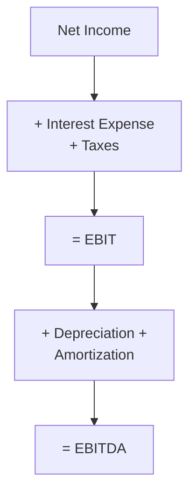

## Introduction

So, you’ve probably seen analysts or financial reporters throw around terms like “EBIT,” “EBITDA,” and a whole alphabet soup of “adjusted” or “pro forma” figures—and you’re thinking, “Why do they make it sound so complicated?” The goal of these metrics is to offer a clearer line of sight into a company’s core operating performance. But, um, as we’ll see, they can sometimes cause more confusion than clarity if we’re not careful.

Below, we’ll walk through EBIT and EBITDA, show how they’re typically calculated, and then explore the world of Non-GAAP metrics. We’ll do a little bit of compare-and-contrast with IFRS and US GAAP requirements, highlight some real pitfalls, and consider how regulators and standard-setters try to keep everyone honest.

## Understanding EBIT

EBIT stands for “Earnings Before Interest and Taxes.” It’s often described as the income from operations that a firm earns before considering:

• Financing costs (i.e., interest expenses or interest income)  
• The impact of taxes

Many folks see EBIT as a key indicator of a company’s underlying profitability. By removing interest expenses (which largely depend on capital structure) and taxes (which can vary due to jurisdiction, tax credits, or deferrals), EBIT allows you to look at the “operational engine” of the business. 

### Calculating EBIT

The simplest way to think about EBIT is:

EBIT = Net Income + Interest + Taxes

Alternatively, you could also calculate it straight from an income statement as:

EBIT = Revenue - Operating Expenses - Non-Operating Expenses (where relevant)

But be careful: some companies might place certain items (like interest income from short-term investments) in a “non-operating” line. If so, you’ll need to check whether that’s included or excluded in their reported EBIT. This is where some detective work—i.e., reading the footnotes—can be super helpful.

### A Quick Example of EBIT
Suppose a company has:
• Net Income = $50 million  
• Interest Expense = $10 million  
• Income Tax Expense = $15 million  

Then EBIT = $50m + $10m + $15m = $75 million.

That $75 million figure is presumably how much the company earned through its operations before paying the interest and the taxman.

## Enter EBITDA

EBITDA is “Earnings Before Interest, Taxes, Depreciation, and Amortization.” So, what’s the deal with removing depreciation and amortization? Well, depreciation and amortization are non-cash charges: they reduce the book value of assets over time or reflect intangible asset consumption. By stripping them out of EBIT, EBITDA intends to show something that’s closer to “cash flow from operations.” In my experience, it’s a bit like wanting to see how profitable the circus is before paying the big clown and ring maintenance bills—some folks love it because of its simplicity.

### Calculating EBITDA
EBITDA can be calculated as:

EBITDA = EBIT + Depreciation + Amortization

Or, equivalently:

EBITDA = Net Income + Interest + Taxes + Depreciation + Amortization

Keep in mind that if you’re looking at a company with substantial capital expenditures, the fact that depreciation and amortization are assumed to be “non-cash expenses” can be misleading. Sure, they’re non-cash in the current period, but the assets that drive that depreciation did cost real money at some point, and they’ll probably need replacing eventually. So, ignoring them altogether could lead you astray if you aren’t paying attention to how fast the circus tent is wearing out.

### A Quick Example of EBITDA
Revisiting our earlier example, let’s say:

• Net Income = $50 million  
• Interest Expense = $10 million  
• Income Tax Expense = $15 million  
• Depreciation = $5 million  
• Amortization of Intangible Assets = $3 million  

Then EBITDA = $50m + $10m + $15m + $5m + $3m = $83 million.

For many investors, that $83 million figure might appear more “robust” than EBIT’s $75 million. But it must be balanced against the reality of capital reinvestment.

## Visualizing EBIT vs. EBITDA

Below is a simple Mermaid diagram illustrating the flow from Net Income to EBIT, and then on to EBITDA. This might help you see which items get added back at each step:

From Net Income, we add back interest and taxes to get EBIT. Then we add Depreciation and Amortization to get to EBITDA.

## Non-GAAP Metrics: Friend or Foe?

Now let’s have a friendly chat about Non-GAAP metrics. Non-GAAP measures, also known as “alternative performance measures,” might exclude costs that management deems nonrecurring—like restructuring charges, acquisition-related costs, or intangible asset write-downs. They might promote them under labels like “Adjusted EBITDA,” “Pro Forma Earnings,” “Core Earnings,” or “Earnings before ‘special items.’” When used carefully, these can give additional context, especially if a company sells off a one-time investment or has a truly rare expense. But if I’m being honest, they can also be used to paint a rosier picture than reality.

### Being a Critical Analyzer

Regulators, such as the U.S. Securities and Exchange Commission (SEC), require companies to present a reconciliation between the Non-GAAP figure and the closest GAAP figure. IFRS-based jurisdictions, guided by bodies like the European Securities and Markets Authority (ESMA), have similar “Alternative Performance Measures” guidelines. The bottom line is: non-GAAP measures can be helpful, but you want to read that reconciliation carefully. Watch out if:

• The same “one-time” charges appear every single year.  
• The adjustments are large relative to GAAP net income.  
• The company reveals minimal transparency on what these adjustments actually represent.

## Cross-Referencing Other Concepts

For a deeper dive on nonrecurring items, see the earlier discussion in “Nonrecurring Items and Accounting Policy Changes” (Chapter 2, Section 2.3). Also, keep in mind that operating vs. non-operating classification matters—a point we explored in “Classification of Operating vs. Non-Operating Items” (Chapter 2, Section 2.6).

## Practical Example of Non-GAAP Adjustments

Imagine a software company that reports $100 million net income under GAAP. However, they highlight their own “Adjusted Net Income” of $130 million. What’s going on in that $30 million difference?

• They add back $15 million in “restructuring costs” (their second major “restructuring” in two years).  
• They add back $10 million for intangible write-offs.  
• They also add $5 million pertaining to stock-based compensation.  

Now, are these “nonrecurring” or “core” items? Maybe. But if you see them repeated each year, you might suspect a pattern. It doesn’t necessarily mean the company is doing anything unethical—it just means you want to be extra cautious when analyzing management’s portrayal of recurring vs. one-time costs.

## IFRS vs. US GAAP Nuances

Under US GAAP, guidance on Non-GAAP measures is shaped by Regulation G. IFRS, while not having an exact counterpart, places restrictions through various standards and local regulatory guidance (like ESMA in the EU). Both systems share a common principle that Non-GAAP or alternative performance measures should not be misleading. But each region has its own disclosures regarding extraordinary or unusual items. Historically, US GAAP strictly discouraged the use of “extraordinary items” classification, whereas IFRS never really used that term in the same way. Regardless of the system, the real key is consistent labeling, transparent disclosure, and unambiguous reconciliation to the nearest GAAP measure.

## Common Pitfalls and Best Practices

• Overreliance on EBITDA: While EBITDA is super popular, it can give a falsely optimistic view if a company’s capital expenditures are high.  
• Chronic “Nonrecurring” Items: If a firm calls something “nonrecurring” but it shows up constantly in disclosures, maybe it’s not that “nonrecurring.”  
• Inconsistent Definitions: Management might not define “adjusted” or “nonrecurring” consistently from period to period.  
• Ignoring Reconciliations: It’s tempting to take “Adjusted EBITDA” at face value, but always check the reconciliation to see what’s being added back or removed.  
• Lack of Operating Result Focus: EBIT is a very standard measure for comparing operational performance across companies. If you skip directly to EBITDA or Non-GAAP earnings, you might miss vital operational signals.

## A Final Word of Caution

I remember analyzing a company that had “restructuring costs” every single quarter for five quarters in a row. They insisted each charge was unique and one-time in nature. Well, maybe. But after five straight rounds, I started to question how “one-time” it really was. That’s the kind of scenario you want to flag to ensure you’re not misled by repeated adjustments to net income.

## Summary

EBIT, EBITDA, and Non-GAAP measures are all attempts to spotlight certain aspects of a company’s performance. EBIT focuses on operating results independent of capital structure and tax environment. EBITDA goes a level further by removing non-cash charges for depreciation and amortization, potentially giving you a quasi-cash flow idea. Non-GAAP metrics can offer even more specialized views of “core” earnings, but always read the footnotes and evaluate how management defines “nonrecurring,” “adjusted,” or “pro forma.” 

At the end of the day, approach these metrics with an open mind but a healthy dose of skepticism. Look for consistency, transparency, and reasonableness in how they’re calculated. After all, you want an honest gauge of operational health—not just a trick mirror.

## References

• SEC Regulation G for Non-GAAP Measures:  
  https://www.sec.gov/  
• ESMA Guidelines on Alternative Performance Measures (European context)  
• Journal of Accountancy: “The DNA of EBITDA”  
• CFA Institute: Financial Statement Analysis Readings  

## Test Your Knowledge: EBIT, EBITDA, and Non-GAAP Metrics



### Which of the following best describes EBIT?

- [ ] Net income plus depreciation expenses  
- [x] Earnings before interest and taxes  
- [ ] Net cash from operations  
- [ ] Revenue after overhead expenses, interest, and taxes  

> **Explanation:** EBIT isolates earnings from operations by excluding interest and taxes, reflecting performance regardless of capital structure or tax strategies.

### An analyst wants to calculate EBITDA. Which of the following adjustments is typically made to EBIT?

- [ ] Subtract depreciation  
- [x] Add depreciation and amortization  
- [ ] Subtract taxes  
- [ ] Add taxes  

> **Explanation:** EBITDA is derived from EBIT by adding back depreciation and amortization, which are non-cash charges.

### One major drawback of relying solely on EBITDA is:

- [x] It ignores capital expenditures necessary to maintain or grow operations  
- [ ] It includes interest expense  
- [ ] It affects the income tax obligation  
- [ ] GAAP prohibits its use  

> **Explanation:** Because EBITDA excludes depreciation (a proxy for capital expenditures), it may present an overly optimistic financial picture if a company has high maintenance costs.

### A Non-GAAP metric that removes costs labeled as "one-time" or "unusual," but appears every quarter, can signal:

- [ ] Transparent financial reporting  
- [x] Possible earnings management or mislabeling of recurring expenses  
- [ ] That the company never makes a profit  
- [ ] That depreciation expense is underestimated  

> **Explanation:** Repeated occurrences of “one-time” expenses may suggest management is consistently excluding normal operating costs from its performance measure.

### If net income is $50 million, interest expense is $10 million, income tax expense is $15 million, depreciation is $5 million, and amortization is $3 million, what is EBITDA?

- [x] $83 million  
- [ ] $60 million  
- [ ] $65 million  
- [ ] $75 million  

> **Explanation:** EBITDA = Net income + Interest + Taxes + Depreciation + Amortization = $50m + $10m + $15m + $5m + $3m = $83m.

### Which organization requires companies to reconcile their Non-GAAP performance measures to GAAP measures in the United States?

- [x] SEC  
- [ ] FASB  
- [ ] IFRS Foundation  
- [ ] World Bank  

> **Explanation:** Under SEC Regulation G, U.S. publicly traded firms must reconcile Non-GAAP metrics to the most directly comparable GAAP measure.

### Under IFRS, nonrecurring or "extraordinary" items:

- [ ] Are strictly defined as catastrophic events  
- [ ] Are prohibited from financial statements  
- [x] Are not formally defined, and must be disclosed in a transparent manner if used  
- [ ] Cannot be deducted for tax purposes  

> **Explanation:** IFRS does not explicitly define “extraordinary” items. Instead, management must ensure clarity and consistency in disclosures for unusual or infrequent transactions.

### A retailer that often cites “Adjusted EBITDA” should primarily be questioned about:

- [ ] Its dividend policy  
- [ ] The changing patterns in global currency exchange rates  
- [x] The specific items it excludes and whether they are genuinely nonrecurring  
- [ ] The timing of new store openings  

> **Explanation:** Adjusted EBITDA excludes certain items considered nonrecurring. Repeated or large exclusions might mask real operating costs.

### An investor comparing two companies’ financial performance across multiple jurisdictions would rely on EBIT primarily to:

- [x] Assess operating profitability without the effect of different tax regimes  
- [ ] Measure net cash inflows from operations  
- [ ] Evaluate only the effect of financing strategies  
- [ ] Understand the equity issuance structure  

> **Explanation:** EBIT removes the impact of taxes (which vary across jurisdictions) and financing differences, making it a more comparable measure of operating performance.

### True or False: Non-GAAP metrics are universally defined by regulatory authorities to ensure consistent usage across companies.

- [x] False  
- [ ] True  

> **Explanation:** Non-GAAP metrics, despite regulatory guidelines for disclosure, are not standardized and can differ significantly from one company to another.


