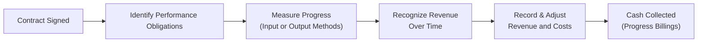

**Introduction**  
Let’s be honest, the notion of recognizing revenue for a contract that stretches months or even years can feel daunting—like reading an epic novel where twists and turns keep popping up. In my own experience analyzing long-term engineering projects, there’s a whole mix of excitement and anxiety. Will the project stay on budget? Will cash flows arrive on time? Will the revenue recognized match the actual economic reality? These questions are precisely why long-term contract accounting is such a big deal in financial analysis.

Revenue from large construction or engineering projects can span multiple reporting periods, and an analyst’s job is to ensure that the revenue on the financial statements actually reflects performance delivered to the client. That’s where IFRS 15 (Revenue from Contracts with Customers) and FASB ASC 606 come in, providing frameworks that clarify the criteria and timing for revenue recognition. And when you add installment sales to the mix, you realize how critical it is to grasp the nuances around collectibility, payment schedules, and variable considerations. This discussion explains those frameworks, highlights best practices, points out pitfalls, and even offers a few personal reflections along the way.

---

### Key Concepts and Why They Matter

#### Long-Term Contracts at a Glance  
Long-term contracts typically span more than one accounting period. Classic examples include building a bridge, developing specialized software, or constructing a piece of heavy machinery. Under older standards, there were distinct methods like the percentage-of-completion and completed contract approaches. However, IFRS 15 and ASC 606 introduced a principles-based model that focuses on performance obligations, progress measurement, and the nature of control transfer. If the customer obtains benefits as the project is built, the revenue often gets recognized “over time.” Conversely, if the customer only gains access to the finished asset on completion, it’s recognized at a point in time.

#### Installment Sales Basics  
Installment sales occur when a buyer purchases a product or service but pays over an extended period. Think about real estate transactions financed directly by the seller or big-ticket durable goods with partial payments. While IFRS 15 and ASC 606 have largely standardized revenue recognition rules, older statements or specialized markets may still show legacy methods like the installment method or the cost recovery method. Analysts need to closely review these situations to understand when and how revenue is booked.

---

### Over-Time vs. Point-in-Time Recognition

Under IFRS 15 and ASC 606, the main question is: Does the seller transfer control of goods or services to the customer over time, or all at once?

- **Over Time Recognition**:  
  This applies if any one of these conditions is met:  
  • The customer simultaneously receives and consumes the benefits as the entity performs.  
  • The entity’s performance creates or enhances an asset that the customer controls as it’s created.  
  • The entity’s performance doesn’t create an asset with alternative use, and the entity has an enforceable right to payment for performance completed to date.  

  In over-time scenarios (like many construction projects), revenue is recognized in proportion to the progress made. That can be based on inputs (e.g., proportion of costs incurred to total costs) or outputs (e.g., units delivered, milestones achieved).

- **Point-in-Time Recognition**:  
  If none of the above conditions apply (say, the seller is providing a specialized machine but retains control until the entire unit is finished), revenue is recognized at a discrete point when control passes—often signaled by title transfer, acceptance, or the right to invoice.

From an exam perspective, it’s important to correctly identify which scenario applies. A question might provide background on the project (such as partial acceptance or monthly billing) and ask you how to compute revenue using the appropriate approach.

---

### The Legacy Percentage-of-Completion Method

Before IFRS 15 and ASC 606, the percentage-of-completion method was standard for many industries. It still conceptually aligns with “over time” revenue recognition. Under the legacy approach:


\text{Revenue recognized to date} = \text{(Percentage of completion)} \times (\text{Total contract price})



\text{Percentage of completion} = \frac{\text{Costs incurred to date}}{\text{Total estimated costs}}


Or we might see output-based measures like the proportion of physical progress. While IFRS 15 doesn’t always use the exact term “percentage-of-completion,” the principle remains. If the contract meets over-time criteria, managers typically use a measure of progress to gauge how much revenue to record. So, the mechanics might look quite similar to the old approach—even though the official guidance is framed in more general terms about “performance obligations.”  

A personal anecdote: I once analyzed a contractor that recognized revenue based on labor hours alone. Problems arose when the cost of materials and subcontracts ballooned unexpectedly, distorting how much progress was really made. This mismatch triggered a huge revision to total estimated costs during the year, leading to a big catch-up adjustment. So, watch out for biases in progress measures: Using only input-based measures might be too narrow if big cost items or external dependencies exist.

---

### Variable Consideration and Performance Bonuses

Contracts often include performance bonuses (like early completion rewards) or penalties (like liquidated damages for being late). Under IFRS 15 and ASC 606, these are forms of variable consideration that must be estimated and included in the transaction price, as long as it’s “highly probable” (IFRS) or not “probable” of a significant reversal (FASB). 

Analysts should keep an eye out for unrealistic assumptions about achievements of performance bonuses and the potential for revenue reversals if deadlines aren’t met. If the financial statements show a big chunk of revenue from variable consideration, but the actual cash receipts lag or are in dispute, it can be a red flag pointing to potential over-aggressive revenue recognition.

---

### The Mismatch Between Revenue and Cash Flow

A practical tip for any analyst is to compare the revenue recognized over time with the contractor’s cash receipts (i.e., from progress billings). If the contract is truly on track, you expect a reasonable correlation between recognized revenue and invoiced amounts (adjusted for normal payment lags). A significant mismatch can indicate one of two things:

1. **Aggressive Revenue Recognition**: The company might be booking gains faster than cash is coming in. This can inflate net income in early stages.  
2. **Credit Risk or Poor Collections**: Even if the revenue recognition policies are sound, the client might be slow or unwilling to pay. That can lead to big allowances for doubtful accounts or contract assets overshadowing realized profit.  

On the CFA exam, you might see a scenario in which a firm’s reported revenue from long-term contracts has grown quickly, yet cash flow from operations lags or goes negative. They might expect you to explain the discrepancy or evaluate the risk of uncollectible payments.

---

### Installment Sales and the Cost Recovery Method

Let’s pivot to installment sales. When a property developer sells a large piece of real estate, it might allow the buyer to pay in monthly installments over five years. Older guidance recognized revenue in tandem with the cash collections (the installment method), or recognized no profit until all costs were recovered (the cost recovery method) if collectibility was uncertain.  

Under IFRS 15 / ASC 606, the basic premise still revolves around performance obligations and transfer of control. In practice:  

- If the seller has completed its primary performance obligation (delivering the property) and there’s no continuing involvement, then the revenue is recognized at the point control is transferred, even if payment extends over time—provided collectibility is probable.  
- If significant uncertainties exist about collectibility, the company might not be able to recognize the full revenue.  

Despite the modern standards, some local regulations or older financial statements may show installment or cost recovery methods. For example, in certain regulatory frameworks or specialized real estate transactions, those legacy methods remain. An analyst’s role is to verify if the approach is consistent with actual risk. If collectibility is highly questionable, the cost recovery method leads to a more conservative approach: no profit recognized until total costs have been recouped.  

---

### Real-World Example: A Hypothetical Construction Company

Imagine Atlas Builders, a company that signs a $100 million contract to construct a highway over four years. The arrangement includes milestone-based payments and a potential $3 million bonus if completed six months ahead of schedule. Here’s how IFRS 15 or ASC 606 would apply:

1. **Identify Contract and Obligations**: The contract calls for the design and construction of a highway. It’s presumably one single performance obligation if the design and build are interdependent.  
2. **Determine Transaction Price**: $100 million plus $3 million variable consideration (the bonus). If Atlas believes it’s highly probable (under IFRS) they’ll meet the deadline, they might include $2.7 million in the transaction price (some weighted probability approach). If not, they exclude or reduce the variable portion.  
3. **Allocate Transaction Price**: If there’s only one performance obligation, it all lumps into that.  
4. **Recognize Revenue Over Time**: Since the customer (the government) arguably controls and uses the in-progress work (or no alternative use plus enforceable right to payment), Atlas uses an over-time approach. Suppose they use a cost-based measure of progress.  
5. **Incur Costs and Recognize Revenue**: If after one year they’ve spent 25% of total projected costs (including revised future cost estimates), they might recognize 25% of the transaction price as revenue.  

At the end of each year, Atlas updates estimates. Changes in the total project cost or the likelihood of achieving the bonus get accounted for as adjustments to revenue in the period of change. That might cause big year-to-year swings, so as an analyst, you’d watch closely to see whether these changes are well justified.

---

### Diagram: Over-Time Recognition Flow

Below is a Mermaid flowchart summarizing key steps in over-time revenue recognition:

This flow is simplified. In reality, each step ties back to IFRS 15 or ASC 606 guidelines about variable consideration, transaction prices, and contract modifications.

---

### Analyzing Disclosure and Potential Pitfalls

1. **Progress Measurement**: Input-based measures (costs incurred) can be distorted by cost overruns. Output-based measures (units delivered, project milestones) can sometimes be artificially inflated.  
2. **Variable Consideration**: Overly optimistic assumptions about bonuses and performance incentives can inflate revenue recognition.  
3. **Contract Assets and Liabilities**: IFRS 15 requires recognition of contract assets if revenue recognized exceeds amounts billed, and contract liabilities if billings exceed recognized revenue. Keep an eye on big swings in these balances.  
4. **Collectibility**: If the buyer’s credit standing is weak or if partial payments are uncertain, recognized revenue might overstate economic reality.  
5. **Contract Modifications**: Many long-term projects get amended. Are new performance obligations created? Are existing ones replaced? The accounting can get tricky, so watch for frequent modifications that restate or reallocate the transaction price.

---

### Exam Relevance and Best Practices

In both constructed-response and item-set questions on the CFA exam, you might be asked to:

- Determine if revenue should be recognized over time or at a point in time.  
- Calculate recognized revenue and gross profit based on an updated measure of progress.  
- Evaluate the reasonableness of reported revenue in light of actual cash flows and project status.  
- Identify whether variable consideration has been appropriately included or excluded.  
- Assess the risk of misstatement if the company’s assumptions about collectibility or bonus payouts seem overly optimistic.

A strong approach is to:

1. **Confirm the contract details**—especially how control transfers.  
2. **Look for big changes in estimates** in footnotes or management discussions.  
3. **Cross-check revenue recognized** vs. progress billings and collections.  
4. **Monitor any disclaimers** about project disputes, claims, or late payments.  

---

### Practical Example: Simple Calculation

Suppose Titan Infrastructure has a $50 million contract with $5 million possible in variable consideration if they complete early. They expect total costs of $40 million. After year one, they’ve incurred $10 million of costs and expect an additional $30 million in costs, for a total of $40 million. They also believe they’ve hit certain project milestones that make a 75% chance of earning the $5 million bonus.

- Estimated total contract price = $50 million + (0.75 × $5 million) = $53.75 million  
- Costs incurred to date ÷ total expected cost = $10 million ÷ $40 million = 25% completed  
- Revenue recognized to date = 25% of $53.75 million = $13.44 million  
- Profit recognized to date = $13.44 million – $10.0 million (costs) = $3.44 million  

Any year-end adjustments would shift these numbers. For instance, if next year the engineers realize they will definitely not meet the bonus schedule, Titan must remove the variable portion from the transaction price and revise the recognized revenue accordingly.

---

### Installment Sales: A Brief Illustration

Imagine you sell real estate for $2 million but allow the buyer to pay $200,000 per year over ten years. Under IFRS 15 / ASC 606:

- If control transfers immediately and collectibility is considered probable, you record the revenue at the point of sale (i.e., $2 million) and set up a receivable.  
- Any interest component from the financing arrangement is recognized separately over time.  

Under older approaches like the installment method, you might only recognize each installment’s share of total profit each year. Or with the cost recovery method, you might not recognize any profit until you’ve recovered the cost basis. While these methods are less common under modern standards, they’re still out there in legacy statements and specialized jurisdictions.  

---

### Common Pitfalls to Avoid

- **Using Naive Progress Measures**: Relying solely on labor hours might fail to capture the real progress if materials play a huge cost role.  
- **Ignoring Contract Modifications**: A “change order” can significantly affect the transaction price or create new performance obligations.  
- **Treating Variable Consideration as Guaranteed**: Overestimating bonus revenue can lead to future write-downs.  
- **Underestimating Collectibility Risk**: If the customer is financially shaky, the revenue recognized might be artificially high.  
- **Heavy Reliance on Management Estimates**: Long-term projects often involve management’s best guess at total costs, completion dates, or project outcomes. Analysts must scrutinize these estimates closely.

---

### Putting It All Together

Long-term contract revenue recognition is about faithfully representing the economic reality of multi-period projects. IFRS 15 and ASC 606 are designed to accomplish that by focusing on performance obligations and the transfer of control. But that doesn’t mean complexities (like variable consideration, modifications, or uncertain collectibility) just go away. Installment sales add another layer of intrigue, particularly in older or specialized environments where you still see installment or cost recovery methods.

As a candidate preparing for the CFA exam—or a finance professional verifying real-world statements—you want to understand where the rubber meets the road. Watch how management measures progress, incorporates potential bonuses or penalties, and addresses collectibility. Don’t just accept top-line revenue as a done deal; cross-check it with cash flows, contract assets, and any disclaimers in the footnotes. Doing so can be the difference between a robust, reality-based analysis and a superficial read that misses brewing trouble.

---

### Further Reading and References

- IFRS 15: Revenue from Contracts with Customers, particularly the sections on over-time criteria, variable consideration, and contract modifications.  
- FASB ASC 606-10-25 and related Implementation Guidance for Long-Term Contracts.  
- CFA Institute: Official Program Curriculum, focusing on advanced readings in financial statement analysis of revenue recognition.

---

## Test Your Knowledge: Long-Term Contracts & Installment Sales Quiz



### A construction firm meets the “over time” criteria under IFRS 15. Which method is most commonly used to measure progress if labor hours and major material costs are the primary inputs?

- [ ] Cost recovery method
- [ ] Completed contract method
- [x] An input-based percentage-of-completion approach
- [ ] Installment sales method

> **Explanation:** When “over time” criteria apply, IFRS 15 and ASC 606 generally allow an input- or output-based measure of progress. Since labor hours and materials are key inputs, an input-based percentage-of-completion is often used.

### Under the new revenue recognition standards, how is variable consideration (like performance bonuses) treated?

- [ ] Excluded until the project is fully complete
- [x] Estimated upfront if it is highly probable (IFRS) or probable (ASC) that no significant reversal will occur
- [ ] Recognized only after the bonus is received in cash
- [ ] Recorded as a contingent asset with no effect on revenue

> **Explanation:** IFRS 15 and ASC 606 allow you to include variable consideration in the transaction price if it’s highly probable (IFRS) or probable (ASC) that significant reversal won’t occur.

### In an installment sale under older accounting methods, which approach typically defers all profit recognition until costs are recovered?

- [ ] Percentage-of-completion method
- [ ] Completed contract method
- [x] Cost recovery method
- [ ] Revenue when billed method

> **Explanation:** Under the cost recovery method, no profit is recognized until all costs have been recouped, reflecting a conservative approach to uncertain collectibility.

### A contractor recognizes revenue over time and notices its actual cash collections lag behind the recognized revenue. Which of the following is a potential concern?

- [ ] Excessive progress billing from customers
- [ ] Accelerated intangible asset amortization
- [ ] Overstated capital expenditures
- [x] Aggressive revenue recognition or poor collectibility

> **Explanation:** A mismatch between recognized revenue and cash collections could indicate that management is too optimistic about project completion or that the client might not pay on time.

### IFRS 15 stipulates that revenue should be recognized over time if:

- [ ] The finished good is a fungible commodity sold in an active market
- [x] The customer receives and consumes benefits as work is performed or an asset is built under the customer’s control
- [ ] Delivery is expected to occur at a single point
- [ ] The contract price exceeds $100,000

> **Explanation:** IFRS 15 states that revenue should be recognized over time if the customer simultaneously benefits from the work performed or otherwise controls the work-in-progress.

### Under IFRS 15/ASC 606, how is a contract modification treated if it significantly changes scope and price?

- [ ] It’s ignored until the contract is fully complete
- [x] It may be treated as a separate contract or as part of the original contract, depending on the nature of the modification
- [ ] Revenue is reversed for all prior periods
- [ ] Progress to date is recalculated under LIFO

> **Explanation:** A contract modification can be appended to the original contract or accounted for as a separate contract if it involves new goods/services priced commensurate with stand-alone selling prices.

### An analyst wants to verify that the percentage-of-completion measure is reasonable. Which ratio or approach could be most helpful?

- [x] Compare recognized revenue to actual progress billings
- [ ] Inspect last year’s intangible asset impairment
- [x] Examine actual vs. planned construction milestones
- [ ] Perform a discounted cash flow analysis on the entire firm

> **Explanation:** Cross-referencing recognized revenue with progress billings and actual milestone achievements helps confirm that management’s measure of completion is in line with real performance.

### Under the new standards, which best describes the main principle behind revenue recognition?

- [ ] Record revenue only upon cash collection
- [ ] Record revenue after 50% of the contract cost is incurred
- [x] Recognize revenue upon transfer of control of goods or services to a customer
- [ ] Recognize revenue when management decides it’s appropriate

> **Explanation:** Both IFRS 15 and ASC 606 emphasize recognizing revenue when or as control is transferred to the customer, not strictly upon cash collection.

### A contractor switches from an output-based progress measure (units delivered) to an input-based measure (costs incurred). What is a key risk?

- [x] Under or overestimating actual physical progress if materials have unexpectedly large or small costs
- [ ] Compliance with IFRS 16 lease requirements
- [ ] Accelerating intangible amortization
- [ ] Diminished asset turnover ratios

> **Explanation:** Switching measurement methods can misalign recognized revenue if the cost of materials isn’t indicative of actual physical progress. Sudden cost spikes might inflate the percentage of completion, leading to inaccurate revenue figures.

### Under a typical installment sale scenario, is it true that modern standards (IFRS 15/ASC 606) require revenue to be deferred until the final installment is received?

- [x] True
- [ ] False

> **Explanation:** This is a tricky question because it’s actually false under IFRS 15/ASC 606. If control has passed and collectibility is probable, revenue is recognized upfront, not deferred to the final installment. The old installment method defers recognition, but that’s generally superseded by the new approach.


