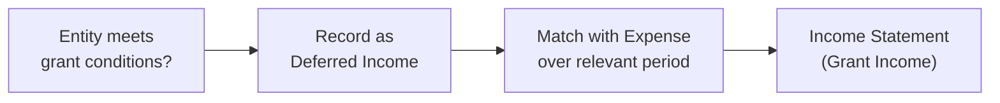
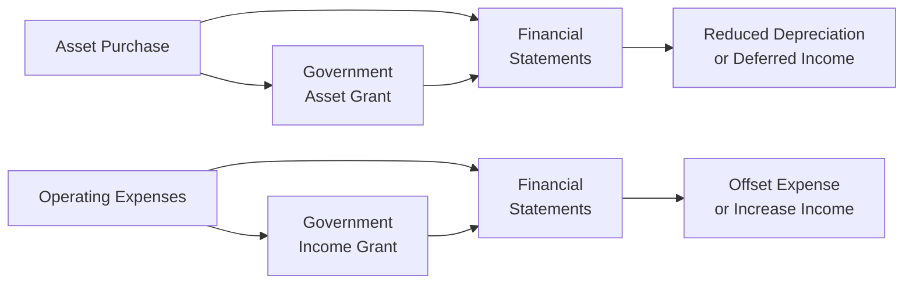

## Introduction

Have you ever come across a company claiming impressive profits, only to realize later that a big chunk of those profits stemmed from a government subsidy or a special grant program? I once invested in a small manufacturing outfit that everyone said was “minting money.” Turns out, the money was minty fresh mainly because of a temporary government grant that defrayed nearly all their labor costs. The moment that grant expired—ouch. Profits shrank to a trickle.  

Government assistance can be a serious game-changer on the income statement, influencing a company’s bottom line in ways that might not be obvious at first glance. In this section, we’ll explore how different types of government assistance—like grants, subsidies, and even certain tax incentives—impact the income statement. We’ll examine how IFRS (chiefly IAS 20) and, to a more limited extent, US GAAP treat these forms of assistance. You’ll come away understanding why an analyst must always look under the hood to see whether these programs boost sustainable operations or create a short-lived uptick in reported earnings.

## Government Assistance: IFRS vs. US GAAP

Under IFRS, the primary guidance for government assistance is IAS 20 (Accounting for Government Grants and Disclosure of Government Assistance). It states that government grants should be recognized only when:

• There is reasonable assurance that an entity will comply with the conditions attached to the grant.  
• The grant will be received (or is highly likely to be received).

So, in IFRS-land, you can’t just record government money super-early. It’s all about ensuring that the conditions (like hitting a specified job-creation target or investing in a new energy-saving facility) are actually met or highly probable.

US GAAP, on the other hand, does not have a dedicated standard for government grants in for-profit entities akin to IAS 20. Instead, it typically views these forms of assistance as gain contingencies (under ASC 450) that are recognized only when realization is assured. Certain not-for-profit entities in the US might follow ASC 958-605, but that’s more for charities and nonprofits than typical for-profit companies. As a result, practice under US GAAP for corporate grants is less prescriptive, usually leading to either offsetting the grant against the related expense or showing it as “other income” once it’s probable that the grant conditions have been satisfied.

## Types of Government Assistance and Income Statement Effects

Government assistance can appear in multiple guises—some might directly offset expense items, while others might reduce the cost of acquiring fixed assets (like subsidizing the purchase of new machinery). Let’s break down the main categories:

### Grants Related to Income  
Picture a local government that wants to boost high-tech jobs in the region, so it grants an annual subsidy to any tech firm that hires fresh graduates. These payments are typically recognized on the income statement in the same period as the expenses they are meant to defray. For instance, if you receive a labor cost subsidy for your new hires, that subsidy shows up as income to offset the staff expenses in your operating line over the same timeframe.

• IFRS (IAS 20) Approach: You match the grant in profit or loss over the periods that your related compensated costs (e.g., payroll expenses) are incurred.  
• US GAAP Approach: You typically treat it as a gain contingency. The assistance might be recorded as income when it is probable you’ll meet the conditions (and when the grant becomes realizable), often presented in “Other Income” or net with the expense line (depending on policy choice and disclosure clarity).

### Grants Related to Assets  
Another common scenario is when the government steps in to partially fund (or reimburse) the purchase or construction of a tangible asset—like a piece of advanced manufacturing equipment or a climate-friendly building. You might see these grants recognized in one of two ways:

• **Reduction of the Asset’s Carrying Value**: The asset is recorded at net cost (i.e., total cost minus the grant amount). Over time, your depreciation expense is lower, since the net asset value is less.  
• **Deferred Income**: You record the grant as deferred income on the balance sheet (a liability). Then you recognize it in profit or loss on a systematic basis over the asset’s useful life, matching with the depreciation of the asset.

IFRS (IAS 20) allows either presentation: reduce the asset’s carrying amount or present the grant as deferred income. Under US GAAP (absent specific industry rules), most companies record it as deferred income and recognize it into earnings over time—mirroring the IFRS “deferred income” approach.

### Tax Incentives  
Sometimes government assistance doesn’t arrive as a check; it’s delivered through a reduced tax rate, a credit, or some other fancy tax incentive. While these might not look like “income,” they effectively reduce tax expense. At first, it might appear that the company’s net income is higher simply because it’s paying lower taxes. However, analyzing that baseline requires an understanding of whether the low tax rate or credits are stable or might vanish if the company relocates or the government changes its strategy.

### Conditional Grants  
Governments can be super picky: “If you create 500 new jobs in the next two years, we’ll reimburse you 30% of the wages during that period.” That’s a conditional or performance-based grant. You can only recognize it once you’ve convincingly demonstrated you expect to fulfill the grant conditions. If your job growth ambitions fall flat, that fancy reimbursement might never actually appear.

### A Quick Diagram

Below is a simple flowchart illustrating how a company might approach recognizing a government grant related to income:

In a nutshell, you can’t book the grant in your income statement until it’s sufficiently certain you’ve satisfied all conditions.

## Matching Principle and Timing

One of the central ideas behind government assistance accounting is aligning the grant with the related costs or, in the case of assets, matching it with depreciation. A big reason for this approach is to prevent artificially inflated earnings in a single period. Companies can’t just lump the entire grant into the income statement at once (except in rare situations where the entire cost or conditions are recognized in a single period). The timing ensures that the grant’s effect is spread out consistently with the expense or depreciation pattern.

## Illustrative Numerical Example: Income-Related Grant

Let’s look at a quick scenario:

• Suppose ZetaTech Inc. hires new staff. The total wage cost for the year is $1,000,000.  
• The government provides a grant of $200,000 to encourage high-tech employment, but only if the firm keeps these new hires for at least 12 consecutive months and satisfies certain skill-training requirements.  
• At year-end, ZetaTech has fully met all conditions.  

How do we book this? Under IFRS, ZetaTech can recognize a $200,000 income offset to wage expenses in the current period, provided they concluded there was “reasonable assurance” they’d meet all conditions before the year-end. In practice, the company might show on its income statement:

• Wage Expense: $1,000,000  
• Government Grant: ($200,000)  
• Net Wage Expense: $800,000  

Alternatively, the company might show $1,000,000 under Wage Expense and separately show $200,000 under “Other Income—Government Grant,” achieving the same net $800,000 cost. The key is that it’s recognized in the same period as the wage costs.  

## Illustrative Numerical Example: Asset-Related Grant

Now imagine BetaRobotics invests in new robotics equipment that costs $500,000, part of which is offset by a $100,000 government grant. That $100,000 can either reduce the asset’s carrying value to $400,000 (thus depressing future depreciation) or sit on the balance sheet as “Deferred Income” and be recognized in smaller, scheduled bites over the asset’s life.

• If BetaRobotics reduces the asset’s value:  
  – Asset is recognized at $400,000.  
  – Depreciation is calculated on $400,000 (let’s say over 5 years).  

• If BetaRobotics uses a Deferred Income approach:  
  – Asset remains at $500,000.  
  – A liability of $100,000 (deferred government grant) is set up.  
  – Annually, BetaRobotics would release a portion of this $100,000 to the income statement, matching the depreciation expense on the $500,000 asset.

In both cases, total net income over the asset’s life typically ends up the same, but in any particular period, the choice affects how expenses and income are presented.

## Potential Risks and Analytical Considerations

• **Overreliance on Grants**: If a business model hinges on repeated government support, that might raise serious concerns about sustainability. Once the grant pipeline dries up, watch out for a decline in profitability.  
• **Hidden Grant Income in Operating Results**: Sometimes, companies bury large grant income in operating lines rather than disclosing it as a separate item. This can skew your impression of ongoing operating performance.  
• **Conditions and Contingencies**: A government might “claw back” funds if certain job creation or environmental standards are not ultimately met. As an analyst, confirm that management’s assumptions of compliance are well-founded.  
• **Tax Incentives**: Special tax holidays or credits need to be carefully flagged. If a company’s effective tax rate is abnormally low, is it because of a stable phenomenon (like a permanent location-based incentive) or something that’s about to expire?  
• **Cash Flow Planning**: Don’t forget to see when government funds hit the bank account. If the timing of grants is uncertain, you might see profitability without corresponding cash flow. That’s one reason to cross-check the statement of cash flows (see Chapter 4) to see if the grants have actually arrived or remain in accounts receivable.  
• **Cyclical or Political Influences**: Government grant programs can change when administrations shift or budgets tighten. If a company depends heavily on such programs, this is a red flag for future performance volatility.

## Personal Anecdote on Government Assistance

I still recall my friend who runs a small agribusiness. They got a grant for investing in sustainable irrigation equipment. She was thrilled at how quickly the financial statements showed reduced net expenses, thanks to the asset-based government support. But guess what? The government’s conditions were super strict—once they discovered she used the machinery part-time for a (completely unrelated) side project, they threatened partial clawback. It was a wake-up call to read the fine print and keep your operations fully in compliance if you don’t want to worry about giving that money back or restating your financials later.

## Case Study: A Temporary Covid-19 Wage Subsidy

During the COVID-19 crisis, many governments worldwide introduced wage subsidy programs—short-term lifelines to keep employees on company payrolls. These programs often carried conditions like: “Maintain 80% of reduced staff levels,” “Avoid large-scale layoffs,” or “Use funds solely for paying wages.” In many IFRS jurisdictions, these subsidies were recognized in the period the wages were paid, reducing wage expense. Under US GAAP, these programs typically were accounted for in a similar matching manner, though variations in classification existed (for example, some recognized the subsidy as other income, while others netted it against wage expense). Analysts had to carefully dissect coverage ratios and margin expansions to see if growth was genuine or if it simply reflected a temporary pass-through of wage costs from the government.

## Putting It All Together: Government Assistance in the Bigger Picture

Government assistance is a double-edged sword. It can be a real boon to a struggling industry or help a company ramp up an ambitious project. At the same time, it can inflate profitability in a way that’s not sustainable if the assistance runs out. Always look at footnotes for details: Are these programs short-lived? Are there strings attached? Could the government claw them back? Are they recognized in the correct period?

From an exam perspective—and for your professional judgment—understand the standard IFRS vs. US GAAP differences. IFRS’s IAS 20 is fairly direct about asset-related grants vs. income-related grants, plus the requirement that conditions be met. US GAAP may require judgment calls on contingency recognition, but the principle that you only record the grant once it’s probable and meets conditions remains consistent.

## Quick Visualization: Asset Grant vs. Income Grant Flow

In each path, the government assistance eventually lands in your financial statements but through different channels.

## Best Practices and Common Pitfalls

• **Disclosure**: Always ensure the assistance is disclosed separately, providing clarity and allowing analysts to isolate the effect.  
• **Accrual vs. Cash**: Keep an eye on whether the grant has been fully received or is still just a promise.  
• **Consistency**: If you change how you present grants from year to year (e.g., from offsetting an expense to showing it as “other income”), that’s a big red flag from a comparability standpoint.  
• **Strategic Distortions**: Watch out for managers who might time large purchases or staff expansions around government deadlines—under normal circumstances, that might be wise, but it can also artificially optimize short-term financial results.

## Conclusion

Analyzing the impact of government assistance on income underscores one of the big watchwords in financial statement analysis: sustainability. Government grants, tax incentives, and subsidies might make this year’s results look superb, but an abrupt policy change or failure to meet conditions can yank that advantage away. The next time you’re combing through a company’s statements, curious about a miraculous bump in net income, don’t forget to see whether it’s courtesy of Uncle Sam (or Uncle Parliament). If it is, just remember that—for better or worse—these grants often come with conditions, time limits, and plenty of small print to read.

## References and Further Reading

• IAS 20 “Accounting for Government Grants and Disclosure of Government Assistance”:  
  https://www.ifrs.org/  
• FASB ASC 958-605 (for certain not-for-profit scenarios)  
• ASC 450 for gain contingencies  
• Government websites detailing specific programs and compliance requirements  

---

## Test Your Knowledge: Government Assistance and Income Recognition



### Which of the following statements best describes how IFRS (IAS 20) requires recognition of a government grant?

- [ ] Government grants can be recognized immediately in the income statement upon signing the grant agreement.  
- [x] Government grants are recognized only when there is reasonable assurance the entity will comply with the conditions, and the grant will be received.  
- [ ] Government grants are always recognized as a liability, irrespective of conditions.  
- [ ] Government grants can be recognized at management’s discretion at any time.  

> **Explanation:** IAS 20 mandates that companies recognize government grants only if there is reasonable assurance that the conditions attached will be satisfied and the grant payment will be received.

### Under IFRS, how would a grant related to an asset typically be recognized?

- [ ] Entirely as income in the period it is received.  
- [x] Either by reducing the carrying amount of the asset or by crediting it to a deferred income account.  
- [ ] As a direct decrease in shareholder equity.  
- [ ] Only in other comprehensive income, not profit or loss.  

> **Explanation:** IAS 20 offers two methods: (1) reduce the asset’s carrying amount, or (2) record the grant as deferred income and systematically recognize it in profit or loss over the asset’s useful life.

### Which of the following represents a risk when analyzing government assistance in the income statement?

- [x] Overreliance on grants that may be discontinued, leading to unsustainable earnings levels.  
- [ ] Higher profit margins that become permanent even after grants stop.  
- [ ] Guaranteed stable income growth from government grants.  
- [ ] Government grants always require immediate repayment of principal.  

> **Explanation:** A key risk is overreliance on government support. Once discontinued, the company’s profitability may drop significantly.

### When is a government grant typically recognized as earned income under US GAAP?

- [ ] Once the grant agreement is announced, before any conditions are satisfied.  
- [x] When the conditions for receiving the grant are substantially met and realization of the grant is assured.  
- [ ] Only after the funds are physically received, irrespective of conditions.  
- [ ] At any point during the grant period, even if the entity might not fully comply.  

> **Explanation:** Under US GAAP, grant income is recorded when the conditions have been met (or are probable) and the grant is realizable or realized.

### How do grants related to income typically appear on the income statement under IAS 20?

- [x] They are matched to the relevant expenses, either by offsetting expenses or showing them as the same period’s income.  
- [ ] They never appear in the income statement and go directly to retained earnings.  
- [ ] They are recorded as revenue in the period after the expenses are incurred.  
- [ ] They can only be recognized after the government has audited the company’s records.  

> **Explanation:** IAS 20 stipulates that income-related grants be matched with the corresponding expenses in the same period to avoid overstating or understating net income.

### Which of the following is an example of a performance-related grant condition?

- [x] Requiring a company to maintain a certain number of employees for 12 months.  
- [ ] Giving a grant without any specific operational constraints.  
- [ ] Reducing the company’s tax rate without any job-creation conditions.  
- [ ] Letting managers handle the grant fund at their own discretion without compliance measures.  

> **Explanation:** Performance-related grants typically tie the funds to specific qualifying activities or targets, such as maintaining employment levels.

### If a company opts to record an asset-related grant by reducing the carrying value of the asset, what is the direct effect on the income statement?

- [x] Decreased future depreciation expense, thereby improving net income over the asset’s life.  
- [ ] Immediate recognition of the grant in revenue.  
- [ ] No impact on depreciation expense.  
- [ ] Significantly higher depreciation expense over the life of the asset.  

> **Explanation:** Recording the grant as a direct reduction of the asset’s carrying value lowers the depreciable base and thereby reduces future depreciation expense.

### Which statement accurately conveys the treatment of a government “tax holiday” incentive?

- [ ] It is always recorded as a direct offset to cost of goods sold.  
- [ ] It has no effect on profitability.  
- [x] It reduces tax expenses, potentially boosting net income, but must be analyzed for sustainability.  
- [ ] It immediately increases operating revenue.  

> **Explanation:** Tax holidays reduce a company’s tax liability. While they may increase net income, analysts should question how stable or temporary this benefit is.

### A company receives an asset-related government grant of $20,000. It records the full amount as deferred income and amortizes it equally over 5 years in line with the asset’s depreciation. How much is recognized as income each year?

- [ ] $0  
- [ ] $4,000 in the first year and $0 thereafter  
- [x] $4,000 each year  
- [ ] $2,000 each year  

> **Explanation:** Spreading $20,000 evenly over five years leads to $4,000 per year recognized as income, mirroring the asset’s five-year depreciation.

### True or False: Under IAS 20, it is acceptable to recognize a government grant even when the entity’s ability to meet all the attached conditions remains highly uncertain.

- [ ] True  
- [x] False  

> **Explanation:** IAS 20 requires “reasonable assurance” that the conditions will be met. If there is high uncertainty, recognition is premature.


