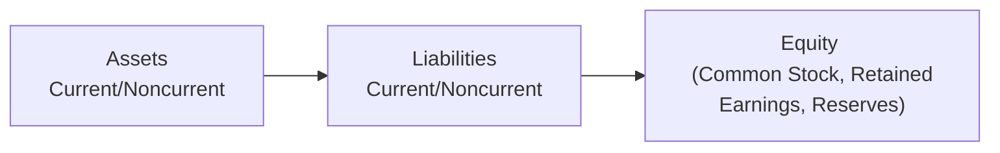

## Introduction and Overview

So, let's dive right in: the balance sheet—sometimes called the statement of financial position—offers a snapshot of a company’s financial standing at a specific moment in time. Picture it like taking a quick Polaroid of everything a company owns, owes, and how much ownership value is left over. It can look daunting at first: rows of assets, liabilities, equity, and a whole bunch of line items scattered around. I still remember the first time I saw a balance sheet in my accounting class and thought, “Oh my goodness, how do I make sense of all these numbers?” But once you understand the logic of how everything is arranged, it starts to click.

Here's the basic story the balance sheet tells:  
• Assets are the “stuff” a company owns or controls (think cash, buildings, patents).  
• Liabilities are what the company owes to parties like lenders or suppliers.  
• Equity is basically the leftover interest in the company that belongs to shareholders after all liabilities are accounted for.

The primary aim of this article is to clarify how these items are classified and presented. This classification is crucial for analyzing everything from short-term liquidity (can the company pay next month’s bills?) to long-term solvency (can the company keep operating and finance its obligations in the future?). Let’s unpack the structure step by step.

## The Structure of a Classified Balance Sheet

A classified balance sheet typically splits assets and liabilities into “current” and “noncurrent” (sometimes called “long-term”). Under many major accounting standards—like IFRS and US GAAP—this distinction is standard unless a liquidity-based format is deemed more useful (you’ll spot this approach more frequently with banks and other financial institutions).

To visualize the layout, take a peek at this simple, high-level diagram:

### Current Assets

Current assets are any resources a company expects to convert to cash or use up within one operating cycle (often one year, unless the operating cycle is longer). Typical examples include:  
• Cash and cash equivalents (like money in checking accounts)  
• Marketable securities—short-term investments easily sold  
• Accounts receivable—money expected from customers  
• Inventories—goods held for sale or raw materials in manufacturing  
• Prepaid expenses—rent or insurance paid in advance  

Set these current assets side by side, and you’ll have a good sense of how liquid (or “quick”) the company is in the immediate term. Having enough current assets is essential to cover short-term obligations like salaries, supplier bills, or short-term debt. If there’s not enough cushion here, that’s a hint of possible liquidity troubles.

### Noncurrent Assets

Noncurrent assets, also called long-term assets, are resources that provide value over multiple periods. These generally take more time to sell or convert into cash. A few common categories:

• Property, Plant, and Equipment (PPE) – Factories, machinery, computers, buildings, etc.  
• Intangible Assets – Patents, trademarks, goodwill from acquired businesses.  
• Long-Term Investments – Equity stakes or bonds intended to be held for more than a year.  
• Deferred Tax Assets (in some cases) – Tax benefits recognized but not yet used.

These long-term assets can be essential to a company’s operations. For instance, a manufacturing firm may have billions invested in advanced machinery. Analyzing their value and useful life is a major part of fundamental analysis—you want to see if these assets are generating sufficient returns.

## Liabilities: Current and Noncurrent

Liabilities are the flipside of assets, reflecting what the company owes. Like assets, liabilities get classified based on timing: short-term (current) vs. long-term (noncurrent).

### Current Liabilities

Companies must settle current liabilities within one year (or the operating cycle, if that’s longer). Common current liabilities include:

• Accounts Payable – Outstanding bills to suppliers.  
• Short-Term Debt – Loans and notes due in under a year.  
• Accrued Expenses – Wages, interest, or taxes that are owed but not yet paid.  
• Current Portion of Long-Term Debt – The part of a multi-year loan due in the next 12 months.  

One of the most-watched figures here is total current liabilities because it’s a key ingredient in measuring the company’s short-term health. If current liabilities soar above current assets, folks start wondering whether the firm faces a crunch meeting its obligations soon.

### Noncurrent Liabilities

Noncurrent liabilities are basically obligations that extend beyond 12 months (or beyond the next operating cycle). Notable examples:

• Long-Term Debt – Bonds or loans not due within the year.  
• Deferred Tax Liabilities – Tax owed in the future, often arising from differences in accounting vs. tax treatments.  
• Pension Liabilities – Obligations to employees under defined-benefit pension plans.  
• Lease Liabilities (for leases longer than one year) – Under IFRS 16 and ASC 842, many leases appear on the balance sheet.

Monitoring noncurrent liabilities helps you see a company’s solvency over the long haul. If there’s a big maturity of bonds or loan principal coming up in five years, how might that affect the firm’s future cash flows? Sometimes you’ll find details in the footnotes about interest rates, covenants (special conditions lenders impose), and the maturity schedule.

## Equity: The Residual Interest

After you subtract liabilities from assets, the remainder is equity. It indicates the shareholders’ stake in the company—though in many real-world scenarios, the “market value” of equity can differ a lot from the “book value” of equity on the balance sheet. Equity generally includes:

• Share Capital (Common and Preferred) – Funds received from shareholders.  
• Additional Paid-In Capital (APIC) – Amount paid by investors above the par value of shares.  
• Retained Earnings – Cumulative profits (minus losses) that haven’t been distributed as dividends.  
• Reserves – Could be revaluation reserves, foreign currency translation adjustments, or other comprehensive income items.  

The way these equity components are reported can provide clues about a company’s history of raising capital, paying dividends, or managing other corporate actions. For instance, large retained earnings might signal consistent profitability or infrequent dividend payouts.

## IFRS vs. US GAAP Formats

Now, under IFRS, IAS 1 (Presentation of Financial Statements) suggests a clear separation of current and noncurrent items unless a different presentation (like liquidity-based) is more relevant. In contrast, US GAAP also typically uses a classified balance sheet, with guidelines in ASC 210. While the overall structure is similar between IFRS and US GAAP, you might see differences in line item naming or grouping, but rest assured—the fundamental logic remains consistent.

Occasionally, IFRS allows a liquidity-based presentation for entities in specialized industries (banking, insurance, etc.) where grouping assets and liabilities in order of liquidity might be more intuitive than labeling them as “current” vs. “noncurrent.” This approach can show how quickly a bank or insurer can meet sudden fluctuations in cash demands or settle policy claims.

## Liquidity-Based Presentation

When a balance sheet is presented by liquidity, you might see something like this:

1. "Most Liquid Assets" first (Cash, Marketable Securities)  
2. "Less Liquid Assets" (Long-term investments, intangible assets)  
3. "Short-Term Liabilities" (e.g., short-term borrowings)  
4. "Long-Term Liabilities"  
5. "Equity"

Such ordering caters to users who care about timely settlement of obligations. But for manufacturing, retail, or other types of businesses, the conventional current vs. noncurrent classification is typically more insightful.

## Working Capital and Why It Matters

Working capital equals current assets minus current liabilities. Whenever you see that number, it’s a quick, back-of-the-envelope measure of whether the firm’s short-term resources can cover its short-term debts. Perhaps you see a company has:

• Current Assets: $120 million  
• Current Liabilities: $90 million  
→ Working Capital = $120 million – $90 million = $30 million

That $30 million slice of resources can give you clues about how well the firm can handle near-term obligations. A positive figure suggests some cushion, but if it’s too large, it might mean the firm is tying up excessive capital in unproductive ways (like letting large amounts of cash idle). A negative figure typically raises red flags about liquidity.

## Reading Between the Lines

When reading a balance sheet, you’ll often see headings like “Total Current Assets,” “Total Noncurrent Assets,” “Total Current Liabilities,” “Total Noncurrent Liabilities,” and “Shareholders’ Equity.” These help you gauge the broad shape of the company’s finances. But don’t skip the footnotes: they detail the composition and measurement basis of those line items. For instance, intangible assets might be aggregated on the face of the balance sheet, while the footnotes break down separate categories of intangible assets (like software licenses, patents, or goodwill) and how they’re amortized.

## A Quick Anecdote

I once analyzed a technology startup’s balance sheet that showed intangible assets lumped together as one big line item—nearly equal in size to total tangible assets. My initial thought was, “That’s unusual…which intangible is that big?” Sure enough, the notes revealed it was mostly software development costs capitalized under specific IFRS rules. That one footnote changed my entire perspective on the nature of the company’s most significant assets—without it, I’d have been in the dark. Always, always read the notes.

## Best Practices and Common Pitfalls

• Consistency Over Time: Check for changes in classification from one period to the next. Sometimes a firm reclassifies items without obvious explanation.  
• Operating Cycle Nuances: Certain industries, like wine production or custom manufacturing, might have lengthy operating cycles. Watch out for how that impacts current vs. noncurrent classification.  
• Noncurrent Liabilities Maturity: Even “long-term” debt becomes short-term as maturity approaches. Tracking these transitions clarifies the firm’s upcoming obligations.  
• Off-Balance-Sheet Items: Not everything sits neatly in the balance sheet. For instance, certain lease or financing structures could remain off the books if they aren’t recognized in IFRS or US GAAP statements (we’ll discuss these in Chapter 9).  

## Putting It All Together

A classified balance sheet provides a clear organizational framework—like sorting your closet into shirts, pants, and jackets, rather than letting everything pile up. You know exactly what’s short-term vs. long-term, you see how much is financed by owners vs. lenders, and you can measure your short-run liquidity and long-run solvency.

But do remember: The balance sheet is just one piece of the financial analysis puzzle. You’ll want to look at the income statement, statement of cash flows, and the accompanying notes to form a holistic view of a company’s performance and risk profile. On top of that, watch for management’s discussion and analysis (MD&A) or risk disclosures to see how management interprets these numbers.

## References for Further Exploration

• International Financial Reporting Standards (IFRS) – IAS 1 Presentation of Financial Statements  
  https://www.ifrs.org/issued-standards/list-of-standards/ias-1-presentation-of-financial-statements/  

• US GAAP – Financial Accounting Standards Board (FASB) Topic 210 Balance Sheet  
  https://fasb.org/  

• Financial Statement Analysis and Security Valuation, by Stephen H. Penman  

• Interpretation and Application of International Financial Reporting Standards, by Barry J. Epstein  

If you’re eager to deepen your knowledge further, these references provide many more details, real-world examples, and interpretations that help illuminate the nuances of balance sheet line items.

## Final Thoughts

Ultimately, the balance sheet is not just a set of numbers—it’s a structured narrative of a company’s financial posture. Understanding how assets, liabilities, and equity are classified sets the stage for deeper analyses, such as liquidity and solvency ratios, capital structure considerations, and broader strategic insights. In the next sections, we’ll dig into additional aspects of financial reporting and show you how everything connects into a cohesive story of a business’s financial health.

Anyway, that’s the gist of how to read, interpret, and classify items in a balance sheet! Ready to test your knowledge?

## Test Your Knowledge: Balance Sheet Presentation and Classification



### Which of the following items is most likely classified under current assets?
- [ ] A new manufacturing plant expected to be used for 10 years
- [x] Inventories held for sale in the next few months
- [ ] A patent with 15 years of remaining useful life
- [ ] Mortgage on a building repayable over 25 years

> **Explanation:** Current assets are those reasonably expected to be converted into cash or used up within one year (or the operating cycle, whichever is longer). Inventory typically fits into this category.

### Which item is typically reported as a noncurrent liability?
- [ ] Accounts payable
- [ ] Short-term debt
- [x] Long-term bonds payable
- [ ] Accrued wages

> **Explanation:** Long-term bonds payable mature beyond one year, thus are classified as noncurrent liabilities under both IFRS and US GAAP.

### Under IFRS, a liquidity-based presentation of the balance sheet (instead of current vs. noncurrent) is most likely used when:
- [ ] A company has a short operating cycle
- [x] Such a presentation provides more relevant information
- [ ] The company has minimal liabilities
- [ ] The company is in the manufacturing sector

> **Explanation:** IFRS permits a liquidity-based balance sheet if it gives more relevant information (e.g., banks or insurance companies), rather than defaulting to the typical current/noncurrent classification.

### The equity section of the balance sheet typically includes:
- [x] Share capital, additional paid-in capital, and retained earnings
- [ ] Accounts receivable and marketable securities
- [ ] Short-term debt and accrued liabilities
- [ ] Long-term debt and deferred tax liabilities

> **Explanation:** Equity is the owners’ residual interest and generally comprises share capital, additional paid-in capital, retained earnings, and potentially other reserves.

### Which of the following is true regarding working capital?
- [ ] Working capital is total assets minus total liabilities.
- [x] Working capital is current assets minus current liabilities.
- [ ] Working capital is only relevant under US GAAP, not IFRS.
- [ ] Working capital includes intangible assets and equity reserves.

> **Explanation:** Working capital is calculated by subtracting current liabilities from current assets. It measures short-term liquidity.

### Deferred tax liabilities typically appear:
- [x] Under noncurrent liabilities
- [ ] Under current liabilities
- [ ] Within equity
- [ ] Only as off-balance-sheet items

> **Explanation:** Deferred tax liabilities generally represent taxes that will become payable in future periods, placing them under noncurrent liabilities in most frameworks.

### Under IFRS, intangible assets would usually be listed:
- [ ] Only as current assets
- [ ] Only in off-balance-sheet disclosures
- [x] Under noncurrent assets
- [ ] Under equity capital

> **Explanation:** Intangible assets (like patents and trademarks) provide value over multiple periods, classifying them as noncurrent assets.

### Which of the following is not typically found in the equity section?
- [ ] Retained earnings
- [ ] Share premium
- [ ] Reserves
- [x] Accounts payable

> **Explanation:** Accounts payable is a current liability, not a component of shareholders’ equity.

### If a firm’s operating cycle is longer than one year:
- [x] Current assets may include those turning over within the operating cycle
- [ ] The firm is not allowed to have any current liabilities
- [ ] The firm must list all assets as noncurrent
- [ ] All liabilities become noncurrent

> **Explanation:** When a company’s operating cycle exceeds one year, the definition of “current” may extend to items recoverable or used within that operating cycle.

### True or False: Under certain circumstances, a company can choose a liquidity-based presentation rather than a classified balance sheet if it deems that presentation more relevant.
- [x] True
- [ ] False

> **Explanation:** IFRS allows for a balance sheet presentation based on liquidity if that approach is deemed to give more useful information than a strictly classified approach.


