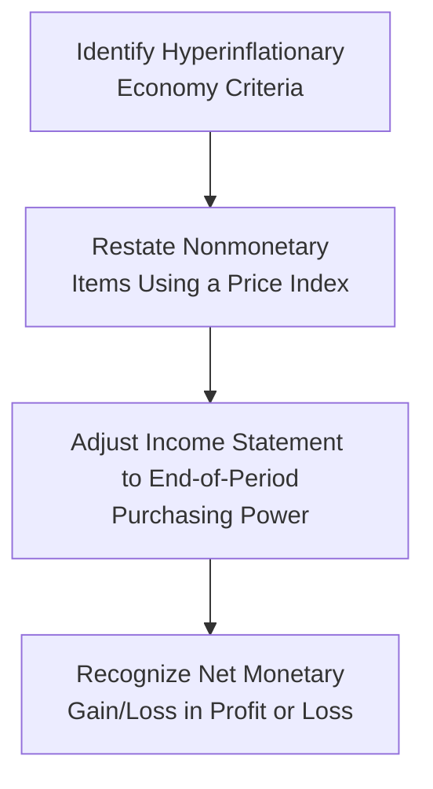

## Understanding High-Inflation and Hyperinflation

High inflation can wreak havoc on a company’s balance sheet. When I was first learning about financial reporting (years back), I heard stories from colleagues who worked in countries where prices rose so fast you literally saw store owners changing price tags every week—or sometimes daily. It was shocking to imagine that the face value of banknotes could become almost meaningless in such a short time. In these hyperinflationary environments, the historical cost of assets and liabilities can become, well, outdated faster than you’d believe. 

Under International Financial Reporting Standards (IFRS), hyperinflationary economies are typically defined by IAS 29 Financial Reporting in Hyperinflationary Economies. Meanwhile, under US GAAP, certain provisions require the use of remeasurement methods similar to the temporal method in foreign currency translation for entities operating in hyperinflationary economies. Both sets of rules aim to preserve the economic substance of transactions in an environment where price levels can change dramatically. 

## IFRS Fundamentals: IAS 29 Restatement

When an economy qualifies as hyperinflationary under IFRS, companies must restate their financial statements using a general price index. This restatement is meant to ensure that the information presented keeps up with the changing purchasing power of the currency.

• Identifying Hyperinflation: IFRS generally regards an economy as hyperinflationary if it has experienced cumulative inflation of around 100% over three years—or if other qualitative indicators exist (such as widespread adoption of a foreign currency for day-to-day transactions).  
• Restatement of Nonmonetary Items: Tangible and intangible fixed assets, inventories, and other nonmonetary items are adjusted (or “updated”) to reflect current price levels, typically measured by a general price index. If a piece of machinery cost 1,000 currency units two years ago, it might be recorded at 2,500 currency units today if that reflects the new price level.  
• Monetary vs. Nonmonetary Distinction: Monetary items (like cash, receivables, and payables) are not restated, because they are already denominated in units of currency. The net monetary position (monetary assets minus monetary liabilities) frequently results in a gain or loss recognized in the income statement, reflecting changes in the purchasing power of those monetary amounts.  
• Effect on Income Statement: In high-inflation environments, revenue and expenses are also restated so that everything is reported in “end-of-period” purchasing power. A separate line item typically reveals the gain or loss from holding monetary items while inflation rages on.  

It’s a bit like measuring your groceries in “today’s dollars” rather than last year’s dollars. If you don’t do this, your financial statements might show a rosy profit when in fact, thanks to inflation, your purchasing power hasn’t improved at all.  

## Monetary Gains and Losses in Hyperinflation

When a company holds net monetary assets (like lots of cash or receivables) during hyperinflation, it risks losing purchasing power as prices climb. Conversely, if the company carries net monetary liabilities (like payables or debt), it might show an inflation-induced gain—since the amount owed is effectively eroded by inflation.  

In IFRS-restated financials for a hyperinflationary economy, this net monetary gain or loss appears in the income statement, allowing users of the financials to see how much value, in real terms, the company either lost or gained due to changes in the currency’s purchasing power.

Below is a simplified formula—expressed in KaTeX—for highlighting the general idea:

$$
\text{Net Monetary Gain/Loss} \;=\;\text{(Net Monetary Assets or Liabilities)}\;\times\;
\left(\frac{\text{CPI}_{\text{end}} - \text{CPI}_{\text{begin}}}{\text{CPI}_{\text{begin}}}\right).
$$

Though this isn’t an official IFRS formula, it helps conceptualize how holding a net monetary position in an environment with drastically rising prices might create a noticeable impact on the bottom line.  

## US GAAP: Remeasurement in Hyperinflationary Economies

US GAAP doesn’t have a single standard explicitly labeled “hyperinflation accounting,” but it requires certain procedures for foreign entities operating in hyperinflationary economies. Usually, these rules are found under ASC 830 (Foreign Currency Matters). The foreign financial statements are first remeasured as if the US dollar were the entity’s functional currency, using the temporal method.  

• Temporal Method Basics: Under the temporal method, monetary assets and liabilities are remeasured at current exchange rates, while nonmonetary items may remain at historical cost denominated in US dollars. This approach is meant to reduce the distortion that arises if the local currency is in a tailspin.  
• Remeasurement Gains and Losses: The difference between the remeasured amounts and the prior-book values goes straight into the income statement, not into other comprehensive income (OCI).  
• Practical Implication: If a Latin American subsidiary, for example, starts operating in a currency whose inflation rates are off the charts, US GAAP requires remeasurement so that the parent’s consolidated statements reflect a more stable currency (the US dollar).  

## Step-by-Step IFRS Restatement Process

Below is a quick diagram (using Mermaid.js) to help visualize the IFRS restatement steps under hyperinflation:

As you can see, it all starts with identifying high-inflation conditions. Companies then adjust historical cost items, make sure revenue and expense accounts are reflected in end-of-period purchasing power, and finally record the monetary gain or loss.

## Example of Restatement for a Nonmonetary Asset

Let’s do a quick example that’s reminiscent of real life. Imagine a piece of equipment purchased for CU 400 (Currency Units) in Year 1. By the end of Year 2:

• The company’s local currency has experienced 50% inflation from the time of purchase to the end of Year 2.  
• Under IAS 29, that piece of equipment might now be restated to CU 600 (because 400 × 1.50 = 600).  

If the company does not restate, it might still report it at CU 400 on the balance sheet, which totally ignores that the real value of the currency dropped. Analysts would then be scratching their heads, trying to reconcile the company’s capital investments with the actual purchasing power.  

A simple representation of how the item is restated:

| Item                     | Historical Cost | Inflation Factor | Restated Amount |
|--------------------------|-----------------|------------------|-----------------|
| Equipment (Purchased Y1) | 400 CU         | 1.50            | 600 CU          |

By restating, you get a better sense of the “real value” of that item at the current price level.

## Analysis of Balance Sheet Ratios

High inflation can distort various ratios:

• Liquidity Ratios: If large amounts of cash and receivables are on hand, inflation can significantly erode these assets. A ratio like the current ratio may overstate real liquidity.  
• Leverage Ratios: If monetary liabilities go unadjusted in a hyperinflation environment, the debt level might appear higher in nominal terms but is actually less burdensome in real terms.  
• Profitability Ratios: Net income can be artificially inflated (or deflated) by gains (or losses) on the net monetary position. Understanding the separation of operating profits vs. inflation-related gains is crucial to see the true operating performance.  

## When Does Restatement Start?

A sticky point is the timing of restatements. IFRS indicates that once an economy is deemed hyperinflationary, companies should restate from the beginning of the accounting period when hyperinflation is identified, or from the date the entity started operating in that economy (if it only recently began).  

Management might have some discretion about exactly when they decide the criteria are met, which can lead to strategic timing. That’s why it’s vital for analysts to examine disclosures closely. If you ever see an abrupt jump in asset valuations or equity, it might be because management recognized (or delayed recognizing) hyperinflation.  

## Challenges and Pitfalls

• Delayed Recognition of Hyperinflation: Firms may postpone labeling an economy as hyperinflationary to avoid the hassle of restatement. This can create misleading financial statements in the interim.  
• Availability of Reliable Indices: Some hyperinflationary economies lack trustworthy price indices. This can pose huge data challenges.  
• Complexity for Multi-Currency Companies: If a firm operates in multiple hyperinflationary environments, ensuring consistent restatement across all subsidiaries can be tricky.  
• Distinguishing Operating Gains vs. Inflation Gains: Analyzing real performance means adjusting out the net monetary gains or losses that appear on the income statement.  

I remember analyzing a company that reported massive net income growth, and the CEO was all too happy to talk about operational excellence. But guess what? Once we stripped out the inflation-related gains from net liabilities it held, the real operating result was nearly flat. Talk about an awkward earnings call!  

## Best Practices for Analysts

• Scrutinize Disclosures: Look for how (and when) management applies IAS 29 or the US GAAP hyperinflationary guidance.  
• Track Net Monetary Position: Identify if the company is a net holder of monetary assets or liabilities, to see whether it’s likely to show gains or losses from inflation.  
• Adjust Comparative Periods: IFRS requires restating comparative figures as well, so ensure all periods are on the same inflation-adjusted basis.  
• Consider Economic Substance: If local currency information is no longer reliable, see if management is presenting data in a more stable currency or using alternative performance metrics.  

## Practical Insights

• Hedge Where Possible: In real life, companies often invest in stable foreign currencies or intangible assets to hedge their inflation exposure.  
• Evaluate Cash Management: If you know the currency is losing purchasing power, you don’t want to be sitting on large local-currency bank balances.  
• Look for Price-Adjusting Mechanisms: In some industries—like utilities or telecoms—contracts might contain inflation-clauses that reset prices periodically, helping the company keep up with inflation.  

## Further Reading and References

• IAS 29 Financial Reporting in Hyperinflationary Economies:  
  https://www.ifrs.org  
• FASB guidance on hyperinflationary economies in ASC 830 Foreign Currency Matters:  
  https://asc.fasb.org  
• Bernstein, S. A., “Accounting for Inflation in Financial Statements.”  

And honestly, if you want real-life context, try reading about countries that have gone through periods of hyperinflation—there are plenty of historical case studies to bring these concepts to life.  

--------------------------------------------------------------------------------------------

## Test Your Knowledge: Hyperinflation and Balance Sheet Analysis



### Which IFRS standard specifically addresses financial reporting in hyperinflationary economies?

- [ ] IAS 1
- [x] IAS 29
- [ ] IAS 16
- [ ] IFRS 15

> **Explanation:** IAS 29 Financial Reporting in Hyperinflationary Economies provides guidance on restating financial statements in hyperinflationary environments.

### Under IFRS hyperinflation accounting, how are nonmonetary items typically adjusted?

- [x] They are restated using a general price index.
- [ ] They remain at historical cost.
- [ ] They are measured at fair value only if inflation exceeds 200%.
- [ ] They are solely written off as expenses.

> **Explanation:** Nonmonetary items (like fixed assets) are restated based on a general price index to maintain their value in current purchasing power terms.

### Which of the following items is considered a monetary item under IAS 29?

- [x] Trade payables
- [ ] Inventories
- [ ] Machinery
- [ ] Goodwill

> **Explanation:** Monetary items are those with a fixed nominal cash flow, such as payables, receivables, and cash.

### If a company has a large net monetary liability position in a hyperinflationary economy, what is the expected impact on its restated statements?

- [ ] It will show a net loss.
- [ ] It will offset the liability to zero.
- [ ] It will record higher future depreciation expense.
- [x] It will report a monetary gain.

> **Explanation:** When liabilities exceed monetary assets in a hyperinflationary environment, the real value of the company’s debt erodes, producing a monetary gain.

### Under US GAAP, which currency translation method is commonly used for entities in hyperinflationary economies?

- [x] Temporal method
- [ ] Current rate method
- [ ] All-current method
- [ ] None of the above

> **Explanation:** In hyperinflationary contexts, US GAAP generally requires using the temporal method to remeasure the local currency financials into the reporting currency.

### What typically happens to comparative financial statements under IFRS once an economy is declared hyperinflationary?

- [x] They are also restated to reflect constant purchasing power.
- [ ] They remain unadjusted, to highlight the transition.
- [ ] They are presented in an entirely separate section.
- [ ] They must be included only after the first period of hyperinflationary restatement.

> **Explanation:** IFRS calls for comparative figures to be restated as well to ensure consistency and comparability across periods.

### What major challenge might companies face when restating financial statements in hyperinflationary economies?

- [ ] Overly simplified IFRS guidelines
- [x] Lack of reliable price indices for adjustment
- [ ] Inability to track monetary items
- [ ] The requirement to completely switch to cash accounting

> **Explanation:** One of the biggest hurdles is the availability of a credible general price index. Without one, restatement is difficult.

### Which of the following best describes the distinction between monetary and nonmonetary items?

- [x] Monetary items have fixed nominal cash flows; nonmonetary items do not.
- [ ] Monetary items appreciate in value, while nonmonetary items depreciate.
- [ ] Nonmonetary items include short-term assets; monetary items do not.
- [ ] Nonmonetary items are intangible, while monetary items are tangible.

> **Explanation:** Monetary items’ nominal value is fixed, while nonmonetary items (like property, plant, equipment) do not have fixed nominal cash flows.

### Under IFRS hyperinflation guidelines, how are gains or losses on net monetary items recognized?

- [ ] In other comprehensive income
- [ ] Deferred until the entity ceases operations
- [x] In profit or loss
- [ ] Offset against retained earnings

> **Explanation:** The net monetary gain or loss from holding or owing monetary items in hyperinflationary conditions is booked directly to the income statement.

### True or False: A firm can choose to delay restating its financial statements until it is more convenient if local inflation spikes unexpectedly.

- [x] True
- [ ] False

> **Explanation:** While not in the spirit of IFRS, there is a degree of judgment in determining when hyperinflation actually begins. Some firms may delay declaration, though auditors and regulators typically scrutinize such decisions closely.


