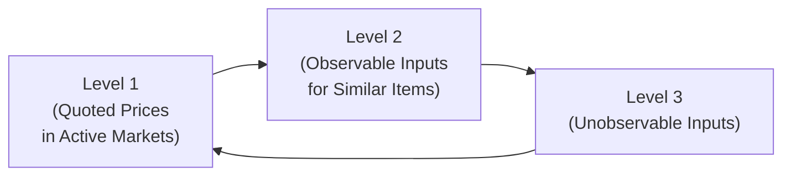

## Overview and Key Concepts

Fair value measurement plays a crucial role in how companies report and analyze their balance sheet items. It’s all about determining an asset or liability’s exit price—what you would receive or pay if you were to sell an asset or transfer a liability under normal market conditions at the measurement date. Under both IFRS 13 and US GAAP (ASC 820), fair value measurements follow a three-level valuation hierarchy, each reflecting varying degrees of data availability and subjectivity in determining fair value.

• Level 1 relies on well-defined, quoted market prices in active markets.  
• Level 2 uses observed inputs that are not quoted prices for the exact item but are based on similar assets or liabilities.  
• Level 3 employs unobservable inputs, often requiring more assumptions and discretion on management’s part (hello subjectivity!).

In practice, identifying the appropriate level can be somewhat tricky—especially when your asset has sporadic trading activity or sits somewhere in between an active market and a nearly invisible one. By the time you wrap up your analysis of fair value disclosures, you’ll have a better sense of how market data availability might affect the confidence you have in any reported valuation.

Anyway, let’s walk through each fair value hierarchy level and see how it might look in real-world examples.

## Level 1: Fair Value from Quoted Market Prices

Level 1 fair value measurements use quoted (unadjusted) prices in active markets for identical assets or liabilities. Think liquid equity shares on a major exchange. If you own a share of a company that’s traded daily on the NYSE, you can simply take that day’s closing price and multiply it by how many shares you hold. Boom, you have the fair value. This is often considered the gold standard of valuation because you have direct, timely market data that’s readily observable.

### Example: Publicly Traded Equity Shares
Suppose your firm owns 10,000 shares of a large technology company that trades on the NASDAQ. On the balance sheet date, the shares close at $150 each. The fair value is straightforward:  
• 10,000 shares × $150 = $1,500,000

The key advantage here is minimal subjectivity. Since you have a direct market quote, you don’t need to do fancy calculations or guess at potential discount rates. One super practical note: If you’re analyzing a company with heavy Level 1 assets, it usually implies they’re holding a lot of liquid, easy-to-value instruments, which might reduce your concerns about random management assumptions creeping in.

## Level 2: Valuation Using Observable Inputs (Other Than Level 1)

Level 2 fair values leverage inputs other than quoted prices for the exact asset or liability. The company might rely on comparable bond prices, yield curves, or other market-corroborated data for a similar financial instrument.

### Example: Corporate Bond Using Matrix Pricing
Let’s say your firm holds a corporate bond with a face value of $1,000,000. You have a decent idea of its credit rating, maturity, and coupon. However, this particular bond didn’t trade yesterday, so there’s no direct last trade price.

To handle that, you might use a matrix pricing model, which basically looks at observable bond data from similar issuers or bonds with comparable credit risk and maturity. You observe:  
• Similar bond A trades at 102% of par with a yield of 4.5%  
• Similar bond B trades around 101% of par with a yield of 4.7%  
• Your bond is slightly riskier than bond A and roughly on par with bond B.

Based on these comparables, you might estimate your bond’s fair value at somewhere around 101.5% of par. Thus, the fair value would be:  
• 1,000,000 × 101.5% = $1,015,000

This approach is more subjective than Level 1 but still anchored by a decent volume of observable market data. You might have to fiddle with some yield assumptions, but you can defend your approach by referencing those similar assets.

## Level 3: Significant Unobservable Inputs

Level 3 is like the wild west of fair value measurement. You’re using unobservable inputs (i.e., data that’s not readily gleaned from the market) and making judgments or estimates based on your internal models and assumptions. Management must disclose which valuation technique they used—common examples include Discounted Cash Flow (DCF) or Net Asset Value (NAV)—along with any significant unobservable inputs (growth rates, discount rates, projected margins, and so on).

### Example: Private Equity Investment in a Startup
Imagine your firm invests in a startup that develops AI-driven medical devices. There’s no active market for these shares, so you can’t just go check yesterday’s quote like you might for a publicly traded company. You choose a DCF approach to project the startup’s cash flows over the next 10 years. But you know how it is with startups: forecasting is part science, part guesswork. You might incorporate:  
• A forecast of revenue growth from zero to $10 million in the first five years.  
• An expected terminal value based on an exit multiple of EBITDA or a hypothetical acquisition scenario.  
• A discount rate reflective of the high risk associated with early-stage biotech or medtech ventures—maybe 15%–30%, depending on your assumptions.

From these inputs, you might come up with a present value that puts the total equity value at, say, $25 million. Your stake is 10%, so you record $2.5 million as the fair value. But you’ll also provide disclosures about how a 1% change in the discount rate or a deviation in projected cash flows by 10% could alter that valuation by, let’s say, hundreds of thousands of dollars.

Level 3 valuations inherently invite a lot of scrutiny from analysts and regulators because of the healthy dose of subjectivity. If you’re analyzing a company, it’s wise to read the footnotes describing how they pinned down those DCF assumptions. You might spot potential red flags such as overly optimistic revenue forecasts or discount rates that appear out of line with industry norms.

## Why Fair Value Hierarchy Matters

There’s a reason IFRS 13 and ASC 820 require disclosures about each level of fair value measurement. When valuations rely on unobservable inputs (Level 3), the risk of error, bias, or outright manipulation is significantly higher. As an analyst, you want to gauge how much of a company’s reported fair value depends on market reality versus how much is based on management’s best guess.

### A Quick Personal Anecdote
I remember a particular instance (well, more than one, actually!) analyzing a private equity fund that held a handful of small startups. The footnotes said the valuations were “based on net asset value.” But I noticed year-over-year that the discount rate used for certain Tier-2 biotech holdings hadn’t budged at all, even though the industry had seen a bunch of changes, including regulatory shifts and increased competition. That was a red flag for me: Either the company had perfect foresight or they’d gotten a bit complacent in updating their assumptions. So for me, this was a gentle reminder to dig deep into those Level 3 disclosures.

## Commonly Used Valuation Techniques

### Matrix Pricing
Often used for bonds. You build a “matrix” of comparable bond yields and prices, adjusting for differences in credit rating, maturity, or coupon. Then you interpolate or weigh the data to arrive at your bond’s estimated fair value.

### Discounted Cash Flow (DCF)
Projects future cash flows and discounts them back to the present. Especially relevant for private companies, intangible assets, or investment property where you don’t have direct market quotes. The discount rate can be derived using models like CAPM (Capital Asset Pricing Model), or from typical industry cost of capital references like Ibbotson’s Valuation Handbook.

### Net Asset Value (NAV)
You sum up the fair value of underlying assets and then subtract any liabilities. Commonly seen in private equity funds, real estate investment trusts (REITs), or other investment vehicles. This method, though, can incorporate a lot of Level 2 or 3 data if the underlying assets themselves don’t have active markets.

### Exit Multiples
You assume a future sale at some multiple of revenue, EBITDA, or net income. This approach is used in private company valuations or in M&A scenarios. You pick the multiple by referencing observed transaction data from comparable companies, typically adjusting for size, growth rates, and risk profiles.

## Disclosures and Sensitivity

Under IFRS 13 and ASC 820, companies must disclose:  
• Valuation technique used and reasons for choosing it.  
• Significant inputs (especially unobservable ones for Level 3).  
• Changes in valuation method from prior periods, if any.  
• Sensitivity: How changes in unobservable inputs might affect fair value.  

The last point is huge for analysts, because it reveals the potential range of outcomes. If a 1% shift in the discount rate changes your valuation by 20%, that’s a big sign that shareholders and stakeholders should keep an eye on those assumptions.

## Diagram: Overview of Fair Value Levels

Below is a simple Mermaid diagram illustrating how different levels of fair value measurement align based on data availability.

• Level 1: Direct market quotes, minimal subjectivity.  
• Level 2: Market-based but involves some adjustments.  
• Level 3: Heavily reliant on management assumptions.

## Potential Challenges and Pitfalls

• Management Bias: Even in Level 2 measurements, the process of selecting comparable bonds or adjusting for credit risk can be subjective.  
• Illiquidity: Thinly traded assets might appear to be Level 1 at first, but upon closer inspection, they may more properly fit Level 2 or even Level 3.  
• Earnings Manipulation: Level 3 opens the door to creative forecasts. By tweaking discount rates, growth projections, or exit multiples, management can influence reported fair values.  
• Audit Challenges: Auditors need to assess the reasonableness of assumptions for Level 3. That can lead to “critical audit matters” disclaimers in the auditor’s report (see also Chapter 1.11 regarding Critical Audit Matters and Auditor Communication).

## Implications for Analyst Interpretation

• Understand the Mix: A balance sheet heavy in Level 3 assets might warrant extra scrutiny—even if the reported net asset value looks strong, a big chunk of that figure might sit on shaky or highly subjective ground.  
• Validate Disclosures: Always read the footnotes for changes in valuation techniques from year to year. A big switch can be a sign of either evolving best practices or possible gaming of the numbers.  
• Sense-Check the Assumptions: If you see a discount rate or exit multiple that’s surprisingly low (or high) relative to the industry norm, it might be too good to be true.  
• Comparative Analysis: Compare a firm’s approach to fair value measurement with its peers. If everyone else in the sector is updating certain assumptions, but your target firm isn’t, that’s worth asking about.

## Exam Tips

• Be prepared to interpret financial statement data where assets or liabilities are classified under Levels 1, 2, or 3.  
• In item sets, you may see footnote disclosures that describe how management calculated fair value. You might be asked to evaluate the reasonableness of assumptions or identify potential red flags.  
• Constructed-response questions (especially at advanced levels) could involve justifying or criticizing a firm’s classification of certain assets in one level versus another.  
• Time management is key. If the exam question provides you with multiple assets and asks you to identify the proper classification under IFRS 13, aim to quickly recall the definitions of each level and match them to the details provided.

## References and Further Reading

• IFRS 13, “Fair Value Measurement”  
• ASC 820, “Fair Value Measurement”  
• “Valuation Handbook,” by Roger Ibbotson, for discount rate assumptions and cost of capital data  
• Publicly available annual reports of large financial institutions, which often provide illustrative fair value disclosures for complex assets  
• PRIIPs (Packaged Retail and Insurance-based Investment Products) disclosures, for alternative assets or structured products  

Looking into these materials can give you a sense of how real-world companies handle fair value measurement, especially when it comes to disclosing unobservable inputs and sensitivity analyses.

## Test Your Knowledge: Fair Value Measurement Hierarchy



### Which of the following is a classic example of a Level 1 measurement?

- [ ] A nontraded private equity stake using discounted cash flow.
- [x] A share of large-cap equity actively traded on an exchange.
- [ ] An interest rate swap valued using observable swap curves.
- [ ] A lightly traded corporate bond valued using matrix pricing.

> **Explanation:** Level 1 measurements draw directly from unadjusted quoted prices in active markets for identical assets or liabilities. Actively traded public stock is the hallmark illustration of Level 1.

### An analyst is reviewing a company’s fair value disclosures and sees “matrix pricing” employed for a bond. This approach typically falls under:

- [ ] Level 1.
- [x] Level 2.
- [ ] Level 3.
- [ ] None of the above.

> **Explanation:** Matrix pricing uses comparable market data for similar instruments, making it a Level 2 approach since you have observable but indirect inputs.

### Which of the following best describes the primary hallmark of Level 2 type valuation?

- [ ] Extensive reliance on unobservable data and assumptions.  
- [x] Use of observable inputs for similar, not identical, assets and liabilities.  
- [ ] Risks of minimal subjectivity and minimal management bias.  
- [ ] Quoted prices for identical assets in an active market.

> **Explanation:** Level 2 uses observable inputs (e.g., interest rates, yield curves, comparables) but not direct quotes for the exact asset or liability being valued.

### A company with extensive Level 3 assets is likely to:

- [x] Provide more detailed disclosures about its valuation assumptions.  
- [ ] Minimize disclosures because fair value is easy to observe.  
- [ ] Rely primarily on unadjusted quoted prices for identical assets.  
- [ ] Face minimal scrutiny from auditors or analysts.

> **Explanation:** Because of the subjectivity inherent in Level 3, these firms must offer more footnote detail about unobservable inputs and their sensitivity to changes.

### A bond with a known credit rating but no recent trade data:

- [x] Might be valued with Level 2 inputs via comparable bond prices.  
- [ ] Must be valued using unobservable inputs.  
- [ ] Always defaults to Level 1 pricing.  
- [ ] Necessitates a multi-year DCF approach.

> **Explanation:** Absent a direct quote, there is still observable market data from similar bonds to support a Level 2 classification.

### Under IFRS 13, the sensitivity analysis for Level 3 disclosures should:

- [x] Show how fair value would change if significant unobservable assumptions change.  
- [ ] Be omitted because it is proprietary business information.  
- [ ] Only be disclosed when an external auditor challenges management’s assumptions.  
- [ ] Be heavily redacted to protect intellectual property rights.

> **Explanation:** IFRS 13 requires that significant unobservable inputs and the potential variability in fair value be disclosed, informing users about the valuation’s sensitivity to changes.

### In practice, an “exit multiple” might be used to:

- [x] Project the potential future selling price of a private company or asset.  
- [ ] Determine the exact discount rate used in a matrix pricing model.  
- [x] Estimate the terminal value in a DCF for an illiquid asset.  
- [ ] Eliminate the need for management assumptions in early-stage valuations.

> **Explanation:** Exit multiples are common in private equity or M&A valuations and can determine the value at the end of the holding period, providing a key input for the DCF model.

### A big shift from Level 2 to Level 3 classification for a particular asset could signal:

- [x] Changes in market activity or liquidity, making the asset less observable.  
- [ ] A reduction in management judgment.  
- [ ] An increased availability of quoted prices.  
- [ ] That the company is subject to fewer disclosure requirements.

> **Explanation:** Moving to Level 3 typically occurs when active market data diminishes, forcing reliance on unobservable inputs.

### An asset that trades frequently and has direct, up-to-date prices for identical items is:

- [x] Level 1.  
- [ ] Level 2.  
- [ ] Level 3.  
- [ ] A hybrid between Level 1 and Level 2.

> **Explanation:** Perfect example of Level 1: identical assets, actively traded, minimal subjectivity.

### True or False: If a company values an asset using discounted cash flow, it always qualifies as Level 3.

- [x] True
- [ ] False

> **Explanation:** DCF often involves significant unobservable inputs—like long-term growth rates and discount rates—making it a Level 3 measurement in most cases.



---

Feel confident about sorting your assets by fair value hierarchy? Great! Keep an eye on those disclosures for potential red flags and be especially cautious with valuations that rely on layers of assumptions. Mastering these distinctions can strengthen both your financial statement analysis skills and your potential exam performance. Good luck!
