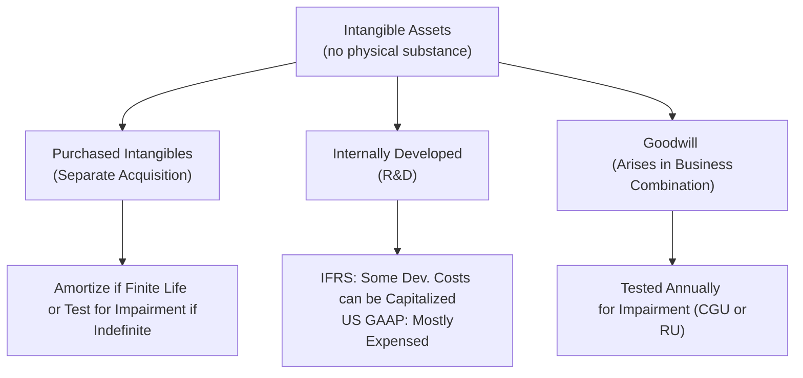

## Overview

Intangible assets and goodwill lie quietly on many companies’ balance sheets, yet they can pack a significant punch in shaping valuation and financial statements. These assets can be the secret sauce behind a company’s competitive advantage—think about a stylish brand name or a brilliant patent that sets a firm apart. But they can also be one of the trickiest items to analyze. The good news is that once you get the hang of how intangible assets and goodwill are recognized, measured, and written down, you’ll be in a better position to spot red flags and unravel hidden truths in financial reports.

In this section, we’ll dig into key concepts, including how intangible assets differ from tangible assets and how goodwill is created, tested, and potentially impaired. We’ll consider both IFRS and US GAAP perspectives, highlight best practices, and offer some cautionary notes on the subjectivity lurking behind management estimates.

## Defining Intangible Assets

Unlike buildings or machines, intangible assets lack physical substance. They’re often the spark that drives innovation and brand loyalty—patents, copyrights, franchises, software licenses, and proprietary processes are prime examples. Below are some important features:

• They are non-physical (i.e., you can’t touch them—think of a trademark).  
• They typically provide economic benefits over time.  
• They can be acquired or developed internally.  

In many cases, intangible assets have finite useful lives and are amortized over the period in which they provide economic benefits. Some intangibles, though, might be considered indefinite (like certain brand names with no foreseeable expiration). Those indefinite intangible assets, much like goodwill, are tested for impairment rather than systematically amortized.

## Internally Developed vs. Purchased Intangibles

### Internally Developed Intangibles

Consider a software developer who invests heavily in research and development (R&D). Under US GAAP, most R&D must be expensed as incurred, meaning such costs never appear on the balance sheet as a capitalized asset. IFRS is a little more lenient here: it allows capitalization of certain development expenditures once technological feasibility is established and certain criteria are met (e.g., the project’s technical feasibility to complete, the intention and ability to sell or use the asset, and a reliable measure of related costs).

Although IFRS provides a path to recognizing an internally developed intangible asset, the bar is quite high, and the expenses leading up to that point (i.e., research phase) are still expensed. This difference can create significant variation in reported net income across IFRS and US GAAP reporters.

### Purchased Intangibles

When one company acquires another, intangible assets such as patents, trademarks, and customer relationships are recognized at fair value on the acquisition date. This is true under both IFRS (IFRS 3, IAS 38) and US GAAP (ASC 805 for business combinations, ASC 350 for intangible asset accounting). Purchased software licenses or franchises obtained in an arm’s-length transaction are also capitalized at cost.

The value assigned to a purchased intangible can have big implications for post-acquisition financials. Why? Because if the intangible is deemed to have a finite life, it gets amortized, reducing future earnings. If deemed indefinite—like certain brand names—then no amortization occurs, but an annual (or more frequent) impairment test is required.

## Goodwill: An Overview

Goodwill materializes when a company is acquired for a purchase price exceeding the fair value of its identifiable net assets (assets minus liabilities). It’s basically the premium paid above the sum of the target’s individual net assets. Goodwill often reflects intangible elements like strong customer relationships, synergies, an assembled workforce, brand recognition, or other unidentifiable intangible factors.

One of my first intangible asset analyses, years ago, involved a newly acquired automotive parts company. I remember sitting there thinking, “Why on earth is the acquirer paying so much more than book value?” Then it dawned on me: intangible marketplace power, a geographically strategic sales network, brand traction among vehicle manufacturers—virtually all the secret sauce that wasn’t on the old target’s publicly reported balance sheet.

Under IFRS (IFRS 3) and US GAAP (ASC 805), the acquisition method is used to account for a business combination. In the purchase price allocation, an acquirer recognizes all identifiable assets (including intangible assets like patents and trademarks), measures them at fair value, and any residual portion above the fair value of net assets becomes goodwill.

## Recognizing and Measuring Goodwill

### Initial Recognition

When an acquisition takes place:

1. All identifiable assets (tangible and intangible) and liabilities are measured at fair value.  
2. Goodwill is the result of "Purchase Price – Net Fair Value of Identifiable Assets and Liabilities."  

In many advanced multiperiod valuation techniques or synergy-driven models discussed at Level III, you will see this residual recognized as “acquirer’s synergy expectations, brand expansion, intangible leaps,” or whatever intangible advantage the acquirer expects to realize once the acquisition closes.

### Subsequent Measurement

Under both IFRS and US GAAP, goodwill is not amortized. Instead, it is carried at its initial recognition value minus any accumulated impairment losses (there’s no partial or systematic “straight-line expense” for goodwill). Consequently, if everything goes well and there is no impairment, goodwill simply remains on the balance sheet at that same value.

## Impairment Testing for Intangibles (Including Goodwill)

### Proxy for a Decline in Value

Impairment, simply put, occurs when the carrying amount of an asset (or a group of assets) exceeds its recoverable amount. If the asset is intangible with a finite life, the carrying amount is normally the cost less accumulated amortization and any previously recognized impairment losses. The recoverable amount (under IFRS) or the fair value (under US GAAP) is effectively the value the asset is expected to generate, either through use or disposal.

An impairment test can be triggered by events like:

• A significant drop in market demand for the products supported by the intangible asset.  
• Adverse changes in technology or legal environment, rendering the intangible less valuable.  
• Internal data suggesting the intangible will no longer yield the projected cash flows (e.g., a major brand tarnish).  

### IFRS vs. US GAAP Impairment Models

Under IFRS (IAS 36), the recoverable amount is the higher of (i) fair value less costs of disposal or (ii) value in use, which is the present value of future cash flows derived from the asset’s (or CGU’s) use. If the carrying amount exceeds the recoverable amount, an impairment loss is recorded.

Under US GAAP (ASC 350 for intangible assets, excluding software intangibles which follow ASC 985), the approach is somewhat similar but uses a “fair value” concept for indefinite-lived intangibles. An entity can first take a qualitative approach to assess if it’s “more likely than not” that the asset’s fair value is below its carrying amount. If yes, a quantitative test follows. If the fair value of the asset is below its carrying amount, the difference is recognized as an impairment.

### Goodwill Impairment Testing

One of the more challenging pieces in analyzing intangible asset reporting is goodwill impairment. Under IFRS, goodwill is allocated to cash-generating units (CGUs)—the smallest groups of assets that independently generate cash inflows. Under US GAAP, goodwill is allocated to reporting units (RUs), which are operating segments or portions thereof.

If a CGU or RU’s carrying amount (including allocated goodwill) exceeds its recoverable amount (IFRS) or fair value (US GAAP), an impairment loss is recognized. That impairment hits profit or loss in the period recognized, potentially creating a large earnings swing. Goodwill impairment losses can never be reversed once recorded. This is a critical point for analysts: a big goodwill impairment can radically transform a company’s reported earnings and net equity, and it often signals that management’s earlier optimism about synergy or intangible value did not pan out.

## Subjectivity and Earnings Management

If there’s one cautionary tale to take away from intangible assets and goodwill, it’s that management discretion in estimates can be huge. Forecasted cash flows, discount rates, intangible useful lives—these are all subject to management’s assumptions, which can lead to the dreaded question: “Are they using heroic assumptions to avoid an impairment?” or “Did they just ramp up synergy assumptions and intangible values to sweeten the reported acquisition results?”

A classic example might be a scenario where impairment is overdue, but management delays it as long as possible by using rosiest-of-rosy projections. For instance:

1. They might project future sales growth at leaps and bounds.  
2. Or set the discount rate artificially low to pump up the present value of future cash flows.  

As an analyst, it’s worth paying attention to footnotes and MD&A disclosures, especially regarding intangible assets and goodwill. See if management’s assumptions over time are consistent with market developments and with historical performance. If you notice repeated downward revisions or partial write-downs that happen year after year, that might be a signal of poorly estimated intangible values.

## Practical Example of Goodwill Calculation

Imagine a scenario in which DeltaTech Corporation acquires InnovatePlus for $500 million. The fair value of InnovatePlus’s net identifiable assets (like property, intangible patents, and net working capital) is $450 million. The difference of $50 million (Purchase price of $500 million − $450 million net assets) is recognized as goodwill.

If in subsequent years, InnovatePlus’s brand underperforms, or synergy never fully materializes, DeltaTech might be forced to recognize an impairment of that goodwill. Let’s say they discover InnovatePlus’s technology is not as game-changing as believed, and the discounted future cash flows from the CGU are now just $480 million. That’s below the CGU’s carrying value of $500 million (including goodwill). The $20 million difference is recognized as an impairment loss.

## Illustrative Mermaid Diagram

Below is a brief diagram representing the classification of intangible assets, purchased intangible assets, and goodwill, along with the impairment testing process:

## Key Areas of Analyst Focus

• Footnote Disclosures: Review management’s assumptions around intangible amortization periods, discount rates, and growth rates.  
• Changes in Assumptions: A sharp shift in discount rates or sales growth forecasts can indicate potential income smoothing.  
• Historical Impairments: Check if a company has a pattern of recurring, sporadic partial goodwill impairments.  
• Comparisons Across Peers: Sometimes intangible asset valuations or goodwill allocations differ widely among competitors, raising questions about the rigor of management’s estimates.  
• IFRS vs. US GAAP: Keep an eye on differences relating to R&D capitalization. IFRS can generate higher intangible asset balances for the same project if certain development costs are capitalized.  

## Common Pitfalls

• Overlooking Indefinite-Lived Intangibles: These do not get amortized and thus can keep inflating the balance sheet if not properly tested for impairment.  
• Bundling Intangibles in Goodwill: During acquisitions, insufficient care in identifying intangible assets could artificially inflate goodwill, leading to large future write-downs.  
• Failing to Read MD&A or Footnotes: The real story behind intangible valuations often appears in the fine print, especially in the sensitivity analyses or the discussion of synergy assumptions.  

## Real-World Perspective

Investors often closely scrutinize intangible assets and goodwill for growth-stage companies. For instance, technology giants might present enormous intangible balances due to brand recognition and diverse patents. Meanwhile, a wave of goodwill write-downs in a downturn can spook markets, as analysts interpret the impairment as management’s admission that prior growth or synergy projections were over-optimistic.  

From a Level III vantage point, intangible-heavy or goodwill-laden companies can pose special portfolio management challenges. Because intangible assets’ realizable value can change rapidly, such firms may exhibit higher volatility in valuations or credit metrics. In scenario analyses, you might stress intangible values or test higher discount rates to see how quickly a company’s net worth or coverage ratios deteriorate if intangible assumptions turn out too rosy.

## Final Exam Tips

• Be ready to interpret the impact of intangible asset accounting on financial ratios: For instance, intangible-intensive firms may have lower operating margins if large amounts of amortization are recognized.  
• Practice calculating goodwill and intangible assets that might appear in both item sets and constructed-response questions.  
• Understand how to approach a potential impairment scenario: read the case vignette, identify relevant assumptions (cash flow forecasts, discount rates, CGU or RU classification), and see whether the carrying value exceeds the recoverable amount.  
• Tie intangible asset valuations back to earnings quality: an overstatement of intangible assets can lead to artificially high equity or delayed recognition of losses.

## References

• IFRS 3 (Business Combinations) and IAS 38 (Intangible Assets):  
  https://www.ifrs.org  
• FASB ASC 350 (Intangibles—Goodwill and Other):  
  https://www.fasb.org/  
• Zyla, Mark L. “Accounting for Goodwill and Other Intangible Assets.”  
• “International GAAP 2023,” EY.  

-------------------------------------------------------------------------------------------

## Test Your Knowledge: Intangible Assets and Goodwill



### Which of the following best describes how IFRS generally treats research vs. development costs on internally developed intangible assets?

- [ ] Both research and development costs are always capitalized.
- [ ] Both research and development costs are always expensed.
- [x] Research costs are expensed, and certain development costs meeting criteria are capitalized.
- [ ] Research costs are capitalized, while development costs are always expensed.

> **Explanation:** Under IAS 38, IFRS distinguishes between the research and development phases. Research costs are expensed as incurred, but development costs can be capitalized if certain technical and commercial feasibility criteria are met.

### If an asset’s carrying amount exceeds its recoverable amount under IFRS, the asset is considered to be:

- [ ] Overdepreciated.
- [ ] Overamortized.
- [x] Impaired.
- [ ] Fully depreciated.

> **Explanation:** IFRS states that when the carrying amount (book value) of an asset exceeds its recoverable amount, an impairment loss must be recognized. “Recoverable amount” is the higher of an asset’s fair value less costs of disposal or its value in use.

### Under US GAAP, which of the following scenarios would generally require the performance of a quantitative impairment test for an indefinite-lived intangible asset?

- [x] Management’s qualitative assessment indicates it is more likely than not that the asset is impaired.
- [ ] The intangible asset has been fully amortized.
- [ ] The intangible asset’s useful life is 20 years.
- [ ] The intangible asset is revalued upward.

> **Explanation:** US GAAP allows a qualitative assessment for indefinite-lived intangibles to determine if it is "more likely than not" (a >50% threshold) that the asset’s fair value is below carrying amount. If the qualitative assessment suggests potential impairment, then a quantitative test is performed.

### In a business combination under IFRS 3 or US GAAP (ASC 805), goodwill is initially measured as:

- [ ] The sum of the fair values of all tangible and intangible assets.
- [ ] The difference between the target’s net book value and the purchase price.
- [ ] A fair value assigned to intangible assets like patents.
- [x] The excess of the acquisition cost over the fair value of net identifiable assets.

> **Explanation:** In a typical business combination, goodwill is calculated as the difference between the acquisition cost (purchase price) and the fair value of the identifiable net assets acquired.

### When an intangible asset is determined to have a finite useful life, which of the following treatments is correct?

- [x] Amortize over its useful life and review for impairment if impairment indicators arise.
- [ ] Do not amortize but test for impairment annually.
- [ ] Periodically revalue up or down as market conditions change.
- [ ] Expense all related development costs as incurred.

> **Explanation:** Finite-lived intangible assets are amortized over their useful lives and tested for impairment when events or changes in circumstances indicate their carrying amount may not be recoverable.

### IFRS refers to the smallest group of assets that generates independent cash inflows as:

- [ ] Reporting Unit (RU).
- [x] Cash-Generating Unit (CGU).
- [ ] Operating Segment.
- [ ] Business Segment.

> **Explanation:** IFRS uses the term “cash-generating unit” (CGU) for impairment testing. US GAAP, by contrast, uses “reporting unit.”

### A large goodwill impairment recognized by a company typically signals:

- [x] Lower-than-expected future cash flows or synergy realization.
- [ ] No change in management assumptions.
- [x] A possibly more prudent approach to carrying intangible assets.
- [ ] The intangible assets are overamortized.

> **Explanation:** Goodwill impairment often arises because the future expected cash flows and benefits are below original expectations. Recognition of the impairment indicates management has determined that part of the premium they paid no longer has the originally envisioned value.

### Suppose a firm capitalizes internally generated software costs under IFRS during the development phase. How might this impact financial statements relative to US GAAP?

- [x] Higher intangible asset balance and possibly higher net income early on.
- [ ] Lower intangible asset balance and no change to net income.
- [ ] Lower intangible asset balance and higher net income.
- [ ] No difference under both IFRS and US GAAP.

> **Explanation:** IFRS permits the capitalization of eligible development costs, which can boost intangible assets on the balance sheet and reduce expenses recognized immediately. US GAAP, in contrast, usually requires expensing R&D, which lowers net income in early periods.

### If an analyst suspects that management is delaying an impairment charge on indefinite-lived intangibles, the analyst will most likely review:

- [ ] Consolidated statement of changes in equity.
- [x] Key assumptions in the impairment testing disclosures, including discount rates and growth projections.
- [ ] The proxy statement for shareholder votes on intangible assets.
- [ ] The board of directors’ meeting minutes to check authorized intangible valuations.

> **Explanation:** The most direct place to find relevant impairment testing assumptions is in the footnotes or MD&A. This is where management discloses discount rates, growth assumptions, and other key factors that can influence whether an impairment is recognized.

### Goodwill is amortized:

- [x] False
- [ ] True

> **Explanation:** Goodwill is not amortized under both IFRS and US GAAP. Instead, it is assessed for impairment at least annually, or more frequently if impairment indicators arise.


