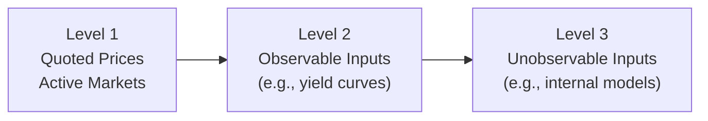
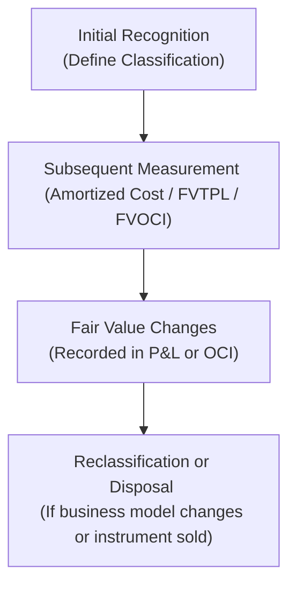

## Understanding Financial Instruments

I remember the first time I encountered a complex derivative contract—my eyes nearly glazed over. It was an interest rate swap, and I just couldn’t believe how many moving parts were involved! But at the heart of it all, the swap was just an agreement (ok, a complicated agreement) between two parties promising future payments. That’s what a financial instrument is: a contract that creates a financial asset (like cash, investments, or receivables) for one party and a corresponding liability or equity instrument for the other.

Financial instruments include a wide range of familiar items:

• Cash  
• Equity instruments (e.g., shares in a company)  
• Debt instruments (bonds, notes payable)  
• Derivatives (futures, forwards, options, swaps)  

And it gets more colorful with things like convertible debt, structured products with embedded derivatives, and so on.

From an analyst’s perspective, the key is to figure out how these instruments are classified and measured on the balance sheet. The classification determines where gains and losses go—and can significantly impact the financial statements you’re analyzing. So hang in there; it’s surprisingly fun once you see the bigger picture.

## Classification and Measurement

In IFRS 9 (and similarly under US GAAP via ASC 825 and related sections), financial instruments are sorted into measurement categories that define how changes in their value hit the income statement or other comprehensive income (OCI). Let’s break this down into a more digestible conversation.

### Amortized Cost

Amortized cost is a measurement basis typically used for certain debt instruments the company intends to hold to maturity in order to collect contractual cash flows—like interest and principal. Over time, you adjust the carrying amount for interest revenue (using the effective interest rate method) and any impairment losses or principal repayments. It’s sort of like booking interest and ignoring fair value movements. 

Accounts such as long-term corporate bonds “held to maturity” typically appear at amortized cost if they meet the correct criteria under IFRS 9 (the so-called “business model test”).

### Fair Value Through Profit or Loss (FVTPL)

Under FVTPL, you measure your financial instrument at fair value every reporting period, and any gains or losses go straight to profit or loss. This category usually captures:

• Trading securities (think: shares you’re actively buying and selling)  
• Derivatives  
• Instruments you’ve designated (under IFRS 9) to be measured at fair value for accounting mismatch reasons or other complexities  

If you’ve ever traded stocks in a personal brokerage account, you’ll know how the share price can change daily. Under FVTPL, these fluctuations go to the income statement, and that can lead to some, shall we say, interesting earning swings. Sometimes a big chunk of reported net income is actually just changes in fair value—something to keep an eye on when analyzing volatility.

### Fair Value Through Other Comprehensive Income (FVOCI)

This is a hybrid approach, where instruments are measured at fair value each period, but the changes go to other comprehensive income (OCI)—at least until you sell the instrument. That basically keeps short-term market moves out of the income statement (which some folks believe better reflects “core operations”). For certain equity investments, IFRS 9 allows an election to place them in FVOCI without recycling gains and losses to profit or loss upon sale. For certain bond investments, realized gains and losses might eventually be recycled to the income statement.

If you’ve ever wondered why some companies’ OCI is massive, it could be from large portfolios of available-for-sale securities (the older IFRS/US GAAP term; replaced by FVOCI under IFRS 9). This approach tries to smooth out ephemeral market fluctuations in the bottom line.

### Reclassification of Financial Instruments

In theory, once you’ve classified a financial asset, you shouldn’t switch it as you please—unless your business model or the nature of the instrument changes. For instance, if you initially designate a bond as amortized cost, but you suddenly start trading it actively, IFRS 9 might force you to reclassify it to FVTPL. These reclassifications can cause one-time hits to equity or profit or loss, so analysts should watch out for big classification shifts.

## Fair Value Disclosures

Alright, so how do companies actually figure out “fair value” for these instruments? IFRS 13 and ASC 820 define fair value as the price that would be received to sell an asset or paid to transfer a liability in an orderly transaction between market participants at the measurement date. But that’s easier said than done—especially for custom or illiquid instruments.

In practice, companies use a hierarchy:

• Level 1: Quoted prices in active markets for identical assets or liabilities (like exchange-traded stocks).  
• Level 2: Inputs other than quoted prices observable for the asset or liability (like interest rates or yield curves).  
• Level 3: Unobservable inputs (e.g., internal models, assumptions, and significant management judgment).  

When a company values instruments with unobservable inputs, IFRS 7 (and IFRS 13 for measurement details) demand robust disclosures about how they arrived at those fair values. And let’s face it: If the fair value number is derived from a CEO’s best guess about future defaults, that’s a place you want to look more closely!

### Diagram: Fair Value Measurement

Below is a simple Mermaid diagram illustrating the fair value hierarchy:

While it’s not exactly an action movie, understanding whether a financial instrument carrying amount is based on a direct market quote (Level 1) or on management’s complex assumptions (Level 3) can totally change how you assess risk.

## Risk Disclosures and IFRS 7

IFRS 7 requires companies to present disclosures about the significance of financial instruments and the nature and extent of risks they face—credit risk, liquidity risk, market risk, and so on. For instance, you might see tables laying out maturities of financial liabilities, an analysis of credit quality for receivables, or sensitivity analyses for interest rate or currency exposures. If the notes mention an interest rate swap with a notional amount of $300 million, your eyebrows might go up—you’ll want to see how that might affect their net interest expense or whether margin calls could create liquidity risk.

One of the biggest benefits to us, as analysts, is transparency—IFRS 7 mandates that companies talk about how they manage financial risks, how they classify them (think: derivatives used for hedging vs. speculation), and what assumptions were used in measuring them at fair value.

## Example on Reclassification

Imagine a company, Let’s Call It DeltaFox Corp., that initially invests in corporate bonds with every intention of holding them to maturity. So it classifies these bonds as amortized cost. Two years later, it changes its strategy and starts actively trading these bonds to profit from short-term price fluctuations. Because the business model changed, IFRS 9 (and in many respects US GAAP too) says this triggers a reclassification to FVTPL. The difference between the previous amortized cost and fair value at the reclassification date is recognized in OCI or profit or loss, depending on the exact details.

So you might see a big jump or drop in equity or net income, corresponding to that reclassification. Always look for footnotes describing these changes. Sometimes the “why” behind reclassifications is more telling about management’s intentions and risk appetite than any raw number.

## Common Pitfalls in Fair Value Disclosures

• Not all fair values are created equal. If it’s a complex, illiquid instrument, watch out for heroic assumptions or large model-based adjustments in Level 3.  
• Sudden changes in classification can hide or reveal big-time gains or losses. Additional scrutiny is essential.  
• Gains designated in OCI can be recycled to the income statement (in the case of debt instruments under IFRS 9), so don’t overlook their potential to affect future reported earnings.  
• Disclosures sometimes bury crucial details in references to “model inputs” or “gross vs. net exposures.” If you see references to netting, check if that’s masking some big notional exposure.  

## Real-World Observations and Best Practices

I’ve seen companies with massive derivative notional amounts that appear trivial or hidden until you look at the notes. And once you realize the notional is 10 times their equity, you start to wonder, “Are these guys ready for a major market swing?” So always dig into the risk disclosures. IFRS 7 specifically calls for meaningful discussion of credit risk, liquidity risk, and market risk. The best-run companies have consistent stories: their derivatives, their risk management policy, and their internal control environment all line up logically.

### Best Practices

• Always cross-check the classification of financial instruments with management’s stated strategies (e.g., are they truly going to hold that bond to maturity, or are they flipping it next quarter?).  
• Evaluate the discount rates, yield curves, and any other assumptions used in fair value measurements. Minor changes in these assumptions can produce major differences in valuations for structured or illiquid instruments.  
• Keep an eye on derivatives. Some might be used to hedge real exposures (like foreign exchange forward contracts for shipments next month). Others might be purely speculative. Oversight and appropriate risk management are crucial.  
• Don’t forget about netting. Derivative exposures can be offset by collateral or other derivatives, but if the offset is weak or legally unenforceable, the “net” position might not be so net after all.  

## Key Takeaways

• Financial instruments can be measured at amortized cost, FVTPL, or FVOCI, each with unique impacts on the income statement and/or OCI.  
• Classification is crucial: it significantly influences how and where changes in value are reported.  
• Disclosures (under IFRS 7, IFRS 9, ASC 825, ASC 815, and so forth) help analysts see the underlying assumptions, risks, and measurement uncertainties. Use them to form a more complete view of the company’s financial health.  
• Be mindful of reclassification triggers and the potential for big swings in reported metrics at reclassification dates.  
• Always drill down into how fair values are determined. The difference between Level 1 and Level 3 valuations can be enormous in terms of reliability and subjectivity.

## Additional Diagrams: Financial Instrument Lifecycle

Below is another quick Mermaid diagram showing a simplified lifecycle of a financial instrument—from initial recognition to subsequent measurement and possible reclassification:

This high-level flow helps us visualize how a typical financial instrument might evolve on the books.

## References and Further Reading

• IFRS 7 Financial Instruments: Disclosures  
  https://www.ifrs.org/issued-standards/list-of-standards/ifrs-7-financial-instruments-disclosures/

• IFRS 9 Financial Instruments  
  https://www.ifrs.org/issued-standards/list-of-standards/ifrs-9-financial-instruments/

• IFRS 13 Fair Value Measurement  
  https://www.ifrs.org/issued-standards/list-of-standards/ifrs-13-fair-value-measurement/

• FASB Standards  
  https://fasb.org/  
  - ASC 815, Derivatives and Hedging  
  - ASC 820, Fair Value Measurement  
  - ASC 825, Financial Instruments  

• “International GAAP” by EY: In-depth comparisons of IFRS and US GAAP  
• “Financial Analysis for Non-Financial Managers” by Harvard Business Review Press

And of course, the official CFA Institute materials provide additional practice exercises and guidance tailored for the exam. It’s always a good idea to do sample problems that force you to interpret financial statements with different classifications and measurement bases.

## Master Your Knowledge: Financial Instruments and Fair Value Disclosures Quiz



### DeltaFox Corp. invests in corporate bonds and holds them to collect contractual cash flows until it decides to start frequent trading. Under IFRS 9, what measurement category change might be triggered?

- [ ] From FVOCI to amortized cost  
- [x] From amortized cost to FVTPL  
- [ ] From amortized cost to net realizable value  
- [ ] No change is allowed once classified  

> **Explanation:** When a company changes its business model from holding assets to maturity to actively trading them, IFRS 9 generally requires reclassification to Fair Value Through Profit or Loss (FVTPL).

### Which fair value hierarchy level uses quoted market prices in active markets for identical assets?

- [x] Level 1  
- [ ] Level 2  
- [ ] Level 3  
- [ ] Level 4  

> **Explanation:** Level 1 is the highest in the fair value hierarchy, relying on directly observable inputs such as stock prices listed on an exchange.

### Under IFRS 9, which measurement category typically records all fair value changes in the income statement?

- [x] Fair Value Through Profit or Loss (FVTPL)  
- [ ] Fair Value Through Other Comprehensive Income (FVOCI)  
- [ ] Amortized Cost  
- [ ] Net Realizable Value (NRV)  

> **Explanation:** FVTPL recognizes all changes in fair value immediately in profit or loss, contrasting with FVOCI where changes go through other comprehensive income.

### Which IFRS standard focuses primarily on the disclosure requirements for financial instruments?

- [ ] IFRS 9  
- [x] IFRS 7  
- [ ] IFRS 13  
- [ ] IFRS 10  

> **Explanation:** IFRS 7 prescribes the specific disclosure requirements for financial instruments, including risk disclosures like credit, liquidity, and market risk.

### A sudden reclassification of a bond from FVOCI to amortized cost can have what immediate effect on a firm’s equity?

- [x] It may remove accumulated OCI gains or losses from the equity section.  
- [ ] It immediately increases revenue.  
- [x] It may result in revaluation gain or loss recorded in equity.  
- [ ] It has no effect on equity at all.  

> **Explanation:** Depending on the circumstances, accumulated OCI may be “frozen” or reclassified upon the transition, impacting how gains/losses are handled.

### Which of the following is typically measured at amortized cost?

- [x] Held-to-maturity bonds under IFRS 9’s business model test  
- [ ] Equity investments designated as FVOCI  
- [ ] Derivatives used for speculation  
- [ ] Trading securities  

> **Explanation:** Debt instruments held in a business model to collect contractual cash flows are generally measured at amortized cost if they meet the IFRS 9 criteria.

### If a firm has financial instruments measured using Level 3 inputs, it implies:

- [x] Significant management judgment or estimation is required.  
- [ ] Fair value is based directly on quoted market prices.  
- [x] The model might rely on unobservable inputs.  
- [ ] Valuation is performed only using publicly available data.  

> **Explanation:** Level 3 valuations rely heavily on unobservable inputs, which typically require management estimates, making them more subjective than Level 1 or Level 2 valuations.

### Under IFRS 7, which risk must be disclosed if a company has large receivables concentrated with a few customers?

- [x] Credit risk  
- [ ] Currency risk  
- [ ] Interest rate risk  
- [ ] Commodity price risk  

> **Explanation:** Concentrated accounts receivable with a limited number of customers can create heightened credit risk (i.e., risk of default on payment).

### Gains or losses on equity instruments designated at FVOCI are:

- [x] Recorded in OCI and typically not recycled to profit or loss.  
- [ ] Recorded in profit or loss immediately.  
- [ ] Subject to immediate impairment recognition in the income statement.  
- [ ] Always recognized in retained earnings.  

> **Explanation:** Under IFRS 9, an entity may elect to recognize changes in the fair value of certain equity instruments in other comprehensive income. These gains or losses are typically not reclassified to profit or loss upon disposal.

### A derivative that is used to speculate on currency exchange rates rather than hedge an existing exposure is most likely recognized under IFRS 9 as:

- [x] FVTPL  
- [ ] FVOCI  
- [ ] Amortized Cost  
- [ ] Historical Cost  

> **Explanation:** Speculative derivatives do not qualify for hedge accounting and are generally recorded at fair value through profit or loss, reflecting immediate earnings volatility.


