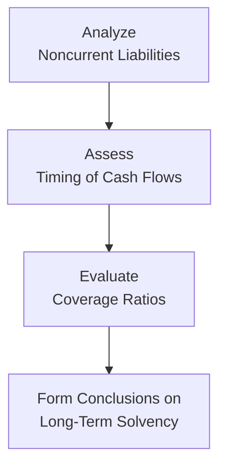

## Overview

Have you ever looked at a massive stack of paperwork for a company’s balance sheet and wondered what all those long-term obligations really mean? Don’t worry, we’ve all been there—staring at a figure labeled “Long-Term Debt” or “Pension Liabilities” and thinking: “Um, so is this going to be a big deal down the line?” Truth is, noncurrent liabilities can have a huge impact on how a company is perceived in the market, especially by creditors and investors who are super keen on leverage measures and overall financial risk.

In this section, we’re going to break down what noncurrent liabilities typically look like and why they matter so much—starting from long-term debt all the way to pension liabilities, deferred tax items, and provisions. Along the way, we’ll share a few stories, maybe a personal experience or two, and close with some essential best practices (and pitfalls to avoid) when analyzing these obligations.

## Key Components of Noncurrent Liabilities

Noncurrent liabilities, sometimes referred to as “long-term liabilities,” are simply obligations a company expects to settle well beyond the current operating cycle—usually, that means more than 12 months into the future. They include:

• Long-Term Debt (bonds, notes payable, mortgages, etc.)  
• Pension and Post-Retirement Benefit Liabilities  
• Deferred Tax Liabilities  
• Provisions (under IFRS) and Contingent Liabilities (under US GAAP)  
• Other miscellaneous items like lease obligations and certain contractual commitments  

The main thing to keep in mind is that these categories can drastically influence a company’s long-term solvency, leverage ratios, and future cash flow requirements. In many ways, looking at a firm’s noncurrent liabilities is like peering into a crystal ball. You’re trying to see how big the drain on future earnings and cash flows might become.

## Long-Term Debt

Let’s start with the most straightforward category—long-term debt. This is the bedrock of corporate financing in many industries: we’re talking bonds payable, secured and unsecured notes, and any other borrowing that matures beyond one year.

### Carrying Value and Amortization

Long-term debt often appears on the balance sheet at amortized cost. If a bond is issued at a discount or premium, the difference between the face value (par) and the issuance price is amortized over the life of the bond. This process gradually brings the bond’s carrying value closer to its face amount by maturity. With each passing interest period, the issuer recognizes interest expense composed of the coupon payment plus (or minus) the amortization of any discount (or premium).

In KaTeX, the carrying value of a bond at time t might look like:


\text{Carrying Value}_t = \text{Issue Price} + \sum_{i=1}^{t} \text{Amortization Expense}_i


### Covenants and Disclosures

Companies typically must meet certain covenants—contractual promises like maintaining a minimum debt coverage ratio or restricting additional borrowing. These covenants are often spelled out in the footnotes to the financial statements. A breach can trigger severe consequences, including immediate repayment demands or restrictions on dividends. So analyzing debt covenants is a big part of assessing financial flexibility.

### Example: Bond Amortization in Python

Here’s a quick Python snippet illustrating a simple schedule for a bond issued at a discount. We’ll assume an annual coupon, simplified to keep the logic straightforward.

```python
import pandas as pd

def bond_amort_schedule(face_value, coupon_rate, market_rate, years):
    """
    Returns a pandas DataFrame with amortization schedule
    for a plain vanilla bond (annual coupons).
    """
    # Calculate coupon payment
    coupon_payment = face_value * coupon_rate
    
    # Calculate number of periods (once a year)
    periods = years
    
    # Compute issue price using present value formula
    price = 0
    for t in range(1, periods+1):
        price += coupon_payment / ((1+market_rate)**t)
    price += face_value / ((1+market_rate)**periods)
    
    schedule = []
    carrying_value = price
    
    for t in range(1, periods+1):
        interest_expense = carrying_value * market_rate
        amortization = interest_expense - coupon_payment
        carrying_value += amortization
        
        schedule.append({
            "Period": t,
            "Beg. Carrying Value": round(carrying_value - amortization, 2),
            "Interest Expense": round(interest_expense, 2),
            "Coupon Payment": round(coupon_payment, 2),
            "Amortization": round(amortization, 2),
            "End Carrying Value": round(carrying_value, 2)
        })
        
    return pd.DataFrame(schedule)

df = bond_amort_schedule(face_value=1000, coupon_rate=0.05, market_rate=0.06, years=5)
print(df)
```

While this snippet is a bit simplified (annual coupons, no extra complexities), it gives a flavor of how you could actually track the carrying value of a bond over its life.

## Pension Liabilities

Now, let’s switch gears and get into something that often feels a little more abstract: pension liabilities. I remember the first time I came across a defined benefit pension plan footnote—it looked like the footnotes had footnotes! Pension accounting can seem complicated, but let’s break it down.

### Overview of Defined Benefit Plans

Under a defined benefit plan, a firm promises employees a certain payout upon retirement, typically based on factors like years of service and final salary level. The firm has an obligation to provide these future payments, and that obligation appears as a liability on the balance sheet. The size of that liability hinges on a whole bunch of actuarial assumptions: discount rates, mortality rates, employee turnover, future salary growth, you name it.

### Actuarial Gains and Losses

IFRS and US GAAP both attempt to capture the difference between expected and actual outcomes (like changes in discount rates or differences in actual returns on plan assets). These differences are known as actuarial gains and losses. The two regimes differ in exactly how they recognize and present these in the financial statements (e.g., IFRS might recognize remeasurements in other comprehensive income, while US GAAP has corridor approaches or requires immediate recognition in other comprehensive income).

### Key Analysis Points

• Discount Rate: The higher the discount rate, the smaller the present value of future pension obligations (and vice versa).  
• Plan Asset Returns: If actual returns on plan assets are lower than expected, the plan can quickly become underfunded.  
• Funding Levels: Some companies are mandated to contribute more if the plan’s funded status (plan assets minus pension obligations) drops below a certain level.  

## Deferred Tax Liabilities

Picture this scenario: a company uses accelerated depreciation for tax reporting but uses straight-line depreciation on its financial statements. For the early years of an asset’s life, the tax expense recognized on the income statement is lower than the actual tax liability recorded on the tax return. Over time, these differences “reverse”—hence the term “temporary differences.” When the accounting income is higher than taxable income (or taxable income is lower than accounting income in the short-run), it often gives rise to a deferred tax liability (DTL).

### When Do DTLs Reverse?

Sometimes it’s easy to see how the differences will reverse, for instance, as the depreciation method gradually catches up. Other times, they might not reverse for many years—like intangible assets with indefinite lives. We want to ensure that the firm’s future tax outflows are accurately captured. If they’re not, it can distort the picture of future cash flow needs.

### IFRS vs. US GAAP

Both IFRS and US GAAP require that DTLs be recognized for taxable temporary differences. A key difference arises in the treatment of certain revaluations or indefinite-lived assets. Analysts should note the future reversal of these DTLs and consider the company’s history of generating profits, because you only pay taxes if you have taxable income in the future.

## Provisions and Contingent Liabilities

Under IFRS, a “provision” is recognized if:

• There is a present obligation (legal or constructive) arising from a past event.  
• An outflow of economic resources to settle the obligation is probable (>50% likelihood).  
• A reliable estimate of the obligation can be made.  

Under US GAAP, we talk about “contingent liabilities.” Generally, the threshold is “probable” for recognition and “reasonably possible” for disclosure. If the future outflow is both probable and reasonably estimable, you record a liability and related expense; if it’s not, you just disclose.

### Example: Warranty Provision

Imagine a car manufacturer knows from historical data that ~2% of units sold will require an average of $300 in warranty repairs. If the firm sells 1,000 cars this year, they might set up a $6,000 warranty provision (2% × 1,000 × $300 = $6,000). The actual warranty claims in future years could be higher or lower, possibly resulting in an adjustment to the provision.

## Analytical Considerations

One key question I’ve always asked myself when analyzing noncurrent liabilities is: “Will these obligations become a near-term liquidity risk?” Sometimes a large portion of the company’s “long-term” obligations might actually come due in the next year if there’s a balloon payment or a covenant breach that triggers early repayment. Keep an eye on maturity schedules, which are often found in a note to the financial statements detailing long-term debt by year of expected maturity.

It can help to visualize how the composition of current vs. noncurrent liabilities can change over time. Below is a simple Mermaid diagram to give a conceptual sense of how liabilities might shift as maturity approaches.


Remember that each year, the portion of long-term debt that comes due within 12 months slides into the current liability bucket. If a company’s total current liabilities balloon because of large maturities, it puts pressure on their liquidity ratios.

## The Interplay of Liabilities and Solvency

Solvency ratio analysis often focuses on total debt or total liabilities relative to equity or assets. But the mix of current vs. noncurrent is equally important. If a company decides to refinance short-term obligations with new long-term borrowings, it can shift the balance. Analysts often watch for:

• Debt/Equity Ratio: Measures financial leverage.  
• Debt/EBITDA: Indicates how many years of cash flow are needed to repay debt.  
• Interest Coverage Ratio: Gauges ability to service interest from current earnings.  

A personal anecdote: I once looked at a mid-size manufacturer that had a so-so interest coverage ratio but an extremely unfavorable maturity schedule. While the interest coverage seemed just okay, they had a big chunk of notes payable rolling over in a single year. That made me super wary that the “just okay” coverage might not hold up after they refinanced at potentially higher interest rates—because guess what, if lenders see that you’re already leveraged, they’ll charge more or impose stricter covenants. So it was a big red flag.

## A Quick Visual on Solvency Analysis

Here’s another Mermaid diagram that might help illustrate some fundamentals:



## Best Practices and Pitfalls

• Read the Footnotes Thoroughly: Sometimes the real story of liabilities is buried in the details.  
• Check Covenant Agreements: Potential violations can accelerate some or all of the debt.  
• Evaluate Pension Assumptions: If discount rates are unrealistically high, pension obligations might be understated.  
• Watch for Large Deferred Tax Amounts: Understand how and when they might become payable.  
• Keep an Eye on Provisions: Some industries, like mining or oil & gas, can have large decommissioning obligations that aren’t obvious from a quick glance.  

Anyway, I admit that analyzing all these small details can feel like a giant puzzle. But once you see how each piece fits together, it becomes a powerful lens for evaluating a company’s financial health. Adjusting short-term vs. long-term obligations can drastically change a company’s risk profile, and analyzing these items properly is a vital skill for any analyst.

## Concluding Remarks

Noncurrent liabilities might not seem as “urgent” as current liabilities, but ignoring them can be a big mistake. Whether it’s a looming balloon payment, underfunded pension plan, or a once-hidden legal obligation, these long-term commitments can have lasting ramifications on a firm’s financial position. If you’re preparing for the CFA exam—or just trying to get a handle on financial statement analysis for your day-to-day job—be sure to dig deep into the company’s footnotes, understand the nature of these obligations, and watch out for changes in valuations or reclassifications that could signal shifts in risk.

In short, noncurrent liabilities are not just hypothetical future headaches; they’re real and have real effects on valuation, solvency, and future strategic opportunities. By keeping all of these concepts in mind, you’ll be well-equipped to spot potential red flags and properly evaluate the long-term financial posture of any firm you study.

## References

• IAS 37 Provisions, Contingent Liabilities and Contingent Assets:  
  https://www.ifrs.org  
• IAS 19 Employee Benefits:  
  https://www.ifrs.org  
• FASB ASC 420 Exit or Disposal Cost Obligations, ASC 710 Compensation — General:  
  https://fasb.org/  
• “Corporate Finance,” by Jonathan Berk and Peter DeMarzo (sections on bond covenants and funding).  

## Practice Questions on Noncurrent Liabilities



### A company issues a bond with a face value of $1 million at a premium. Which of the following statements is most accurate regarding the carrying amount of the bond over its life?

- [ ] The carrying amount increases over time until the bond reaches its face value.  
- [x] The carrying amount decreases over time until it converges to the face value.  
- [ ] The premium is added to the face value at maturity.  
- [ ] The carrying amount remains constant until the redemption date.  

> **Explanation:** When a bond is issued at a premium, the carrying amount is higher than the face value initially and is amortized downward over time to meet the par value at maturity.

### Which of the following best describes a situation that would give rise to a deferred tax liability under IFRS?

- [ ] A temporary difference where the tax base of an asset exceeds its carrying amount.  
- [x] A temporary difference where the carrying amount of an asset exceeds its tax base.  
- [ ] The presence of unused tax losses carried forward.  
- [ ] Recognition of a permanent difference like fines or penalties.  

> **Explanation:** Deferred tax liabilities typically emerge when the carrying amount of an asset is higher than its tax base, leading to taxable temporary differences that will reverse and cause future tax outflows.

### For a defined benefit pension plan, which of the following assumptions has the most direct impact on the present value of the pension obligation?

- [ ] Expected return on plan assets.  
- [x] The discount rate used in measuring the obligation.  
- [ ] Future salary growth.  
- [ ] Employee turnover rate.  

> **Explanation:** Although salary growth and turnover affect the size of future payments, the discount rate is crucial for determining the present value of the projected benefit obligation. A small change here can significantly affect the liability.

### When analyzing long-term debt, covenant violations matter primarily because:

- [x] They can trigger immediate repayment or penalties, affecting liquidity.  
- [ ] They reduce the coupon rate paid on the debt.  
- [ ] They allow companies to defer interest payments until covenant compliance is restored.  
- [ ] They have no real consequences if management discloses them.  

> **Explanation:** Violating a debt covenant can accelerate repayment clauses or result in penalties, putting significant pressure on the firm’s liquidity position.

### Under IFRS, when is a provision recognized?

- [x] When there is a present obligation, probable outflow of resources, and a reliable estimate can be made.  
- [ ] Only after cash has been spent to settle the obligation.  
- [ ] If it is less than 50% likely to occur but at least 20% likely.  
- [ ] Only if an insurance policy does not exist to cover the loss.  

> **Explanation:** IFRS requires a present obligation, probable future outflow, and a reliable estimate of the obligation for a provision to be recognized (IAS 37).

### A deferred tax liability arises because:

- [ ] A company paid less tax than required by the tax code.  
- [x] Accounting income exceeds taxable income due to timing differences that will reverse in the future.  
- [ ] Tax authorities reclassified income from one tax year to another.  
- [ ] All temporary differences give rise to a deferred tax liability.  

> **Explanation:** Deferred tax liabilities reflect future tax outflows due to timing differences in recognizing income for accounting vs. tax purposes.

### A large portion of a firm’s "long-term" debt is maturing in the next 12 months. Which financial statement effect is most likely?

- [x] A shift from noncurrent liabilities to current liabilities.  
- [ ] No change to the leverage structure.  
- [x] Possible liquidity pressure if refinancing doesn’t occur.  
- [ ] Recognition of an immediate gain on the income statement.  

> **Explanation:** As long-term maturities approach, that portion of the debt is reclassified as current liabilities, which can significantly increase liquidity risk if the company is unable to refinance.

### One example of an actuarial gain or loss in pension accounting is:

- [x] A difference between expected and actual return on plan assets.  
- [ ] A new labor contract that increases current salaries.  
- [ ] Deferred tax liabilities recognized on pension payments.  
- [ ] An increase in short-term provisions.  

> **Explanation:** Actuarial assumptions include expected returns on plan assets, discount rate, mortality rate, etc. Deviations from these assumptions create actuarial gains or losses recognized in other comprehensive income or in retained earnings under various accounting rules.

### Under US GAAP, if an adverse event is "reasonably possible" but not "probable," how is it handled?

- [x] Disclosed in the notes as a contingent liability, but not recognized on the balance sheet.  
- [ ] Recognized on the balance sheet with full provision.  
- [ ] Deferred as an intangible asset.  
- [ ] Ignored completely.  

> **Explanation:** A “reasonably possible” event that is not “probable” and cannot be reliably estimated is disclosed in the notes, rather than recognized as a liability.

### A firm has a bond covenant requiring a Debt/EBITDA ratio below 3.0. If the ratio is currently at 2.9, which of the following is true?

- [x] The firm is close to violating the covenant and may be at risk if EBITDA declines.  
- [ ] The firm has fully satisfied the covenant and will never violate it.  
- [ ] The firm’s ability to borrow more is unrestricted.  
- [ ] The ratio is irrelevant for future debt issuance.  

> **Explanation:** If the current ratio is close to the threshold (2.9 out of 3.0), a slight drop in EBITDA or increase in debt could trigger a covenant violation, potentially leading to drastic consequences.


