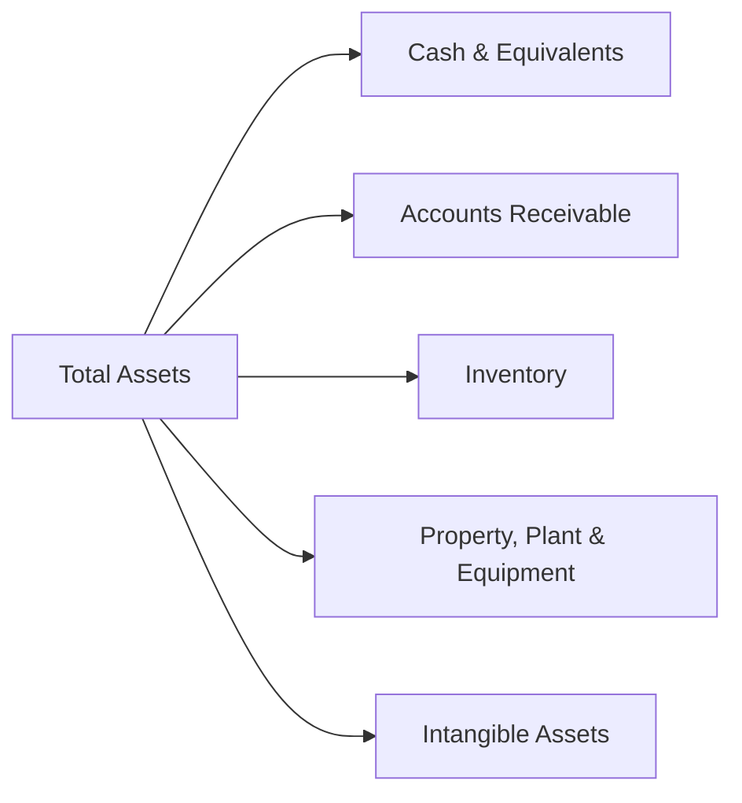

## Understanding the Power of Common-Size Balance Sheets

If you’ve ever tried to compare the financial statements of a massive multinational conglomerate to a small local company, you might’ve felt overwhelmed. After all, big companies just have huge numbers everywhere—billions in inventory, billions more in property, and so on. Meanwhile, your neighborhood business has accounts receivable in the thousands. So how on earth are you supposed to do any meaningful comparison?

That’s where common-size balance sheets come in. By expressing every balance sheet line item as a percentage of total assets, you effectively level the playing field. It’s almost like normalizing everyone’s height to 100 inches and then explaining what proportion each person’s arms or legs represent. Common-size analysis helps you see structural differences that absolute figures can hide, such as whether a company relies too heavily on intangible assets or if short-term liabilities are ballooning out of proportion. 

In the context of the CFA® 2025 Level 1 curriculum, the ability to look at a firm’s balance sheet in a common-size format is vital. It allows you to detect patterns and red flags and prepares you for deeper analysis, from the intangible assets focus (see Section 3.2) to the impact of liabilities and equity on solvency and capital structure. Let’s dive into the details.

## Why Common-Size Analysis Matters

Common-size statements deliver a quick comparative framework between:
• Different firms in the same industry.  
• The same firm over multiple periods.  
• Benchmarks, such as industry averages or top competitors.  

When you have several years of data, you can spot trends like expansions in intangible assets or increased reliance on short-term debt. You can also see how effectively a company manages its working capital—for instance, a rising proportion of inventory might signal strategic stockpiling or, potentially, poor inventory turnover (analyzed more thoroughly in Chapter 5).

In practice, I remember once comparing a tech startup’s balance sheet (80% intangible assets!) with a more traditional manufacturing company. If I had stuck to absolute figures, the intangible items of the manufacturing firm were minuscule, while the startup’s intangible assets were enormous. Common-size analysis helped me see that intangible assets took up a striking portion—over half—of total assets for the tech startup, whereas for the manufacturer, intangibles were negligible. That was a major clue about their future earnings volatility and the potential for intangible asset write-downs. This is precisely the kind of insight you want as an analyst or an investor.

## Calculating and Interpreting Common-Size Balance Sheets

Performing common-size analysis seems straightforward: each balance sheet item is divided by total assets. But the real value emerges when you interpret those percentages in context.

• Identify big movers: Did property, plant, and equipment (PP&E) jump from 30% to 45% of total assets year over year? This could indicate a capital expenditure spree, potentially affecting liquidity if financed by short-term bank debt.  
• Watch intangible assets: If intangible assets balloon to 40% of total assets, you’d better check what’s fueling that growth. Are these acquisitions of goodwill, or is the firm capitalizing R&D? Are there possible impairment risks?  
• Note trends in payables: If accounts payable consistently hovers around 20% of total assets but suddenly shoots up to 30%, the firm might be stretching its credit or experiencing a cash crunch.  

This approach is especially handy for cross-company comparisons. If a retailer holds 45% of assets in inventory while an industry peer carries just 20%, you’ll want to probe management’s inventory strategy. Depending on the sector—manufacturing, retail, or e-commerce—typical line items will differ, so comparing a “like with like” environment (e.g., big-box retailer to big-box retailer) is important for fairness.

Below is a simple Mermaid diagram illustrating how each line item in a balance sheet relates to total assets in a common-size format:

Each percentage measure (e.g., cash is 10% of total assets, PPE is 35%, etc.) helps you see how the pie is divided.

## Solvency Ratios in a Nutshell

Solvency ratios measure a firm’s capacity to meet its long-term obligations. Where common-size statements help you see how the firm’s resources are distributed, solvency ratios assess the stability of its capital structure. Three of the most widely used solvency metrics for CFA Level 1 candidates are:

• Debt-to-Equity Ratio (D/E)  
• Total Debt Ratio (sometimes just called the debt ratio)  
• Interest Coverage Ratio (often EBIT-based)  

How do these connect to the balance sheet and income statement? The D/E ratio and total debt ratio come straight from the balance sheet. The interest coverage ratio, on the other hand, ties the Income Statement’s EBIT (earnings before interest and taxes—see Section 2.7) to interest expense. 

### Debt-to-Equity (D/E) Ratio

This ratio shows how much debt a firm uses in relation to the equity financing contributed by shareholders:

(1)  

\text{Debt-to-Equity Ratio} = \frac{\text{Total Debt}}{\text{Total Equity}}


“Total Debt” might be defined differently among firms. Sometimes it includes all interest-bearing obligations. Sometimes short-term lease liabilities are included. As an analyst, be sure you know what’s in that denominator and numerator. If you see a D/E ratio that’s creeping upward over time, it might be a sign the firm is leveraging up—potentially riskier if the business environment worsens.

### Total Debt (or Debt) Ratio

While the D/E ratio compares debt to equity, the total debt ratio compares total debt to total assets:

(2)  

\text{Total Debt Ratio} = \frac{\text{Total Debt}}{\text{Total Assets}}


If this ratio is 0.40 (or 40%), it implies that 40% of the assets are financed by debt. The remainder is presumably financed by equity or other forms of capital. Firms with high total debt ratios tend to have more risk, especially if interest rates are rising. On the other hand, some industries (like utilities) commonly carry higher leverage, so properly benchmarking is key.

### Interest Coverage Ratio

The interest coverage ratio (or times interest earned) is calculated by dividing EBIT by interest expense:

(3)  

\text{Interest Coverage} = \frac{\text{EBIT}}{\text{Interest Expense}}


A ratio of 5.0 might indicate the firm comfortably covers its interest payments five times over. But a ratio closer to 1.0 could signal potential distress if profitability dips or if interest rates climb. Since the interest coverage ratio uses EBIT—a figure from the income statement—you may want to watch out for nonrecurring items that inflate or deflate EBIT.

## Cross-Analyses and Practical Use Cases

By combining common-size balance sheet data with solvency ratios, you can uncover deeper insights:

• If intangible assets are growing as a percent of total assets and the firm’s D/E ratio is also climbing, maybe management has financed a string of acquisitions with debt. You might investigate the synergy assumptions behind those deals.  
• If common-size analysis reveals that current liabilities are climbing year over year, a quick look at interest coverage might reveal if the firm has sufficient earnings to cover what’s likely a growing interest burden.  
• Benchmarking both common-size data and solvency ratios against peers helps you spot outliers. For example, if your subject firm’s debt ratio is 60% while the industry norm is 30%, that’s a strong sign of high leverage risk.  

On more than one occasion, I’ve seen a company’s share price decline sharply when the market realized the firm’s intangible assets were overvalued or that its debt load was unsustainable. This is exactly the sort of scenario you want to anticipate by checking trends in the common-size statements and solvency metrics.

## IFRS, US GAAP, and Other Considerations

For the most part, the calculation of solvency ratios does not differ dramatically between IFRS and US GAAP, though some balance sheet presentation details can vary. IFRS might allow certain items (like intangible assets or revalued property, plant, and equipment) to appear at an upwardly revalued amount, which can offset debt in the total assets figure. US GAAP typically mandates historical cost minus accumulated depreciation or amortization, except for impairment. 

What does this mean for you as an analyst? Be aware of the accounting framework each firm uses. If you compare a UK-based company that revalues its buildings upward every so often under IFRS with a US-based firm that doesn’t, your ratio comparisons might be skewed. You’ll want to adjust the data—where feasible—to create an apples-to-apples scenario.

Additionally, IFRS 16 (and ASC 842 in the US) changed how lease liabilities appear on the balance sheet. That’s relevant for total debt calculations. Many operating leases must now be capitalized, increasing total liabilities. For a company with many leases—say an airline or a retail chain—this can dramatically change its debt metrics overnight. Before you compare year-over-year solvency, double-check that new lease accounting standards didn’t alter the baseline.

## Potential Pitfalls and Best Practices

• Blindly trusting the definitions: Always verify what each line item includes. “Debt” might include bonds, loans, and lease liabilities, or perhaps only some subset.  
• Comparing across different industries: You might see typical D/E ratios around 1.5 for utilities, while technology startups could hover near 0.2. The raw ratio alone doesn’t pass judgment; you need industry context.  
• Overreliance on interest coverage: EBIT can sometimes be inflated by nonrecurring items. Consider looking at EBITDA-based coverage or interest coverage after adjusting for one-time gains or losses.  
• Neglecting “off-balance-sheet” liabilities: If a firm has plenty of operating leases or structured financing (see Chapter 9 on Off-Balance-Sheet Items and SPEs), you might be underestimating the firm’s true leverage.  

## Exam Tips and Strategies

1. Practice calculating and interpreting common-size statements. On the CFA exam, you might be asked to compute percentages, identify trends over a few periods, and draw conclusions about performance.  
2. Understand each solvency ratio formula cold and know how to interpret changes. Expect scenario-based questions: e.g., how does issuing new debt affect the D/E ratio or total debt ratio?  
3. Keep IFRS vs. US GAAP differences in mind, especially regarding intangible assets and revaluation. The exam loves to see if you catch subtle differences in reported numbers.  
4. Manage your time in multi-part item sets. If you’re asked to calculate solvency ratios, the next part might ask you to interpret them in conjunction with a corporate event, such as raising new equity capital or writing off intangible assets.  

Ultimately, you want to blend common-size balance sheet analysis with solvency metrics to paint a rich, 3D picture—comparing not only how the firm’s resources are allocated but also how comfortably it can cover its long-term obligations.

## Final Thoughts

Common-size balance sheets and solvency ratios form the bedrock of long-term financial stability analysis. By transforming raw numbers into percentages of total assets, you gain remarkable clarity across time, firms, and industries. Combine that with solvency ratios, and you’ll quickly identify whether a firm’s capital structure is a ticking time bomb or a stable foundation.

Remember: When intangible assets surge, or when short-term liabilities creep upward, these shifts often leave footprints in both common-size statements and solvency ratios. Don’t shy away from exploring these footprints. Instead, follow them to uncover the company’s true financial story—one that might be more subtle than the highlights in the annual report.

### References

• Subramanyam, K.R. (various editions). Financial Statement Analysis.  
• Higgins, R. Analysis for Financial Management.  
• CFA Institute, “Financial Statement Analysis” resources: https://www.cfainstitute.org  

## Test Your Knowledge: Common-Size Balance Sheets & Solvency Ratios



### Which statement best describes a common-size balance sheet?

- [ ] Each liability is expressed as a percentage of equity.
- [ ] Each equity component is expressed as a percentage of liabilities.
- [x] Each balance sheet line item is expressed as a percentage of total assets.
- [ ] Each asset is expressed as a percentage of fixed assets.

> **Explanation:** A common-size balance sheet sets every line item (assets, liabilities, and equity) as a percentage of total assets, allowing for more straightforward comparisons across companies and time.

### What is a potential reason for a company’s intangible assets growing as a percentage of total assets?

- [ ] The company decided to expense all R&D.
- [x] The firm acquired several technology-based businesses, creating goodwill.
- [ ] The company only uses assets with very short service lives.
- [ ] The company wrote down most intangible assets in the current period.

> **Explanation:** Acquisitions often increase intangible assets (especially goodwill). If intangible items become an ever-larger share of total assets, you should investigate M&A activity or capitalization practices.

### When analyzing solvency, which ratio is most useful to assess how much of the company’s operations are financed by debt versus equity?

- [ ] Interest coverage ratio.
- [ ] Current ratio.
- [x] Debt-to-equity ratio.
- [ ] Quick ratio.

> **Explanation:** The Debt-to-Equity (D/E) ratio indicates how heavily a company relies on borrowed funds relative to shareholder equity.

### If a company has a total debt ratio of 45%, what does that imply?

- [ ] The company’s interest coverage ratio is 2.0.
- [x] 45% of the company’s assets are financed by debt.
- [ ] The D/E ratio is 100% minus 45%.
- [ ] 45% of the company’s revenue is from debt financing.

> **Explanation:** The total debt ratio measures total debt over total assets. A 45% figure means that nearly half of the assets have been financed by debt.

### Which of the following statements about interest coverage ratio is correct?

- [x] It measures how many times EBIT covers interest expense.
- [ ] It directly shows the proportion of total debt in a firm’s capital structure.
- [ ] It combines total assets and total expenses in a single metric.
- [x] A higher figure typically indicates stronger ability to service debt.

> **Explanation:** Interest Coverage = EBIT / Interest Expense. A higher ratio usually means a firm can more comfortably cover interest payments.

### Under IFRS, which accounting treatment can significantly affect common-size analysis?

- [x] Revaluation of PP&E upwards, thus increasing total assets.
- [ ] Recording all leases off the balance sheet.
- [ ] Mandating intangible assets remain at cost at all times.
- [ ] Eliminating all liabilities over time.

> **Explanation:** Under IFRS, PP&E can be revalued upward if suitable market evidence exists, which raises total assets and can alter the relative proportions of line items in a common-size balance sheet.

### How might adopting IFRS 16 or ASC 842 affect solvency ratios?

- [ ] It moves intangible assets to the liability side of the balance sheet.
- [x] It increases recognized lease liabilities, potentially raising the firm’s D/E ratio.
- [ ] It removes long-term debt from the balance sheet.
- [ ] It removes intangible assets from total assets.

> **Explanation:** These new lease standards require capitalizing many operating leases, increasing the reported liabilities and thus potentially raising debt-based solvency ratios.

### Why is benchmarking solvency ratios against industry averages beneficial?

- [ ] It guarantees the ratios will meet required thresholds for every company.
- [ ] It confirms that all companies follow IFRS rules strictly.
- [x] It provides a context to determine whether a firm’s leverage is unusually high or low.
- [ ] It eliminates the need to review footnotes for accounting policy differences.

> **Explanation:** Comparing a firm’s solvency ratios to its industry average helps determine whether the firm is out of line with peers, signaling above-average or below-average leverage risk.

### What is a common limitation when using common-size statements?

- [ ] They cannot compare large multinational firms with smaller firms.
- [ ] They enhance certain line items to stand out artificially.
- [x] They do not automatically disclose the quality of the underlying assets or liabilities.
- [ ] They replace the need for solvency or profitability ratios.

> **Explanation:** Common-size statements normalize the size differences but do not address the qualitative aspects of an item’s real economic value or risk.

### True or False: A significant increase in intangible assets as a percentage of total assets automatically signals that a company will face solvency problems.

- [x] True
- [ ] False

> **Explanation:** While a rising proportion of intangibles can signal higher risk (e.g., possible impairment or uncertain value), it does not alone guarantee future liquidity or solvency issues. Context, such as M&A or technology investments, matters greatly.


