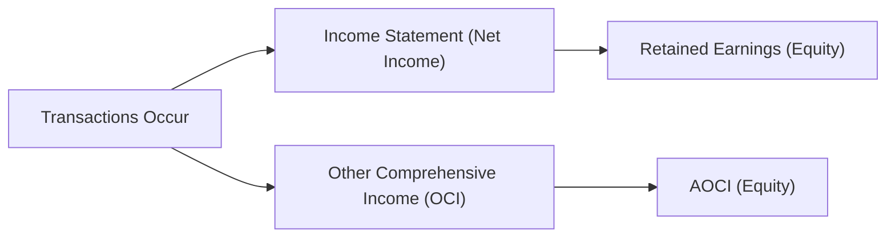

## Overview of Other Comprehensive Income

Have you ever glanced at a company’s balance sheet and wondered where certain gains or losses vanish if they aren’t hitting the income statement? Well, they’re not exactly vanishing; often they’re just tucked away in what we call Other Comprehensive Income (OCI). In my early days as an analyst, I’d see these weird fluctuations in shareholders’ equity and think, “Wait, where did those numbers come from?” Then I realized it was OCI, essentially capturing some of the changes in value that accountants say don’t (yet) belong in net income.  

OCI is a great example of accounting’s attempt to reflect broader economic realities that arise from certain financial instruments, foreign currency exposures, or pension remeasurements. But it can be tricky. You see, OCI accumulates in the equity section as Accumulated Other Comprehensive Income (AOCI), which sits there like a quiet observer. It doesn’t flow through net income (meaning it isn’t part of earnings per share calculations), but it is definitely part of shareholders’ equity and can be a major source of volatility.  

OCI might be a bit more subtle than net income, but it’s often super relevant for analyzing a company’s risk exposure—like foreign exchange risk, interest rate risk, or changes in the fair value of certain debt or equity instruments. Let’s dive in deeper.

## Typical Items in OCI

It’s common for some key gains and losses to bypass the income statement—at least initially—and land in OCI. Under IFRS and US GAAP, the main culprits are:

• Foreign Currency Translation Adjustments: Suppose you have a multinational firm with a subsidiary in another country. When converting that foreign operation’s financials into the parent’s reporting currency, exchange rate changes can trigger gains or losses. These appear in OCI.

• Changes in Fair Value of FVOCI (IFRS) or AFS (Available-for-Sale under older US GAAP): If your firm holds certain financial assets at fair value and classifies them as “Fair Value through OCI (FVOCI),” the unrealized gains or losses typically appear in OCI instead of the income statement. In older US GAAP references, this was often “available-for-sale” (AFS) classification.

• Cash Flow Hedging Instruments: Hedge accounting (especially for cash flow hedges) often records effective portions of the hedge’s gain or loss to OCI. Once the underlying transaction affects earnings, that gain or loss reclassifies into net income.

• Remeasurement of Defined Benefit Pension Plans: Pension remeasurements (actuarial gains and losses) may land in OCI, especially under IFRS. That helps keep net income less volatile due to pension assumptions.

Whatever the precise item, these amounts build up in Accumulated Other Comprehensive Income (AOCI) on the balance sheet, reflecting a running total of all past and current period OCI activity.

## Presentation and Format

Companies can present comprehensive income in two ways:
• As a single continuous statement of comprehensive income that starts with revenues, deducts expenses, arrives at net income, and then shows OCI items, summing to “total comprehensive income.”  
• As two separate statements: one for net income and one for other comprehensive income.  

IFRS uses the term “Other Comprehensive Income” for these items, and US GAAP uses “Comprehensive Income” concepts. While the naming and exact location might differ a bit, the general idea is consistent across both frameworks.

## IFRS vs. US GAAP Treatment

While both IFRS and US GAAP follow the big-picture approach of presenting OCI items separately from net income, a few nuances exist:

• IFRS classification often revolves around “Fair Value through Profit or Loss (FVPL)” vs. “Fair Value through OCI (FVOCI)” vs. “Amortized Cost.” Meanwhile, US GAAP historically used “Held to Maturity,” “Trading,” and “Available-for-Sale” as categories for debt securities, though updates (ASC 320 and subsequent pronouncements) have aligned more with the IFRS approach.  
• Pension remeasurements under IFRS typically go directly to OCI and stay there, whereas US GAAP might employ corridor or smoothing approaches (though the corridor approach is less common in practice).  
• IFRS requires reclassification for certain equity instruments only in specific scenarios, but US GAAP often reclassifies “available-for-sale” gains or losses into net income upon sale or impairment.  

The differences can be subtle but can materially shift how earnings appear on the income statement versus comprehensive income overall. For instance, a multinational firm applying IFRS might keep certain fair value changes in OCI until disposal, whereas under older US GAAP rules, a portion of those fair value changes might be recognized in net income under certain impairment triggers.

## How OCI Flows into Equity

To get a sense of how these items flow, imagine we have a simplified approach:

1. During the period, the company recognizes net income in the income statement. This amount goes into Retained Earnings.  
2. Meanwhile, the company calculates gains or losses from, say, foreign currency translations or FVOCI instruments. These get recorded in OCI.  
3. At the end of the period, these OCI items feed into the cumulative AOCI line item in the equity section of the balance sheet. AOCI is effectively the “accumulation” of all prior and current OCI items still recognized in equity.  

A short illustration:

This diagram is obviously simplified, but it shows how we have two different “channels” leading into total equity: one for net income and one for OCI.

## Real-World Impact of OCI on Analysis

I recall analyzing a manufacturing company that reported stable earnings year after year—hardly any fluctuation in net income. But guess what? Their OCI soared wildly as exchange rates whipped around for their foreign subsidiaries. Sure, it didn’t impact current net income, but these currency swings were a big sign of the company’s underlying vulnerability to currency exposure, which eventually led them to adopt new hedging strategies.  

Here are a few insights on analyzing OCI for real-world decision-making:

• Large, repeated swings in OCI can indicate exposures that may not be fully hedged (e.g., foreign currency risk, interest rate risk).  
• Gains or losses in fair value of equity investments recognized in OCI could turn into realized losses in net income if the assets are eventually sold at a loss.  
• Pension remeasurement items in OCI might reveal that the pension liability is more (or less) volatile than expected.  

## The Equity Section and Its Components

When you scrutinize the equity section, you’ll usually see:

• Share Capital (Common or Ordinary Shares, Preferred Shares)  
• Contributed Surplus (Share Premium)  
• Retained Earnings  
• Treasury Stock (contra-equity)  
• Accumulated Other Comprehensive Income (AOCI)  

Changes in these accounts convey vital information about the company’s financing choices and strategy. For instance, expanding contributed surplus might signal new share issuances or conversions of debt to equity. A rising treasury stock balance typically signals share buybacks. Meanwhile, a surging or plummeting AOCI indicates that various fair value or translation adjustments are at play.

## Monitoring AOCI for Long-Term Investors

Long-term investors (as well as lenders) pay attention to AOCI. Why? Because it’s a leading indicator of potential future hits or gains to net income. If you see large and persistent unrealized losses in AOCI, you might wonder whether some of those losses will eventually be recognized in the income statement. By contrast, big unrealized gains might never turn into realized gains if the assets are never sold, but they can still speak to the company’s financial health and risk exposures.

## Example of Fair Value Through OCI (FVOCI)

Let’s do a quick numeric example—though it won’t be super complicated:

• On January 1, a company purchases a bond for $10,000.  
• By year-end, its fair value climbs to $10,500. The company classifies it as FVOCI under IFRS.  
• Instead of reporting a $500 gain in net income, the company records a $500 increase in OCI.  
• This $500 accumulates in AOCI on the balance sheet.  

If the company ultimately sells the bond, that $500 gain (and any further fair value changes) may get reclassified to net income (under certain rules), or remain in equity if IFRS rules preclude reclassification for certain instruments. Either way, it’s crucial from an analytical perspective to keep track of that $500 within AOCI, because it represents potential value that hasn’t hit net income yet.

## Analyzing Fluctuations and Potential Pitfalls

Maybe you’re thinking: “So if it’s not in net income, is it not important?” Definitely not. Large fluctuations in OCI can imply:

• Significant foreign currency risk in operations.  
• Exposure to changing interest rates if you hold debt instruments in FVOCI.  
• Uncertainty in pension valuations that might impact future contributions.  

One pitfall is ignoring OCI’s volatility. Another is forgetting that some items in OCI might never reclassify into net income (especially if IFRS says no reclassification for certain equity instruments). That means the net income stream you’re evaluating might be missing important economic effects—like a portfolio that dropped drastically in value but is just sitting in AOCI, hoping to recover.

## Exam Tips for Handling OCI and Equity

On the CFA® exam at Level I (and beyond), keep the following ideas in mind:

• Understand which financial statement items flow through net income vs. OCI. If you see large AOCI changes, suspect foreign currency exposures, hedges, or fair value adjustments.  
• Distinguish between IFRS and US GAAP classifications; know that IFRS often employs FVOCI while US GAAP has historically used “AFS.”  
• Look for reclassification adjustments. Comprehensive income statements frequently show “OCI before reclassification” and “Reclassification adjustments” to net income.  
• For ratio analysis, remember that some items swirling around in AOCI might eventually impact equity and net income. This can affect solvency ratios or net worth calculations in the future.  

Anyway, let’s be real: in practice, analysts sometimes gloss over these sections, but exam questions might target them directly. So it pays to know your stuff here.

## References for Further Study

• IAS 1, Presentation of Financial Statements: Key guidance on how comprehensive income is presented.  
• FASB ASC 220, Comprehensive Income (https://fasb.org): US GAAP references on how to handle OCI.  
• “Intermediate Accounting,” by Donald E. Kieso: Familiar resource emphasizing the intricacies of OCI and shareholders’ equity presentations.  
• Chapter 8 in this volume (Analysis of Income Taxes) for a deeper look into how some OCI items are recognized net of tax.  

## Test Your Knowledge: Other Comprehensive Income and Equity Section Implications Quiz



### Under IFRS, which of the following items is typically recognized in Other Comprehensive Income rather than net income?

- [x] Changes in the fair value of FVOCI equity instruments
- [ ] Gains from the sale of trading securities
- [ ] Dividend income from short-term equity investments
- [ ] Depreciation on fixed assets

> **Explanation:** Under IFRS, fair value changes for FVOCI instruments bypass net income. Trading securities’ fair value changes generally go through net income.

### Which of the following would most likely create large swings in a company's Accumulated Other Comprehensive Income?

- [x] Major foreign exchange fluctuations experienced by an international subsidiary
- [ ] Minor changes in inventory valuations under FIFO
- [ ] The write-off of a bad debt by a customer
- [ ] Normal depreciation and amortization

> **Explanation:** Foreign currency translation adjustments can significantly impact AOCI. The other items typically affect net income rather than OCI.

### A firm reports a $1,000 unrealized gain on an FVOCI bond. Which statement is true under IFRS?

- [ ] The gain goes to net income immediately.
- [ ] The gain is permanently recorded in retained earnings.
- [x] The gain is recorded in OCI until the bond is sold or matures.
- [ ] The gain is recorded in net income net of taxes.

> **Explanation:** Under IFRS FVOCI classification, unrealized gains on debt instruments typically appear in OCI, reclassifying to net income upon disposal or maturity.

### Assume a company’s pension plan experiences a significant actuarial loss. Under IFRS, how would this impact the financial statements?

- [x] The actuarial loss is recognized in OCI and accumulated in AOCI.
- [ ] The actuarial loss is recognized within net income immediately.
- [ ] The actuarial loss is ignored unless it exceeds a predetermined threshold.
- [ ] The actuarial loss is categorized as a deferred liability on the balance sheet.

> **Explanation:** IFRS typically places actuarial gains/losses from defined benefit plans directly into OCI, bypassing net income.

### What is the function of “Reclassification Adjustments” found in the statement of comprehensive income?

- [x] They move certain OCI items into net income when realized.
- [ ] They adjust retained earnings for errors.
- [x] They move prior period errors to the current period’s net income.
- [ ] They represent currency revaluation of foreign operations only.

> **Explanation:** Reclassification adjustments shift OCI items that have been realized or settled into net income (e.g., upon selling an investment or settling a hedge).

### Which of the following is a typical component of shareholders’ equity besides AOCI?

- [x] Contributed surplus (share premium)
- [ ] Current liabilities
- [ ] Goodwill
- [ ] Deferred tax liabilities

> **Explanation:** Equity often includes common stock, preferred stock, contributed surplus, retained earnings, treasury stock, and AOCI. Goodwill is a noncurrent asset, deferred taxes are liabilities, and current liabilities are obviously not equity.

### When might a large negative balance in AOCI be most concerning for an equity analyst?

- [x] If there is a strong likelihood that losses recorded in AOCI will ultimately be realized
- [ ] If net income is showing a positive trend
- [x] If the company manages strictly domestic operations with no foreign exposure
- [ ] If the company reports high interest coverage

> **Explanation:** A large negative AOCI could be a red flag if it reflects unrealized losses likely to be realized, such as impairments on foreign currency or fair value instruments. It’s especially concerning if the company claims no foreign exposure but still accumulates large negative currency translation adjustments (possible sign of undisclosed risks).

### A firm designates an interest rate swap as a cash flow hedge for its floating-rate debt. The effective portion of gains or losses on the swap is most often:

- [x] Recorded in OCI
- [ ] Recorded directly in retained earnings
- [ ] Included in net income immediately
- [ ] Excluded from the financial statements entirely

> **Explanation:** The effective portion of a cash flow hedge is recorded in OCI, while any ineffective portion goes to net income.

### Under US GAAP, a major difference in treating OCI compared to IFRS is typically reflected in:

- [x] The classification and measurement of financial assets, such as AFS vs. FVPL vs. FVOCI
- [ ] The fact that US GAAP does not report comprehensive income at all
- [ ] US GAAP mandates that all foreign exchange gains go directly to net income
- [ ] US GAAP disallows the use of cash flow hedges

> **Explanation:** While IFRS and US GAAP both require comprehensive income, US GAAP historically used categories like Trading, HTM, and AFS, whereas IFRS uses FVPL, FVOCI, or Amortized Cost. That classification difference can lead to differences in whether changes go through OCI or net income.

### A company’s net income is $1 million, but its total comprehensive income is $1.2 million. Which statement is most reasonable?

- [x] The company recognized $0.2 million in OCI from items not included in net income.
- [ ] The company recognized $0.2 million in extra tax dividends.
- [ ] The company recognized negative operating cash flows that inflated its total comprehensive income.
- [ ] The difference is due to depreciation being classified in other comprehensive income.

> **Explanation:** Usually, total comprehensive income exceeding net income indicates positive OCI. Items like foreign currency gains, revaluation gains, or fair value adjustments can boost total comprehensive income.


