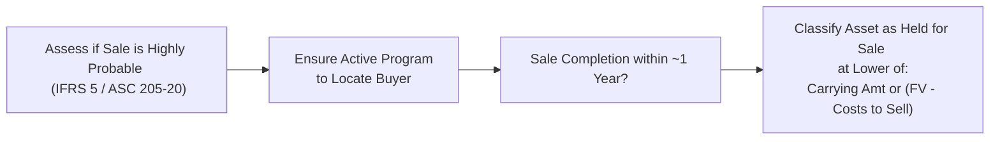

## Introduction

So, I’ll start with a quick personal memory: early on in my career, I remember flipping through a set of consolidated financials where a large consumer goods manufacturer announced that it was selling off its entire snack-food division. At first, I was like, “Wait…didn’t they just acquire that division two years ago?” It turned out the subsidiary was consistently incurring losses. The parent decided it was better off as an asset held for sale—and soon enough, the entire operation was reclassified as a discontinued operation. That single reclassification significantly changed the way the financial statements looked, and it also had a telling effect on crucial metrics like return on assets and operating margins.

Now, this scenario might be surprisingly common for those of us deeply involved in financial statement analysis. That’s why IFRS 5 (Non-current Assets Held for Sale and Discontinued Operations) and ASC 205-20 (Presentation of Financial Statements — Discontinued Operations) exist: to ensure consistent reporting and clarity for both preparers and users of financial statements. Let’s walk through the major concepts you need to know.

## IFRS 5 and ASC 205-20 Basics

At the heart of it, both IFRS 5 and ASC 205-20 revolve around identifying which assets (or groups of assets) a company is planning to sell or dispose of, and separately reporting any operations that are, so to speak, on their way out the door. It’s not just about labeling them differently—a whole new measurement requirement kicks in once an asset or group of assets is classified as “held for sale.”

• Under IFRS 5, an asset held for sale must be available for immediate sale in its present condition and the sale should be highly probable within one year.  
• Under ASC 205-20, US GAAP echoes this idea, emphasizing that the disposition is imminent and that management must be actively seeking a buyer.  

Reporting under these standards typically affects two major areas:  
1. The classification and measurement of assets on the balance sheet.  
2. The separate presentation of discontinued operations on the income statement—net of taxes and interest impacts.

## Criteria for Classification as Held for Sale

A non-current asset or disposal group (collection of assets and liabilities to be sold together) is classified as “held for sale” if two primary conditions are met:

• Management is committed to a plan to sell the asset (or disposal group).  
• The asset is available for immediate sale, and completion of the sale is probable within a year.

One of my colleagues—who used to be a corporate controller—once said, “Classifying an asset as held for sale is pretty serious business. You can’t just throw it in that bucket if you’re not actively talking to buyers or don’t have a real plan.” And that’s exactly the idea behind IFRS 5 and ASC 205-20. Both standards require robust evidence that the company is fully engaged in the disposal process.

### Measurement at the Lower of Carrying Amount or Fair Value Less Costs to Sell

When an asset qualifies for classification as held for sale, it must be measured at the lower of:

• Its carrying amount on the books (original cost minus accumulated depreciation and impairment, if any), or  
• Fair value less any costs to sell.

If the fair value less costs to sell is lower, the company writes down the asset in the period the reclassification occurs. This ensures the balance sheet reflects the asset’s recoverable amount as if the sale were to happen imminently. Any subsequent increases in fair value can be recognized to the extent they reverse previously recognized losses (under IFRS, with certain limitations; under US GAAP, typically no reversal after being written down, though the specific treatments can vary in some circumstances).

Below is a simplified flowchart illustrating the classification and measurement approach:

So, if your question is “When does the accounting change from normal depreciation to an immediate write-down if needed?” the chart above is your quick guide.

## Discontinued Operations

Discontinued operations are often the “headline-grabbers.” Whenever you hear, “Company X to spin off its entire consumer electronics division,” that’s probably going to be presented as a discontinued operation. The gist: a discontinued operation is a component of an entity that has either been disposed of or classified as held for sale and that represents a major line of business or a geographical segment. 

### Income Statement Presentation

On the income statement, discontinued operations are normally presented separately, below income from continuing operations. The results are shown net of tax. This separation distinctly highlights the performance of the part of the business that is no longer central to ongoing operations. From an analyst’s point of view, this can drastically change our understanding of “core” profitability and comparisons across periods.

### Examples

Let’s say a global automobile manufacturer decides to sell off its entire truck division. If the truck division qualifies as a major line of business, that portion of revenue, expenses, assets, and liabilities must be carved out and placed into the discontinued operations line items. This classification helps us (the analysts, that is) better see the ongoing business dynamics for passenger vehicles separately from the truck operation that’s heading out.

## Analysis and Impact on Financial Statements

### Effect on the Balance Sheet

Assets (and sometimes related liabilities) reclassified as held for sale are no longer depreciated or amortized. Instead, you adjust them to the lower of carrying value or fair value minus costs to sell. The immediate effect is often a downward valuation, which can reduce total assets and equity—depending on the size of the impairment recognized.

Additionally, assets held for sale and liabilities associated with those assets are shown separately on the balance sheet. This makes them visually “stand out,” so you can quickly identify them in your analysis.

### Effect on the Income Statement

Once reclassified, you remove all income and expenses associated with that division (or asset) from continuing operations going forward. Any gains or losses on measurement or eventual disposal of the discontinued operation also appear in the discontinued operations section of the income statement. This separation arguably makes the statement more transparent by isolating past operations that no longer represent the firm’s future direction.

### Impact on Ratios

Here’s a situation that used to trip me up a bit: ratio analysis can become tricky when you remove revenues, expenses, and assets from continuing operations. For instance, profitability ratios (like net margin or return on equity) might suddenly look better or worse once the discontinued segment’s results are stripped out. Liquidity ratios and leverage ratios can also shift if large assets (and liabilities) vanish from the balance sheet.

Analysts must remain cautious when comparing historical performance before and after the reclassification. Typically, you’d look for restated prior-period numbers that reflect the segment as discontinued so that your year-over-year or quarter-over-quarter comparisons remain consistent.

## Strategic Realignment Signals

Repeated classification of different segments as discontinued operations might hint at broader strategic realignment or a big push to exit unprofitable lines. While this can be a positive for future profitability, it might also signal that management’s initial strategy missed the mark, prompting frequent restructuring. I remember encountering a retail company that had announced “discontinuation” of four different store concepts over three consecutive years. Investors naturally started asking, “When are you guys going to settle on a winning strategy?”

## Red Flags and Pitfalls

1. Over-optimistic Fair Value Estimates: Companies sometimes base the fair value of assets held for sale on questionable assumptions about how smoothly the disposal will proceed. Dig into the disclosures or footnotes to confirm if management’s judgments sound reasonable.  
2. Repeated Losses on Disposal: If the same company keeps taking big hits each time it sells a component, that might suggest poor forecasting, or possibly even some strategic mismanagement.  
3. Incomplete Note Disclosures: IFRS 5 and ASC 205-20 require robust disclosures about expected disposal timelines, expected proceeds, and the basis for concluding an asset meets “held for sale” criteria. Missing or vague disclosures might be a sign of trouble or insufficient corporate governance oversight.

## Practical Illustrations

### Example: Write-down to Fair Value Less Costs to Sell

Imagine a manufacturing facility on the books for a carrying amount of $5 million. Management commits to sell that facility within six months, and the current fair value for industrial properties like this is estimated at $4.2 million. But the company expects to pay $0.2 million in broker commissions and legal fees. Thus:

Fair Value = $4.2 million  
Less Costs to Sell = $0.2 million  
Net = $4.0 million  

Since $4.0 million is below the carrying amount of $5 million, the asset is written down by $1 million. The company recognizes a $1 million loss in the period it classifies the facility as held for sale. That’s a big direct impact on the income statement (or specifically, in discontinued operations if that facility is a major part of the business under disposal).

### Example: Discontinued Operations in Tech

Suppose a consumer electronics company decides to cease production of its e-reader line—one that’s well known but underperforming. If that e-reader division constituted a major revenue source, it would likely meet the definition of a discontinued operation. All associated revenues and expenses for the e-reader segment get reported separately in the company’s upcoming financial statements, net of tax. This often provides clarity to investors concerning the performance of the continuing lines—maybe smartphones and tablets.

## Exam-Relevant Considerations

• Past essay questions often present financial statements before and after an asset reclassification. They might ask you to recalculate ratios or comment on the quality of earnings.  
• Item set questions might give you footnote disclosures about future disposal or an ongoing plan to sell a segment. They may ask whether the disposal is truly probable within 12 months (or question if certain conditions are met).  
• You might be asked to determine the correct measurement approach for an asset once it meets the held-for-sale criteria.

## Best Practices for Analysis

• Read footnotes carefully. IFRS 5 and ASC 205-20 demand that companies explain the reasons for a classification and the expected timeframe for completion.  
• Verify that public documents (e.g., 10-Ks, MD&A sections) provide details about negotiations, the stage of disposal, etc.  
• Check for consistency between management’s statements (e.g., in earnings calls and press releases) and the financial statement disclosures.  
• Look for big gains or losses disclosed separately in discontinued operations. If they recur, try to determine whether they represent transitory items or indicate ongoing structural weaknesses.

## Final Study Tips

1. Understand the difference between “held for sale” and “discontinued operations.” Not all assets held for sale automatically become discontinued operations—only those that represent a major line of business or geographical area.  
2. Remember the measurement rule: the lower of carrying amount or fair value less costs to sell.  
3. Identify the intangible or hidden signals such a classification might reveal about management’s long-term strategy or the company’s profitability trends.  
4. Know that once an asset is held for sale, depreciation stops. This might affect the comparability of operating metrics.  
5. In an exam scenario, practice quick calculations: IFRS 5 and ASC 205-20 questions often involve short numeric examples focusing on measuring the asset’s write-down or showing the layout of discontinued operations in the income statement.

## References and Further Reading

• IFRS 5 Non-current Assets Held for Sale and Discontinued Operations:  
  https://www.ifrs.org  
• FASB ASC 205-20 — Discontinued Operations:  
  https://fasb.org/  
• Revsine, Collins, Johnson: “Financial Reporting and Analysis” (chapters on restructuring and discontinued operations)  
• CFA Institute Program Curriculum, Level 1, “Financial Reporting and Analysis”  

Remember, knowing the standard is just part of the story: truly understanding how these classifications affect analysis and forecasting is what sets skilled analysts apart from the crowd.

--------------------------------------------------------------------------------

## Mastering Assets Held for Sale and Discontinued Operations: 10 Exam-Style Questions



### 1. When classifying an asset as held for sale under IFRS 5, which of the following criteria must be met?

- [ ] The asset is out of favor with existing management.  
- [ ] The asset requires additional depreciation expense.  
- [x] The asset is available for immediate sale in its current condition, and the sale is highly probable within 12 months.  
- [ ] The asset has been fully depreciated.  

> **Explanation:** Under IFRS 5, an asset must be available for immediate sale in its present condition, and a sale must be highly probable (usually within one year). Management’s preference or additional depreciation is irrelevant for classification purposes.

### 2. Under the lower of carrying amount or fair value less costs to sell principle, which statement is most accurate?

- [ ] The carrying amount can be written up indefinitely if fair value increases.  
- [x] The carrying amount may be written down but can only be partially written up if it reverses a previous impairment under IFRS.  
- [ ] The carrying amount is unaffected by changes in fair value.  
- [ ] The asset is immediately depreciated upon classification as held for sale.  

> **Explanation:** Once classified as held for sale, an asset is measured at the lower of carrying value or fair value less costs to sell. IFRS 5 allows reversal of impairment losses only to the extent of previously recognized losses (with certain limitations). Under US GAAP, generally no write-up is permitted.

### 3. Discontinued operations must involve which of the following to be reported separately on the income statement?

- [ ] Any segment that reports a negative gross margin for two consecutive quarters.  
- [x] A major line of business or geographical area that has been disposed of or is held for sale.  
- [ ] Any disposal of assets in a noncore business.  
- [ ] A foreign currency subsidiary repatriating capital.  

> **Explanation:** Discontinued operations refer to the disposal (or classification as held for sale) of a major business line or geographical segment. Simple underperformance or arbitrary classification does not qualify.

### 4. When an operation is classified as discontinued, how are its results typically presented?

- [ ] In the compilation of retained earnings.  
- [x] Separately from continuing operations, net of tax.  
- [ ] In the statement of changes in equity, net of tax.  
- [ ] Combined with extraordinary items.  

> **Explanation:** Discontinued operations appear separately on the income statement, shown net of tax, below the line for continuing operations to provide clarity on the performance of the ongoing business.

### 5. Which of the following is a possible red flag when analyzing repeated classifications of discontinued operations?

- [x] Frequent disposals may signal poor strategic planning or mismanagement.  
- [ ] They indicate guaranteed high-value disposals.  
- [x] They suggest the company is always making profitable divestments.  
- [ ] They show stable management and consistent profitability.  

> **Explanation:** Many instances of discontinued operations could signal a lack of strategic focus or mismanagement. The assumption that they guarantee “profitable disposals” or indicate “stable management” is not generally accurate.

### 6. Once an asset is classified as held for sale:

- [x] It is no longer depreciated.  
- [ ] It must be revalued annually under IFRS regardless of changes in value.  
- [ ] Depreciation continues until disposal.  
- [ ] The carrying amount is immediately transferred to goodwill.  

> **Explanation:** IFRS 5 and ASC 205-20 both require that depreciation cease once an asset is classified as held for sale. Any adjustments afterward relate to fair value less costs to sell.

### 7. A company commits to a plan to sell a building. The building’s carrying value is $900,000, its fair value is $850,000, and costs to sell are $25,000. Under IFRS 5, the building should be measured at:

- [ ] $900,000.  
- [ ] $875,000.  
- [ ] $850,000.  
- [x] $825,000.  

> **Explanation:** It is measured at the lower of carrying value ($900,000) or fair value less costs to sell ($850,000 – $25,000 = $825,000). Hence, $825,000 is the recognized amount on the balance sheet.

### 8. What is the primary purpose of separately reporting discontinued operations?

- [ ] To enable management to hide one-time losses.  
- [ ] To facilitate synergy with regulatory capital disclosures.  
- [x] To isolate the financial effects of operations that will no longer contribute to the company’s ongoing performance.  
- [ ] To defer recognizing revenue in later periods.  

> **Explanation:** Discontinued operations are shown separately to highlight that these results won’t affect future operations, helping users of the financial statements assess ongoing performance more accurately.

### 9. Under US GAAP (ASC 205-20), which situation could disqualify an asset from being classified as held for sale?

- [ ] Management is searching for a buyer but has not yet finalized a purchase agreement.  
- [x] There is no evident plan or intention to actively market the asset for sale.  
- [ ] The asset is geographically remote, making it harder to find a buyer quickly.  
- [ ] The asset’s carrying value is already discounted.  

> **Explanation:** US GAAP (like IFRS) requires an active plan to locate a buyer and complete the sale within one year. If management has no actual plan or intention to market the asset, the criteria for “held for sale” status are not met.

### 10. True or False: All assets classified as held for sale must also be considered discontinued operations.

- [ ] True  
- [x] False  

> **Explanation:** Not all assets classified as held for sale meet the threshold for discontinued operations. Discontinued operations apply only to distinct components representing major lines of business or geographical areas.


