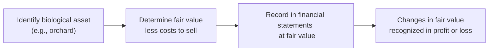
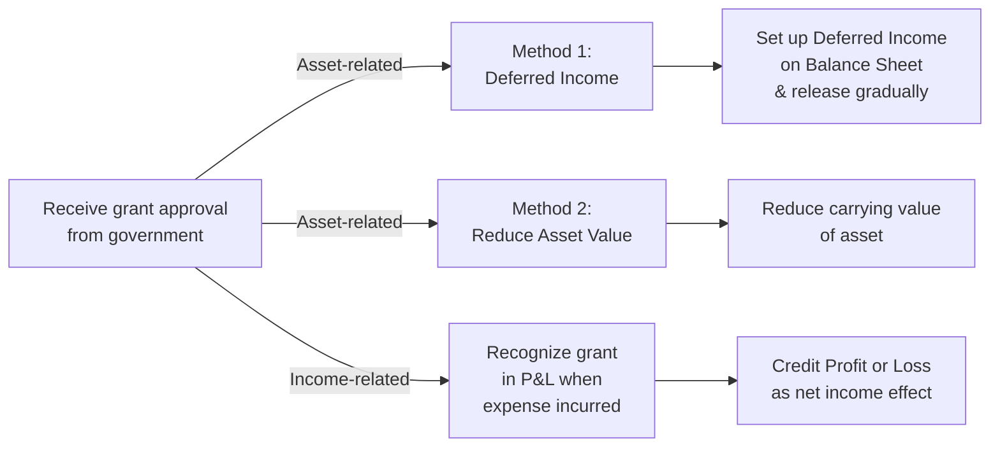

## Overview

Let’s dive into a topic that sometimes confuses folks: biological assets (think livestock, orchards, or those large pineapple plantations you see on TV) and the government grants that might pop up in a company’s statements. At first glance, these ideas can be kind of intimidating—especially because the accounting rules for something like a baby cow’s fair value can be, well, a little unusual. But don’t worry; we’ll sort it all out step by step.

We’ll chat about the measurement of biological assets under International Financial Reporting Standards (IFRS), specifically IAS 41, and see how it contrasts with US GAAP. We’ll also explore the ins and outs of government grants—how they’re recognized, disclosed, and analyzed. If you’ve ever thought, “How do companies handle these weird categories in their balance sheets?” then you’re in the right place. Let’s roll!

## IFRS Approach to Biological Assets

### Defining Biological Assets
A biological asset is any living plant or animal that is used in agricultural activities for sale, transformation into another product, or breeding. You can think of it as cows on a dairy farm, grapevines in a vineyard, or apple trees in an orchard—generally anything living that produces agricultural output.

In IFRS, the key standard here is IAS 41 Agriculture. IAS 41 requires:

• Measuring biological assets at fair value less costs to sell.  
• Recognizing any changes in that fair value right into profit or loss.  

That’s probably one of the biggest quirks: if, say, your orchard trees suddenly become more valuable because of rising apple prices, you must recognize an unrealized gain in the income statement—kind of like revaluing a trading security. This is all about ensuring that the balance sheet reflects the current fair value of your cows or palm trees or game fish (yep, some fish farms do that).

### Fair Value Measurement and Impact on Earnings
When you measure a biological asset at fair value, you’re looking at the value the market would pay for it, minus any cost to get it ready for sale (such as transportation or commissions). If you’re raising sheep and the price of wool skyrockets, your sheep might be worth more, which leads to a fair value gain. But the opposite could also happen: if a virus has hit the orchard business and diminished the expected yield and selling prices, you might need to record a loss.

Those changes can add volatility to the income statement. In practical terms, a farm might see big swings in reported earnings simply because its biological assets’ fair values are fluctuating.

### Bearer Plants vs. Consumable Assets
Bearer plants, such as orchard trees or grapevines, are generally accounted for differently from the produce they generate. IFRS points out that these plants (once mature) are more like property, plant, and equipment (PP&E) because they’re used repeatedly year after year. The fruit—like apples or grapes—would still come under biological assets measured at fair value less costs to sell, but the orchard trees themselves might be accounted for under IAS 16 (Property, Plant and Equipment) once they reach maturity.

This distinction helps reduce some of the recognized volatility, since the orchard itself isn’t constantly revalued, but the produce hanging off those branches is. I remember one orchard owner telling me how confusing it was that, in one place on the balance sheet, the orchard orchard was measured at depreciated cost (assuming bearer plants fall under IAS 16), but the apples themselves were measured at fair value. Hard to keep it straight sometimes—especially around harvest season!

### Diagram: The Process of Valuing a Biological Asset

Below is a simple mermaid diagram illustrating how fair value measurement for a biological asset might move through each step:

In a real orchard scenario, you’d be looking at local market prices for produce, adjusting for the time of harvest, logistics, and so on. The diagram is an oversimplification but helps to visualize the process.

## US GAAP Treatment for Biological Assets

Over in the US GAAP realm, there isn’t a single standard like IAS 41 that specifically addresses biological assets. Instead, there are often industry-specific guidelines. For instance, you might have specialized guidance in ASC 905 (Agriculture). Many times, these assets are measured at cost (plus maybe capitalization of certain expenditures) or at lower of cost or net realizable value. So, differences between IFRS and US GAAP can be pretty big in terms of how you reflect changes in value.

That means that under US GAAP, a soybean farmer might treat the cost of seeds, planting, fertilizing, etc., in a relatively traditional, inventory-esque manner. Gains resulting from a rise in the market price aren’t recognized until sale. That’s significantly less volatile on the income statement, but it might also be less representative of the real economic value if your commodity prices skyrocket.

From an analyst’s perspective, you want to be aware if a company is using IFRS or US GAAP. If you see big fluctuations in earnings for apparently “no reason,” IFRS-based companies with biological assets might just be reflecting changes in the fair value of their fields or livestock.

## Government Grants

### Understanding Government Grants
Now, let’s flip to the second puzzle piece: government grants. A grant is basically assistance from the government in the form of transferring money or resources to a business. The business generally has to meet certain conditions, like investing in new technology, building factories in certain regions, or possibly meeting operational performance targets.

In IFRS, we rely on IAS 20 Accounting for Government Grants and Disclosure of Government Assistance. The standard requires separate, clear disclosure of the type of grant, the conditions attached, and how it’s recognized. A big theme is transparency around what the business had to do to get that money and how it is recognized in the financial statements.

### Types of Government Grants
A few common flavors:

• Grants related to assets: The government might help fund the purchase or construction of PP&E (for example, a new research facility or specialized equipment).  
• Grants related to income: General subsidies that compensate a company for expenses or losses already incurred.  

An example from my own experience: at a horticultural company I consulted for, the local government wanted to support “green farm technologies.” The company got a partial grant to build solar-powered irrigation systems. That’s a grant related to assets because it’s basically subsidizing the purchase of equipment.  

### Accounting Approaches Under IFRS

There are two main approaches to account for asset-related government grants:

Deferred Income Method:  
• The asset is recorded at its full cost, but you also set up a deferred income liability for the grant.  
• Over the useful life of the asset, the deferred income is recognized in profit or loss at the same pace as the asset is depreciated.  

Reduction of Asset Method:  
• You reduce the carrying amount of the asset by the amount of the grant.  
• Depreciation is then calculated on the net asset value.  

In both approaches, the effect on net income over the asset’s useful life is typically the same—though the shape of that effect might differ from period to period. The choice of method can slightly change how the balance sheet looks, so analysts should keep an eye on which policy the company uses.

For income-related grants, the standard approach is to credit them to profit or loss when the corresponding expenses are recognized (assuming you’ve met all necessary conditions). If the conditions aren’t met yet, or the company isn’t sure it can comply, it generally shouldn’t recognize the grant until there’s sufficient assurance these conditions will be satisfied.

### US GAAP and Government Assistance
Under US GAAP, historically, government grants lacked a specific overarching standard (though new guidance has gradually emerged, including ASC 958 for not-for-profits, and some angles in ASC 450 for contingencies, or ASC 606 for revenue from contracts with customers if certain facts apply). Entities often looked at an analogy to IFRS or considered the nature of the grant—whether it is more like a contribution, revenue, or a reduction in expense. Some grants are recognized as revenue once all conditions are met, while others reduce the expense recognized.

It’s worth checking company disclosures: if they don’t highlight grants or separate them clearly in revenue or expense, you might have to dig into footnotes to see how they treated the inflow.

## Financial Analysis Considerations

### Volatility of Fair Value Changes
Biological assets measured at fair value (under IAS 41) can generate big swings in reported profit or loss. Think about how that might distort performance metrics from one quarter to another. The farm might look super-profitable if fruit prices spike one season, and then less profitable if they dip the next. As an analyst, it’s important to look beyond these short-term movements and focus on the fundamental performance (like yield, efficiency, demand trends, or the portion of gains that are actually realized in cash).

### Government Grants and the Timing of Income
Government grants can make a company’s bottom line look better in certain periods—particularly if the grant is recognized in full during a short timeframe. If the company had minimal costs to meet the grant conditions, that “extra income” can inflate profitability. Always ask: “Did the company need to do something in exchange for this money?”, “Is future compliance or a clawback possible?” If the entity might have to repay the grant if certain conditions aren’t kept, that could pose a risk down the road.

### Diagram: Government Grant Recognition Approaches

## Practical Example

Imagine you have a dairy farmer—let’s call her Chloe—who operates in a region that’s huge on innovative farming. She uses IFRS, so she records her cows at fair value less cost to sell. If the local market price for a dairy cow jumps by 10% in one quarter, she recognizes an unrealized gain based on that inventory revaluation. That whipsaws her net income but may not reflect an actual sale of the cows (so no real cash benefit was realized yet).

Chloe also receives a government grant to offset the purchase of advanced “cow comfort” equipment—better feeding and hydration systems that, theoretically, keep the cows healthier and produce better milk yields. The local government gives her $20,000 for the equipment. Under IFRS, she either sets up a deferred income approach or simply reduces the equipment’s carrying value on her balance sheet by the $20,000. Either way, the grant lowers future depreciation or systematically offsets costs.

As an analyst, you’d probably want to factor in the grant’s effect on net income, the volatility from revaluing the livestock, and any obligations that Chloe might have to keep the cows under certain welfare standards for five years (or risk losing or repaying the grant).

## Common Pitfalls and Best Practices

• Pitfall: Ignoring Volatility. It’s tempting to treat all fair value adjustments as “non-cash.” But they do matter for a firm’s real net worth—just not necessarily for immediate operating performance.  

• Pitfall: Failing to Identify Grant Conditions. If a company lumps grants into “other income” without detail, you might miss red flags about what the company must do to keep that money.  

• Best Practice: Look for Realization. For biological assets, examine how much of the reported gains or losses are realized via actual sales. If a large portion is just remeasurement, consider whether it’s likely to reverse.  

• Best Practice: Check Notes for Grant Policies. IFRS standards require robust disclosure. If the footnotes don’t show the method used (deferred income vs. asset reduction), that’s a sign you need more info.  

• Best Practice: Adjust Earnings for Trends. Some analysts strip out revaluation gains/losses to get a smoother measure of operating performance. The IFRS standard sets the rules, but you can still perform your own adjustments for valuation.  

## References and Further Reading

• IAS 41 Agriculture:  
  https://www.ifrs.org/issued-standards/list-of-standards/ias-41-agriculture/  

• IAS 20 Accounting for Government Grants and Disclosure of Government Assistance:  
  https://www.ifrs.org  

• For US GAAP industry-specific guidance, see the FASB Accounting Standards Codification (ASC) 905 (Agriculture) and related updates.  

• Additional reading on IFRS vs. US GAAP differences: IFRS Foundation’s “Comparison of IFRS and US GAAP.”  

## Final Exam Tips

• Under exam conditions, watch for keywords like “fair value changes to be recognized in profit or loss” to clue you in that IFRS is in play for biological assets.  
• If you see references to orchard or livestock disclaimers in a scenario, think IAS 41—these might be tested as examples of revaluation gains or losses.  
• For government grants, confirm whether it’s asset-related or income-related. The question might revolve around which method (deferred income or asset reduction) a company uses or how the timing of recognition affects net income.  
• Don’t forget that notes to the financial statements can reveal the method the company has chosen to implement. In a real testing environment, details in the footnotes often give you the biggest clues.  

Remember, the name of the game is understanding how these items flow through the balance sheet and, ultimately, into earnings. Biological assets can cause wild swings in reported profitability, while government grants can provide short-term boosts (or, if misapplied, lead to bigger issues later). By keeping a close eye on the details, you’ll have a much better handle on a company’s real economic performance.

---

## Test Your Knowledge: Biological Assets & Government Grants



### Under IFRS (IAS 41), how are biological assets measured?

- [ ] Historical cost
- [x] Fair value less costs to sell
- [ ] Depreciated cost
- [ ] Net realizable value only at harvest

> **Explanation:** IAS 41 requires biological assets to be measured at fair value less costs to sell, with changes recognized in profit or loss.

### Which statement accurately describes the “deferred income method” for government grants related to assets under IFRS?

- [ ] The carrying amount of the asset is reduced, and no liability is recorded.
- [x] The grant is initially recorded as a liability and recognized as income over the asset’s useful life.
- [ ] The grant is recognized as income immediately when received.
- [ ] The grant is categorized exclusively as an equity injection from the government.

> **Explanation:** Under the deferred income method, the entity records the grant as a liability, then amortizes this liability to income parallel to the depreciation of the related asset.

### How does US GAAP typically approach the accounting for biological assets?

- [ ] Same as IFRS, using fair value less costs to sell.
- [ ] US GAAP prohibits carrying any biological assets on the balance sheet.
- [x] Industry-specific guidelines often leading to cost-based approaches.
- [ ] US GAAP requires immediate recognition of gains and losses in other comprehensive income.

> **Explanation:** US GAAP does not have a single standard akin to IAS 41; instead, it often relies on industry-specific cost-based methods, such as ASC 905 (Agriculture).

### Which of the following is an example of an income-related government grant?

- [ ] A subsidy to partially fund a new warehouse’s construction.
- [ ] A tax credit specifically for intangible asset acquisitions.
- [x] A cash payment to reimburse operating expenses already incurred.
- [ ] An import duty exemption on capital equipment purchases.

> **Explanation:** Income-related grants typically compensate for expenses already incurred; an example is a cash grant to offset operating expenses.

### Under IAS 20, which of the following is a valid presentation option for an asset-related grant?

- [x] Crediting the grant to a deferred income account and recognizing it over time
- [ ] Recording it as retained earnings
- [x] Deducting the grant from the related asset’s carrying amount
- [ ] Recording it under intangible assets

> **Explanation:** IFRS allows two main approaches: reducing the asset’s carrying amount or setting up a deferred income account and systematically recognizing the grant as income.

### If a company applies IAS 41, which of the following would cause volatility in the income statement?

- [x] Fluctuations in the market price of its livestock
- [ ] Depreciation of intangible assets related to marketing
- [ ] Changes in foreign exchange rates for a subsidiary
- [ ] Revisions in corporate tax rates

> **Explanation:** Under IAS 41, changes in fair value of biological assets are recognized in profit or loss, creating volatility when market prices move.

### A farming entity recognizes a government grant. The entity is certain it meets all grant conditions. Which of the following statements is correct under IAS 20?

- [x] They can recognize the grant immediately or over the periods when the related costs are incurred.
- [ ] They must wait until the asset is sold.
- [x] They must record the grant fully as an asset-related liability on day one with no alternative.
- [ ] They must treat it only as a reduction to taxes payable.

> **Explanation:** If the conditions for the grant are satisfied, the entity may recognize it. If it’s asset-related, it can be recognized over time or by reducing the asset. If it’s income-related, it’s recognized in the period(s) when the related expense is incurred.

### Bearer plants (like orchard trees) under IFRS are often:

- [x] Classified as property, plant, and equipment once mature
- [ ] Kept off-balance-sheet
- [ ] Measured at net realizable value only
- [ ] Never presented separately from inventory

> **Explanation:** Bearer plants are typically accounted for under IAS 16 once mature, as they are used in the production or supply of agricultural produce over multiple periods.

### Which of the following is a potential downside of government grants to an analyst?

- [x] They can inflate short-term profitability without corresponding cash inflows.
- [ ] They are always recognized as deferred tax assets.
- [ ] They cause immediate fair value losses on the company’s assets.
- [ ] They must be grouped into intangible assets, making analysis overly simple.

> **Explanation:** A government grant may artificially boost profits if recognized quickly, potentially masking underlying performance.

### Under IAS 41, changes in the fair value of biological assets typically:

- [x] Flow through profit or loss in the period the changes occur
- [ ] Flow directly to retained earnings
- [ ] Are capitalized as part of the cost of the asset
- [ ] Are recognized only when the asset is sold

> **Explanation:** IAS 41 specifically requires fair value changes in biological assets to be recognized in profit or loss immediately.


