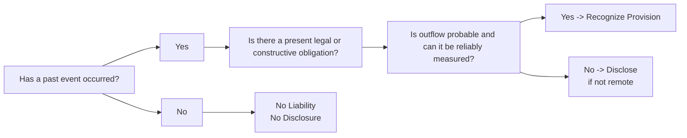

## Introduction
Contingent liabilities and provisions can significantly influence a company’s balance sheet and investors’ perception of its financial health. They represent uncertain future outflows that hinge on events or conditions beyond a firm’s full control. Understanding their recognition and measurement—especially the differences between IFRS and US GAAP—is critical for anyone analyzing financial statements at an advanced level. In practice, misclassifying or mismeasuring provisions or contingencies can conceal meaningful risks or misstate a firm’s net worth.

In this section, we’ll lay out the main considerations behind contingent liabilities and provisions, focusing on criteria for recognition, common examples such as legal claims and warranty obligations, and how to analyze their impact on a company’s overall financial position. We’ll also consider the effect of potentially large environmental obligations, litigation costs, and how cross-border comparisons can be challenging.

## Key Definitions
Before we dive into the technical underpinnings, let’s clarify some key terms:

• Contingent Liability: A possible obligation that arises from past events whose outcome is uncertain and not fully within the entity’s control. Its ultimate crystallization depends on future events.  
• Provision (IFRS): A liability of uncertain timing or amount recognized when specific criteria are met, such as a present obligation and a probable outflow of resources.  
• Present Obligation: An obligation resulting from past events that leaves the entity with no realistic alternative to settling it—i.e., it is effectively unavoidable.  
• Probable Outflow: Under IFRS, generally means “more likely than not” (above 50%). Under US GAAP, “probable” often implies a higher standard—some interpret it around 70–80%.  
• Reliable Estimate: The amount of the obligation can be measured with a reasonable degree of certainty or reliability.  

In IFRS, the governing standard is IAS 37 (Provisions, Contingent Liabilities, and Contingent Assets), whereas in US GAAP, ASC 450 (Contingencies) covers similar ground for the recognition and measurement of contingencies.

## Recognition Criteria
Under IAS 37, an entity recognizes a provision on the balance sheet if all three of these conditions are met:  

1. There is a present obligation (either legal or constructive) resulting from a past event.  
2. It is probable (more likely than not) that an outflow of economic resources will be required.  
3. The amount of this outflow can be reliably estimated.  

When the probability of outflow is not met (or the criteria for recognition fall short), the obligation usually remains off-balance sheet, disclosed only if the possibility of an outflow is not remote.

Under US GAAP (ASC 450), the thresholds for recognition are slightly different. A loss contingency is recognized if:  

• It is probable that a liability has been incurred at the financial statement date.  
• The amount of the loss can be reasonably estimated.  

If the loss is only “reasonably possible” (rather than “probable”), or if the loss cannot be reliably measured, GAAP typically requires disclosure in the footnotes—though no accrual is made.

## Measurement Approaches
When provisions are recognized, they should reflect the best estimate of the expenditure needed to settle the obligation at the reporting date. If there’s a range of possible outcomes, IFRS encourages using the midpoint of the range or a probability-weighted average, while US GAAP typically requires the “most likely” point or, if no point in the range is more likely, the minimum of the range may be used.  

Because such estimates inherently involve judgments about future events, organizations often rely on historical data (e.g., typical settlement outcomes for lawsuits) and expert opinions (for environmental liabilities or technical warranties). While these estimates can be revised over time, the potential for error or manipulation means analysts must carefully scrutinize the metrics and assumptions used.

## Common Types of Provisions and Contingencies
Provisions can arise in many different forms. Let’s look at the types most frequently encountered in practice:

• Legal Claims (Litigation Contingencies): Lawsuits or claims pending against the firm can lead to obligations if the courts or regulatory bodies determine the firm should bear liability. The timing of these outcomes is often uncertain, and settlements can be material.  
• Environmental Obligations: Companies in extractive or high-pollution industries may face clean-up costs or decommissioning liabilities. As these obligations often stretch over decades, assumptions about future regulation, technology, and discount rates play a huge role in measurement.  
• Warranty Obligations: Firms that sell products typically offer warranties. They must set up a provision for expected costs of repairs or replacements. Historical warranty claim rates can inform the “probable outflow” under IFRS or “probable and estimable” under US GAAP.  
• Restructuring Provisions: In IFRS, restructuring provisions are recognized if the company has a detailed formal plan and has raised valid expectations in affected parties (e.g., employees). US GAAP has more specific guidelines on when to recognize severance and exit costs.  

## A Visual Overview
Below is a simple flow diagram illustrating the typical decision tree an organization follows to determine whether a contingent obligation should be recognized as a provision, disclosed, or neither:

## Analyzing Changes in Provisions
For many analysts, an entity’s repetitive ability to accurately estimate and manage provisions is a signal of the reliability of its financial reporting. Differences between prior-year provisions and actual settlements can reveal whether management is consistently overestimating (being conservative) or underestimating (potentially aggressive). Examining roll-forwards of provisions (which show the beginning balance, additions, usage, and reversals) in the notes is often enlightening.

Some points to remember:
• Large negative adjustments in future periods might indicate prior overestimation.  
• Unexpected large increases might signify underestimation in earlier periods or the emergence of new obligations.  
• Frequent reversals without clear explanations raise questions about earnings management or “cookie-jar accounting,” in which excess provisions are created in good years and reversed in lean years to bolster reported earnings.

## Cross-Border Comparisons
Because IFRS and US GAAP apply slightly different thresholds for what is considered “probable,” comparing provisions across jurisdictions—particularly within the same industry—requires some care. One firm might accrue for a legal claim earlier under IFRS, whereas another might only disclose it under US GAAP if it deems the likelihood short of “probable.”  

In addition, IFRS sometimes calls for a more probability-weighted approach, while US GAAP typically focuses on the best possible estimate or the low end of a range. Hence, an analyst must account for these subtle differences in measurement and presentation before making judgments about relative risk levels across multinational firms.

## Real-World Example
Consider a global electronics manufacturer that faces warranty liabilities for its next-generation smartphones. According to IFRS, the firm examines its historical warranty claims record, the complexity of the new smartphone’s design, and any known defects. Management determines a probable outflow of approximately $20 million for the next 12 months. This amount is recognized as a warranty provision. If the firm used US GAAP, it would check whether an obligation is probable and can be estimated reliably. Assuming the same facts, it might similarly record a $20 million accrual, though differences can still arise from internal interpretations and how management weighs the evidence.

Separately, the same firm might face a legal claim from a competitor, accusing it of patent infringement. Suppose the legal team believes the outcome is only probable at a 45% confidence level. Under IFRS, that might remain off-balance sheet, but a note might be included if the possibility isn’t remote. For US GAAP, since the probability is not likely above 70–80% (depending on the firm’s internal policy for “probable”), no accrual is recognized. The potential liability, if “reasonably possible,” is disclosed with an estimate (if known).

## Impact on Financial Ratios
Significant provisions affect the balance sheet, net income, and, consequently, key ratios:

• Profitability Ratios (e.g., Net Margin): Large provisions can reduce net income, lowering measures of profitability.  
• Debt to Equity or Leverage Ratios: Recognizing a provision increases liabilities. Higher liabilities mean higher leverage, which may breach debt covenants or raise questions about solvency.  
• Liquidity Ratios: Current provisions can reduce the current ratio and potentially tighten short-term liquidity metrics.  

Changes in provisions also impact cash flow statements if they result in real settlements during the period. However, the initial recognition of a provision usually affects only non-cash accounts (it doesn’t immediately result in a cash outflow until it is settled).

## Best Practices and Common Pitfalls
• Consistent Methodology: A well-documented approach to probability assessment and measurement fosters transparency and comparability.  
• Monitoring Actual Outcomes: Tracking actual settlements versus projected outflows over time can reveal management’s pattern of overbooking or underbooking provisions.  
• Disclosures: Analysts should read the footnotes thoroughly—especially for litigation or environmental issues, which can be material and subject to significant uncertainty.  
• Watch for Earnings Smoothing: Companies sometimes use provisions as a means to “smooth” earnings. If you see large swings in provisions paired with suspiciously stable net income, that’s a red flag.  

## Exam Relevance
For the CFA Level III (and indeed advanced Level I or II) exam, you might encounter scenario-based questions that require evaluating how certain contingencies should be accounted for under IFRS vs. US GAAP. You might be asked to:

• Decide whether to recognize or disclose a contingency.  
• Assess how the difference in threshold (for example, “probable” IFRS vs. “probable” US GAAP) affects reported net income and leverage.  
• Identify how changes in provisions from year to year might signal risk of earnings manipulation or strong financial management.

The ability to read a scenario, spot subtle differences in probability thresholds, and interpret balance sheet notes effectively can mean the difference in answering a question accurately within the exam’s time constraints.

## Conclusion
Contingent liabilities and provisions sit at the intersection of legal risk, operational realities, and financial reporting. Their recognition and measurement are often peppered with uncertainty, making them a prime area for potential misstatement or creative accounting. For analysts, paying close attention to note disclosures, comparing prior estimates to actual outcomes, and understanding IFRS vs. US GAAP differences are essential steps in building a holistic balance sheet analysis. Even a single large provision (such as an environmental cleanup or legal settlement) can reshape an organization’s liquidity, solvency, and overall risk profile.

Given the many gray areas and subjective judgments involved, this field can be both fascinating and complex. By applying a solid framework—focusing on the event, the obligation, the probability, and the reliability of estimates—you can cut through much of the noise and assess whether a reported liability truly reflects the underlying exposure.

## References & Further Reading
• IAS 37 – Provisions, Contingent Liabilities and Contingent Assets (www.ifrs.org)  
• FASB ASC 450 – Contingencies (www.fasb.org)  
• “Wiley IFRS 2023: Interpretation and Application of International Financial Reporting Standards”  
• CFA Institute – CFA Program Curriculum, Financial Reporting and Analysis sections  

## Test Your Knowledge: Contingent Liabilities and Provisions



### Which of the following best describes a contingent liability under IFRS?
- [ ] A liability that is always recognized immediately on the balance sheet.  
- [x] A possible obligation arising from past events, whose outcome depends on future events.  
- [ ] A liability that should only be disclosed if the probability of outflow is zero.  
- [ ] An assured amount payable when a fixed cost is incurred.  

> **Explanation:** A contingent liability depends on uncertain future events and is recognized only if certain probability and measurement thresholds are met.

### How does IFRS typically define “probable” in the context of recognizing a provision?
- [ ] Less than 25% chance of occurrence.  
- [ ] Between 25% and 50% chance.  
- [x] More likely than not (above 50%).  
- [ ] At least 90% chance of occurrence.  

> **Explanation:** Under IFRS, “probable” generally means “more likely than not,” so it is over the 50% mark.

### Under US GAAP (ASC 450), what is a key requirement for recognizing a contingency?
- [x] The loss must be probable, and the amount can be reasonably estimated.  
- [ ] The event must have already occurred, regardless of the likelihood.  
- [ ] The upper bound of the liability must be clearly determinable.  
- [ ] The board of directors must formally approve management’s estimate.  

> **Explanation:** US GAAP requires that the liability is probable and that management can reasonably measure or estimate the amount of the loss.

### Which of the following provisions would most likely appear on the balance sheet?
- [ ] A contingent liability that has only a remote chance of requiring settlement.  
- [ ] A planned upgrade to a major asset next year.  
- [ ] A lawsuit management believes has a 40% chance of an unfavorable outcome.  
- [x] A warranty obligation expected to result in future outflows based on historical claims.  

> **Explanation:** Warranty obligations typically meet recognition criteria because they are probable and can be reliably estimated using historical data.

### What is a common risk associated with provisions when companies manage their earnings?
- [x] “Cookie-jar accounting,” where excessive provisions are reversed in later periods to inflate profits.  
- [ ] Systematic underreporting of expenses across all years.  
- [ ] Complete inability to estimate any future outflow with reliability.  
- [ ] Immediate recognition of all possible losses even if unlikely.  

> **Explanation:** Companies might record higher provisions in profitable years and then reverse those provisions in poorer years, smoothing reported earnings.

### How might an analyst detect potential earnings management in provisions over time?
- [x] Compare historical provisions to actual outflows each year and look for systematic overestimation or underestimation patterns.  
- [ ] Strictly rely on audit reports.  
- [ ] Ignore the notes on contingent liabilities since only recognized liabilities matter.  
- [ ] Assume all provisions are accurate if the external auditor issued an unqualified opinion.  

> **Explanation:** Roll-forward analyses and year-over-year comparisons are crucial for detecting patterns of over- or under-estimation in provisions.

### Why can comparing provisions across companies operating under different accounting frameworks be difficult?
- [ ] Companies often choose not to release annual reports at the same time.  
- [x] IFRS and US GAAP have different definitions of “probable,” leading to varying thresholds for recognition.  
- [ ] Provision data are always presented in different currencies.  
- [ ] IFRS does not require disclosures of contingent liabilities.  

> **Explanation:** IFRS’s “more likely than not” vs. US GAAP’s higher threshold for “probable” can lead to significant recognition differences.

### Under IAS 37, how is the measurement for a provision typically determined?
- [x] Based on the best estimate of the expenditure required to settle the present obligation.  
- [ ] By taking the minimum possible amount in a range.  
- [ ] By ignoring any probability weighting and strictly using the midpoint.  
- [ ] By applying an automatic 10% risk premium above the maximum possible amount.  

> **Explanation:** IAS 37 states that provisions should be measured at the best estimate of what is required to settle the present obligation at the balance sheet date.

### Which statement accurately reflects the possible outcomes for a contingent liability that does not meet recognition criteria?
- [x] It should be disclosed in the notes if the outflow is more than remote, but not probable.  
- [ ] It should always remain unrecorded and undisclosed.  
- [ ] It should be partially recognized as an asset.  
- [ ] It must be accelerated 100% within the income statement.  

> **Explanation:** When it is not probable but still more than remote, it is disclosed in the footnotes for transparency.

### True or False: If an event is only “reasonably possible” under US GAAP, the contingency should be accrued on the balance sheet.
- [ ] True  
- [x] False  

> **Explanation:** Under US GAAP (ASC 450), a contingency is only accrued if it is “probable” and “reasonably estimable.” If it’s just “reasonably possible,” it gets disclosed but not accrued.


