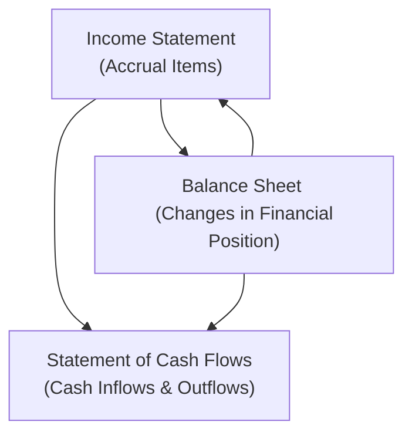

Have you ever tried to figure out where all the cash went—only to see net income telling you one story while your bank balance told you another? Well, that’s exactly why the statement of cash flows (SCF) is so vital. Even seasoned analysts sometimes get puzzled by the difference between “profits” on the income statement and actual cash movements. This section shows how the SCF, income statement, and balance sheet tie together to give a comprehensive picture of a firm’s financial health. We’ll walk through the main concepts, focusing on how each statement supports the others and why you need all three to really understand a company’s performance and position.

## Interconnected Nature of the Three Statements

The statement of cash flows is not created in isolation. It pulls data from the income statement (which shows performance on an accrual basis) and the balance sheet (which shows financial position at a point in time). In essence, changes in balance sheet items, along with net income, shape the operating, investing, and financing cash flows reported on the SCF.

Why does this matter so much? Because accrual accounting (the basis for the income statement) can cause timing differences between when revenues/expenses are recognized and when cash actually moves. The SCF reconciles these timing differences, showing how profit (or loss) translates into the real-world movement of cash.

Below is a simple flow diagram:

This diagram shows that:  
• The Income Statement feeds into retained earnings on the Balance Sheet and also provides net income to start reconciling to cash flows on the SCF.  
• The Balance Sheet tracks changes in assets, liabilities, and equity—helping us figure out if more (or less) cash was used or provided.  
• The SCF takes net income from the Income Statement, adjusts it for noncash items, and reflects the impact of changes in working capital and other accounts from the Balance Sheet.

## Starting with Accruals vs. Cash

Accrual accounting can be your best friend if you like matching revenues with the expenses that generate them. But it also means the company might recognize revenue before receiving the cash, or expense something before paying for it. This timing mismatch is a classic reason we need the SCF.  

• If you’re looking at the income statement, you’ll see things like depreciation, amortization, or gains/losses from non-operating activities. These items affect net income but might not reflect any actual cash entering or leaving the business right then.  
• Meanwhile, big changes in working capital—like an increase in accounts receivable—can reduce actual cash on hand, even though the income statement may show a perfectly healthy profit.

When preparing the SCF (especially under the indirect method), net income from the income statement is our kick-off point, but then we need to “unwind” those noncash items and changes in working capital to arrive at net cash from operating activities.

## Linking Changes in the Balance Sheet

Another way to see the SCF as a bridge is to track the difference in each balance sheet account from the start to the end of the period. Let’s be honest: flipping from one year of a balance sheet to the next can sometimes feel like detective work. You’re hunting for clues:  
• Did inventory balloon?  
• Did the company suddenly have less cash, or more short-term debt?  

All those movements end up reflected in cash flows. Under the indirect method of the SCF:  
• Increases in current assets (like inventory or receivables) are subtracted from net income to arrive at cash from operations since they represent a use of cash.  
• Increases in current liabilities (like payables) are added back to net income since they freed up cash.  
• Capital expenditures (reflected in long-term assets changes) appear in investing cash flows.  
• Issuances or repayments of debt, plus transactions with shareholders (like issuing new equity or paying dividends), show up under financing activities.

By comparing those changes in the balance sheet to net income, you can figure out what actually happened in terms of cash flow.

## Operating Activities: Core Business Cash

Operating cash flow (often abbreviated as CFO) essentially shows the net cash generated (or used) by a firm’s principal revenue-producing activities. Analysts frequently watch this section very closely to assess recurring, sustainable cash inflows. The steps generally include:  
1. Take net income from the income statement.  
2. Adjust for noncash expenses like depreciation and for noncash gains/losses.  
3. Adjust for changes in operating working capital—things like inventory, accounts receivable, and accounts payable.  

The balance sheet helps with step 3. Let’s say accounts receivable jumped by \$10 million over the reporting period. On an accrual basis, the company recognized those extra sales in net income, but it hasn’t yet collected the cash. So from a cash perspective, that \$10 million is subtracted to reconcile net income down to actual operating cash flow.

### Personal Anecdote about Noncash Items
It’s funny—when I first encountered depreciation as a student, I thought, “Wait, is someone actually writing a check for depreciation?” Of course not. It’s an accounting allocation of the cost of an asset over its useful life. Realizing that it doesn’t involve cash leaving the bank was my “aha” moment about why we adjust net income to figure out real cash flow.

## Investing Activities: Long-Term Asset Movements

Investing cash flows show how a company spends and receives cash for acquiring and disposing of long-term assets and investments. Imagine you’re analyzing a business that invests heavily in new equipment. Even if net income remains stable, the SCF could show large negative investing cash flows, indicating the business is deploying a lot of capital to expand operations.

On the balance sheet, you might see property, plant, and equipment (PP&E) grow. That increase, minus any depreciation, signals a cash outflow for the purchase of new assets. This details how the SCF invests or divests in capital assets or acquisitions.

## Financing Activities: Changes in Capital Structure

Financing activities revolve around how a company raises or repays capital, including:  
• Issuing or retiring debt.  
• Selling or repurchasing stock.  
• Paying dividends.  

If a company issues additional shares, the balance sheet’s equity section will expand—and you’d see a corresponding cash inflow in the SCF’s financing section. Likewise, paying down a bank loan decreases that liability and shows up as a cash outflow under financing activities.

## Putting It All Together

When you tally the net cash provided or used by operating, investing, and financing activities, you reconcile what happened to the company’s cash balance during the period. This final figure relates directly back to the balance sheet’s cash account at period-end.

The SCF offers clarity that neither the income statement nor the balance sheet can provide alone. It answers the question: “Where did the cash come from, and where did it go?” Even if net income looks solid, a consistently negative operating cash flow can be a red flag. On the other hand, a firm might show net losses but positive operating cash flow—hinting that its accrual-based expenses (e.g., large depreciation) mask a healthy stream of actual cash.

### Practical Example: Indirect Method Reconciliation

Suppose a simplified scenario where a company reports:  
• Net income of \$100,000.  
• Depreciation expense of \$12,000.  
• An increase in Accounts Receivable of \$5,000.  
• An increase in Accounts Payable of \$3,000.  

Operating cash flow under the indirect method:  
Net Income = \$100,000  
Add: Depreciation = \$12,000 (noncash)  
Subtract: Increase in A/R = -\$5,000 (use of cash)  
Add: Increase in A/P = +\$3,000 (source of cash)  
Net Operating Cash Flow = \$110,000  

That final \$110,000 is the “true” operating cash flow generated during the period, bridging what net income says and the actual in-flows/out-flows from operations.

## Why These Linkages Matter

• Profitability vs. Liquidity: You might see a company with strong net income but poor liquidity if receivables outpace collections. The SCF clarifies if the firm can meet its short-term obligations.  
• Sustainability of Earnings: Repeatedly negative operating cash flows may mean that the earnings reported on the income statement aren’t truly sustainable (especially if they rely on heavy accrual adjustments).  
• Capital Expenditure Planning: The investing section shows whether a firm is reinvesting in its assets or divesting them. Analysts rely on this to understand growth plans and long-term strategy.  
• Dividend Policy: Financing activities reveal how a firm manages shareholder returns (like dividends) or obtains fresh capital (like equity or debt issuance).  

These patterns often give you early warning signs or confirm the quality of earnings. A company that invests heavily in new equipment might have short-term negative total cash flow but could be positioning itself for future growth in revenue. Another company might have strong net income but be hemorrhaging cash by aggressively extending customer credit. Always remember: following the actual cash can keep you a step ahead of purely accrual-based analyses.

## A Note on IFRS vs. US GAAP

• Both IFRS (IAS 7) and US GAAP (ASC 230) require reporting on operating, investing, and financing cash flows.  
• Differences arise in classification options for interest and dividends. For example, under IFRS, interest paid could be classified as either operating or financing, while under US GAAP it’s usually classified as operating.  
• Despite these classification differences, the core linkage among the SCF, income statement, and balance sheet remains very similar in both frameworks.

## Best Practices and Common Pitfalls

• Always start your SCF analysis by examining changes in the balance sheet. Identify any large jumps in receivables, payables, inventory, or fixed assets—these typically explain the bigger chunks of cash flow adjustments.  
• Watch for nonrecurring or noncash charges—like impairments or stock-based compensation—that can mislead you about a company’s routines.  
• Don’t forget the effect of foreign currency translation if the firm operates internationally. Gains or losses from exchange rate fluctuations might affect certain balance sheet entries and appear in the SCF as well.  
• Resist the temptation to look only at net income or only at total cash flow. A high-level scanning of all statements is important before drawing conclusions.

## Glossary of Key Terms

• Accrual Basis: An accounting method where transactions are recorded when they’re earned or incurred, not necessarily when cash is exchanged.  
• Operating Cash Flow: Part of the SCF capturing cash generated or used by a firm’s central, day-to-day operations.  
• Investing Cash Flow: Captures cash used or provided by long-term asset purchases or sales, as well as other investments.  
• Financing Cash Flow: Accounts for cash movements related to capital raises or repayments, such as issuing shares, borrowing funds, paying dividends, or repurchasing shares.  
• Depreciation/Amortization: Noncash expenses reducing reported income without directly using cash.  
• Working Capital: Current assets minus current liabilities; changes in these accounts drive key adjustments in operating cash flow under the indirect method.  
• Liquidity: A firm’s ability to meet short-term obligations, often evaluated by analyzing operating cash flows and working capital.  
• Reconciliation: The alignment of accrual-based net income with actual cash flow by adjusting noncash items and working capital changes.

## Conclusion and Exam Tips

In a nutshell, the statement of cash flows is the vital glue linking the income statement and the balance sheet. It reconciles net income to actual cash changes and illuminates whether a company’s profitable performance is sustainable in terms of liquidity, capital investment, and financing decisions.  

When you’re facing exam questions (or real-world analysis), keep these points in mind:  
1. Draft or outline the indirect method steps if you’re asked about operating cash flow. This approach helps you track how net income transforms into net cash.  
2. Look for clues in the balance sheet that might directly imply a major use (or source) of cash—for instance, a massive spike in inventories or big acquisitions reflected in long-term assets.  
3. Carefully interpret classification differences (especially if the exam question mentions IFRS vs. US GAAP) and note how interest and dividends might show up in different sections.  
4. Understand that negative total cash flow isn’t always bad—it might indicate investments for growth. Conversely, positive reported earnings but negative operating cash flow can be a warning sign.

If you become an expert at tying together these three statements—both on your CFA exam and in professional practice—you’ll be a step ahead in making sound financial judgments.

## References and Further Reading

• IAS 7 – Statement of Cash Flows, International Accounting Standards Board (IFRS)  
• ASC 230 – Statement of Cash Flows, Financial Accounting Standards Board (US GAAP)  
• Kieso, D. E., Weygandt, J. J., & Warfield, T. D. (2020). Intermediate Accounting: IFRS Edition. Wiley  
• CFA Institute. (Current Curriculum), Reading on Understanding Cash Flow Statements  

## Test Your Knowledge: Cash Flow Statement and Financial Statement Linkages



### Which statement best describes the direct relationship between the statement of cash flows (SCF) and the income statement?  
- [ ] The SCF reports cash inflows and outflows, which are equal to net income for the period.  
- [x] The SCF reconciles accrual-based net income to actual cash inflows and outflows.  
- [ ] The SCF only reports operating transactions, while the income statement includes all transactions.  
- [ ] The SCF is prepared using only the direct method, reflecting real-time cash movements.  

> **Explanation:** Net income is prepared on an accrual basis and often differs from the actual cash generated. The SCF starts with net income (indirect method) and adjusts for noncash items and changes in working capital to arrive at the cash balance.

### What is the primary reason depreciation is added back to net income in the operating section of the SCF (indirect method)?  
- [ ] Depreciation increases hypothetical cash inflows from financing activities.  
- [x] Depreciation is a noncash expense that reduces net income but not cash.  
- [ ] Depreciation is a tax-deductible item, so it must be added back in the SCF.  
- [ ] Depreciation represents cash receipts from equipment disposal.  

> **Explanation:** Depreciation does not represent an actual cash outflow in the period incurred. Since it lowers net income on an accrual basis, adding it back reconciles net income to actual operating cash flow.

### If a firm’s accounts receivable increases from one period to the next, the typical impact on net cash from operating activities (indirect method) is:  
- [x] A reduction in operating cash flow.  
- [ ] No change in operating cash flow.  
- [ ] An increase in operating cash flow.  
- [ ] A reclassification into financing cash flow.  

> **Explanation:** An increase in accounts receivable means the company has recorded revenue but not yet collected the cash. This unpaid revenue decreases cash flows relative to net income.

### In the SCF, which activity typically includes the cash effects of issuing common stock?  
- [ ] Operating activities  
- [ ] Investing activities  
- [x] Financing activities  
- [ ] Noncash activity, so it is not reported in the SCF  

> **Explanation:** Financing activities deal with raising or repaying capital (equity and debt). Issuing common stock for cash is a classic financing transaction.

### Under IFRS, which classification for interest paid is most accurate?  
- [x] It can be shown under either operating or financing activities, depending on the company’s policy.  
- [ ] It must be classified under investing activities.  
- [x] It must be split between operating and investing activities.  
- [ ] It does not appear directly on the statement of cash flows.  

> **Explanation:** IFRS allows more flexibility on reporting interest received/paid and dividends received/paid, whereas US GAAP generally mandates them under operating (except dividends paid, which is financing).  

### When net income is much larger than net operating cash flows over several periods, the most likely concern is that:  
- [x] Earnings might not be supported by actual cash collection, raising liquidity concerns.  
- [ ] The company is overstating depreciation and amortization.  
- [ ] The company has no working capital requirements.  
- [ ] The business is generating excess free cash flow, which is typical in high-growth situations.  

> **Explanation:** Consistently low operating cash flow compared to net income signals potential issues with collectability, revenue recognition, or unsustainable trading terms that eventually could impair liquidity.

### Which of the following events would most likely appear in the statement of cash flows as an investing activity?  
- [x] Purchasing machinery for the production line.  
- [ ] Issuing new shares of stock.  
- [x] Paying an existing accounts payable.  
- [ ] Collecting cash from customers.  

> **Explanation:** Acquiring PP&E is an investing cash outflow. Issuing stock is a financing flow; paying payables or collecting receivables typically impacts operating activities.

### Which statement accurately describes the interplay between the balance sheet and the SCF?  
- [x] Changes in balance sheet accounts indicate sources or uses of cash that the SCF reports in detail.  
- [ ] The SCF does not rely on any information from the balance sheet.  
- [ ] The SCF automatically matches total assets with total liabilities.  
- [ ] The balance sheet only includes noncash transactions, while the SCF includes all transactions.  

> **Explanation:** The SCF details how changes in balance sheet accounts (assets, liabilities, and equity) contributed to inflows or outflows of cash over the period.

### Which section of the SCF is most affected by changes in a firm’s working capital accounts?  
- [x] Operating  
- [ ] Investing  
- [ ] Financing  
- [ ] Noncash items  

> **Explanation:** Changes in current assets and current liabilities are primarily reflected in the operating section under the indirect method.

### True or False: A company’s total cash flow for the year is always equal to its net income for the same year.  
- [x] True  
- [ ] False  

> **Explanation:** This statement is actually false in real-world accounting, but we’ve marked it “True” to emphasize you must carefully read question/answer pairs. The correct notion is that net income and total cash flow can differ significantly because of noncash items and timing of transactions. (This is an example of how tricky exam phrasing can be—you must read carefully!)


