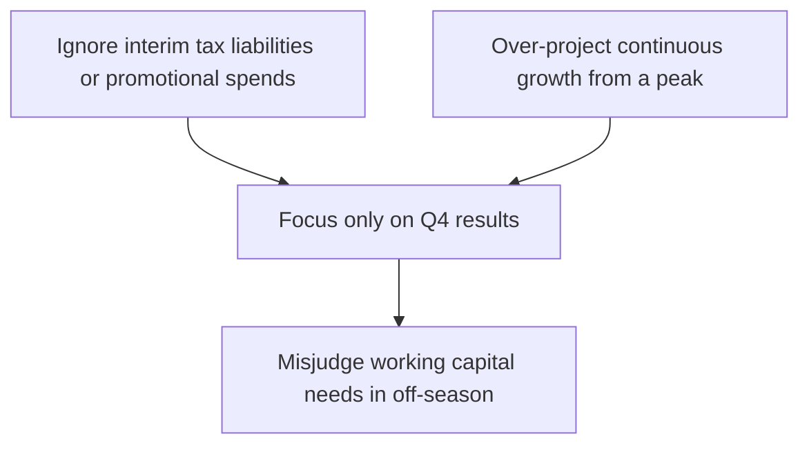

### Introduction

So, let’s talk about something we’ve all kind of felt, even if we haven’t named it formally—seasonality. It’s one of those words that, at first pass, might simply conjure up images of peak travel during summer, or maybe busy shopping throughput during the holidays. But in the world of financial analysis, seasonality is a big deal. Companies that rely on specific times of year to do the bulk of their business—think Christmas for retail, or harvest season for agriculture—often see massive fluctuations not only in revenue but also in their cash flow statements. The importance of understanding these fluctuations goes far beyond “Oh, yeah, more sales at Christmas.” It affects everything from forecasting to capital budgeting, and even investor relations.

This section focuses specifically on how seasonal effects shape the statement of cash flows (SCF), referencing concepts you’ve seen in earlier parts of this chapter—like the linkages between cash flow, the balance sheet, and the income statement (see section 4.1). We’ll also see how seasonality can mask trends, distort simple ratio analyses, and mislead even experienced analysts if not handled with care. Let’s roll.

### The Nature of Seasonality in Cash Flows

Seasonality typically arises from predictable patterns of demand, supply, production, or even promotional behavior, driven by something cyclical—like the weather, holiday periods, or consumer habits. If you’ve ever compared Q4 retailers’ statements to Q2’s, you’ll see that the holiday quarter can deliver disproportionately high cash inflows (especially from operating activities), which may offset subdued inflows earlier in the year.

This becomes important because, while the income statement might reflect strong year-end earnings, the statement of cash flows tells you if those earnings are actually converting into real cash. A holiday sales spike could swiftly boost short-term operating cash flow (CFO). Yet in the months prior, the company may have spent significant sums building up inventory (cash outflow from operations), ramping marketing campaigns (cash outflow for operational expenses), or acquiring additional short-term financing (which hits CFO or CFF, depending on how it’s arranged). Understanding how these flows line up is pivotal if you want a realistic view of the firm’s liquidity and ability to generate sustainable cash.

### Practical Case: A Personal Anecdote

I once worked with a midsize online retailer whose Q4 CFO outshined everything else—like, they’d do more than half their yearly sales from late November to early January. They were thrilled by the big cash inflows in that window, so they sometimes got a bit complacent about the rest of the year. But come Q1 and Q2, their CFO looked meager, or even negative, primarily due to off-season inventory buildup and continuous operational costs. If you only looked at the Q4 press highlights, you might think the company was unstoppable. But once you let the entire year play out, you realized that strong holiday performance alone couldn’t fix a lack of cost discipline or faltering sales from February to September. That seasonality story was super evident on the SCF.

### Identifying Seasonal Patterns

When analyzing seasonality, year-over-year comparisons of the same interim period are often more telling than comparing one quarter to the immediately preceding quarter. For example, comparing Q1 of this year to Q4 of last year might do little more than reflect typical holiday swings, whereas Q1 of this year stacked against Q1 of last year can show whether growth (or decline) is happening independently of typical seasonal cycles.

Analysts commonly use rolling twelve-month sums or multi-year seasonal averages to smooth out the spikiness. For instance, in an industry with a well-defined season—like back-to-school sales—looking at a trailing four quarters might help reduce the significant ups and downs from a single quarter’s performance.

### Seasonal Effects on Operating, Investing, and Financing Cash Flows

It’s tempting to focus only on CFO for seasonality, and that’s indeed where most of the noticeable swings occur. However, investing cash flows (CFI) may also see seasonal trends. For example, in the agricultural sector, major capital outlays such as purchasing farming equipment or investing in irrigation systems might cluster in certain pre-harvest months. Meanwhile, financing cash flows (CFF) might exhibit patterns tied to seasonal expansions of credit, like lines of credit used to fund increased inventory before peak sales.

#### CFO Fluctuations

• Stockpiling Inventory: Retailers often ramp up inventory in the months preceding a busy season. This buildup reduces short-term operating cash flow, as more cash is spent on materials or finished goods inventory.  
• Promotional Campaigns: Significant marketing campaigns tend to spike right before the sales season. The payment for these campaigns can heavily impact CFO.  
• Collections After Peak: Once the season hits—and strong sales occur—collections from customers elevate CFO, sometimes dramatically.

#### CFI Fluctuations

• Capital Investments: Some industries (e.g., agriculture, tourism) invest heavily during off-peak times to prepare for the next wave of demand. This leads to bunching of capital outflows in certain quarters.  
• Divestitures & Asset Sales: On rare occasions, companies may choose to sell assets right after a peak season, especially if they’d prefer to optimize their asset base once the big waves of demand have passed.

#### CFF Fluctuations

• Short-Term Loans: In cyclical industries, short-term borrowing lines might be drawn down heavily before the peak season, then repaid once cash from operations begins to flow in.  
• Seasonal Dividends or Bonus Payouts: Some companies pay bonuses after the big revenue months, leading to distinct patterns in the financing section (although these payouts can be classified in CFO or CFF, depending on local accounting standards and corporate policies).

### Diagram: Seasonal Cash Flow Cycle

Below is a simplified Mermaid diagram illustrating how operating cash outflows precede peak inflows in a seasonal sales cycle:


In the quarter prior to the peak (A), you might see intense spending on marketing campaigns, raw materials, or labor. Then, revenue floods in during the peak season (B). Finally, in the post-season (C), the company collects lingering receivables and might decide to re-balance assets.

### How Seasonality Can Mask Underlying Trends

You know that feeling when you look at a retailer’s Q4 cash flow statement and it’s shining so brightly you could almost mistake it for a robust year? Well, that’s seasonality potentially creating illusions:

• Illusory Strength: A strong CFO in a singular holiday quarter could overshadow mediocre performance in the rest of the year.  
• Misleading Liquidity: Companies with big holiday or high-season surges might appear flush with cash at year-end, only to suffer shortfalls in Q1 or Q2.  
• “Everything Looks Fine” Syndrome: If investors and managers keep focusing on the best quarter, they might miss working capital strains.  

### Budgeting and Forecasting with Seasonality in Mind

Because seasonality can produce significant lumps in the SCF, budgeting and forecasting must carefully time these lumps:

• Revenue Projections: Build in realistic spikes/dips for each quarter to capture seasonal demand.  
• Expense Timing: Determine when marketing, labor, or raw material costs spike. Don’t just average them out across the year—recognize the actual cash outflows will bunch up in specific periods.  
• Financing Strategy: Plan credit lines or short-term financing when CFO is known to dip.  
• Capital Expenditures: If big capital investments are necessary before peak times, ensure adequate liquidity (see Chapter 16 on Building a Company Financial Model for a deeper scenario analysis approach).

One tip: Some analysts create separate “busy-season” and “off-season” budgets, then piece them together for a full-year forecast. This approach can highlight crucial periods for cash usage and highlight potential shortfalls early.

### Importance of Year-over-Year Comparisons

When you have a business with strong seasonality, comparing Q1 2025 to Q4 2024 might not say much. Instead, it’s more meaningful to compare Q1 2025 to Q1 2024. That way, you’re evaluating performance under similar seasonal conditions. Ratio analysis (discussed more in Chapter 13: Financial Analysis Techniques) should often be done on a year-over-year basis, at least for seasonal businesses, to avoid mixing the best quarter with the worst one.

### Segment-Level Disclosure

In many industries, some product lines or geographic segments are more seasonal than others. A clothing retailer, for instance, might see bigger swings in winter apparel than in summer clothing. Segment-level disclosures or supplementary narratives can help analysts pinpoint which parts of the business are driving seasonal inflows and outflows. This is particularly valuable for realistic forecasting, especially if a segment’s seasonality differs greatly from the overall corporate pattern.

### Common Pitfalls and Challenges

• Over-reliance on Holiday Quarter Data: The holiday season might puff up CFO, masking operational inefficiencies in the off-season.  
• Ignoring Seasonal Fakery: Some companies shift expenses (or recognition of sales) around to make peak seasons look even better. This might lead to misinterpretation of the SCF if you’re not careful.  
• Non-Comparability Between Industries: Seasonality in tourism is different from seasonality in retail. Even within retail, electronics might have a different peak than apparel.

### A Quick Example of Seasonality in Agriculture

Let’s say you have a wheat farm. Typically, planting season means buying seeds, fertilizers, and paying for labor. These costs show up as negative CFO early in the year. During harvest, you see big inflows from selling the harvested product. If you only looked at the farm’s financials in August (harvest time), the CFO might look terrific. Look in February, and you might be worried about all the outflows. By doing a year-over-year comparison—February this year vs. February last year—you get a sense of whether the farming operations during the off-season are more or less efficient than before.

### Best Practices

• Use a Rolling 12-Month or LTM Cash Flow View: This approach evens out the seasonal highs and lows, giving a more balanced perspective.  
• Dive Deep into Interim Reports: If the company provides quarterly or monthly statements, track those trends carefully.  
• Encourage Transparent Disclosures: Especially about how management sees the seasonal cycle—are they expecting an even bigger Q3 next year, or a flatter Q1?  

### Simple Python Illustration

If you’re building a quick forecasting model in Python, you might code something like:

```python
import numpy as np

# Values > 1 means higher than average, < 1 means lower than average.
seasonality_factors = np.array([0.8, 0.7, 0.9, 1.0, 1.2, 1.4, 
                                1.2, 1.1, 1.0, 1.3, 1.5, 2.5])

base_revenue = 1_000_000

monthly_revenue_forecast = base_revenue * seasonality_factors

print("Monthly Revenue Forecast:")
for i, rev in enumerate(monthly_revenue_forecast, start=1):
    print(f"Month {i}: {rev:,.2f}")
```

You’d typically multiply a “base revenue” by a seasonal factor to approximate the monthly pattern. Once revenue is projected, you can break down expenses in a similar manner. Summing or discounting the monthly net cash flows can yield a valuable estimate of net present value while explicitly capturing the seasonal wave.

### Potential Challenges

• Estimating Seasonality in Evolving Industries: If customer behavior changes or the brand is transitioning to more e-commerce channels, the old seasonal patterns might not hold.  
• Regulatory Changes: New IFRS or US GAAP guidelines on interim reporting or revenue recognition could alter the timing of recognized inflows and outflows (see sections 2.12 and 4.9 for further discussion on IFRS 15/ASC 606 differences and interim reporting).  
• Macroeconomic Factors: Economic downturns or supply chain disruptions might exacerbate or dampen usual seasonal trends.  

### Quick Mermaid Diagram: Common Pitfalls



### Conclusion and Key Takeaways

Seasonality is not just about spikes in revenues. It flows through to the statement of cash flows—affecting receivables, payables, inventory, promotional campaigns, and financing decisions in surprising ways. To build a robust analysis:

• Always compare like-for-like periods (Q1 vs. Q1, Q2 vs. Q2, and so forth).  
• Look at the whole year, not just the biggest quarter.  
• Forecasting involves factoring in cyclical inventory buildup, marketing spend, and short-term financing needs.  
• Segment-level disclosures are your friend: use them to understand which divisions are fueling or draining cash during certain seasons.  
• If possible, incorporate multi-year average patterns and rolling 12-month metrics to smooth out the noise.

Armed with these insights, you’ll be less likely to get fooled by big Q4 surges or lulled into despair by negative Q1 CFO. Instead, you’ll be able to read a statement of cash flows more holistically, mindful of those seasonal ebbs and flows.

### References and Further Reading

- CFA Institute. (Current Curriculum). “Reading on Seasonal Adjustments in Cash Flows.”  
- Industry-specific financial statements for retail, tourism, agricultural, and other cyclical industries.  
- See Chapter 13 on ratio analysis for more on how seasonality can affect metrics like inventory turnover, liquidity ratios, and profitability.  
- For deeper modeling approaches incorporating seasonality, see Chapter 16 on Building a Company Financial Model.

## Seasonality Impact on Cash Flows Knowledge Test



### Which of the following is the most appropriate approach to analyze a company with strong seasonality in its cash flows?

- [ ] Compare Q4 of the current year to Q3 of the current year.
- [x] Compare Q4 of the current year to Q4 of the prior year.
- [ ] Compare Q1 of the current year to Q4 of the current year.
- [ ] Compare all annual quarters to Q4 of the prior year.

> **Explanation:** For businesses subject to significant seasonal fluctuations, year-over-year comparison of the same quarter (e.g., Q4 vs. Q4) is often the most accurate way to assess performance.

### Which of the following could mislead analysts if they focus solely on a retailer’s holiday quarter CFO?

- [x] The illusion of strong overall annual cash flow.
- [ ] A surge in noncurrent liabilities undisclosed to investors.
- [ ] Permanent inflation in the timing of accounts payable.
- [ ] Reduced working capital requirements for the rest of the year.

> **Explanation:** A strong holiday quarter might mask the rest of the year’s weak performance, giving a false impression of annual liquidity or profitability.

### What is a direct consequence of “stockpiling inventory” ahead of peak seasons?

- [ ] Higher immediate cash inflows.
- [x] Lower immediate operating cash flow.
- [ ] Lower short-term liabilities.
- [ ] Decreased financing costs.

> **Explanation:** Buying additional inventory requires cash outlays, which reduces operating cash flow in the preparatory period before the season.

### In the agricultural context, how might capital expenditures reflect seasonal patterns?

- [ ] Farmers buy expensive machinery right after peak harvest.
- [ ] Capital expenditures do not exist in agriculture.
- [x] Farmers may invest in equipment and irrigation systems pre-harvest.
- [ ] Farmers only invest in off-seasons for tax reasons.

> **Explanation:** Many farmers make key capital purchases prior to the harvest when equipment and preparations are most urgently needed.

### Why can year-over-year comparison be preferable to quarter-to-quarter comparison in seasonal industries?

- [x] It controls for typical seasonal variations.
- [ ] It provides an immediate trend analysis of consecutive quarters.
- [x] It ensures performance is not skewed by a known strong or weak quarter.
- [ ] It avoids the need to evaluate working capital changes.

> **Explanation:** Characteristic seasonal swings mean Q1 vs. Q4 comparisons can be unhelpful. Evaluating Q1 vs. Q1 year-over-year more reliably detects real changes in performance, free from the seasonal effect.

### Which type of cash flow is most visibly impacted by promotions and marketing campaigns close to peak seasons?

- [x] Operating Cash Flow
- [ ] Investing Cash Flow
- [ ] Financing Cash Flow
- [ ] Other Comprehensive Income

> **Explanation:** Promotions and marketing campaigns typically require immediate outlays for operational activities, impacting CFO.

### If a retailer heavily relies on short-term borrowing before its peak season, which cash flow section is most likely to record this transaction?

- [x] Financing Cash Flow
- [ ] Operating Cash Flow
- [x] Financing Cash Flow (certain jurisdictions could classify interest in CFO)
- [ ] Investing Cash Flow

> **Explanation:** The receipt of short-term loans is usually reflected in the financing section, though some interest payments appear in CFO depending on the reporting standards.

### How does a rolling 12-month (LTM) analysis help in seasonal industries?

- [x] It smooths out seasonal spikes.
- [ ] It conceals problem quarters.
- [ ] It eliminates the need for segment disclosures.
- [ ] It replaces all other forms of financial reporting.

> **Explanation:** By looking at a rolling or last-twelve-month window, you incorporate both high and low quarters, mitigating the impact of a single seasonal spike.

### Which of the following statements about budgeting for seasonal variations is valid?

- [x] Budgets should include timing for cyclical inventory buildup and planned marketing outlays.
- [ ] Budgets cannot predict seasonality accurately, so no adjustments are made.
- [ ] Only capital expenditures matter in seasonal businesses.
- [ ] Seasonal patterns can be disregarded if the company has strong annual growth.

> **Explanation:** Proper budgeting for seasonal industries must include precise timing of expenditures and prepare for cyclical shifts in demand, inventory, labor needs, etc.

### Seasonal effects on the SCF can lead to a scenario where a company looks flush with cash at year-end but is struggling early in the following year.

- [x] True
- [ ] False

> **Explanation:** A retailer with strong holiday sales (Q4) can appear liquid at year-end, only to face cash crunches in Q1 or Q2 when revenues dip and costs remain.


