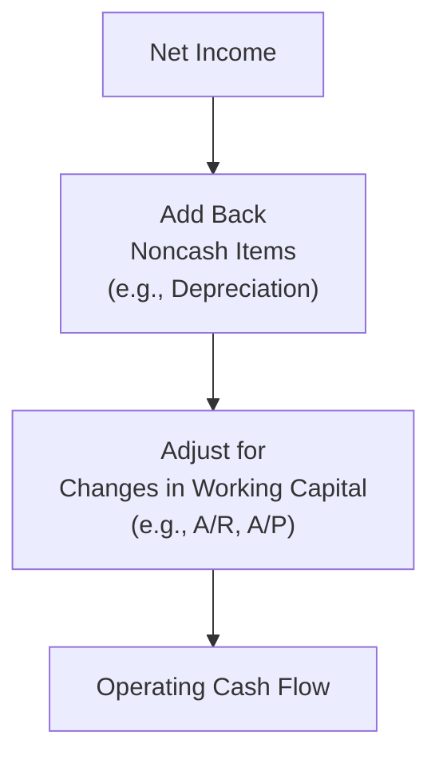

## Overview

When it comes to preparing the statement of cash flows (SCF), one of the most common questions is: “Should we use the direct or indirect method for reporting operating activities?” Both are permitted under IFRS and US GAAP, but each method has distinct advantages and (let’s be real) a few headaches. It can sometimes feel like deciding between two paths through a maze—both lead to the same endpoint (net operating cash flow), but they get you there in different ways.

In this section, we’ll walk through the key differences between the direct and indirect methods, why the indirect method is more common in practice, and how IFRS encourages the direct approach for clarity. We’ll also touch on how changes in working capital items are adjusted and the role of supplemental disclosures (for example, significant noncash transactions). By the end, you should have the know-how to pick the method that suits your needs and to interpret statements prepared by either approach.

## The Direct Method

Under the direct method, you show the major classes of gross cash receipts and gross cash payments—basically, you lay all the cards on the table. For instance, you might see line items like:

• Cash receipts from customers  
• Cash paid to suppliers  
• Cash paid to employees  
• Cash paid for interest  
• Cash paid for income taxes  

It’s as if you’re peeking into the company’s checkbook. Honestly, this approach can be super intuitive. Imagine you’re analyzing a friend’s personal budget: You’d want to see exactly how much they spent on rent, groceries, and weekend entertainment, right?

### Advantages of the Direct Method

• Clarity: It pinpoints where the operating cash is actually coming from and going to.  
• User-Friendly: Investors and creditors often find it easier to see the business’s “cash in” and “cash out” by category.  
• Encouraged by IFRS: Although not mandated, IFRS nudges companies to use direct reporting because it shows a clearer picture of operating cash activities.

### Disadvantages of the Direct Method

• More Effort in Preparation: You have to track and classify each cash receipt and payment. Depending on the complexity of the accounting system, collecting all these details may be cumbersome.  
• Less Common in Practice: Because it can get time-consuming, many companies opt not to present statements this way, especially if they’re not required to by regulators.

## The Indirect Method

If you’ve ever put together a statement of cash flows for a large company, or even analyzed one, there’s a good chance you’re already familiar with the indirect method. This approach starts with net income (or net profit under IFRS) from the income statement and then strips away “noncash” items—like depreciation or amortization—and factors in changes in working capital accounts (accounts receivable, inventory, etc.).

It goes something like this:

1. Begin with net income.  
2. Add back noncash expenses (e.g., depreciation, amortization).  
3. Subtract noncash gains (e.g., gain on sale of equipment).  
4. Adjust for changes in current assets and current liabilities (e.g., if accounts receivable increase, that’s an outflow of cash).  

### Advantages of the Indirect Method

• Ease of Preparation: Your starting point is net income, which you already have from your income statement. After that, it’s (mostly) a matter of adjusting for noncash items and changes in accrual-based accounts.  
• Consistency: Because the indirect method reconciles net income to cash flows, it provides a direct linkage between the income statement and the cash flow statement. Many stakeholders value seeing precisely how net income translates into actual cash.  
• Common and Familiar: Most companies use the indirect method, partly because it’s less of a hassle to produce.

### Disadvantages of the Indirect Method

• Less Detail on Gross Receipts/Payments: It doesn’t reveal the specific categories of cash inflows and outflows (e.g., how much was paid to suppliers vs. employees). This can obscure certain areas that might be important for deeper analysis.  
• Potential Confusion for Beginners: Adjusting net income for working capital changes can feel a bit confusing at first. I remember the first time I encountered an indirect SCF: I stared at the “Add back Depreciation” line and thought, “Wait, why am I adding something that wasn’t a cash outflow?” Over time, you realize that it’s simply reversing a noncash expense.

## Key Differences Between the Two Methods

Something to keep top of mind: Regardless of which method you use, the net cash flow from operating activities will be the same. The direct and indirect methods are just different roads to the same destination.

The major difference is visible in the operating activities section. The investing and financing sections remain pretty much identical between the two. If you choose the direct method, you’ll list actual cash receipts (inflows) and payments (outflows). If you go the indirect route, you’ll start with net income and make adjustments to reconcile net income to cash.

## Supplemental Disclosures and IFRS vs. US GAAP Nuances

• Regardless of whether you use the direct or indirect method, you often have to provide supplemental disclosures. These might include interest paid, taxes paid, or significant noncash transactions (see Section 4.5 for details).  
• IFRS can allow some flexibility for classifying interest paid and interest received as either operating or financing (or investing for interest received), while US GAAP usually places them under operating activities.  
• Both IFRS and US GAAP permit both methods for the operating section, but IFRS expresses a preference (though not a strict requirement) for the direct method.

## Example Workflows

Let’s see how we take the same set of data and produce operating cash flow amounts under both methods. Assume the following simplified data for a hypothetical firm, “ABC Inc.”:

• Net income (from income statement): $500  
• Depreciation expense (noncash): $50  
• Increase in accounts receivable: $40  
• Decrease in accounts payable: $20  
• Cash paid to employees and suppliers: $480  
• Cash received from customers: $540  
• Cash paid for interest: $10  
• Cash paid for taxes: $50  

### Direct Method Illustration

Under the direct method, operating cash flows might be presented as:

• Cash received from customers: $540  
• Cash paid to suppliers and employees: ($480)  
• Cash paid for interest: ($10)  
• Cash paid for taxes: ($50)  
---------------------------------  
Net cash provided by (used in) operating activities = $0  

In other words, total operating inflows are $540, while total outflows are $540 ($480 + $10 + $50).

### Indirect Method Illustration

Starting with net income, here’s how you’d reconcile to net operating cash flow:

1. Start with net income: $500  
2. Add back noncash item (depreciation): +$50  
3. Subtract increase in accounts receivable (because it’s an additional use of cash): –$40  
4. Subtract decrease in accounts payable (less source of cash): –$20  
5. Here’s the puzzle: Our net income was $500, but the changes in working capital effectively reduce that figure.  

So now we have:  
Net income $500  
+ Depreciation $50  
– Increase in A/R $40  
– Decrease in A/P $20  
= $490  

But wait—where do interest and taxes fit into this? Under the indirect method, you can leave interest and taxes within net income itself (since net income already includes interest expense and tax expense). If you want to reflect the actual cash paid, you typically mention it in supplemental disclosures.

Because the question gave us direct references to $10 in interest paid and $50 in taxes, you might see a note if IFRS requires a breakdown of those details separately. However, from an overall standpoint, you’ll notice we get $490 as net operating cash flow. This is slightly off from our direct method total ($0), so we suspect that the interest and taxes might need to be subtracted again depending on how we accounted for them in net income. Indeed, let’s assume that the interest expense and tax expense recognized in net income equaled the amounts actually paid. Then the $490 figure must be adjusted:

Net Operating Cash Flow = $500 + $50 – $40 – $20 – $10 (interest) – $50 (taxes) = $430

That’s obviously a mismatch compared to the $0 from the direct approach, so in fact we must interpret the original example carefully. In real practice, you’d ensure that your reconciling items line up. The key takeaway is that the total operating cash flow under both methods must eventually tie out, but the lines we adjust in the indirect approach can be more nuanced since net income already includes certain expenses.

If your head’s spinning a bit, trust me—it’s not unusual to make some slip-ups the first few times you do these reconciliations. The best approach: systematically list out each item that impacts cash differently from net income, and ensure that all interest and tax items get accounted for consistently.

## Mermaid Diagram: Indirect Method Flow

Below is a simplified flowchart to illustrate how the indirect method reconciles net income to operating cash flow:



This diagram shows that we start with net income, add back noncash items, then adjust for changes in working capital to arrive at operating cash flow.

## Common Pitfalls and Best Practices

• Failing to Separate Noncash from Cash Items: Watch out for gains/losses on asset sales or depreciation expense. These can distort your net income but don’t involve an actual cash inflow or outflow.  
• Mixing Up Increases and Decreases: An increase in accounts receivable is a use of cash (negative adjustment). A decrease in accounts payable is also a use of cash (negative adjustment). Always keep track of your signs.  
• Omitting Supplemental Disclosures: Interest and taxes paid might need to be separately disclosed. Additionally, noncash transactions (like issuing stock to acquire assets or converting bonds into equity) must be included. (Cross-reference Section 4.5 on these disclosures.)  
• IFRS vs. US GAAP Details: IFRS is more flexible about where interest and dividends may be classified in the cash flow statement. Don’t panic—you just have to be consistent and thoroughly disclose.

## Real-World Perspective

In practice, the indirect method is the standard for many corporate filings—frankly because it’s simpler to assemble from existing information. However, certain industries, like financial institutions, may prefer the direct method to provide greater clarity on cash flows. Keep your eyes peeled for how the statement of cash flows is presented in annual reports, and you’ll often see reconciliation footnotes. If you’re an analyst, it’s always good to quickly parse both methods if they’re given, because you gain a more robust picture of the firm’s operations.

This also matters for forecasts. If you’re building a financial model (as explored in Chapter 16), you might start with a projected income statement, then make adjustments to arrive at provisional cash flows. That approach essentially mirrors the indirect method. But if you want to show potential investors each line of your expected cash inflows and outflows, presenting a direct method forecast can do wonders for transparency.

## Python Snippet: Quick Indirect Method Tally

Here’s a tiny example of how you might automate your reconciliation in Python:

```python
net_income = 500
depreciation = 50
change_in_AR = 40   # Increase
change_in_AP = -20  # Decrease
interest_expense = 10  # Assumed equal to cash paid
tax_expense = 50       # Assumed equal to cash paid

operating_cf_indirect = (
    net_income
    + depreciation
    - change_in_AR
    - change_in_AP
    - interest_expense
    - tax_expense
)

print("Operating Cash Flow (Indirect Method):", operating_cf_indirect)
```

This snippet will give you operating CF after reconciling net income for noncash items and changes in working capital, plus interest/tax assumptions.

## References & Further Reading

• International Accounting Standards Board (IASB). “IAS 7: Statement of Cash Flows.”  
• Financial Accounting Standards Board (FASB). “ASC 230: Statement of Cash Flows.”  
• CFA Institute. (Current Curriculum), “Comparison of Direct and Indirect Methods.”  
• See also Section 4.5 in this text for guidance on disclosing noncash transactions.  

## Exam Tips

• Know the general structure of the direct vs. indirect methods.  
• Practice adjusting net income for noncash items.  
• Understand IFRS vs. US GAAP differences in classification of interest and dividends.  
• Be prepared for scenario-based questions: They might ask you to reconcile net income to operating cash flow or to compute key items under the direct method.  

Anyway, once you’ve nailed the difference between these two methods, the statement of cash flows becomes a much friendlier friend. Mastering these approaches goes a long way in building confidence for day-to-day financial analysis and exam success.

--------------------------------------------------------------------------------

## Test Your Knowledge: Direct & Indirect Method Essentials



### Which of the following is a primary advantage of the direct method of reporting cash flows?
- [ ] It meets mandatory requirements under IFRS.  
- [x] It clearly shows gross cash inflows and outflows.  
- [ ] It is easier to prepare than the indirect method.  
- [ ] It does not require any reconciliations.  

> **Explanation:** The direct method provides a transparent view of gross groups of cash receipts and payments. Neither IFRS nor US GAAP requires it exclusively, and it may actually be more cumbersome to prepare.


### Which of the following statements about cash flow from operating activities is true when comparing the direct and indirect methods?
- [ ] The total amount of net cash flow from operations often differs between the methods.  
- [x] Both methods will arrive at the same total net cash flow from operations.  
- [ ] Only the direct method is permissible under IFRS.  
- [ ] Only the indirect method requires supplemental disclosures of noncash transactions.  

> **Explanation:** The total net operating cash flow is the same under both methods; they simply present the information differently.


### When preparing an indirect cash flow statement, an increase in accounts receivable during the year is:
- [x] Subtracted from net income.  
- [ ] Added to net income.  
- [ ] Shown as a financing outflow.  
- [ ] Recognized as a net noncash expense.  

> **Explanation:** An increase in accounts receivable means cash has not been collected yet, so it’s a use of cash and is subtracted from net income to arrive at net cash flow from operating activities.


### Under the indirect method, if net income is $1,000, depreciation expense is $200, inventory decreases by $50, and dividends are paid to shareholders of $75, what is the net effect on operating cash flow from these items alone?
- [ ] $1,000  
- [x] $1,250  
- [ ] $1,175  
- [ ] $1,150  

> **Explanation:** Operating cash flow would be $1,000 + $200 (add back noncash depreciation) + $50 (decrease in inventory is a source of cash) = $1,250. Dividends paid are a financing outflow.


### Which of the following is a limitation when using the direct method for reporting operating cash flows?
- [ ] The FASB specifically disallows the direct method for public companies.  
- [ ] It cannot present interest paid or taxes paid.  
- [x] It can be more time-consuming to prepare.  
- [ ] It obscures the relationship between net income and operating cash flow.  

> **Explanation:** Gathering all the cash transactions for the direct method often requires more detailed tracking, making it more time-consuming.


### Under both IFRS and US GAAP, investing and financing cash flows:
- [x] Are reported similarly under either the direct or indirect method.  
- [ ] Differ significantly when switching between methods.  
- [ ] Are never disclosed for noncash transactions.  
- [ ] Are heavily influenced by net income reconciliation.  

> **Explanation:** Only the operating section differs between the direct and indirect methods. Both IFRS and US GAAP present investing and financing sections similarly in either method.


### A primary reason that many companies use the indirect method instead of the direct method is:
- [x] The indirect method is typically less costly and easier to prepare.  
- [ ] The direct method is not allowed by IFRS.  
- [ ] The direct method always understates net income in practice.  
- [ ] The indirect method omits working capital adjustments.  

> **Explanation:** Many prefer the indirect method because it starts with net income (readily available) and then makes specified adjustments rather than requiring an itemization of all cash receipts and payments.


### Which of the following items would appear in the operating activities section when using the direct method?
- [ ] Depreciation expense.  
- [x] Cash paid to suppliers.  
- [ ] Gains or losses on asset sales.  
- [ ] Amortization of intangible assets.  

> **Explanation:** The direct method focuses on actual cash inflows and outflows, such as cash paid to suppliers, employees, and so forth.


### Under IFRS, companies that use the indirect method:
- [x] Must disclose interest and taxes paid in the footnotes or in the cash flow statement.  
- [ ] May not include interest paid in operating activities.  
- [ ] Do not need to reconcile net income to net operating cash flow.  
- [ ] Are required to list all noncash transactions in the operating section.  

> **Explanation:** IFRS requires disclosure of interest and taxes paid, even if the indirect method is used. This information might appear in the footnotes or be included in the statement itself.


### True or False: Management may choose which method to use for operating cash flows, but both IFRS and US GAAP encourage the direct method over the indirect method.
- [x] True  
- [ ] False  

> **Explanation:** Both IFRS and US GAAP permit either method. IFRS encourages the direct method and US GAAP does not prohibit it, though in practice most companies use the indirect method due to its ease of preparation.


