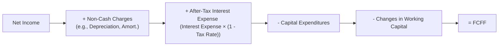

## Introduction

People often say to me, “I see a company’s net income is huge—so does that mean it’s flush with cash?” And I’ve definitely been there, buying into that idea that net income means straight-up liquidity. But, as we dig deeper into actual cash flows, we realize that net income might not tell the whole story. That’s where free cash flow measures come into play. Free cash flow analysis is a powerful lens for understanding how much real, spendable cash a firm generates once it meets all its obligations—like paying for operating expenses, covering interest, investing in new equipment, and so forth. 

This section takes a deep dive into Free Cash Flow to the Firm (FCFF) and Free Cash Flow to Equity (FCFE), discussing how they’re calculated and how they help analysts determine a company’s ability to service debt, operate efficiently, pay dividends, buy back shares, or expand. We’ll then look at coverage ratios—like interest coverage and fixed charge coverage—to see how these metrics give us a sense of a company’s ability to meet fixed payments. Finally, we’ll walk through examples, diagrams, and best practices so you’ll feel comfortable assessing free cash flows and coverage ratios in a variety of scenarios.

## Key Concepts in Free Cash Flow Analysis

### Free Cash Flow to the Firm (FCFF)

Free Cash Flow to the Firm (FCFF) is basically the cash flow available to all of a company’s capital providers—both debt holders and equity holders—after covering necessary capital expenditures and operating costs. If you’re looking at a firm’s capacity to service its debt and equity effectively, FCFF is your friend. Typically, FCFF is derived from one of two main starting points: Net Income (NI) or Operating Cash Flow (CFO). 

Here’s one commonly used FCFF formula starting from net income:


\text{FCFF} = \text{NI} + \text{Non-Cash Charges} + \text{(Interest Expense} \times (1 - \text{Tax Rate)}) - \text{Fixed Capital Investment} - \text{Working Capital Investment}


Or, starting from CFO:


\text{FCFF} = \text{CFO} + \text{(Interest Expense} \times (1 - \text{Tax Rate)}) - \text{Fixed Capital Investment}


Where:
• NI = Net Income  
• Non-Cash Charges = Depreciation, amortization, impairment, etc.  
• Interest Expense × (1 − Tax Rate) adjusts for the fact that FCFF includes cash flows to both debt and equity holders, so after-tax interest must be added back if CFO was calculated after interest.  
• Fixed Capital Investment (often noted as CapEx, short for capital expenditures) includes investments in property, plant, and equipment.  
• Working Capital Investment (also called working capital changes) is the net change in items like accounts receivable, inventory, and accounts payable.  

If you prefer a visual guide, here’s a simple mermaid diagram illustrating an FCFF calculation path starting from Net Income:



### Free Cash Flow to Equity (FCFE)

Where FCFF looks at what’s left for *all* providers of capital, Free Cash Flow to Equity (FCFE) zeroes in on what’s available specifically to equity holders—after the company has taken care of its interest and principal payments to creditors, as well as the capital expenditures needed to maintain or grow operations. One standard formula for FCFE is:


\text{FCFE} = \text{FCFF} - \text{(Interest Expense} \times (1 - \text{Tax Rate)}) + \text{Net Borrowing}


But if you want a direct approach from CFO, you can also do something like:


\text{FCFE} = \text{CFO} - \text{Fixed Capital Investment} + \text{Net Borrowing}


Where net borrowing basically equals any new debt that the company raises minus any debt it repays (principal amounts, not interest). The reason we add net borrowing is that it’s an inflow of cash to equity owners—assuming the firm drew on debt capacity and that the cash is available to shareholders after paying off the prior obligations.

Both FCFF and FCFE are heavily used in valuation models. You might have come across discounted cash flow (DCF) valuations that use a Weighted Average Cost of Capital (WACC) discount rate for FCFF or a cost of equity discount rate for FCFE. Even if you’re like, “Wait, that’s more detail than I need to do at the moment,” it’s good to know how these measures fit into the bigger valuation picture.

### Reconciling Net Cash Flow from Operations to FCFF or FCFE

In practice, we often start with the “Net Cash Flow from Operating Activities” line from the Statement of Cash Flows (CFO) and then systematically adjust for interest and capital expenditures to get FCFF or FCFE. Here is a high-level summary:

• Start with CFO (reported on the Statement of Cash Flows).  
• Add back after-tax interest expense to get the firm-level perspective for FCFF.  
• Subtract capital expenditures to capture the necessary investment in long-term assets.  
• If you’re going for FCFE, subtract any debt principal repayment and add any new debt issuance. This step is combined in “Net Borrowing.”

In short:
• FCFF from CFO = CFO + (Interest × (1 – t)) – CapEx.  
• FCFE from CFO = CFO – CapEx + Net Borrowing.

Sometimes, you’ll see subtle variations in definitions and formulas depending on the source. For instance, some analysts incorporate dividends if they’re focusing on a special scenario. But for exam and standard practice purposes, the above formulas are well accepted.

## Coverage Ratios

Coverage ratios focus on how well a company can service its fixed obligations, such as interest or lease payments. We often use data from the Statement of Cash Flows to create more robust coverage measures than those derived solely from net income or EBIT.

### Interest Coverage

A widely used metric is interest coverage, which can be computed in multiple ways depending on your preference for an income measure. The old-school approach uses EBITDA or EBIT from the income statement:


\text{EBIT Interest Coverage} = \frac{\text{EBIT}}{\text{Interest Expense}}


But some analysts prefer looking at cash-based coverage, such as:


\text{CFO-Based Interest Coverage} = \frac{\text{CFO before Interest and Taxes}}{\text{Interest Paid}}


This approach tries to answer, “Does the company generate enough actual cash from its core operations to meet interest obligations?” If you see this ratio dipping below 1.0, that’s a yell-out-loud red flag. Even if it’s just trending lower from one quarter to the next, you might want to ask, “Are they going to end up needing more external financing soon?” 

### Fixed Charge Coverage

Fixed charge coverage extends the logic of interest coverage by including other fixed obligations besides interest, such as lease payments:


\text{Fixed Charge Coverage} = \frac{\text{EBIT} + \text{Fixed Charges (excluding interest)}}{\text{Interest Expense} + \text{Fixed Charges (including interest)}} 


Or, if you’re using a cash flow basis:


\text{CFO-Based Fixed Charge Coverage} = \frac{\text{CFO before Fixed Charges and Taxes}}{\text{Interest Paid} + \text{Other Fixed Charges Paid}}


Why do we go to all this trouble? Because sometimes a firm can have relatively low interest expenses yet enormous annual lease payments or other contractual outflows. If you’re ignoring those, you might get the idea that the firm is more profitable or more “covered” than it actually is. 

## Illustrative Example

Let’s say DeltaEx, a manufacturing company, has the following data for the most recent year (in \$ millions):

• Net Income = \$300  
• Depreciation & Amortization = \$120 (non-cash)  
• Interest Expense = \$50  
• Tax Rate = 25%  
• Capital Expenditures = \$200  
• Net Working Capital increase = \$40 (i.e., an outflow)  
• Net Borrowing = \$100 (the firm issued new debt of \$150 and repaid \$50 in principal)  
• CFO = \$420 (from the Statement of Cash Flows)  

First, let’s compute FCFF starting from Net Income:

1. FCFF (from Net Income)
   FCFF = NI + Non-Cash Charges + (Interest Expense × (1 – t)) – CapEx – WCInv  
   FCFF = 300 + 120 + (50 × (1 – 0.25)) – 200 – 40  
   FCFF = 300 + 120 + 37.5 – 200 – 40  
   FCFF = 217.5  

Alternatively, from CFO:

2. FCFF (from CFO)
   FCFF = CFO + (Interest Expense × (1 – t)) – CapEx  
   FCFF = 420 + (50 × 0.75) – 200  
   FCFF = 420 + 37.5 – 200  
   FCFF = 257.5  

Why the difference? Notice that in the first method, we subtracted the \$40 increase in working capital explicitly. In the second, CFO has *already* accounted for the working capital outflows. That’s good to double-check for consistency. If we pinned everything correctly, we might find a discrepancy from how the company categorizes certain non-cash items, interest amounts, or changes in certain intangible or unusual line items. In real life, you’d want to carefully reconcile these differences. Let’s assume we discover a small difference in how CFO was reported or an additional non-cash cost. For exam calculations, they typically give you consistent data, so your results would align accordingly.

Next, let’s find FCFE from FCFF:

3. FCFE
   FCFE = FCFF – (Interest Expense × (1 – t)) + Net Borrowing  
   Using FCFF = 217.5 from above:
   FCFE = 217.5 – 37.5 + 100  
   FCFE = 280  

Or using CFO directly:

 FCFE = CFO – CapEx + Net Borrowing  
 FCFE = 420 – 200 + 100 = 320  

Again, watch for consistency in the problem data to ensure your numbers line up.

Finally, let’s do a quick CFO-based interest coverage ratio. Suppose interest paid (rather than interest expense recognized) was \$48 (we assume a timing difference). If CFO before interest and taxes was \$480, then:


\text{CFO-Based Interest Coverage} = \frac{480}{48} = 10.0


DeltaEx can pay its interest about 10 times over using operating cash flows, which suggests a healthy margin of safety—at least from the integrated vantage point of CFO.

## Interpreting Positive vs. Negative Free Cash Flows

• Positive FCFF or FCFE often signals that the company is (or could be) generating value for both debt and equity holders. Positive FCFE, for instance, implies potential for dividends or share repurchases.  
• Negative FCFF or FCFE isn’t always *bad.* A high-growth firm might be purposefully investing big in new capacity, R&D, or acquisitions. The real question is whether that negative number is likely to reverse into a strong positive in the future.  
• Trends matter. If a firm’s FCFF has been consistently negative for years while net borrowing is rising, that might be a risk red flag.  

One cautionary tale I remember was analyzing a budding tech hardware startup back when I was new to the field: The company had negative FCFE for three consecutive quarters, but that was because it was diving headfirst into R&D, new product lines, and major expansions of its supply chain. While the near-term free cash flow was indeed negative, longer-term prospects pointed to eventual strong cash flows. Indeed, by year two, FCFE was sharply (and positively) in the black. Without contextual insight, one might have concluded “this is a money-losing operation,” which would’ve missed the bigger growth strategy.

## Best Practices and Common Pitfalls

• Confirm definitions. Different sources might treat certain items differently. Know your exam’s or real-life entity’s definitions to ensure consistency.  
• Check consistency between the income statement, balance sheet, and statement of cash flows. If something doesn’t reconcile, look for classification differences or data input errors.  
• Be mindful of interest and tax rates. Using after-tax interest is crucial in FCFF calculations if you start with CFO that already subtracts interest.  
• Watch out for unusual items. Gains or losses on asset sales, restructuring charges, or one-time receipts might skew free cash flow.  
• Consider depreciation policy and capital expenditures. Some firms might reduce CapEx in the short run to boost free cash flows artificially, risking future operational capacity.  
• Evaluate external financing possibilities. If negative FCFE is consistent, the firm might be sustaining growth with new debt or equity issuance.  

## Diagram for Putting It All Together

Sometimes, it helps to view the relationships more holistically. Below is a mermaid diagram simplifying how Net Income, CFO, FCFF, and FCFE connect.


## A Brief Python Example

If you like to see how you’d gather data programmatically (or just test different scenarios), a simple Python snippet might look like this:

```python

def calculate_fcff_cfo_basis(CFO, interest_expense, tax_rate, capex):
    after_tax_interest = interest_expense * (1 - tax_rate)
    return CFO + after_tax_interest - capex

def calculate_fcfe_cfo_basis(CFO, capex, net_borrowing):
    return CFO - capex + net_borrowing

CFO = 420
interest_expense = 50
tax_rate = 0.25
capex = 200
net_borrowing = 100

fcff = calculate_fcff_cfo_basis(CFO, interest_expense, tax_rate, capex)
fcfe = calculate_fcfe_cfo_basis(CFO, capex, net_borrowing)

print("FCFF:", fcff)
print("FCFE:", fcfe)
```

You’d run this and get the results we conceptually discussed.

## Additional References

• CFA Institute. (Current Curriculum). Reading on Free Cash Flow Valuation.  
• Damodaran, A. (2012). Investment Valuation: Tools and Techniques. Wiley.  
• McKinsey & Company. (2020). Valuation: Measuring and Managing the Value of Companies.  

These references provide a deeper dive into topics like detailed DCF modeling, capital structure considerations, terminal value assumptions, and other advanced valuation frameworks.

## Test Your Knowledge: Free Cash Flow and Coverage Ratios



### Which of the following statements is most accurate regarding FCFF?

- [ ] FCFF represents cash flow only available to a company's equity holders.  
- [x] FCFF is cash flow available to both equity holders and debt holders.  
- [ ] FCFF excludes any consideration of capital expenditures.  
- [ ] FCFF is not influenced by interest expense or taxes.  

> **Explanation:** FCFF (Free Cash Flow to the Firm) reflects cash available to all providers of capital after operating expenses and capital expenditures. It's affected by after-tax interest expense—unlike FCFE, which focuses solely on cash available to equity holders.

### A company's FCFF is negative, but its FCFE is positive. Which scenario best explains this?

- [ ] The company has insufficient filing of intangible assets.  
- [x] The company borrowed a significant amount of debt, which offset the negative firm cash flow.  
- [ ] The company sold fixed assets at a gain.  
- [ ] The company earned high net income with no new capital.  

> **Explanation:** FCFE is FCFF minus after-tax interest plus net new borrowing. Positive FCFE with negative FCFF suggests new debt raised more cash for equity holders than the firm-level outflows.

### In deriving FCFF starting from CFO, which of the following adjustments is correct?

- [ ] Subtract after-tax interest expense, then add capital expenditures.  
- [ ] Subtract goodwill impairment, then add interest expense.  
- [x] Add after-tax interest expense, then subtract capital expenditures.  
- [ ] Add gross interest expense, then subtract acquisitions.  

> **Explanation:** A standard approach to FCFF from CFO is: FCFF = CFO + (Interest Expense × (1 − t)) − Capital Expenditures.

### Which of the following best conveys the meaning of a coverage ratio below 1.0?

- [x] The firm’s cash flow or earnings are insufficient to cover its fixed obligations.  
- [ ] The firm is highly profitable after taxes.  
- [ ] The firm is carrying no debt.  
- [ ] The firm’s leverage has significantly decreased.  

> **Explanation:** A coverage ratio below 1.0 indicates that the firm does not generate enough earnings/cash to cover its interest or fixed charges, which raises solvency concerns.

### Which of the following is a correct formula for FCFE computed from CFO?

- [ ] FCFE = CFO + CapEx + Net Borrowing.  
- [x] FCFE = CFO − CapEx + Net Borrowing.  
- [ ] FCFE = CFO − CapEx − Net Borrowing.  
- [ ] FCFE = CFO + Debt Repayment − CapEx.  

> **Explanation:** FCFE = CFO − Capital Expenditures + Net Borrowing. This formula captures the debt inflows/outflows and the capital investment outflows.

### Which of the following elements would typically be subtracted when calculating FCFF from Net Income?

- [ ] Interest Expense multiplied by (1 − t).  
- [ ] Depreciation and non-cash charges.  
- [x] Capital expenditures and changes in working capital.  
- [ ] Stock dividends distributed.  

> **Explanation:** To get FCFF from Net Income, you add back non-cash charges and after-tax interest expense, then subtract capital expenditures and changes in working capital.

### A high cash flow-based interest coverage ratio indicates:

- [x] The firm has robust operating cash flows relative to interest obligations.  
- [ ] The firm is under heavy debt obligations relative to equity.  
- [x] The company likely possesses a comfortable ability to meet its interest payments.  
- [ ] The firm has negative FCFE but positive CFO.  

> **Explanation:** A high CFO-based interest coverage ratio suggests a large cushion for interest payments. This ratio uses operational cash flows rather than just earnings.

### Which of the following might cause FCFE to increase even if FCFF remains constant?

- [ ] An increase in the tax rate.  
- [ ] A decrease in depreciation.  
- [x] An increase in net borrowing.  
- [ ] A decrease in gross capital spending.  

> **Explanation:** FCFE includes net borrowing. If the company raises more debt capital, it could increase FCFE without affecting FCFF directly.

### If a firm’s FCFE shows a downward trend for several years while net borrowing is rising, this generally indicates:

- [x] A potential financial risk because the firm may be relying heavily on external borrowing to cover equity cash flow needs.  
- [ ] A sign of operational efficiency.  
- [ ] A likely reduction in capital expenditures.  
- [ ] That the firm has consistently positive operating income.  

> **Explanation:** Persistent declines in FCFE alongside higher net borrowing could mean the company is increasingly dependent on external debt financing rather than internally generated cash.

### True or False: A fixed charge coverage ratio includes lease payments or other periodic obligations in addition to interest expense.

- [x] True  
- [ ] False  

> **Explanation:** By definition, a fixed charge coverage ratio goes beyond interest expense to include lease payments and similar obligations, providing a more comprehensive view of the firm’s ability to satisfy all fixed payment requirements.


