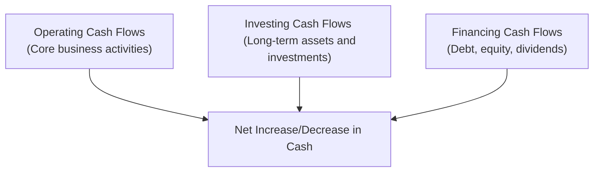

## Overview

The statement of cash flows (SCF) is one of the most critical financial statements in a firm’s reporting package. It shows exactly how cash is moving in and out of the business under three main categories: operating, investing, and financing activities. Interpreting each component can give you, as an analyst or portfolio manager, deep insights into a company’s liquidity, sustainability, and strategic direction. And yes, it might initially feel tedious—like you’re dissecting a puzzle with a gaze that never ends—but trust me, once the puzzle comes together, the payoff is clarity about how a business actually generates and uses its money.

In this section, we’ll explore the nature of each flow category, discuss how to evaluate trends, and probe some of the more nuanced concerns that might crop up when analyzing real-life statements.

## Operating Activities

Operating cash flow (OCF) typically represents cash generated or used by a firm’s core business operations—think receipts from selling goods or services minus cash paid to suppliers, employees, and other routine expenses. Tracking OCF helps assess the sustainability of the company’s day-to-day business model and its ability to self-fund growth and satisfy creditors.

### Defining Operating Cash Flow

Under both IFRS and US GAAP, cash flows from operations generally encapsulate:
• Cash receipts from customers.  
• Cash paid to suppliers and employees.  
• Interest and dividends received (under US GAAP these may fall in operating, though IFRS can classify interest and dividends received in either operating or investing depending on the firm’s policy).  
• Interest payments (treated as operating under US GAAP but can be operating or financing under IFRS).  
• Income taxes paid (except when specifically related to investing or financing transactions).

Although the concept sounds straightforward, an accountant’s view of “operating” might differ slightly from a manager’s day-to-day perspective, especially concerning interest expense or dividend income. Variation in classification choices allows for nuanced comparisons across firms.

### Evaluating the Quality of Operating Cash Flows

1. Consistency with Reported Net Income:  
   Analysts often compare OCF to net income (NI). A healthy business generally sees a positive correlation—a stable or rising OCF that tracks with net income growth indicates that profits are being backed up by real cash. Strategically, you might examine this ratio over time. If net income grows but OCF stalls or declines, it’s a possible warning sign of aggressive revenue recognition, poor credit policies, or growing receivables.

2. Adjustments and Noncash Items:  
   Various noncash items—such as depreciation, amortization, and stock-based compensation—are added back to net income in calculating OCF (indirect method). Watch out, though. A large swing in vision—like a sudden surge in OCF purely from a big working capital shift—could reflect timing issues rather than sustainable improvement.

3. Working Capital Management:  
   Changes in receivables, inventories, and payables can cause OCF to fluctuate significantly. If you see short-term payables balloon, OCF might look great this quarter, but that may reflect simply stretching payables (i.e., paying suppliers more slowly). Over the long run, a company must pay these bills—and that can reduce OCF in a future period.

4. Cross-Referencing with Other Statements:  
   • From the income statement: Does the company’s revenue growth match the pattern of cash collections?  
   • From the balance sheet: Do changes in inventory or receivables align with the business cycle, or do they look artificially manipulated?

### Why Sustainable Operating Cash Flows Matter

A consistent, positive OCF ensures the firm can:

• Reinvest in the business without constantly raising external capital.  
• Survive economic downturns or cyclical fluctuations.  
• Fund dividends or share buybacks (though those often appear in the financing section, the “cash supply” must often come from operating success).

## Investing Activities

Investing cash flows (ICF) revolve around purchasing or disposing of long-term assets and making or liquidating investments in other companies. Examples include the acquisition of property, plant, and equipment (PP&E), intangible assets, or other companies’ shares.

### Normal for It to Be Negative?

You’ll often see regular negative ICF in capital-intensive or rapidly growing companies. For them, that “negative” is a sign of continuous investment in new production facilities, technology upgrades, or expansions into new market segments. If the operating side is robust and the firm has a clear trajectory to recoup these outlays, negative ICF can be perfectly normal and often healthy.

But watch out for:

• Chronic negative ICF without commensurate expansion in operating capacity or revenue growth.  
• Acquisitions financed by heavy borrowing, which could create large negative ICF but also shift huge amounts into the financing section.  
• Delayed asset disposals that would ordinarily offset major acquisitions.  

### Efficiency and Funding Sources

When a firm invests extensively, you’ll want to see:

• Adequate operating cash flow or prudent financing to support capital expenditures (CapEx).  
• Management discussion in “Management’s Commentary” (or MD&A) indicating strategic rationale for these capital outlays.  
• Historical returns on previous investments. A track record of strong or rising return on invested capital (ROIC) can justify ongoing heavy investment.

Similarly, if the company is systematically selling off assets (leading to positive ICF), that might be a red flag, especially for businesses in decline or those struggling to raise cash from operations or financing markets.

## Financing Activities

Financing cash flows (FCF) highlight how firms raise or return capital—not from sales of goods/services (operating) or from buying/selling investments (investing), but from shareholders, bondholders, and other financing partners.

### Typical Financing Inflows

• Issuing equity shares.  
• Borrowing funds (issuing corporate bonds or taking bank loans).  
• Proceeds from stock option exercises.  

### Typical Financing Outflows

• Debt repayments.  
• Cash dividends to shareholders.  
• Share repurchases (treasury stock).  

### Tying Financing Activities to Capital Structure Strategy

Where do you find the real story? Look at patterns of financing activities:

• Is the firm repeatedly issuing debt to cover normal operating shortfalls? That might indicate ongoing liquidity issues.  
• Are large equity issuances fueling expansions, acquisitions, or R&D? Check if these expansions show up in the investing section.  
• Are share buybacks or dividends consistently high? That could reflect strong operating performance—yet it could also reflect short-term “financial engineering” if the firm is borrowing heavily just to maintain shareholder payouts.

## Putting It All Together: Trends and Strategic Insights

A single period’s statement of cash flows can be incredibly revealing, but the real power emerges when you compare multiple periods or even multiple companies within a similar industry. You can pick up patterns such as:

• Oscillating operating cash flows from cyclical industries (e.g., mining or energy).  
• Prolonged negative ICF in high-growth tech or biotech industries as they ramp up R&D or intangible acquisitions.  
• Shifts in financing approach—like pivoting from debt to equity or vice versa—based on market conditions and cost of capital.  

Below is a simple mermaid diagram illustrating the relationship among the three sections of the statement of cash flows:

In the end, you want to see a cohesive story: that operating, investing, and financing flows align with the firm’s stated strategy and industry norms. If they don’t, dig deeper because the statement of cash flows is often where anomalies or manipulations are least hidden.

## Common Pitfalls and Cautionary Notes

• Overemphasis on a Single Metric: Some analysts fixate on OCF alone. While it is crucial, ignoring investing or financing flows can blind you to major strategic or risk factors.  
• Seasonal and Cyclical Effects: Many businesses see seasonal lumps in both operating and investing outlays (e.g., retail building inventory before holidays or agriculture investing heavily in seed purchases). Keep your eyes peeled for these patterns to avoid misinterpretation.  
• Accounting Policy Differences: Under IFRS vs. US GAAP, interest or dividends paid can appear in different sections. Be sure to read the footnotes and remain consistent in your comparisons.  
• Manipulation through Working Capital Changes: A temporary rise in payables or cutback in inventory might artificially boost OCF. Always tie back to overall operational trends.

## Brief Example: Growth Company vs. Mature Dividend Payer

Imagine two firms:

1. GrowCo Inc.:  
   • Negative investing cash flows for the past five years—driven by building new facilities and acquiring smaller companies.  
   • Positive but sometimes modest operating cash flows as the firm’s revenue grows.  
   • Regularly raising debt and issuing shares to fund expansions.  

   Evaluation: This isn’t automatically alarming if GrowCo demonstrates strong potential for future cash flows and an expanding market share. But keep watch for its debt levels and whether the new investments actually pay off.

2. StablePay Corp.:  
   • Solid, stable operating cash flows.  
   • Light investing activity—mainly replacing existing equipment.  
   • Consistent financing outflows from share repurchases or dividends.  

   Evaluation: StablePay is returning wealth to shareholders, indicating management believes free cash flow exceeds growth needs. The business is likely mature, focusing on incremental improvements rather than major expansions. One might evaluate whether they are investing enough to remain competitive.

## Cross-References

• For a deep dive on the direct vs. indirect reporting approach, see Section 4.2 in this chapter.  
• For further discussion on quality assessments of cash flow from operations, cross-reference Chapter 12 on Financial Reporting Quality.  
• For more on adjusting nonrecurring items in the statement of cash flows, see Section 4.6 in this chapter.

## Final Exam Tips

• Practice comparing cash flow statements across multiple periods or among peers to see how different strategies manifest through cash flows.  
• Keep an eye on the classification of interest and dividends between IFRS and US GAAP, as exam questions often hinge on these subtle differences.  
• Look for alignment: Does the story the company tells in its management commentary match the statement of cash flows?  
• Don’t forget to check if any items appear as noncash transactions in footnotes. These can significantly affect how you interpret operating or investing outflows.

## References and Further Reading

• CFA Institute (Current Curriculum). “Reading on Interpreting the Statement of Cash Flows.”  
• Penman, S.H. (2012). Financial Statement Analysis and Security Valuation. McGraw-Hill.  
• International Financial Reporting Standards (IFRS) and US Generally Accepted Accounting Principles (GAAP) technical literature.

## Test Your Knowledge of Operating, Investing, and Financing Cash Flows



### Which of the following items is most commonly classified under operating cash flows?

- [ ] Purchase of equipment
- [ ] Dividends paid
- [x] Cash received from customers
- [ ] Issuance of common stock

> **Explanation:** Cash received from customers arises from the firm’s core operations. Purchases of equipment and dividends paid are typically investing and financing flows, respectively.

### Assuming a company reports positive net income but negative operating cash flow, which scenario is a likely explanation?

- [ ] The firm has no accruals listed on its income statement.
- [x] The firm has a significant increase in accounts receivable.
- [ ] The firm repaid a portion of its long-term debt.
- [ ] The firm sold major equipment during the period.

> **Explanation:** A large increase in accounts receivable means the firm booked revenue but has not yet collected cash, driving operating cash flow below net income.

### How should you generally interpret consistently negative investing cash flows for a high-growth firm?

- [ ] They indicate the business is in financial distress.
- [x] They may reflect ongoing expansion and CapEx.
- [ ] They suggest the firm has zero net investment in working capital.
- [ ] They imply potential misclassification of financing flows.

> **Explanation:** Rapidly growing companies typically show negative investing cash flows as they spend on new facilities, technology, or acquisitions to support expansion. This is not inherently concerning if supported by solid operating cash flows or appropriate financing.

### Under IFRS, where can interest paid be classified?

- [ ] Only in operating activities
- [ ] Only in investing activities
- [ ] Only in financing activities
- [x] Operating or financing activities

> **Explanation:** IFRS allows interest paid to be reported either in the operating or financing section, depending on the firm’s accounting policy. US GAAP generally requires interest paid under operating activities.

### Which pair of activities would both appear under financing cash flows?

- [x] Issuing bonds and repaying long-term debt
- [ ] Paying taxes and purchasing equipment
- [ ] Collecting from customers and paying suppliers
- [ ] Paying rent and receiving dividends from investments

> **Explanation:** Issuing or repaying debt are both financing activities. The other pairs represent either operating or investing transactions.

### A firm shows very strong operating cash flow yet declining net income over several quarters. What might be a plausible reason?

- [x] Noncash depreciation and amortization charges are growing.
- [ ] The firm is stretching out its payables aggressively.
- [ ] The firm is investing in additional properties and plants.
- [ ] The firm is borrowing more in order to pay dividends.

> **Explanation:** Growing noncash expenses (like depreciation) could lower net income without affecting operating cash flow, causing net income to dip while cash flow remains robust.

### If a company is using the indirect method for its statement of cash flows, which item is typically added back to net income to arrive at operating cash flows?

- [ ] Dividends declared
- [ ] Interest paid
- [x] Depreciation expense
- [ ] Earnings from equity-method investments

> **Explanation:** Depreciation is a noncash expense and is added back to net income in the operating section under the indirect method.

### Which trend in the statement of cash flows might indicate a future liquidity problem?

- [ ] Consistent large negative investing flow each period because the firm is expanding
- [ ] Operating inflows that surpass investing outflows
- [ ] Debt issuances that consistently fund new acquisitions
- [x] Persistently high positive financing inflows matched with negative operating flows

> **Explanation:** If a firm is repeatedly using external financing to cover operating shortfalls (negative operating flow), it could suggest looming liquidity or solvency issues.

### When analyzing a mature company with stable operations, which of the following is most likely?

- [ ] Very high negative investing cash flow from continuous expansion
- [x] Steady operating cash flow that generally exceeds investing outlays
- [ ] Highly volatile financing flows without a clear pattern
- [ ] Significant intangible asset acquisitions every quarter

> **Explanation:** A mature firm typically has stable operating cash flow and moderate investment needs, with outflows for equipment maintenance rather than major expansions.

### A significant decrease in inventories would most likely:

- [x] Increase cash from operating activities
- [ ] Decrease cash from operating activities
- [ ] Increase cash from financing activities
- [ ] No impact on the statement of cash flows

> **Explanation:** A decrease in inventory suggests fewer resources tied up in the production process, thereby boosting operating cash flow in the indirect method.


