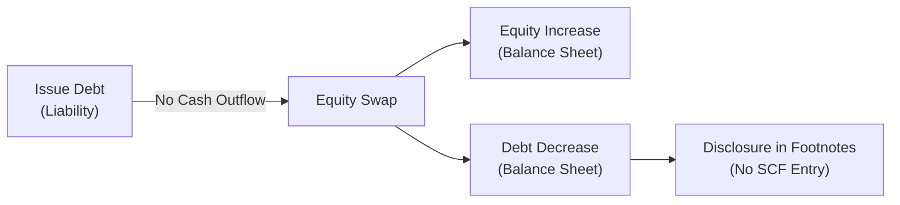

## Understanding the Purpose of Noncash Transaction Disclosures

Ever chatted with a friend about a fancy new gadget they got and then realized they actually swapped an old gadget for it without spending a dime? That’s kind of how noncash transactions work in the world of financial reporting. Companies can acquire new assets (or settle obligations) without directly using cash—maybe by issuing shares, swapping land for equipment, or converting debt into equity. Because these transactions don’t show up in the main numbers of the Statement of Cash Flows (SCF), regulators require detailed disclosures so potential investors, analysts, or other stakeholders can see what’s really happening under the hood.

Noncash transactions can make a company look more (or less) liquid than it might appear at first glance. A big debt-to-equity swap, for instance, eliminates a chunk of liability without an obvious cash outlay. So, if you’re not paying attention, you might think the company’s leverage is dropping due to strong cash inflows—when, in fact, it’s simply a capital restructuring. These disclosures are crucial to understanding the firm’s real economic performance and financial flexibility.

## Why Noncash Items Aren’t on the Main Statement of Cash Flows

The SCF is specifically intended to show how cash moves in and out of a company during a specific reporting period. That’s why the official line is that pure noncash activities don’t belong in the main SCF sections (Operating, Investing, Financing). Instead, they’ll typically appear in a supplemental or separate disclosure area. This distinction lets the SCF remain faithful to its role: summarizing actual cash inflows and outflows.

However, IFRS (per IAS 7.43) and US GAAP (ASC 230-10-50) recognize that while these noncash changes may not impact current liquidity, they sure do affect a company’s long-term capital structure and resource base. So, standard-setters require clarity: highlight big items somewhere else (often in the notes), so no one is misled.

## Common Types of Noncash Transactions

Below are some everyday examples of noncash transactions that might pop up in footnotes:

• Conversion of Debt to Equity:  
  – This is arguably one of the most common noncash disclosures. A loan or bond metamorphoses into equity shares, which instantly changes the debt ratio. If you’re evaluating a company’s solvency, it’s pretty important to spot that shift!

• Acquisition of Assets by Issuing Shares:  
  – Sometimes, the entire purchase price for a new machinery line or building is paid with stock. This transaction doesn’t use cash, but it significantly alters the issuing firm’s ownership structure and the target’s shareholder base.

• Exchanges of Property or Equipment:  
  – Think of a scenario where a car dealer trades vehicles with a real estate developer—no cash changes hands, but both sides record changes in their respective asset accounts. These can get complicated, especially if the assets differ in fair value.

• Entering into a Lease that Acquires an Asset:  
  – Under IFRS 16 or ASC 842, leasing can bring a right-of-use asset and lease liability onto a firm’s balance sheet without immediate cash outflow at inception. Disclosing the noncash portion helps readers see the actual financing nature of the agreement.

## Significance for Analysts

### Impact on Capital Structure

Noncash transactions can transform a company’s equity, debt, or asset base in ways that might obscure a firm’s risk profile. If you’ve ever tried to do a ratio analysis for a company and had that “Wait, how did they suddenly reduce debt so drastically?” feeling, there’s a decent chance a debt-to-equity conversion was in play.

### Masking True Cash-Generating Capabilities

If a firm acquires multiple assets or pays off liabilities without using cash, you could momentarily mistake their cash flows for being stronger than they actually are. Noncash disclosures are your lifeline, ensuring you don’t give unfair credit to management for skillful operational money-making when really they might just be bartering or restructuring.

### Importance of Reading Footnotes

Yes, footnotes can be dense, occasionally reminiscent of reading legal disclaimers in tiny print. But footnotes (or supplemental disclosures) hold the secrets. Analysts who skip them risk missing out on major transactions that influence creditworthiness, profitability, or future growth potential. For instance, if a company is heavily reliant on noncash acquisitions for expansion, it might face looming liquidity issues when it eventually needs to generate actual cash to service new obligations.

## IFRS vs. US GAAP Requirements

From a practical standpoint, IFRS and US GAAP are largely aligned in requiring separate disclosure of noncash transactions. Both sets of standards see the significance of ensuring transparency.

• IFRS (IAS 7.43):  
  Encourages an entity to disclose major classes of gross cash receipts and gross cash payments arising from investing and financing transactions that do not involve cash flows. IFRS generally emphasizes providing enough detail to let users evaluate the effects on the company’s financial position and performance.

• US GAAP (ASC 230-10-50):  
  Requires a separate schedule or narrative disclosure for noncash investing and financing transactions. It’s especially explicit that the SCF exclude these noncash items from the main sections but remain included in the notes so users can see the bigger picture.

## Examples and Case Study

### Example 1: Debt-to-Equity Swap

Let’s say ABC Corp. has a $1,000,000 long-term loan outstanding. Facing liquidity constraints, the lender decides to convert $500,000 of that loan into ABC’s common shares. Now, if you look purely at the SCF, you won’t see a half-million dollars of “cash inflow” from financing—because no cash changed hands! Instead, in the footnotes, ABC Corp. might say:

“During the period, the company converted $500,000 of long-term debt into 10,000 shares of Class A stock.”

When analyzing leverage, you must incorporate that partial debt extinguishment, combined with a higher equity base.

### Example 2: Share-Based Acquisition of a Subsidiary

Now suppose DEF Corp. acquires a smaller competitor purely by issuing new shares. No money is discharged to the seller. The footnotes would read something like:

“On June 30, DEF Corp. issued 200,000 common shares at $25 par value each to acquire all outstanding equity of GHI, Inc. No cash was involved in this transaction.”

A quick read of the SCF might give no hint of a big outflow because, again, there was no actual cash. However, the transaction significantly expanded DEF Corp.’s operations and presumably changed the ownership structure.

### Example 3: Equipment Exchange

A manufacturing firm might exchange old equipment (carrying value $100,000) plus an issuance of new shares for a more advanced machine from another company (fair value $200,000). The difference is partly recognized as a gain or loss, but no net cash changes hands. This situation can lead to a footnote such as:

“XYZ Manufacturing exchanged equipment with a net book value of $100,000 and issued 5,000 shares of its common stock in return for new machinery valued at $200,000.”

Spotting that exchange means you know how $200,000 of new assets materialized, even though the SCF’s “Investing” section remains quiet on that front.

## Visualizing Noncash Transactions

Below is a simple Mermaid diagram showing how a noncash transaction might flow in a company’s reporting. Imagine a debt-to-equity swap:

Notice how everything bypasses the SCF main sections (Operating, Investing, Financing). Instead, readers find details in the supplemental disclosures.

## Best Practices for Financial Analysis

• Read Footnotes and Schedules:  
  – This is step one. The more thorough the footnotes, the easier your life is. Some IFRS filers present a standalone schedule specifically listing noncash changes in liabilities.

• Adjust Ratios Appropriately:  
  – Don’t let a big bump in equity or a reduction in debt trick you. Recalculate leverage metrics with a full understanding of what triggered the changes.

• Compare Year-over-Year Cash Flows:  
  – Check if the company consistently grows assets or retires debt using noncash methods, rather than generating free cash flow. It may be sustainable during boom times (e.g., convertible bonds easily turning into shares if the stock price cooperates), but it can be risky if the share price plummets or investor appetite changes.

• Watch for Overreliance on Noncash Financing:  
  – Frequent issuance of equity for asset purchases could dilute existing shareholders. Meanwhile, large-scale debt restructuring can reveal deeper operational or credit issues. Evaluate the entire story behind these transactions.

## Common Pitfalls and Challenges

1. Overlooking Disclosures:  
   – It’s surprisingly easy to gloss over footnotes. Yet, big red flags often appear in these short paragraphs.

2. Confusing Noncash with “No Cost”:  
   – A transaction that doesn’t require immediate cash outlay can still carry a hefty price. Issuing shares depresses ownership percentages. Asset-or-equity swaps might trigger tax effects or future obligations.

3. Missing the Timing of Recognition:  
   – Sometimes, the formal footnote is in the next reporting period, or the fairness of the transaction valuation might get questioned (especially if intangible or unlisted assets are swapped).

4. Imprecise Valuation of Exchanges:  
   – If two firms swap assets with “equal fair values,” you might wonder how that value was determined. This is especially relevant for intangible or specialized equipment where market prices aren’t straightforward.

## Exam Relevance and Practical Takeaways

For your exam (and real-world analysis), be prepared to encounter statements or vignettes describing how a firm’s capital structure changed without any associated cash movements. You might be asked to:

• Recalculate leverage ratios adjusting for debt-to-equity conversions.  
• Explain how an asset acquisition should appear in the SCF and footnotes.  
• Identify the correct classification of a newly leased asset.  

Many exam scenarios highlight how ignoring these disclosures can lead to wrong capital structure or liquidity assessments. Don’t let that happen—footnotes truly can be the hero of your analysis.

## Conclusion

Noncash transactions can significantly alter a company’s balance sheet, capital structure, and future risk profile—often without any visible trace in the main sections of the Statement of Cash Flows. Recognizing and properly interpreting these disclosures is a must for anyone seeking to understand a firm’s financial and operational well-being. The good news? IFRS and US GAAP both require thorough footnote detail, so you’re not left totally in the dark. 

But it’s on you to hunt down these hidden gems of information: read the footnotes, ask the right questions, and incorporate that additional analysis into your valuation or investment decisions. You’ll thank yourself later—trust me, I’ve learned it the hard way when analyzing clients’ capital structures (back in my early days, I totally missed a massive convertible bond–to–equity transaction buried near the end of the notes).

Take a moment to review your own approach to SCF analysis. Practice scanning financials for any transaction that might have zero net cash effect but a significant impact on the business. And next time you see a sudden jump in equity or a miraculous drop in debt, you’ll know exactly where to look.

## Reference List

- IFRS Foundation (IAS 7), Paragraph 43.  
- FASB Accounting Standards Codification (ASC) 230-10-50.  
- CFA Institute, “Financial Statement Analysis,” Official Curriculum.  

## Test Your Knowledge: Disclosures of Noncash Transactions Quiz



### Which of the following best describes a noncash transaction?

- [ ] An event that involves the direct exchange of cash for assets or services.
- [x] An event that changes a company’s financial or asset structure without using cash.
- [ ] A transaction recorded in the operating section of the SCF.
- [ ] An event that has no impact on a firm’s capital structure.

> **Explanation:** A noncash transaction usually alters a firm’s assets, liabilities, or equity but doesn’t involve an actual cash outlay or inflow.

### Under IFRS and US GAAP, where are noncash transactions typically reported?

- [ ] Directly in the financing section of the SCF.
- [ ] Directly in the investing section of the SCF, net of taxes.
- [x] In a separate footnote or supplemental disclosure.
- [ ] They are not recorded anywhere in the financial statements.

> **Explanation:** Both IFRS (IAS 7.43) and US GAAP (ASC 230-10-50) keep these noncash items out of the main SCF sections but mandate separate reporting in footnotes or supplemental schedules.

### Which of the following is a classic example of a noncash financing transaction?

- [x] Conversion of debt into equity shares.
- [ ] Paying interest expenses with short-term borrowings.
- [ ] Selling equipment for cash at book value.
- [ ] Recognizing unearned revenue in the operating section.

> **Explanation:** Debt-to-equity conversions do not involve cash and directly affect a company’s capital structure.

### A company acquires a building by issuing common stock, with no cash changing hands. How would this appear?

- [ ] It would show as a cash outflow in the investing section of the SCF.
- [x] It would appear only in the notes or supplemental disclosure section, not in the main SCF.
- [ ] It would appear as an inflow in the operating section and outflow in the financing section.
- [ ] It would appear as a net-zero line item in the SCF.

> **Explanation:** Since it’s a noncash transaction, IFRS and US GAAP both require it to be disclosed but kept out of the main SCF sections.

### Which statement about noncash transaction disclosures is most accurate?

- [x] They prevent analysts from overestimating a company’s cash generation.
- [ ] They never influence leverage ratios.
- [x] They are only relevant for firms operating in high-inflation economies.
- [ ] They are inconsequential to capital structure evaluations.

> **Explanation:** Disclosing noncash items keeps you from getting the wrong impression of a company’s operational cash flows and helps you properly assess leverage.

### If a firm consistently retires debt by issuing shares instead of paying cash, what is the key risk you might watch for?

- [x] Significant shareholder dilution.
- [ ] Excessive cash outflows.
- [ ] Lower reported net profits.
- [ ] Inability to secure more debt in the future.

> **Explanation:** Repeated share issuances erode existing ownership stakes, resulting in potential dilution for current shareholders.

### Which of the following is least likely to be considered a noncash transaction?

- [ ] Converting preferred stock into common stock.
- [x] Paying a supplier with cash drawn from a credit line.
- [ ] Trading a truck for a smaller vehicle of equal fair value.
- [ ] Issuing equity to acquire intangible assets.

> **Explanation:** Paying a supplier with cash from a credit line is still a cash transaction, even if sourced from borrowed money, whereas the others do not use cash.

### In the context of IFRS (IAS 7.43), which of the following would require separate disclosure?

- [x] Settling a note payable by issuing equity instruments.
- [ ] Receiving interest income on an investment security.
- [ ] Purchasing raw materials with short-term credit that’s immediately paid down with cash.
- [ ] Paying salaries to employees.

> **Explanation:** IAS 7.43 explicitly states that major classes of investing and financing transactions that do not involve cash flows should be disclosed separately, such as settling a note by issuing shares.

### Why might an exchange of property for similar property at equal fair value still require detailed note disclosure?

- [x] To reveal the impact on reported assets even if no cash flow occurred.
- [ ] Because IFRS prohibits asset exchanges.
- [ ] Because it always triggers a large miscellaneous expense.
- [ ] Because the SCF demands separate line items for exchanges.

> **Explanation:** Even if fair values are the same and no cash changes hands, IFRS and US GAAP guidelines require disclosure to explain how the transaction changed the firm’s asset mix.

### True or False: Noncash transactions can never affect a company’s debt-to-equity ratio.

- [ ] True
- [x] False

> **Explanation:** A noncash transaction such as a debt-to-equity swap can significantly alter a firm’s leverage ratios without a single dollar of cash changing hands.


