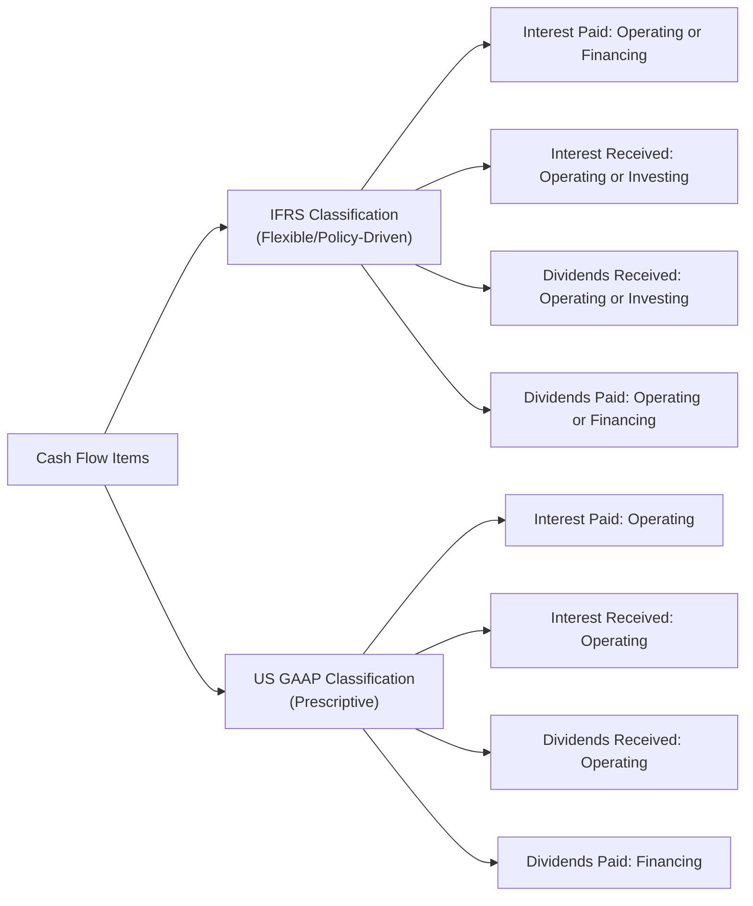

## Introduction

If you’ve ever looked at two companies’ statements of cash flows side by side and found yourself thinking, “Wait, why are these line items not matching up?”—believe me, you’re not alone. It’s kind of a classic puzzle for anyone comparing multinational companies. Under International Financial Reporting Standards (IFRS) and US Generally Accepted Accounting Principles (US GAAP), certain items—like interest received, interest paid, and dividends—might show up in different spots on the statement of cash flows. And it can be confusing if you’re just reading them for the first time or approaching them from a purely conceptual standpoint.

In this section, we’ll explore how IFRS and US GAAP classify operating vs. investing cash flows. We’ll highlight the main differences, and then we’ll talk about how analysts can handle the potential headaches these differences can cause, especially when you’re trying to compare cross-border companies. And trust me, if you’ve got a global portfolio, you’ll want to keep these distinctions in mind so you don’t get tripped up on your next investment analysis—or your next exam question.

## Core Principles of the Statement of Cash Flows

Before we dive into the classification differences, let’s do a quick refresher on the three core sections that appear under both IFRS (IAS 7) and US GAAP (ASC 230):

• Operating Activities (CFO): Usually revolve around day-to-day business activities, such as cash receipts from customers and cash payments to suppliers and employees.  
• Investing Activities (CFI): Typically involve the purchase or sale of long-term assets and other investments not classified as cash equivalents.  
• Financing Activities (CFF): Generally related to raising or repaying capital, such as issuing shares, paying dividends, and borrowing or repaying debt.

At a high level, IFRS and US GAAP agree on these broad categories. But the devil, as usual, is in the details regarding where to classify items like interest and dividends.

## IFRS Classification Flexibility

Under IFRS (as described in IAS 7), companies have more leeway in determining the classification of interest, dividends received, and dividends paid. This is sometimes described as IFRS classification flexibility. In short:

• Interest Received: Can be shown under operating or investing activities.  
• Dividends Received: Can be shown under operating or investing activities.  
• Interest Paid: Can be shown under operating or financing activities.  
• Dividends Paid: Can be shown under operating or financing activities.

### Why Does IFRS Allow This Flexibility?

The rationale is that IFRS generally wants to reflect the substance of the transaction. If management sees dividends paid as part of the “cost” of equity financing, then it’s perfectly valid to classify that under financing activities. Alternatively, if the organization’s view is that dividends are just a distribution out of operating cash flows, IFRS would permit classification within the operating section. The key point is consistency: IFRS encourages firms to choose a classification approach and stick with it across reporting periods. This consistency helps preserve comparability for that particular entity over time.

### Policy Choice Example: Interest Paid

Imagine a European manufacturing company that finances all its growth with debt. It might regard interest paid as a cost of borrowing, so they classify interest payments under financing activities to reflect the idea that they’re part of the overall financing structure. That said, IFRS also allows them to place interest payments under operating if they consider it part of the normal cost of running the business. IFRS is basically saying, “Decide which classification best mirrors your economic reality—but once you pick, don’t keep flipping back and forth.”

## US GAAP Prescriptive Classification

On the other hand, US GAAP (per ASC 230, “Statement of Cash Flows”) is a bit more prescriptive about interest and dividends. Generally, US GAAP says:

• Interest Received: Operating activities.  
• Dividends Received: Operating activities.  
• Interest Paid: Operating activities.  
• Dividends Paid: Financing activities.

### Why the Prescriptive Approach?

The US GAAP framework aims to reduce variability so that when analysts compare US-based companies, they’re all essentially dealing with the same classification rules. In a sense, it’s simpler: If you’re paid interest on your marketable securities, that’s part of operating cash flows. If you’re paying interest on your business loans, that’s also operating. End of story. Are you paying dividends to shareholders? That goes into financing. There’s less guesswork, so you won’t see as many policy elections from one US GAAP firm to the next.

## Key Differences and Comparability Concerns

So, what happens if you attempt to compare a US-based telecom company with a European telecom company, and they both have massive interest payments on their loan obligations? Under IFRS, that interest might be classified as either operating or financing; under US GAAP, it’s almost always operating. That difference can distort your read on cash flow from operations (CFO). One company might look like it generates more operating cash flow, but in reality, it’s partially because interest payments are shoved under financing.

When analyzing cross-border peers, you need to check:

1. **Where does each company classify interest paid, interest received, and dividends paid and received?**  
2. **Has the IFRS firm changed policy recently, or has it stayed consistent?**  
3. **Could differences in classification significantly alter a financial ratio like the Operating Cash Flow to Total Debt Ratio?**

Consistency within a single firm is crucial, but it’s just as crucial for you, as the analyst, to do some standardization if you want to make apples-to-apples comparisons. If you find that one IFRS firm includes interest paid in financing, while the US GAAP peers show it in operating, you might want to recast the IFRS firm’s numbers to better align the classification.

## A Quick Mermaid Diagram

Below is a simplified depiction of how IFRS and US GAAP might map certain items to different sections of the cash flow statement.



As you can see, IFRS has more routes (D, E, F, G) depending on management’s policy choices, whereas US GAAP lumps each item into a single bucket.

## Illustrative Examples

Let’s look at how a company might classify interest and dividends to see these rules in practice. We’ll do three mini scenarios to show you the differences under IFRS vs. US GAAP.

### Example 1: Interest Paid

• IFRS: A French manufacturing firm sees interest paid as a financing cost. It classifies interest paid in its financing section.  
• US GAAP: A US manufacturing firm must classify interest paid in its operating section.

Result: When analyzing the statement of cash flows, the French company’s CFO might look higher, while its CFF might look lower (due to the interest paid being placed in financing). The US company's CFO might be deflated by that same interest cost.

### Example 2: Dividends Paid

• IFRS: A UK software developer might classify dividends paid as operating, arguing it is a routine distribution from operating cash flow. It could also classify dividends paid as financing if it considers that part of its capital structure decisions.  
• US GAAP: A US-based software developer must report dividends paid as a financing outflow.

Result: Under IFRS, you might see the line under “Operating Activities” or “Financing Activities.” Under US GAAP, you will only see it under “Financing.”

### Example 3: Dividends Received

• IFRS: Given IFRS policy flexibility, a Canadian-based IFRS-reporting entity might classify dividends received as operating or investing. Some folks see dividends received as a return on equity investments (thus operating); others see it as a return on investment, so they present it in investing.  
• US GAAP: Dividends received are always recognized as operating inflows.

In all these scenarios, the classification choice by IFRS reporters can create confusion when you’re bench-marking or building ratio analyses. If you’re not watching carefully, you might incorrectly conclude that one company is more “operationally efficient” (because its operating cash flow is large) or less so (because that company lumps more of these costs into the operating section).

## Potential Pitfalls and Why Consistency Matters

1. **Misleading Comparisons**: If you’re measuring an “Operating Cash Flow Margin,” you could be picking up or excluding interest payments in one company’s margin but not in another’s.  
2. **Performance Metrics**: Analysts often rely on CFO-based performance metrics such as the Operating Cash Flow to Debt ratio. If a large chunk of interest expense is missing from CFO (due to being in financing under IFRS) or is included in CFO under US GAAP, you can end up with an apples-and-oranges scenario.  
3. **Trending Over Time**: If a firm switches IFRS classifications from period to period, it can hamper trend analysis. The IFRS standard strongly encourages consistency to avoid this confusion, but in practice, policy changes can happen due to acquisitions, new CFOs, or changes in strategic direction.

## Cross-Border Considerations

You know, a while back, I was analyzing two steel companies—one was US-based and the other was IFRS-reporting. I’ll never forget the confusion I had when I looked at their statements of cash flows. The IFRS one had significantly higher CFO because it classified both dividends paid and interest paid in the financing section. Meanwhile, the US-based company’s CFO was comparatively smaller due to interest being grouped into operating. At first glance, it looked like the IFRS company was a cash monster. But once I adjusted for the differences, I realized that, in reality, the two firms had pretty similar operating cash flow profiles.

### Adjusting for Comparability

Analyzing cross-border companies often involves making adjustments to standardize their statements. Some analysts recast IFRS statements to US GAAP style (or vice versa) so they can do an apples-to-apples comparison. This might mean moving interest paid from financing to operating, or vice versa, or reclassifying dividends paid. The process can be a bit tedious, but it often yields a clearer picture of both companies’ true cash-generating abilities.

## A Simple Python Snippet to Illustrate Recasting

Below is a small Python code snippet—just for fun—to imagine how one might automatically recast IFRS-based statements to a more standardized classification:

```python
def recast_cash_flow_ifrs_to_usgaap(ifrs_cash_flow):
    """
    Recasts certain IFRS classification items to US GAAP classification for easier comparison.
    """
    # Suppose ifrs_cash_flow is a dict with keys: 'operating', 'investing', 'financing'
    # And nested details of interest_paid, interest_received, dividends_paid, dividends_received
    usgaap_cash_flow = {
        'operating': ifrs_cash_flow['operating'].copy(),
        'investing': ifrs_cash_flow['investing'].copy(),
        'financing': ifrs_cash_flow['financing'].copy()
    }

    # Under US GAAP, interest_paid must be in operating
    if 'interest_paid' in usgaap_cash_flow['financing']:
        usgaap_cash_flow['operating']['interest_paid'] = usgaap_cash_flow['financing'].pop('interest_paid')

    # Under US GAAP, interest_received in operating
    if 'interest_received' in usgaap_cash_flow['investing']:
        usgaap_cash_flow['operating']['interest_received'] = usgaap_cash_flow['investing'].pop('interest_received')

    # Dividends_received must be in operating under US GAAP
    if 'dividends_received' in usgaap_cash_flow['investing']:
        usgaap_cash_flow['operating']['dividends_received'] = usgaap_cash_flow['investing'].pop('dividends_received')

    # Dividends_paid must be in financing under US GAAP
    if 'dividends_paid' in usgaap_cash_flow['operating']:
        usgaap_cash_flow['financing']['dividends_paid'] = usgaap_cash_flow['operating'].pop('dividends_paid')

    return usgaap_cash_flow
```

Granted, in the real world, you’d need a more sophisticated approach (and more data). But this quick snippet highlights the main classification differences that must be addressed if you’re standardizing IFRS statements to US GAAP style.

## Real-World Mini Case

Picture a cross-border tech conglomerate (“GlobalTech Solutions”) that has a subsidiary in the US (which reports under US GAAP) and a subsidiary in Germany (which reports under IFRS). When consolidating, the parent must unify these statements onto one consistent basis. Quite often, the parent’s IFRS classification rules will override or they’ll present the entire set of consolidated results under IFRS. But the US subsidiary, having historically reported interest paid under operating, might now see that classification changed to financing on the consolidated statements. This difference can create confusion for minority shareholders and external analysts unless carefully explained in the notes to the financial statements.

## Best Practices and Strategies for Analysts

• **Check the Notes:** Always read the footnotes in the annual reports to see exactly how management is classifying interest, dividends, and other borderline items.  
• **Maintain a Recasting Template:** Develop a consistent approach if you regularly compare IFRS and US GAAP companies. This can be especially important for large retailers, banks, or manufacturing conglomerates with extensive financing arrangements.  
• **Look for Consistency Over Time:** Pay attention when a firm changes its classification. They’re supposed to disclose this, but you need to watch for it. If you see CFO jump in one period, the cause might be a reclassification rather than genuine operational improvement.  
• **Beware of Partial Adoptions or Dual Gaap Filings:** Some entities file partly under IFRS for certain jurisdictions or wholly under US GAAP for others. That’s a recipe for confusion if not handled carefully.

## Conclusion

When it comes to statements of cash flows, IFRS and US GAAP share the same broad template but diverge in their classification of interest and dividend-related items. Under IFRS, you’ll see flexibility—interest received, interest paid, dividends received, and dividends paid might fall under operating or investing/financing categories. US GAAP is more prescriptive, placing interest received/paid and dividends received in operating, and dividends paid in financing.

As an analyst, you should maintain awareness of these differences. If you’re not careful, you might get fooled into thinking a company is generating more (or less) operating cash flow than it truly is. Always check the notes and, where necessary, recast or standardize statements so you can make a fair comparison. This knowledge is crucial whether you’re brushing up for your next CFA exam or doing a deep-dive on cross-border equity valuations.

## References & Further Reading

• IAS 7, “Statement of Cash Flows,” paragraphs 31–35, IFRS Foundation  
• ASC 230, “Statement of Cash Flows,” US GAAP, FASB Accounting Standards Codification  
• PwC. (2024). “IFRS and US GAAP: similarities and differences.”  
• Deloitte. (2024). “iGAAP vs. US GAAP: A comparison of IFRS and US GAAP.”  

## Practice Questions on Operating vs. Investing Cash Flows under IFRS vs. US GAAP



### Under IFRS, which of the following items could potentially be classified as either operating or financing activities?

- [ ] Dividends received
- [x] Interest paid
- [ ] Sale of property, plant, and equipment
- [ ] Purchase of intangible assets

> **Explanation:** Under IFRS, a company may choose to classify interest paid as either an operating or financing outflow. Dividends received can be operating or investing (but not financing). Sales or purchases of fixed assets fall under investing activities.

### Which of the following items is always classified as an operating activity under US GAAP?

- [ ] Dividends paid
- [x] Interest received
- [ ] Repayments of principal on debt
- [ ] Issuance of new shares

> **Explanation:** Under US GAAP, interest received is always recognized as operating. Dividends paid are financing, repayments of principal on debt are financing, and issuance of new shares is financing.

### If an IFRS-reporting entity wants to show interest received as an investing activity, what is the main principle allowing this choice?

- [x] IFRS classification flexibility
- [ ] US GAAP prescriptive approach
- [ ] Fair value hierarchy
- [ ] Mandatory disclosure in financing

> **Explanation:** IFRS classification flexibility means interest received can be classified in either operating or investing activities, as long as the company is consistent in its policy.

### Under US GAAP, dividends received are classified in the statement of cash flows as:

- [x] An operating inflow
- [ ] An investing inflow
- [ ] A financing inflow
- [ ] A reduction of net income

> **Explanation:** Dividends received from investments are reported as an operating cash inflow under US GAAP.  

### Which classification is allowed under IFRS but not under US GAAP for dividends paid?

- [ ] Dividends paid as operating outflow
- [x] Dividends paid as operating outflow
- [ ] Dividends paid as investing outflow
- [ ] Dividends paid as intangible outflow

> **Explanation:** IFRS allows dividends paid to be classified as either financing or operating. US GAAP mandates dividends paid be classified as financing activities.

### A company that reports under IFRS chooses to classify interest paid as a financing outflow. Which statement is true?

- [x] This policy choice reduces the reported operating cash flow compared to US GAAP.
- [ ] This policy choice increases the reported operating cash flow compared to US GAAP.
- [ ] This policy choice is only allowed if dividends paid are also financing outflows.
- [ ] This policy choice has no impact on total free cash flow.

> **Explanation:** Under US GAAP, interest paid must be in operating. If a company under IFRS chooses to show interest paid in financing, then all else equal, its operating cash flow appears higher relative to a US GAAP classification.

### An analyst wants to compare two companies’ operating cash flow margins, but one follows IFRS and the other uses US GAAP. What should the analyst do first?

- [ ] Compare their net income calculations
- [ ] Ignore classification differences since total cash flow is the same
- [x] Examine classification policies for items like interest paid and dividends
- [ ] Consolidate all differences by ignoring the footnotes

> **Explanation:** The first step in cross-border comparison is to look at how items like interest and dividends are classified, which can distort operating cash flows.

### Which item is generally reported differently under IFRS compared to US GAAP?

- [ ] Cash from sale of equipment
- [x] Dividends received
- [ ] Issuance of shares
- [ ] Lease repayments

> **Explanation:** Dividends received is the area where IFRS allows an operating or investing classification, while US GAAP typically demands operating. Sales of equipment, share issuance, and lease repayments have more straightforward classifications.  

### A US-based manufacturing firm has large interest payments on its bonds. Under US GAAP, in which section does this appear?

- [x] Operating activities
- [ ] Financing activities
- [ ] Investing activities
- [ ] Discontinued activities

> **Explanation:** US GAAP prescribes that interest paid is operating, regardless of its root cause.

### True or False? Under IFRS, a company must classify interest received under operating activities only.

- [ ] True
- [x] False

> **Explanation:** Under IFRS, you may classify interest received as either operating or investing, so the statement is false.


