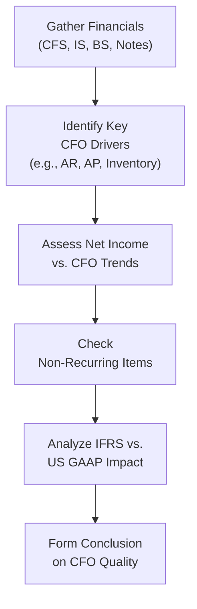

## Overview and Objectives

Evaluating the quality of cash flow from operations (CFO) is a critical step in understanding a firm’s financial health and measuring how effectively managers are converting revenue into real, recurring cash. High-quality operating cash flow signals that the reported numbers genuinely reflect robust, sustainable performance rather than window dressing or short-term maneuvers. In contrast, low-quality CFO often arises when companies use adjusted payment terms, off-balance-sheet structures, or aggressive working capital strategies to inflate or smooth out their operating cash figures.

In this section, you will learn how to:

• Determine whether operating cash flow aligns with a company’s underlying economic reality.  
• Compare CFO to measures like net income to uncover potential red flags or aggressive accounting.  
• Evaluate changes in working capital, non-recurring items, and management policies that may impact CFO quality.  
• Differentiate between sustainable changes in operational efficiency and short-term gains that boost CFO only temporarily.  

This discussion builds on our earlier foundations in Chapters 2 and 3, particularly the relationship between net income (Chapter 2: Analyzing Income Statements) and balance sheet accounts like receivables, payables, and inventory (Chapter 3: Analyzing Balance Sheets). We also rely on concepts from Section 4.1 regarding the linkages among financial statements.

## Importance of CFO Quality

### Relevance to Analysts and Investors

From an investor’s standpoint, operating cash flow is often viewed as more robust than net earnings because it is harder to manipulate pure cash inflows and outflows over the long run. However, the quality of CFO is susceptible to management’s discretion in the timing of receipts and payments, as well as how certain expenses or non-recurring items are treated. If a company extends its payables significantly right before quarter-end, for example, CFO may look unexpectedly strong—yet this may not be sustainable or repeatable.

In practice, a reliable and consistently positive CFO helps demonstrate a firm’s ability to:

• Fund ongoing operations without recurring external financing.  
• Invest in capital expenditures to maintain or grow the business.  
• Distribute dividends or buy back shares.  

When CFO is erratic or disproportionately high relative to net income, it can raise concerns about manipulative tactics or underlying issues in earnings quality (see also Chapter 12: Financial Reporting Quality).

### When CFO Diverges from Net Income

One classical indicator is the relationship between CFO and net income. Over extended periods, these two metrics should typically trend in tandem. If net income is rising but CFO remains flat or lags notably, it might be a sign of:

• Overly aggressive revenue recognition (e.g., booking sales before actual payment).  
• Rising accounts receivable that outpace revenue growth.  
• Capitalized expenditures or depreciation practices that mask operational weaknesses.  

Alternatively, if CFO surges but net income remains stagnant, you might suspect that management is stretching payables, selling off inventory at a discount, or delaying certain essential expenses—moves that can inflate CFO artificially.

## Key Components and Influences on CFO Quality

### Working Capital Effects

Working capital management can drastically affect CFO. Companies regulate their collections (accounts receivable), payments (accounts payable), and inventory levels to optimize their short-term liquidity. Let’s take a closer look at each major element:

• Accounts Receivable (AR): If AR expands faster than revenue, it might signal that the company is struggling to collect from customers or is using loosening credit terms to boost sales artificially. This typically reduces CFO in the current period.  
• Inventory: Excess inventory ties up cash, impacts liquidity, and can also become obsolete or require markdowns (see Chapter 5: Analysis of Inventories). Conversely, running low on inventory to the point of harming operations can temporarily increase CFO but signal future revenue constraints.  
• Accounts Payable (AP): Delaying supplier payments can inflate CFO. If a firm repeatedly extends its payment deadlines without building sustainable arrangements, it may face reputational damage or supply-chain disruptions.  

An analyst’s job is to see through these changes in working capital patterns and decide whether they reflect genuine efficiency improvements or are short-term boosts lacking fundamental support.

### Non-Recurring Items and Adjustments

Noncash and non-recurring items—such as restructuring charges, litigation settlements, or one-time write-offs and reversals—can increase CFO if recognized in net income but reversed out in the CFO section under the indirect method. For instance:

• Large impairment or goodwill write-downs recognized in net income are essentially added back to CFO, boosting operating cash flows artificially in that reporting period.  
• Gains from asset sales may artificially reduce CFO if misclassified in operating vs. investing categories (depending on IFRS or US GAAP treatment).

#### Window Dressing

Window dressing involves short-term tactics to improve reported metrics in financial statements (often near the end of a reporting period). Some examples:

• Pushing out payables just before quarter-end and then paying them immediately after the new quarter begins.  
• Offering sales discounts to accelerate collections from customers, thereby reducing receivables.  
• Factoring receivables to a financial intermediary to convert them rapidly into cash (though in some cases, factoring arrangements reclassify CFO into financing or off-balance-sheet items if risk is not truly transferred).  

Evaluating CFO’s quality means distinguishing between these fleeting adjustments and legitimate improvements in cash generation.

### Relationship to Capital Expenditure Strategy

While analyzing CFO, it helps to see if the company is also:

• Investing in growth through capital expenditures (CapEx), product development, or acquisitions.  
• Maintaining or replacing existing assets.  

If a firm shows robust CFO but simultaneously slashes CapEx drastically, the improved CFO might simply be due to underinvestment rather than genuine operational success. Over time, insufficient reinvestment could degrade future revenue potential.

## IFRS vs. US GAAP Considerations

Although IFRS and US GAAP share common ground on the broad concept of CFO, there are nuances in classification and disclosures that analysts should keep in mind:

• IFRS allows more flexibility in classifying certain interest and dividend flows under operating versus investing or financing. Some companies under IFRS classify interest paid or interest received in the operating section, while under US GAAP, interest paid is always an operating outflow.  
• IFRS often discusses principle-based guidance, while US GAAP provides more rule-based guidelines, which can lead to differences in how non-recurring items or working capital adjustments are presented.  
• Certain disclosures, such as the breakdown of noncash transactions, may appear differently, requiring a more thorough reading of the notes.  

These differences can create challenges when comparing CFO across different reporting standards (see also Section 4.7 for further IFRS vs. US GAAP classifications of operating vs. investing cash flows).

## Identifying Red Flags in CFO

Below are some warning signs that CFO may not be of high quality:

• **Significant divergence between CFO growth and net income growth**: Could signal that one of them is manipulated.  
• **Sudden dramatic changes in working capital**: Spikes in receivables or payables may reveal timing plays.  
• **Repeated large adjustments for non-recurring items**: Suggests a pattern of frequent one-offs that might not be truly one-offs.  
• **Huge differences between direct and indirect methods**: Unusual items may hide within the indirect reconciliation.  
• **Declining days payable outstanding (DPO) or days sales outstanding (DSO)** inconsistencies: If inventory turnover or payables turnover look too good to be true, they might not last beyond the reporting period.  

## Tools for Quality-of-CFO Analysis

### Trend Analysis

Comparing CFO across multiple periods can provide insight into whether the firm’s cash flow generation is steady, declining, or improving:

1. **CFO-to-Net Income Ratio**: Over time, this ratio should hover around 1.0 or more. A persistently low ratio might indicate aggressive revenue recognition or poor collections.  
2. **CFO-to-Total Liabilities Ratio**: A helpful measure to see how comfortably CFO covers existing obligations.  
3. **CFO Margin**: Calculated as CFO divided by total revenue. A stable CFO margin suggests reoccurring, dependable operating performance.  

### Common-Size CFO Statements

Similar to what we do with income statements and balance sheets, a common-size approach can simplify cross-company or cross-time comparisons. For instance, analyzing CFO against total assets or total liabilities can help you see trends that might be masked by pure absolute figures.

### Segment-Level CFO

If available, segment-level CFO or segment disclosures (see 1.8 Segment Reporting Requirements) offer more detail on which business lines generate or consume the most cash. Sometimes, the consolidated CFO can look healthy while one major division is hemorrhaging cash.

### Visual Diagram of CFO Evaluation Process

Below is a simple Mermaid diagram illustrating the steps commonly taken to evaluate CFO quality:

## Practical Examples and Case Studies

### Example 1: Retailer with Extended Payment Terms

Imagine a mid-sized retailer that negotiates extended payment terms with its suppliers to go from net-30 to net-60. The immediate effect is lowered cash outflows for the current period, giving a boost to CFO. If the financial statements show net income up only 5% but CFO up by 20%, further data might reveal that most of this CFO improvement is from pushing payments into the next quarter. This does not necessarily reflect a genuine, ongoing operational improvement.

### Example 2: Tech Firm with Large Deferred Revenue Reversal

Consider a subscription-based software company that releases new software earlier than planned, pulling forward recognized revenue. At the same time, write-offs for intangible assets from past acquisitions get added back to CFO as a noncash item in the same period, further inflating CFO. While the CFO figure surges, deeper analysis discloses that the intangible impairment is non-recurring and the software deployment timing is part of a revenue recognition shift (refer to IFRS 15/ASC 606 guidance in Chapters 2.11 and 2.12). In reality, the sustainability of that spike in CFO is questionable.

## Best Practices, Pitfalls, and Strategies

• **Read the Footnotes**: Many clues about CFO manipulations hide in the footnotes or MD&A discussions, particularly notes on changes in working capital policies or credit terms.  
• **Compare Direct and Indirect Methods**: Examine how the direct method breaks down cash receipts and payments. Large differences can alert you to unusual changes in payables or receivables.  
• **Evaluate Non-Recurring Items**: Scrutinize items that appear once every few years. Frequent “one-time” write-downs or restructurings are suspicious.  
• **Consistent Policy Review**: Ensure no frequent changes to accounting policies for revenue recognition, depreciation, or inventory costing that might artificially alter CFO.  
• **Look for Lagging Indicators**: If CFO is rising but you notice capital expenditures dropping drastically, the higher CFO may be at the expense of future growth.

## Bridging CFO with Overall Financial Analysis

A thorough evaluation of CFO should not happen in a vacuum. Combine your analysis with:

• **Income Statement Review**: Check if improved CFO is supported by better operating margins or genuine sales growth.  
• **Balance Sheet Examination**: If short-term liabilities spike relative to assets, or intangible assets/rolling short-term debts accumulate, CFO might be overstated as a one-time effect.  
• **Risk Management and Stress Testing**: For industries like banking (see Chapter 14), analyzing CFO quality is crucial, especially under stressed market conditions.  

In practice, high-quality CFO stands at the intersection of healthy earnings, prudent balance sheet management, and robust operational policies.

## Exam Tips and Final Thoughts

1. **Focus on Trends, Not One-Offs**: A single quarter’s CFO improvement is less meaningful than a multi-period upward trend.  
2. **Recall IFRS/GAAP Differences**: Classification differences matter when comparing multi-national firms’ CFO.  
3. **Watch Working Capital**: Rapid changes in receivables, payables, or inventory can significantly distort CFO in the short term.  
4. **Tie in Revenue Recognition**: For subscription-based or long-term contract firms, confirm that revenue timing aligns with actual cash inflows.  
5. **Use Caution with Non-Recurring Adjustments**: Keep track of how often a firm includes items labeled “one-off” or “unusual.”  
6. **Practice from Past Exams**: Know how to interpret the CFO section under both the direct and indirect methods; exam prompts frequently include reconciling net income to CFO.

When you combine thorough analysis of operating cash flows with the rest of a firm’s financial statements, you gain a deeper sense of whether reported numbers are realistic and repeatable. Recognizing the warning signs of inflated CFO helps you identify companies that might be more volatile in future earnings or that engage in questionable financial reporting strategies.

## References

• Schilit, H. & Perler, J. (2018). Financial Shenanigans: How to Detect Accounting Gimmicks and Fraud. McGraw-Hill.  
• CFA Institute. (Current Curriculum). Reading on Cash Flow Analysis and Quality.  

## Test Your Knowledge: Evaluating Cash Flow From Operations



### Which of the following best describes “quality of cash flow from operations” (CFO)?

- [ ] The total money a company invests in capital expenditures each period.  
- [x] The sustainability, recurrence, and representativeness of a firm’s operating cash flows.  
- [ ] The direct cash flow method’s final total of investing cash flows.  
- [ ] The net amount of debt and equity raised by the company.  

> **Explanation:** CFO quality refers to whether reported operating cash flows genuinely reflect the firm’s underlying economic performance, reflect sustainable operations, and are free from excessive manipulation.

### A significant gap between net income growth and CFO growth over several consecutive quarters is most likely an indication of:

- [ ] Consistently strong growth in capital expenditures.  
- [ ] A stable alignment of net income and cash-based performance.  
- [x] Potential manipulation in revenue recognition or delayed outflows.  
- [ ] The normal timing difference between IP (intellectual property) costs and revenue.  

> **Explanation:** When net income and CFO diverge significantly, it can signal aggressive revenue recognition (e.g., booking revenue without corresponding cash inflows) or short-term measures like delaying supplier payments.

### One-time improvements in CFO through stretching payment cycles are best categorized as:

- [ ] A permanent enhancement to free cash flow.  
- [x] A non-sustainable short-term boost.  
- [ ] An indication of future upgrades in credit ratings.  
- [ ] A reclassification of financing activities as operating.  

> **Explanation:** Extending payment terms with suppliers can temporarily increase CFO but does not necessarily reflect long-term financial health or operational efficiency.

### Under IFRS, how might a firm classify interest received in the statement of cash flows?

- [x] Choice between the operating or investing section, depending on policy.  
- [ ] Mandated to appear only in the investing section.  
- [ ] Permitted solely in the financing section.  
- [ ] Always included in financing, consistent with US GAAP.  

> **Explanation:** IFRS provides companies some flexibility in classifying interest received. Under US GAAP, however, interest received must be recorded as operating cash flow.

### Which of the following best explains why analysts examine the indirect and direct methods of reporting CFO side-by-side?

- [x] To uncover any inconsistencies or unusual changes in working capital accounts.  
- [ ] Because the direct method is mandated for all public companies.  
- [x] To satisfy regulatory requirements imposed by local tax authorities.  
- [ ] To gain insight into noncash financing activities.  

> **Explanation:** Comparing direct vs. indirect presentations can illuminate hidden variations in receivables, payables, or other working capital items that might not be obvious through indirect reporting alone.

### In evaluating CFO quality, which item would most likely draw immediate scrutiny?

- [x] Multiple recurring “one-time” charges added back to CFO.  
- [ ] A moderate seasonal decline in revenue.  
- [ ] Depreciation expense consistent with the prior year.  
- [ ] Stable CFO-to-Revenue ratio.  

> **Explanation:** Frequent “one-time” items are suspicious because they can mask recurring operational challenges while inflating CFO through add-backs.

### A firm reports strong CFO yet drastically cuts capital expenditures. Which interpretation is most appropriate?

- [x] The higher CFO could be due to underinvestment, raising questions about sustainability of future growth.  
- [ ] This is a clear sign of improving operational efficiency.  
- [ ] It indicates the firm’s intangible assets are fully depreciated.  
- [ ] Capital needs are no longer required, so CFO is likely understated.  

> **Explanation:** Slashing capital expenditures can inflate CFO in the short term, but it may hamper the firm’s ability to generate revenue in future periods.

### Which is generally considered a “red flag” in CFO evaluation?

- [ ] A consistent CFO-to-Net Income ratio of around 0.95 over a three-year period.  
- [ ] A stable growth in both net income and CFO.  
- [x] A sudden spike in CFO driven primarily by a large increase in accounts payable.  
- [ ] An increase in depreciation expense tied to expanded production.  

> **Explanation:** When a short-term tactic like delaying payments to suppliers causes a sudden spike in CFO, it often signals temporary improvements that may not be repeatable.

### A commercial real estate firm revalues its assets upward because of a market boom. What impact could this have on CFO under IFRS?

- [x] Minimal direct effect, but potential allocation of revaluation gains may influence investor perceptions of future CFO.  
- [ ] A guaranteed reduction in CFO.  
- [ ] Automatic classification of revaluation gains in operating cash flows.  
- [ ] Increases CFO in the current period as a noncash add-back.  

> **Explanation:** Revaluations typically affect balance sheet values (and possibly other comprehensive income), but they do not necessarily generate immediate operating cash inflows.

### If a CFO measure is described as “high quality,” it mainly implies that:

- [x] The present CFO levels are likely to persist and align well with net income.  
- [ ] The firm uses only the direct method of reporting CFO.  
- [ ] The company’s quick ratio is above 1.0.  
- [ ] There are zero noncash transactions.  

> **Explanation:** “High quality” CFO suggests that ongoing business operations support the reported cash flows in a consistent, reliable manner, free from significant manipulations or temporal shifts.


