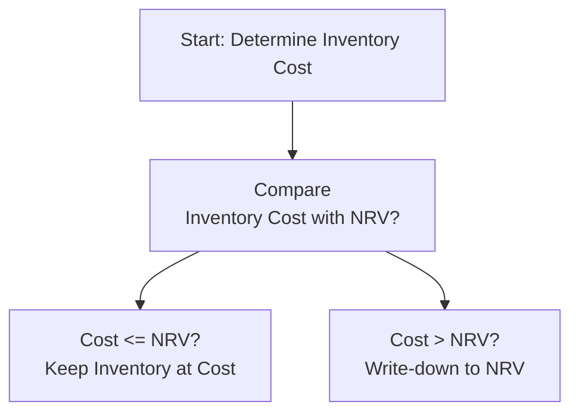

## Introduction

If there’s one area in financial statements where a bit of, well, “judgment” (some might say guesswork!) sneaks in, it’s definitely the valuation of inventories. I remember talking to an industry colleague who once discovered that hundreds of obsolete product units languished in a dusty warehouse—those items were still carried at full cost on the balance sheet. Needless to say, the subsequent write-down came as a nasty shock to management, creditors, and investors alike.

In this section, we’ll walk through the essential principles used to measure and value inventories under both IFRS and US GAAP. We’ll see how “lower of cost or net realizable value” is one of the cornerstones for reporting, why it matters to you as an analyst, and what signals you should watch out for if you suspect a company might be overstating (or understating) its inventory. Let’s jump right in.

## Core Principles of Inventory Valuation

### Lower of Cost or Net Realizable Value (NRV)

Under IFRS, and specifically IAS 2, inventories must be measured at the lower of:

• Cost  
• Net Realizable Value (NRV)

US GAAP, guided by ASC 330, generally uses the “lower of cost or market” approach. However, “market” is bounded by:

• A ceiling, which is NRV.  
• A floor, which is NRV less a normal profit margin.

In practice, this usually ends up being pretty close to the IFRS requirement of lower of cost or NRV—unless you’re in a situation with significant fluctuations in selling prices or complexities in normal profit margins.

### What Constitutes “Cost”?

Cost of inventory typically includes:

• Purchase price.  
• Import duties and transportation costs to bring the inventory to the current location.  
• Other handling or directly attributable costs.  

Indirect overhead, such as factory rent, might be allocated to inventory if it’s used in the production process, making cost accumulation more complex. Analysts should pay attention to how overhead is allocated—or, in some cases, misallocated—since that can inflate or shrink reported inventory.

### Net Realizable Value and its Calculation

NRV is basically the amount you expect to collect from selling the inventory in the ordinary course of business, minus:

• Estimated costs of completion, if any (e.g., finishing, assembly).  
• Estimated costs necessary to make the sale, such as marketing or distribution.  

Think of it as the exit price of the item, less any remaining steps and expenses needed to turn inventory into a sale. If that number is lower than your cost, you have a potential write-down on your hands.

### Write-Downs and Reversals

Under IFRS, you reduce (write down) the carrying amount of inventory to NRV when cost exceeds NRV. Subsequent increases in value (for instance, if the market rebounds or if you misjudged salability) can allow for partial or full reversal of the write-down—though you can’t exceed the original cost. US GAAP is stricter on this point: write-downs happen, but generally no reversal is permitted if circumstances change.

This difference has real implications for ratio analysis. Let’s say you’re comparing two companies in the same industry—one follows IFRS, one follows US GAAP. You might see the IFRS-preparer’s inventory fluctuate more if they reverse certain write-downs in future periods. The US GAAP company won’t show that same effect because it can’t reverse the previously recognized losses.

## Practical Decision Tree

The logic for determining whether to keep your inventory at cost or to write it down can be seen in a simple diagram. Let’s reveal the steps:

This flowchart reminds us that we always compare the recorded cost to NRV. If cost is higher, you write it down. If not, keep calm and carry on.

## Real-World Example

Imagine a smartphone manufacturer that’s built up a huge stock of last year’s phone model. Let’s say each unit’s cost is $300 (including materials, labor, factory overhead, and so on). Demand is sliding, and a competitor’s new phone is overshadowing it in the market. The company estimates that it can still sell each phone for $350 (note this is the expected selling price), but only after incurring $20 in final customization and $15 in marketing costs per unit. So the NRV is:

NRV = $350 – ($20 + $15) = $315

Since our cost ($300) is below the calculated NRV ($315), we keep the inventory on the books at $300. No write-down is necessary. But if the final customization and marketing costs rose, or if the selling price tumbled, we might find ourselves with, say, a net realizable value of $280. In that scenario, we’d have a $20 per-unit write-down ($300 cost – $280 NRV).

## Major Differences: IFRS vs. US GAAP

• Under IFRS (IAS 2), inventories are carried at the lower of cost or NRV. Write-downs can be reversed up to the original cost if market conditions improve.  
• Under US GAAP (ASC 330), inventories are carried at the lower of cost or market. “Market” is not to exceed NRV nor be less than NRV minus a normal profit margin. Reversals are generally prohibited.  

For practical purposes, many IFRS-preparers align close to US GAAP by rarely reversing a previously recognized write-down—unless it’s very clear that market conditions have dramatically changed.

## Cost Allocation: Why It Matters

Let’s be honest, inventory provides plenty of room for management’s “interpretation,” especially concerning overhead allocation or deciding which costs are capitalized versus expensed. Overstating the cost of inventory could artificially boost assets on the balance sheet, but it also inflates cost of goods sold (COGS) over time. Understating it might make margins look better in the short run but can lead to inventory shortfalls and big lumps of cost recognized in later periods.

Analysts often compare a company’s cost allocation approach to others in the same industry:

• If a company includes abnormal production costs in inventory while others expense them, it could be artificially inflating inventory levels.  
• If a company is allocating too little overhead to inventory, they might be trying to “smooth” the cost, so as not to surprise shareholders with a big chunk of overhead once items are sold.

## Obsolescence and Slow-Moving Items

One of the biggest headaches for inventory accountants is deciding which items are truly sellable and which ones are destined for obsolescence. Here’s where management estimation and judgment turn critical:

• How quickly do items become outdated? (Think high-tech or fast-fashion apparel—things fall out of style or become technologically obsolete fast.)  
• Is there a plan for discounting the items or bundling them with other, more popular products?  

If an analyst sees an unusually large proportion of older inventory items but no corresponding write-down, it’s a red flag. When that happens, you might want to dig into management’s assumptions and assess whether a correction is looming on the horizon.

## Frequent Revaluations in Volatile Industries

In volatile sectors—commodities, for example—inventory values can change dramatically in short periods. Under IFRS, you may see frequent partial write-downs and subsequent reversals if prices recover. A mining company with big piles of copper might revalue inventory each time the spot price changes significantly. Under US GAAP, you’d see a downward adjustment if needed, but not an upward one.

## Common Pitfalls and Best Practices

• Pitfall: Relying solely on management’s word for inventory’s salability. Best Practice: Examine disposals, discount strategies, and actual sales data for the older stock.  
• Pitfall: Not distinguishing between normal production overhead and abnormal production costs. Best Practice: Cross-check overhead rates with industry data.  
• Pitfall: Inconsistent valuation policies across reporting periods. Best Practice: Review footnotes for changes in cost methodology. A shift from standard costing to actual costing can bump or reduce inventory significantly.

## Brief Example of a Write-Down Reversal (IFRS)

Let’s imagine a retailer that wrote down winter coats by $10,000 total last year because it didn’t expect to sell them above cost. Suddenly, thanks to a fashion trend, those coats are back in style. The NRV is now higher than the previously written-down amount. The company can reverse, say, $6,000 of that original write-down. IFRS requires the reversal to be recognized in the current period’s income statement, reducing cost of goods sold or counted as another form of income. But it can’t exceed the original cost basis on those coats prior to the first write-down.

US GAAP would not allow this reversal. Once you write inventory down, it stays down on the books, even if you end up selling it at a nice margin later on.

## Analytical Implications

1. Profit Margins: Watch out for big inventory write-downs that reduce net income. Also, remember IFRS can reverse portions and re-inflate margins.  
2. Liquidity and Working Capital: Overstated inventory could mislead about short-term solvency. If you rely heavily on current ratios, consider whether the inventory is truly convertible to cash near its stated value.  
3. Earnings Quality: A company that regularly writes down large amounts of inventory might need to improve forecasting or purchasing. Frequent, material write-downs can hint at a deeper operational problem.

## Incorporating Inventory Into Valuation and Forecasts

When building a financial model (see Chapter 16 for more on building pro forma statements), keep the following in mind:

• Forecast your cost of goods sold carefully, factoring in typical overhead allocations.  
• Model potential shifts in market price and how they may create additional write-downs or write-down reversals (IFRS).  
• Stress test the scenarios—especially if the company deals in cyclical or fast-moving industries where net realizable value changes quickly.

## Displaying Inventory on the Balance Sheet

In IFRS statements, you’ll often see a single line item “Inventories” in the Current Assets section of the balance sheet, with details in the notes. IFRS requires some additional disclosures like the amounts of any write-downs and reversals recognized during the period. Under US GAAP, the line item is also typically labeled as “Inventories,” and the notes provide cost flow assumptions (FIFO, LIFO, or average cost), as well as any significant write-down information.

## Exam Tips for CFA® Candidates

• Learn the IFRS vs. US GAAP differences. The exam might include scenario-based questions asking you to compare the impact on the statements.  
• Remember that reversals are allowed under IFRS, but not US GAAP. This difference often affects earnings and ratio analysis.  
• Don’t forget the formula for calculating NRV and how cost is determined. You might have to run these calculations in the exam, or interpret them in a vignette.  
• Keep an ear out for red flags: large inventory days outstanding, repeated write-downs, suspiciously high overhead allocations.  
• Practice with real financial statements. Look at the notes and see how different companies disclose their approaches. This will sharpen your ability to spot potential manipulations or unusual patterns.

## References for Further Study

• IFRS (IAS 2) – Inventories  
• US GAAP (ASC 330) – Inventory  
• Kieso, Weygandt, and Warfield, “Intermediate Accounting”  
• CFA Institute, “Financial Statement Analysis”  

Now that we’ve covered the main aspects of cost vs. net realizable value, let’s test your knowledge with some practice questions.

## Inventory Measurement and Valuation Practice Questions



### Under IFRS, the measurement rule for inventories is typically:

- [ ] The greater of cost or net realizable value (NRV).  
- [x] The lower of cost or net realizable value (NRV).  
- [ ] The lower of cost or replacement cost.  
- [ ] The greater of NRV or net replacement value.

> **Explanation:** IAS 2 requires inventory to be measured at the lower of its historical cost or its net realizable value, ensuring it is not overstated on the balance sheet.

### Which of the following statements about inventory write-down reversals is correct?

- [ ] Both IFRS and US GAAP permit reversals of previously recognized write-downs.  
- [x] IFRS allows reversals of write-downs under certain conditions, but US GAAP generally does not.  
- [ ] US GAAP allows reversals of inventory write-downs if the fair market value increases.  
- [ ] Neither standard allows reversals in any circumstance.

> **Explanation:** IFRS (IAS 2) permits limited reversals of previously recognized write-downs if the inventory’s NRV recovers. US GAAP does not allow these reversals.

### A company under IFRS wrote inventory down from a cost of $120,000 to $105,000. Subsequently, the market improved and the NRV rose to $115,000. What can the company do?

- [x] Record a reversal of $10,000 but only up to the original cost of $120,000.  
- [ ] Record a reversal of the full $15,000.  
- [ ] Do nothing, since write-downs cannot be reversed.  
- [ ] Write inventory up to the new NRV of $115,000, with no limitation.

> **Explanation:** Under IFRS, a write-down can be reversed but cannot exceed the original cost prior to the write-down. So in this example, the reversal is limited to $10,000.

### Under US GAAP, market value for the “lower of cost or market” approach is:

- [ ] Any selling price established by the company’s management.  
- [x] Generally the replacement cost, capped by NRV and floored by NRV less a normal profit margin.  
- [ ] Always just the net realizable value.  
- [ ] Based solely on carrying value from prior periods.

> **Explanation:** ASC 330 uses “market” as replacement cost bounded by the upper limit of NRV and the lower limit of NRV minus a normal profit margin.

### Which of the following costs would typically be included in the cost of inventory?

- [x] Direct labor and factory overhead directly associated with production.  
- [ ] Post-production marketing expenses.  
- [x] Freight charges to bring the inventory to its final location.  
- [ ] Administrative salaries unrelated to production.

> **Explanation:** The cost of inventory includes direct materials, direct labor, certain overhead costs, and handling charges needed to bring the inventory to a salable condition.

### One key difference between IFRS and US GAAP in inventory valuation is that:

- [x] IFRS allows reversals of inventory write-downs; US GAAP does not.  
- [ ] US GAAP allows reversals; IFRS does not.  
- [ ] IFRS only uses “lower of cost or market.”  
- [ ] US GAAP matches IFRS exactly with no differences.

> **Explanation:** IFRS allows for partial or full reversal of an inventory write-down if certain conditions are met. US GAAP prohibits reversals of previous write-downs.

### Under IFRS, when is the carrying amount of inventory typically written down to NRV?

- [x] When the cost exceeds NRV, indicating a potential loss in value.  
- [ ] Only when management decides to sell the inventory at a loss.  
- [x] When there are significant raw material price changes.  
- [ ] If the cost matches the NRV.

> **Explanation:** Inventory is written down if the carrying amount (cost) exceeds its NRV. This ensures the balance sheet shows inventory at no more than its realizable amount.

### An analyst reviewing a company’s inventory disclosures notices a sudden large increase in overhead costs capitalized to inventory compared with peers. This likely indicates:

- [x] Potential overstatement of inventory and understated cost of goods sold.  
- [ ] A normal shift in overhead allocation that has no effect on results.  
- [ ] A strategic decision under IFRS to reduce reported net income.  
- [ ] Routine improvement in operating efficiency.

> **Explanation:** Capitalizing more overhead than appropriate can inflate inventory values, lowering cost of goods sold initially. The analyst should probe to see if this is justified or potentially manipulative.

### Which of the following might cause a recalculation or adjustment of NRV?

- [x] Changes in selling prices due to market conditions.  
- [ ] Changes in standard costs that do not affect selling prices.  
- [ ] Seasonal fluctuations in overhead rates.  
- [ ] Retirement of shares by the company.

> **Explanation:** NRV adjustments happen when a change in the expected selling price or in completion/selling costs impacts the amount recoverable from the sale of inventory.

### True or False: Under US GAAP, once inventory is written down, subsequent increases in NRV can be recorded as reversals.

- [x] True  
- [ ] False  

> **Explanation:** This is actually a trick question: The statement is false in practice. US GAAP does not allow reversals of inventory write-downs.


