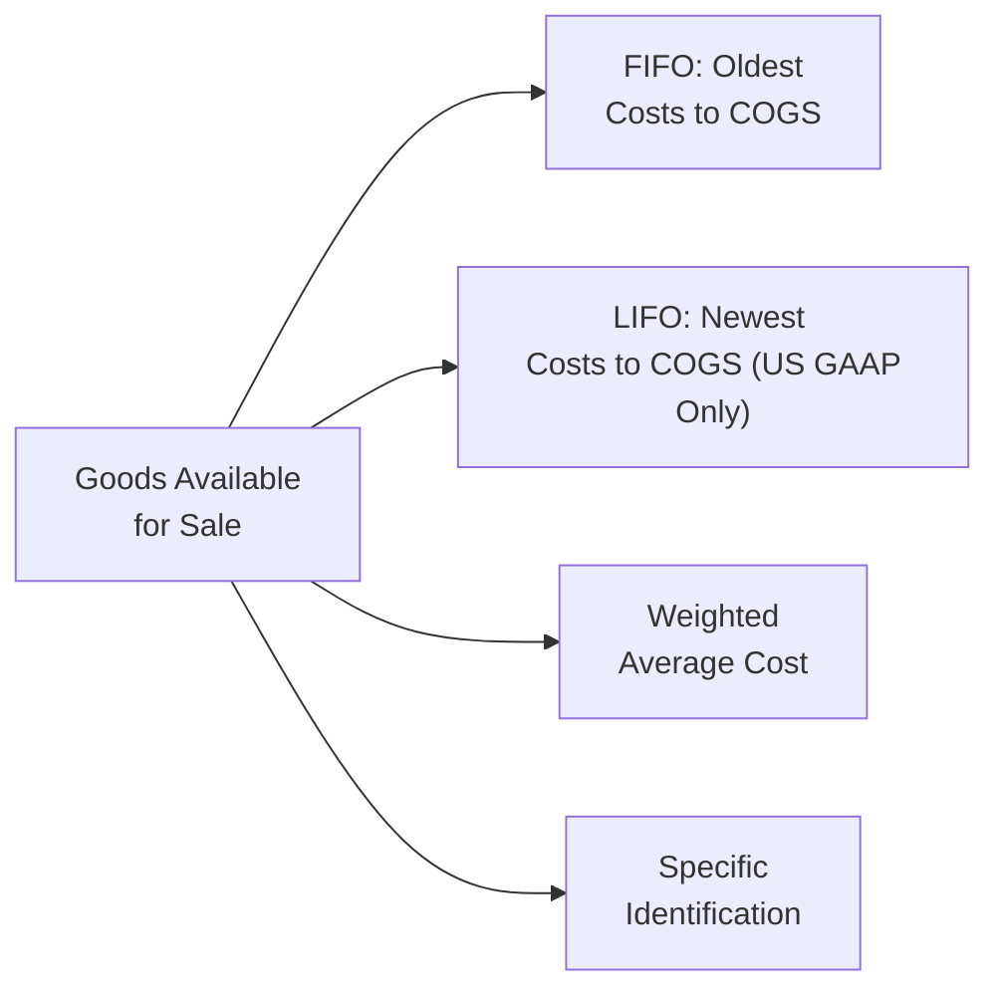

## Introduction and Overview

If you’ve ever peeked into a busy warehouse—stacked full of boxes that all look the same—it might be tempting to think that it doesn’t really matter which ones get sold first. Yet, in the world of financial reporting, the method a firm chooses to keep track of those identical boxes can significantly affect reported earnings, taxes, and even the appearance of the firm’s balance sheet. That’s the essence of inventory costing methods. And hey, I remember a conversation with a friend of mine (a CFO at a mid-sized manufacturing outfit) who was puzzled by how drastically her company’s choice of inventory method impacted quarterly results. She was constantly juggling concerns about taxes, net income volatility, and ensuring compliance with the relevant accounting standards. 

In this section, we’ll explore the various cost flow assumptions under IFRS (IAS 2) and US GAAP (ASC 330-10-30). Consequently, you’ll gain insights into how these choices affect reported financial statements—and, just as importantly, what that means during your exam and real-world analysis. Let’s have a look.

## Permissible Methods under IFRS

IFRS (IAS 2) permits three main inventory costing methods:

• FIFO (First-In, First-Out)  
• Weighted Average Cost (WAC)  
• Specific Identification  

In a nutshell, IFRS forbids LIFO (Last-In, First-Out). This point alone often raises eyebrows because many companies in the United States have historically used LIFO to manage taxable income during inflationary periods (more on that in a bit).

### FIFO (First-In, First-Out)
FIFO assumes that the oldest items in inventory are sold first. In times of rising prices (i.e., inflationary environments), using FIFO typically means lower cost of goods sold (COGS) and higher net income. That’s because you are “expensing” the earlier, cheaper items first. However, your ending inventory on the balance sheet will reflect the cost of the most recent (and often most expensive) purchases.

### Weighted Average Cost (WAC)
If you’ve ever tried to spread the cost of a big grocery bill over lots of family members, you can kind of relate to Weighted Average Cost. With WAC, you average the cost of all similar goods available for sale during the period. Then you use that average to value both COGS and the ending inventory. This tends to smooth out the impact of price fluctuations because you don’t strictly say “the oldest items are gone first” (as under FIFO) nor “the newest items are gone first” (as under LIFO). Instead, you’re applying a blended cost.

### Specific Identification
Specific Identification tracks the exact cost of each individual item in inventory—plain and simple. This method is typical when inventory items are unique and have significantly different costs (think custom machinery, high-end jewelry, or real estate properties). Under IFRS as well as US GAAP, Specific Identification is acceptable, but it can be cumbersome for large volumes of identical or nearly identical items.  

## Permissible Methods under US GAAP

US GAAP (ASC 330-10-30) permits all the methods IFRS allows—so FIFO, Weighted Average Cost, and Specific Identification—plus one extra: LIFO. This additional method can drastically change the reported numbers:

### LIFO (Last-In, First-Out)
LIFO assumes that the most recently purchased items are sold first. In inflationary periods, those recently acquired items have the highest cost, so using LIFO bumps up the company’s COGS. With higher COGS, companies experience lower taxable income (i.e., a tax advantage in rising price environments). As a result, net income is often lower under LIFO compared to FIFO during inflation. 

However, if prices decline or the environment is deflationary, LIFO can yield different outcomes that aren’t always favorable. And when inventory layers built under LIFO get “liquidated” (because you sell more than you purchase), it can produce unexpectedly low COGS, thus inflating income in a way that reveals older, cheaper layers in the inventory account.

## Why LIFO Is Prohibited Under IFRS

IFRS disallows LIFO primarily because it can distort inventory valuations on the balance sheet—especially if the firm accumulates old, cheaper layers of inventory over multiple inflationary years. IFRS aims to offer financial statements that reliably reflect current economic realities. Because LIFO generally uses the oldest costs in ending inventory, it might understate the value of the remaining inventory and complicate cross-company comparisons.  

## Visualizing Cost Flow Methods

Below is a simple flowchart showing how “Goods Available for Sale” are channeled into different cost-flow assumptions. Each node shows a distinct approach for assigning costs to COGS and inventory:

## The LIFO Reserve

When a company using LIFO under US GAAP wants to provide additional transparency, they disclose the so-called LIFO reserve. This reserve is the difference between:

• Inventory valued under LIFO, and  
• Inventory valued under FIFO (or Weighted Average Cost).  

Analysts often add the LIFO reserve back to the LIFO-based inventory figure to approximate how inventory would have been valued under FIFO. This helps even out comparisons between a US-based company using LIFO and an IFRS-based (or FIFO-based) company.

In practice, you might see a footnote that says something like, “Our LIFO reserve at year-end 20XX was \$100 million.” If you add \$100 million to the LIFO inventory reported on the balance sheet, you’re approximating what the inventory would look like using FIFO. This approach helps standardize ratio analysis and peer comparisons.

## Changing from LIFO to Another Method

US GAAP allows companies to change from LIFO to, say, FIFO or Weighted Average. However, accountants must catch up the financial statements to show what would’ve happened if that method was in place all along. Typically this means adjusting retained earnings for the cumulative difference. If you switch away from LIFO, watch for a “one-time” bump in retained earnings—particularly in a long-standing inflationary environment, because FIFO-based inventory might be way larger than LIFO-based inventory.

Under IFRS, you can’t simply switch methods on a whim. IAS 2 requires that a change in cost formula be made only if it results in a more reliable or more relevant presentation of financial information. If that’s not the case, IFRS would frown upon the switch. 

## Analytical Considerations and Consistency

As an analyst—or as a busy finance professional prepping for the CFA exam—it’s important to note that inventory costing methods can dramatically alter reported net income, taxes, and, in some geographies, key profitability ratios like gross margin and net profit margin. Here are some pointers:

• Look for consistency. If a company changes cost flow assumptions too often, that could be a red flag. Ask yourself: Are they trying to manage earnings or optimize taxes?  
• Adjust where needed. If you’re comparing a LIFO-based US firm to an IFRS firm using FIFO, consider adding the LIFO reserve to that US firm’s inventory. Similarly, you can adjust COGS by the change in the LIFO reserve to see what net income might look like under FIFO.  
• Check for unusual motives. Some companies might adopt LIFO precisely because they have a big inflation-driven tax advantage. Conversely, some IFRS firms might prefer Weighted Average because it reduces the volatility of earnings in times of wild price swings.  
• Evaluate the effect on valuations. Inventory is a current asset, so its valuation can affect the working capital calculation, liquidity ratios, and certain solvency measures.  

Remember that IFRS prohibits LIFO, so if you’re analyzing a multinational group or a cross-border merger, you might need to standardize inventory valuations. This is especially relevant in global coverage of industries where local US-based firms compete with IFRS-based firms.

## Spotting Potential Red Flags

Occasionally, changes in inventory costing methods can alert you to possible earnings management. For instance, a sudden shift from FIFO to Weighted Average might be entirely justified if the company’s product lines have changed. But if it happens without a clear explanation—or if it’s timed suspiciously at the end of a poor earnings quarter—it could signal managerial attempts to smooth out reported profits or manipulate share valuations. 

You know how, once in a while, you get suspicious when your friends abruptly change their weekend routine without any apparent reason? It’s the same with inventory reporting: abrupt changes warrant a deeper look into the rationale.

## Practical Example: LIFO Reserve Adjustment

Imagine a US company (let’s call it Maple Manufacturing) that reports inventories at \$1,000,000 under LIFO. Maple’s footnotes reveal a LIFO reserve of \$250,000. If you want to compare Maple’s inventory to an IFRS company’s FIFO-based inventory, you might adjust:

• Inventory (FIFO-equivalent) = Inventory (LIFO) + LIFO Reserve = \$1,000,000 + \$250,000 = \$1,250,000.  
• By extension, you could revise Maple's net income or gross profit if you’re removing the LIFO effect. The difference in COGS is approximately the change in the LIFO reserve for the period.  

## Impact on Taxes

Under US GAAP, LIFO was historically popular in part because it offers a tax advantage during inflationary periods. By reporting higher COGS, a firm can lower its taxable income. Although IFRS disallows LIFO, remember that tax rules differ worldwide; IFRS compliance and local statutory tax rules don’t necessarily overlap one-to-one. Occasionally, a firm might keep “books” in IFRS for reporting but maintain a separate set of records for tax calculations (where permissible).

## Exam Relevance and Integration

For the CFA Level I exam—and indeed beyond—understanding inventory methods is critical for dissecting financial statements accurately. You might see a question that asks you to adjust the statements of a LIFO user to a FIFO basis or to spot the difference in net income for a Weighted Average vs. FIFO scenario. Or you could face a scenario-based item set where a company changes its inventory method mid-stream, and you must figure out the proper adjustments to COGS and retained earnings.  

Here are a few final quick points to remember for test day:

• The “LIFO Reserve” is your friend for bridging differences between FIFO and LIFO.  
• LIFO is not allowed under IFRS.  
• Changing from LIFO to another method typically leads to a one-time retained earnings adjustment.  
• Weighted Average smooths out cost fluctuations.  
• Specific Identification is relevant for unique, high-cost items.  

## Conclusion and Exam Tips

Anytime inventory moves out the door, you have to pick an official cost that goes into COGS. The method that you (or the company you’re analyzing) choose can have ripple effects across the income statement, balance sheet, and ratio analysis. From a CFA exam perspective, you’ll want to be comfortable adjusting between LIFO and FIFO, explaining the theory behind Weighted Average, and recognizing how IFRS and US GAAP differ in their inventory treatment.

On exam day:

• Be ready to recast statements. Don’t panic if you see a question about converting LIFO-based inventory to FIFO-based inventory (it’s often just adding back the LIFO reserve to inventory and adjusting COGS).  
• Look for footnotes. Most questions involving LIFO highlight a footnote with the LIFO reserve. Use that footnote effectively.  
• Watch out for method changes. Assume that any change in cost flow assumptions should be scrutinized carefully unless you’re given a straightforward business reason.  

Accurately understanding these cost flow methods—and how to convert from one to another—will put you in an excellent position not only for the exam but also in practical corporate finance or equity research roles.

## Reference List

• US GAAP “ASC 330-10-30” for inventory cost flow assumptions.  
• International Accounting Standard (IAS) 2 “Inventories.”  
• The Journal of Accounting Research, “Evaluating the Effects of LIFO and FIFO on Company Value.”  

## Self-Assessment: IFRS vs. US GAAP Inventory Methods



### Which of the following inventory costing methods is disallowed under IFRS but permitted under US GAAP?

- [ ] FIFO  
- [ ] Weighted Average Cost  
- [ ] Specific Identification  
- [x] LIFO  

> **Explanation:** IFRS (IAS 2) does not permit LIFO. US GAAP allows LIFO, but only US-based companies typically apply it for tax benefits during inflationary times.

### A firm using LIFO under US GAAP shows ending inventory of $500,000 and discloses a LIFO reserve of $120,000. Which inventory value best approximates FIFO?

- [ ] $380,000  
- [ ] $500,000  
- [x] $620,000  
- [ ] $500,000 minus $120,000  

> **Explanation:** The approximate FIFO value equals LIFO inventory ($500,000) plus the LIFO reserve ($120,000) for a total of $620,000.

### Under IFRS, a company may switch inventory methods only if:

- [ ] The tax authority mandates it.  
- [x] The new method leads to more reliable or relevant information.  
- [ ] The CEO wants to reduce COGS.  
- [ ] The CFO decides to smooth earnings.  

> **Explanation:** Per IAS 2, switching inventory valuation methods is allowed only if it results in a more reliable or more relevant depiction of the entity’s financial position.

### Which method generally smooths out price fluctuations in both COGS and inventory valuation?

- [x] Weighted Average Cost  
- [ ] FIFO  
- [ ] LIFO  
- [ ] Specific Identification  

> **Explanation:** Weighted Average Cost blends the costs of all items during the period, providing a smoother valuation that is less sensitive to volatility in purchase prices.

### A company operating under US GAAP uses LIFO. During a period of inflation, how does LIFO typically impact reported income compared to FIFO?

- [x] LIFO produces lower income than FIFO.  
- [ ] LIFO always produces higher income than FIFO.  
- [x] LIFO results in higher COGS in inflationary periods.  
- [ ] LIFO’s impact on income is identical to that under FIFO.  

> **Explanation:** Because the newest (most expensive) items are “sold” first, COGS goes up during inflationary periods, reducing reported income relative to FIFO.

### Which of the following factors is most likely to drive a company to choose LIFO under US GAAP?

- [x] Desire to reduce taxable income in an inflationary environment  
- [ ] Easier bookkeeping compared to Weighted Average Cost  
- [ ] IFRS compliance rules  
- [ ] Non-unique, standardized inventory items  

> **Explanation:** LIFO can reduce taxable income by assigning higher costs to COGS in times of rising prices, lowering net income and hence taxes.

### What does the LIFO reserve represent?

- [ ] The amount of inventory lost due to spoilage  
- [x] The difference between LIFO inventory and FIFO (or average cost) inventory  
- [x] A measure that analysts use to restate LIFO values to FIFO values  
- [ ] The historical cost of inventory that has never been sold  

> **Explanation:** The LIFO reserve balances the difference in reported inventory under LIFO vs. FIFO or Weighted Average; it’s a critical tool for analysts when comparing companies.

### Under IAS 2, which cost flow assumption is not allowed?

- [ ] FIFO  
- [ ] Weighted Average  
- [ ] Specific Identification  
- [x] LIFO  

> **Explanation:** IAS 2 clearly prohibits the use of LIFO for financial reporting.

### If a company changes from LIFO to FIFO, which of the following usually occurs under US GAAP?

- [x] Retained earnings is adjusted for the cumulative effect of the change in accounting principle.  
- [ ] All prior-period financials remain unchanged.  
- [ ] The company must amortize the difference over three years.  
- [ ] No disclosure of the accounting change is required.  

> **Explanation:** Under US GAAP, a firm changing cost flow methods must disclose the change and adjust retained earnings for the cumulative effect of the difference (retrospective application).

### Under IFRS, LIFO is prohibited primarily because:

- [x] It may not reflect the recent cost of inventory, potentially undermining relevance.  
- [ ] It always increases net income.  
- [ ] It complicates Weighted Average Cost calculations.  
- [ ] It is too conservative.  

> **Explanation:** IFRS focuses on reliable and relevant representation of current economic realities. LIFO’s reliance on older cost layers may distort the true value of remaining stock.  


