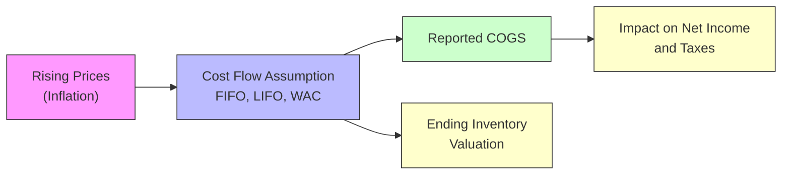

## Introduction and Context

Inventory accounting can be surprisingly tricky—like trying to find your way out of a maze when prices keep changing. I still remember, during my early days as an analyst, inadvertently mixing up FIFO and LIFO assumptions (yes, I’m confessing!), which led me to significantly overstate a client’s profit margins. That experience taught me how the chosen cost flow assumption can dramatically alter reported financials—especially when inflation or deflation enters the picture. In this section, we explore how inflation and deflation each affect key inventory methods (FIFO, LIFO, Weighted Average) and why analysts must carefully interpret reported results to gain a meaningful understanding of performance.

Below, we’ll walk through the specific mechanics of how FIFO, LIFO, and Weighted Average Cost (WAC) respond to changes in price levels. We’ll consider the implications for reported costs of goods sold (COGS), net income, taxes, and—crucially—comparability. We’ll also introduce the concept of hyperinflation as tackled by IAS 29 (Financial Reporting in Hyperinflationary Economies), and how such extreme conditions complicate inventory valuation further.

## The Basic Dynamics of Price Movements

Before diving into each inventory method, let’s clarify two broad categories of economic conditions:

• Inflationary environment: A period when overall prices are rising, meaning inventory purchased later is typically more expensive than earlier purchases.  
• Deflationary environment: A period when overall prices are declining, so inventory purchased at later dates might actually cost less than your earlier units.  

Small fluctuations in prices might not drastically change your analysis, but in extended or volatile periods of inflation or deflation, the method a firm uses to track and value inventory can dramatically shift the numbers you see on the financial statements.

## How Cost Flow Assumptions Operate

Perhaps the best way to understand how different cost flow assumptions interact with inflation or deflation is to recall that these methods (FIFO, LIFO, Weighted Average) are purely accounting conventions. They do not necessarily match the actual physical movement of items. It’s like if you ran a bakery: You might physically use each day’s fresh ingredients first, but for accounting purposes, you might choose to value your oldest flour sacks first or last—it’s purely a book decision, with real financial statement consequences.

### FIFO (First-In, First-Out)

FIFO assumes the first items you purchase or produce are the first items you sell. Consequently, during inflationary periods, your older (cheaper) inventory costs flow to COGS first, leaving newer (more expensive) purchases in ending inventory. This typically yields:

• Lower COGS (relative to LIFO in an inflationary environment)  
• Higher gross margin and net income  
• Higher taxes (because of the higher taxable income)  
• Inventory on the balance sheet heavily reflects more recent (higher) costs  

In a deflationary environment, that dynamic flips. Because your first purchases were more expensive than your later purchases (prices keep dropping), FIFO means:

• Higher COGS (now those older, more expensive units are hitting the income statement)  
• Lower net income  
• Lower tax liability  
• Inventory that sits on the balance sheet at lower (more recent) costs  

### LIFO (Last-In, First-Out)

LIFO assumes the last items purchased or produced are the first units sold. Under inflation, you expense the higher, more recent costs before the older, cheaper costs. This often yields:

• Higher COGS  
• Lower gross margin and net income  
• Lower taxes  
• Inventory on the balance sheet might reflect very low costs from earlier purchases (sometimes extremely outdated if you’ve built up inventory layers over time)  

But in deflation, LIFO reverses its effect. If the most recent purchases cost less than earlier ones:

• Lower COGS  
• Higher net income  
• Possibly higher taxes  
• Balance sheet inventory might still be recorded at older, higher costs  

### Weighted Average Cost (WAC)

Weighted Average Cost, often said to be the middle-of-the-road approach, calculates COGS and ending inventory using an average cost of all units available for sale over a period. WAC can be implemented with either periodic or perpetual systems, but the principle is the same: each unit of inventory, whether sold or still on hand, carries the same average cost. Typically:

• In inflation, COGS and net income land somewhere between those reported under LIFO and FIFO.  
• In deflation, the same principle applies: WAC sits somewhere in between, but leaning closer to FIFO if price changes aren’t too extreme.  

This method can be simpler to implement if you’re not dealing with thousands of diverse inventory items acquired at wildly different times. But in a dynamic, fast-moving price environment, weighted average still smooths out the cost fluctuations to some degree.

## Why Inflation and Deflation Matter So Much

When inflation rises quickly, the difference between FIFO, LIFO, and WAC can be stark. Investors and analysts who compare a FIFO-reporting company directly to a LIFO-reporting competitor might mistake the lower net income under LIFO as an indicator of weaker performance. Conversely, a LIFO firm in a deflationary environment might look suspiciously profitable at first glance. This is why IFRS does not permit LIFO: it can significantly distort comparability in a global context or at least create more complexity when regulators, analysts, or investors want to compare cross-border financial statements.

Also, in hyperinflationary environments (think double or triple-digit annual inflation), it may not be enough to simply choose a cost flow assumption. Under IFRS, IAS 29 requires restating the financial statements based on a general price index to reflect current purchasing power. In such cases, the basic LIFO vs. FIFO vs. WAC question often becomes secondary to broader hyperinflation adjustments. You adjust not just inventories but also monetary items, nonmonetary items, equity, and more.

Below is a diagram summarizing the typical relationships between cost flow assumptions and reported outcomes in an inflationary environment:

## Detailed Look at Gross Margin and Net Income Trends

Gross margin = (Sales – COGS) / Sales

Since your cost flow assumption directly affects COGS, it follows that gross margin is also heavily influenced by the choice of FIFO, LIFO, or WAC. Over time, in an inflationary environment:

• FIFO typically shows the highest gross margin.  
• LIFO typically shows the lowest gross margin.  
• WAC usually ends up in between.  

In a prolonged deflationary environment—less common historically but important to consider—these relationships reverse. FIFO would generally yield higher COGS and lower gross margin, while LIFO would do the opposite. Keep in mind that changes in gross margin due to accounting methods do not necessarily indicate real changes in operating efficiency. That’s one reason many analysts try to restate statements to a common method when comparing companies.

## Hyperinflation and IAS 29

When inflation reaches extreme levels, IFRS requires applying the guidance of IAS 29 (Financial Reporting in Hyperinflationary Economies). Let’s face it, a 100% annual inflation rate (or more) makes normal financial reporting sound a bit surreal. IAS 29 instructs that all nonmonetary items—inventory included—be restated based on a recognized general price index. Essentially, you inflate historical costs to reflect current purchasing power. This restatement ensures that your statements remain, at least theoretically, relevant to users.

In practice, working in a hyperinflationary environment is a logistical headache, involving constant updates to general price indexes, frequent revaluation of monetary and nonmonetary items, as well as additional disclosures in the notes. Under U.S. GAAP, there isn’t an explicit standard for hyperinflation on par with IAS 29, but U.S. GAAP does address certain remeasurement and restatement principles (particularly when consolidating foreign subsidiaries operating in hyperinflationary economies).

## Analytical Adjustments for Comparability

Now, at some point you’ll likely want to compare two or more companies that do business in different inflationary contexts or use different inventory methods. For instance, you might compare a U.S.-based retailer using LIFO to a European competitor that, under IFRS, must use FIFO or Weighted Average. In such a scenario, it’s often useful to adjust both sets of statements so that they both reflect, say, FIFO inventory balances and COGS. You might see references to a “LIFO reserve,” which is the difference between LIFO inventory reported on the balance sheet and what that inventory would have been if using FIFO.  

Adjusting the company’s reported figures by the LIFO reserve can help you approximate what reported margins, net income, and inventory values would be under FIFO. This is typically straightforward if the firm regularly discloses the LIFO reserve in the footnotes. Keep in mind that repeated inflation year over year can push the LIFO reserve to accumulate. However, if a company starts liquidating older LIFO layers—meaning they sell inventory from older periods priced drastically lower—watch out for potential one-time gains in net income that do not reflect normal operating performance.  

## Practical Example: Tracking Inventory in Inflation

Let’s run a short numerical example. Suppose your company has rising purchase costs for the same item over three transactions:

• Purchase 1: 100 units at $10 each  
• Purchase 2: 150 units at $12 each  
• Purchase 3: 50 units at $13 each  
• Let’s say you sold 200 units total.  

Under FIFO:

1) The first 200 units come from the first two purchases (100 at $10 and 100 out of the 150 at $12).  
2) Average cost for those 200 units is [(100 × $10) + (100 × $12)] ÷ 200 = $11.  
3) COGS = 200 × $11 = $2,200.  

Under LIFO:

1) The first 50 units sold come from Purchase 3 at $13, then the next 150 from Purchase 2 and 1. Specifically, you’d use all 150 from Purchase 2 (if needed) and then 0 from Purchase 1 for your final 50 units.  
2) COGS = (50 × $13) + (150 × $12) = $650 + $1,800 = $2,450.  

Under Weighted Average (periodic):

1) Total cost of 300 units = (100 × $10) + (150 × $12) + (50 × $13) = $1,000 + $1,800 + $650 = $3,450.  
2) Weighted average cost per unit = $3,450 ÷ 300 = $11.50.  
3) For 200 units sold, COGS = 200 × $11.50 = $2,300.  

Notice the differences:

• FIFO’s COGS = $2,200 (lowest COGS; highest net income).  
• WAC’s COGS = $2,300 (somewhere in between).  
• LIFO’s COGS = $2,450 (highest COGS; lowest net income).  

This difference in COGS cascades to gross margin, taxes, and net income. In a deflationary scenario, the ranking reverses (LIFO would produce lower COGS, FIFO higher, etc.).

## Implications for Financial Ratios

Investors and analysts who like ratio analysis must be vigilant: Key ratios such as gross profit margin, net profit margin, inventory turnover, and even return on equity can look very different under alternative cost flow assumptions.

• Inventory Turnover = COGS / Average Inventory. 
  If LIFO inventory balances are very low because the oldest layers remain on the balance sheet, turnover could appear artificially high.  

• Gross Margin = (Sales – COGS) / Sales. 
  LIFO might yield a lower gross margin if prices are rising.  

• Return on Assets (ROA) = Net Income / Average Total Assets. 
  Net income and the carrying value of inventory both affect this ratio.  

Hence, it’s prudent to track the inventory method in use and adjust if needed for cross-company comparisons.

## Real-World Anecdotes

I once consulted for a specialty food import business that chose Weighted Average because their goods had widely varying shelf lives—some quickly perishable, some with a year or two of stable shelf life. The CFO joked that Weighted Average was “the path of least headaches,” but with recent high inflation in shipping and commodity prices, the firm realized Weighted Average might mask the real margin impacts of rising costs. They ended up disclosing more granular cost data so analysts could see how inflation influenced specific product lines.

## Best Practices and Potential Pitfalls

• Pay attention to inventory method disclosures in the footnotes. That’s where you’ll often find details about the LIFO reserve or revaluation differences.  
• In a rapidly changing inflationary environment, re-evaluate your assumptions often—don’t rely on last quarter’s cost figures.  
• Look out for accounting policy changes. A switch from LIFO to FIFO (or vice versa, if allowed in a jurisdiction) can significantly alter comparability over time.  
• In hyperinflationary conditions, normal financial statements can be misleading. Always check for restatement using price indices per IAS 29 or relevant local GAAP.  

## Exam Tips

• Be prepared to interpret how changes in prices affect reported income under different inventory methods—especially LIFO vs. FIFO.  
• Know the direction: in inflation, FIFO yields lower COGS, whereas LIFO yields higher COGS. In deflation, that reverses.  
• Make sure you’re comfortable using the LIFO reserve to convert LIFO-based statements into approximate FIFO-based figures for better comparability.  
• Understand how hyperinflation requires financial statement restatements. You might be tested on the conceptual side (IAS 29 guidelines) and also the numerical impact.  
• Practice with ratio analysis. The exam might ask you to identify how a change in inventory method affects margin, turnover, or return ratios.  

## References and Further Reading

• IAS 29, “Financial Reporting in Hyperinflationary Economies” (IFRS).  
• Whittington, G. (1983). “Inflation Accounting.” Cambridge University Press.  
• U.S. GAAP codification references on inventory methods (ASC 330).  
• IFRS Foundation website (https://www.ifrs.org/) for ongoing updates to inventory and hyperinflation standards.  

---

## Test Your Knowledge: Inventory Methods in Inflationary and Deflationary Contexts



### Which inventory method generally reports the lowest COGS in a period of rising prices (inflation)?  
- [x] FIFO  
- [ ] LIFO  
- [ ] Weighted Average  
- [ ] Specific Identification  

> **Explanation:** In inflationary environments, FIFO costs out the oldest (cheapest) inventory first, thus reporting lower COGS.

### In a deflationary environment, which method tends to produce the highest net income?  
- [ ] FIFO  
- [x] LIFO  
- [ ] Weighted Average  
- [ ] Retail Method  

> **Explanation:** Under falling prices, LIFO costs out the newest (cheapest) inventory first, leading to lower COGS and thus higher net income.

### Under IFRS, which inventory cost flow assumption is not allowed?  
- [ ] FIFO  
- [ ] Weighted Average  
- [x] LIFO  
- [ ] Specific Identification  

> **Explanation:** IFRS rules prohibit LIFO for financial reporting because it can distort comparability and does not align with IFRS principles.

### Which cost flow assumption can provide a middle-ground COGS figure between FIFO and LIFO in a stable inflation environment?  
- [ ] Specific Identification  
- [ ] FIFO  
- [x] Weighted Average  
- [ ] Retail Method  

> **Explanation:** Weighted Average Cost usually yields results (COGS and net income) that fall between FIFO and LIFO in an inflationary scenario.

### What is the primary purpose of the LIFO reserve disclosed in a company’s financial statements?  
- [ ] To record inventory obsolescence  
- [ ] To adjust for changes in freight costs  
- [x] To reconcile inventory under LIFO to a FIFO basis  
- [ ] To identify intangible assets related to inventory  

> **Explanation:** The LIFO reserve tracks the difference between inventory costs using LIFO and what they would have been under FIFO, facilitating comparability.

### In an inflationary period, if the company switches from LIFO to FIFO, which of the following effects might you expect?  
- [x] Higher taxable income  
- [ ] Lower ending inventory  
- [ ] Lower gross margin  
- [ ] Lower net income  

> **Explanation:** Transitioning from LIFO to FIFO in an inflationary period typically moves COGS downward, raising taxable income and net income.

### Hyperinflationary accounting under IAS 29 requires a company to:  
- [ ] Freeze inventory valuation until inflation stabilizes  
- [x] Restate financial statements using a general price index  
- [ ] Disclose inflation multipliers in footnotes only  
- [ ] Switch from LIFO to FIFO  

> **Explanation:** IAS 29 mandates the restatement of nonmonetary items, including inventory, based on a relevant price index to maintain the relevance of financial statements.

### During inflation, a company using LIFO could see artificially high inventory turnover ratios because:  
- [x] Inventory on the balance sheet is carried at older, often lower, costs  
- [ ] The newest units are recorded at the lowest costs  
- [ ] LIFO ensures the ending inventory is updated to current prices  
- [ ] LIFO automatically restates inventory for inflation  

> **Explanation:** Under LIFO, ending inventory often consists of older (cheaper) layers, so the balance sheet inventory can be understated, boosting the turnover ratio.

### If prices fluctuate frequently, which inventory method might best smooth out COGS volatility?  
- [ ] LIFO  
- [x] Weighted Average  
- [ ] FIFO  
- [ ] Specific Identification  

> **Explanation:** Weighted Average Cost blends the cost of different purchases, reducing the impact of price volatility on periodic COGS figures.

### True or False: In a hyperinflationary economy, standard FIFO or LIFO reporting is typically sufficient without any further restatement.  
- [ ] True  
- [x] False  

> **Explanation:** In hyperinflationary contexts, IAS 29 requires restatement of financials to reflect current purchasing power, making standard FIFO or LIFO alone insufficient.


