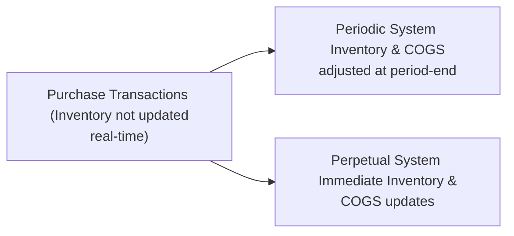

## Introduction

If you’ve ever spent a cold Saturday morning physically counting boxes in a warehouse (trust me, I’ve been there!), you’ve already experienced a slice of inventory management. It can be tedious—counting, recounting, and praying you’ll finish before lunchtime. Yet, accurate inventory measurements are absolutely essential for determining the cost of goods sold (COGS), ending inventory, and ultimately, a company’s profitability.

In financial statement analysis, the choice between a Periodic or a Perpetual Inventory System has implications that go way beyond how many weekends you might spend counting stock. It can affect reported profits, influence management decisions, and shape the perception of a firm’s operational efficiency. This section explores both systems, from the nitty-gritty definitions to the advanced considerations relevant in accounting frameworks such as IFRS and US GAAP.

## Overview of Inventory Systems

Inventory accounting systems track the cost of products a company holds for sale. The two primary systems for accomplishing this tracking are the Periodic Inventory System and the Perpetual Inventory System.

• Periodic System: Updates inventory (and derives COGS) only at the end of the accounting period—monthly, quarterly, or annually.  
• Perpetual System: Updates inventory balances in real time with each purchase or sale transaction.

Although that distinction sounds straightforward, each approach has subtleties that can change how you interpret a company’s financial statements, especially when analyzing cost flows, margins, or turnover ratios.

## Periodic Inventory System

In a Periodic Inventory System, companies maintain a Purchases account to record all inventory acquisitions throughout the period. However, they do not update inventory or COGS on a continuous basis. Instead, a physical count of the ending inventory is performed at the end of the period, and an adjusting entry determines COGS for the whole period. It’s a bit like waiting until the end of a road trip to figure out how many gallons of gas you’ve used in total, rather than tracking consumption after each stop.

Under this system:

• Purchases are recorded in a temporary account (often called "Purchases"), instead of immediately increasing the "Inventory" account.  
• At period-end, the company physically counts inventory and determines the cost of goods still on hand.  
• Using the formula (Beginning Inventory + Purchases – Ending Inventory = Cost of Goods Sold), companies derive COGS.  

This system tends to be less resource-intensive on a daily basis but might open the door to certain inefficiencies or inaccuracies—especially if shrinkage, theft, or damage occurs frequently and goes unnoticed until the period-end count.

### Advantages of the Periodic System

1. Simplicity of Daily Record-Keeping: You don’t constantly update inventory or COGS; you simply tally up purchases throughout the period.  
2. Less Expensive to Implement: Historically preferred by smaller businesses with minimal or predictable inventory traffic.  

### Disadvantages of the Periodic System

1. Delayed Awareness: Management only gets an accurate view of ending inventory and COGS after the period ends.  
2. Higher Chance of Shrinkage Unnoticed: Theft, damage, or administrative errors might remain hidden until the physical count occurs.  
3. More Scramble at Period-End: The physical count can be time-consuming, especially if you’re dealing with multiple storage locations or large volumes of goods.

## Perpetual Inventory System

A Perpetual Inventory System updates the "Inventory" and "COGS" accounts as soon as each transaction takes place. Every single sale triggers an immediate reduction in inventory and a corresponding entry to COGS. Every purchase updates the "Inventory" account concurrently. It’s a bit like wearing a fitness tracker that reports your daily step count in real time—no guesswork, no waiting until month-end to realize you fell short of your step goal.

### Advantages of the Perpetual System

1. Real-Time Accuracy: You can check inventory levels and cost flow status at any moment.  
2. Better Control Over Shrinkage: Discrepancies and theft can be highlighted quickly, improving internal controls.  
3. Enhanced Reporting and Analysis: Companies can generate up-to-date financial and operational reports.  

### Disadvantages of the Perpetual System

1. Resource-Intensive: Requires robust software systems and potentially more staff training.  
2. Higher Initial Cost: Implementing barcode scanners, RFID technology, or integrated ERP systems can be expensive.  
3. Ongoing Maintenance: Despite automation, data entry errors or system lags can occur, and inventory still needs periodic physical checks to confirm accuracy.

## Key Differences in Reported Financials

The method a company chooses can lead to variations in COGS and inventory values, especially if the firm uses Last-In, First-Out (LIFO) or an Average Cost method. Under First-In, First-Out (FIFO), periodic and perpetual results typically match, but let’s explore why that might not be the case for other cost-flow assumptions.

### LIFO and Average Cost Disparities

• LIFO (Last-In, First-Out): Under a periodic system, the company determines which goods were “last in” only at the end of the period. Under a perpetual system, “last in” is determined after each batch of purchases, so the COGS and ending inventory can differ slightly (or significantly, if prices fluctuate).  

• Weighted Average Cost: Under a periodic approach, the average cost is computed at the end of the period based on total units available and total cost. Under a perpetual system, the average is recalculated each time new items are purchased. This “moving average” approach can yield different unit costs throughout the period.

### FIFO Consistency

• FIFO (First-In, First-Out): Whether a company is using a periodic or a perpetual system, the oldest inventory layers are assumed to be used first. This typically yields identical numbers for both COGS and ending inventory, making FIFO more straightforward if you’re comparing a company that might use different systems in different divisions.

## Diagram: Comparing Periodic and Perpetual Flows

Below is a simple diagram illustrating how purchases and sales update inventory under each system.

In the Periodic box (B), you see no real-time link to Inventory or COGS. Companies store purchase info in a temporary Purchases account and wait until period-end to shift everything to COGS and Inventory. On the Perpetual side (C), each transaction updates Inventory and COGS immediately.

## Impact on Financial Statement Analysis

### Inventory Turnover and Gross Margin

Inventory turnover (cost of goods sold ÷ average inventory) and gross margin (gross profit ÷ net sales) are heavily influenced by both the cost flow assumptions (FIFO, LIFO, Average Cost) and the type of system (Periodic vs. Perpetual). When analyzing a firm:

• Look for Disclosures: Many firms disclose which system they use in the notes. This helps interpret any abrupt change in turnover or margin trends.  
• Assess Consistency: If you compare two firms, it’s ideal to compare those that use similar inventory systems and valuation methods for more reliable ratio analysis.

### Risk of Over- or Understating Inventory

Periodic systems can obscure mid-period changes in inventory levels, which might lead to inaccurate ratio analysis if you’re not aware of big seasonal fluctuations. In some industries, a single big promotional event (say, Black Friday) can drastically change inventory levels. Without a real-time system, the external analyst won’t see that shift until the next official reporting date.

### Additional Considerations Under IFRS and US GAAP

Under IFRS, LIFO is not permitted, so the difference in results between periodic and perpetual is typically less pronounced. For US GAAP reporters using LIFO or Weighted Average, the results can differ more significantly, and those differences often show up in the notes. While IFRS and US GAAP both allow the use of perpetual or periodic systems, IFRS’s exclusion of LIFO narrows the variation you might see in practice.

## Real-World Example

Let’s imagine a sporting goods retailer, called FunSports Co., that previously used a Periodic Inventory System while employing Weighted Average Cost. During a quarter, the total cost of purchases soared by 20% near the end of the period. Under the periodic approach, FunSports would figure out its average cost at the end of the quarter, taking all new purchases (including the higher-cost items) into account. Now, if FunSports switched to a Perpetual System in the following quarter, it would continually update the average cost as purchases come in. Each time items are bought at a higher cost, the average unit cost is updated—not just at quarter-end.

So, if you’re analyzing FunSports’ gross margin between these two quarters, you might see a jump or dip, which could partially reflect a real operational change but might also reflect the difference in how the inventory system captures costs in real time.

## Internal Controls and Shrinkage

Another big reason to opt for a perpetual system is the reduction of shrinkage risk. When inventory is tracked in real time, differences between book quantities and the physical count can be identified much more quickly. In industries such as retail apparel, electronics, or pharmaceuticals—where theft and pilferage can be significant—knowing the exact quantity on hand at any time can help clamp down on losses.

That said, a perpetual system isn’t foolproof. A physical count at least once or twice a year is still recommended. You’d be surprised how many times a system says you have five units on hand, but your employees can’t find them anywhere in the store.

## Best Practices and Common Pitfalls

• Frequent Checks: Even under a perpetual system, periodic physical counts remain essential to catch errors, theft, or administrative slip-ups.  
• Proper Software Integration: If you switch to a perpetual system, make sure your point-of-sale software, warehouse management system, and accounting system talk to each other seamlessly. Nothing’s worse than a misalignment that results in real-time errors.  
• Watch Seasonal Distortions: High seasonality (like holiday seasons) can lead to big differences in beginning and ending inventory counts under a periodic system, skewing the data you rely on for ratio analysis.  
• Don’t Forget IFRS vs. US GAAP Nuances: Especially pay attention if the company uses LIFO under US GAAP. Since IFRS doesn’t allow LIFO, any cross-border comparison might need adjustments or at least a careful interpretive approach.

## Behavioral and Managerial Insights

Interestingly, companies sometimes choose between periodic and perpetual systems based on management style or the complexity of their product lines. More meticulous managers, who prioritize real-time data for decision-making, often prefer the perpetual system. Others, especially those with stable inventory or limited resources, stick with the periodic approach to keep upfront costs and daily complexity in check.

## Integration with Higher-Level Portfolio Analysis

You might be asking, “Why does this matter at the portfolio level if I’m a fund manager looking at a company’s stock? Inventory valuation can drive reported earnings and distort performance metrics, which certainly influences your models for company valuation. A slight difference in COGS can shift net income, potentially affecting forward price-to-earnings (P/E) or enterprise-value-to-EBITDA (EV/EBITDA) multiples you rely on. Thus, whether you’re analyzing a company for an equity fund or incorporating scenario analysis for a private equity project, understanding the nuance of Periodic vs. Perpetual is key.

## Time Management for Exam Setting

On the CFA exam, you might face a scenario-based question on inventory methods. Remember to read carefully which system is being used. Then, see if the question changes the assumption to highlight how results differ. Time is often short on exam day, so keep the fundamentals in mind:

1. Know the Formula for Periodic COGS: Beginning Inventory + Purchases – Ending Inventory.  
2. Recognize the Real-Time Nature of Perpetual: Each sale → immediate credit from Inventory and debit to COGS.  
3. Evaluate the Cost Flow Assumption: LIFO vs. FIFO vs. Weighted Average, and how these might produce different outcomes under each system.  

## Final Exam Tips

• Be comfortable with the mechanics of both systems. Even if you do not have to recite journal entries from memory, understanding them helps you detect errors or manipulations.  
• Memorize the big differences between FIFO, Weighted Average, and LIFO under both systems—particularly Weighted Average, which can differ significantly between periodic and perpetual.  
• Always keep IFRS vs. US GAAP differences in mind—especially the LIFO restriction under IFRS.  
• If you see weird or unexpected ratio movements in a question, consider that the firm might have switched from a periodic to a perpetual system or vice versa (or changed the cost flow assumption).

## References for Further Study

• Horngren, C. T., Datar, S. M., & Rajan, M. V. (Latest Edition). Cost Accounting: A Managerial Emphasis.  
• Kieso, D. E., Weygandt, J. J., & Warfield, T. D. (Latest Edition). Intermediate Accounting.  
• IFRS Foundation. (Latest publication). International Financial Reporting Standards.  
• FASB Accounting Standards Codification (ASC) Section 330 – Inventory (US GAAP).

---------------------------------------------------------------------------

## Mastering Periodic vs. Perpetual Inventory Systems Quiz



### Which of the following statements best describes the key difference between Periodic and Perpetual Inventory Systems?

- [ ] Under the Periodic system, goods are physically counted more often than under the Perpetual system.
- [x] The Periodic system updates COGS and inventory balances at period-end, whereas the Perpetual system updates them continuously.
- [ ] The Periodic system is used only by small businesses, while the Perpetual system is used only by large corporations.
- [ ] There is no noticeable difference; both systems produce identical figures for inventory at all times.

> **Explanation:** The fundamental difference is that the Periodic system calculates inventory and COGS at the end of the accounting period, while the Perpetual system tracks updates in real time.

---

### Under a Periodic Inventory System, which account is typically used to accumulate the cost of all purchases during the accounting period?

- [ ] Inventory
- [ ] Cost of Goods Sold
- [x] Purchases
- [ ] Accounts Payable

> **Explanation:** In a Periodic system, purchases are often recorded in a temporary “Purchases” account. At period-end, these amounts are used to calculate COGS and ending inventory.

---

### Which inventory costing method generally produces the same results under both Periodic and Perpetual systems?

- [ ] Weighted Average Cost
- [ ] Last-In, First-Out (LIFO)
- [x] First-In, First-Out (FIFO)
- [ ] Specific Identification

> **Explanation:** FIFO assumptions typically yield consistent results under both systems because the oldest costs are assumed to be sold first, regardless of how frequently the inventory ledger is updated.

---

### In a Perpetual system, when a sale is made:

- [x] Inventory and COGS are immediately updated.
- [ ] Only the Sales Revenue account is updated.
- [ ] Inventory is updated at the end of the year, but COGS is updated immediately.
- [ ] The Purchases account is credited immediately.

> **Explanation:** A Perpetual system posts a debit to COGS and a credit to Inventory right after each sale, ensuring real-time tracking of goods on hand.

---

### Which of the following is a significant advantage of using a Periodic Inventory System?

- [x] Lower daily record-keeping costs.
- [ ] High real-time accuracy in inventory levels.
- [ ] Immediate recognition of COGS.
- [ ] Less frequent physical counts are necessary.

> **Explanation:** A key advantage of the Periodic method is simplicity: companies do not need to track every transaction in real time, which lowers ongoing record-keeping costs.

---

### How does the Perpetual Inventory System help reduce inventory shrinkage?

- [x] By allowing real-time monitoring of inventory, discrepancies are easier to spot.
- [ ] By eliminating the need for physical counts.
- [ ] By recording all purchases in a Purchases account that is reconciled yearly.
- [ ] By automatically adjusting the cost flow assumption to FIFO.

> **Explanation:** The Perpetual system monitors inventory in real time, prompting immediate checks if recorded levels do not match actual physical quantities.

---

### Under US GAAP, which cost-flow assumption is permitted but is not permitted under IFRS?

- [ ] FIFO
- [x] LIFO
- [ ] Weighted Average Cost
- [ ] Specific Identification

> **Explanation:** IFRS does not allow the LIFO method, while US GAAP explicitly permits it.

---

### If a company experiences fluctuating prices throughout the year, which combination is most likely to yield different results for COGS under Periodic vs. Perpetual?

- [ ] FIFO used under IFRS
- [x] Weighted Average Cost used under US GAAP
- [ ] Specific Identification used under IFRS
- [ ] FIFO used under US GAAP

> **Explanation:** Weighted Average Cost can produce different unit costs when recalculated periodically versus recalculated after each purchase batch under a Perpetual system.

---

### Looking at a retailer’s financial statements, you notice a sudden jump in the COGS ratio during a high-season quarter. Which of the following might be a reasonable explanation?

- [x] A switch from a Periodic to a Perpetual system under Weighted Average Cost.
- [ ] A change from FIFO to FIFO.
- [ ] A significant error in the bank reconciliation statement.
- [ ] Lower sales prices while maintaining a Perpetual system under FIFO.

> **Explanation:** Shifting from Periodic to Perpetual Weighted Average Cost can cause changes in how costs are captured, leading to fluctuations in the reported COGS ratio.

---

### In an exam context, which of the following should you do first when determining how a company calculates its COGS?

- [x] Identify whether it uses a Periodic or Perpetual system and which cost-flow assumption applies.
- [ ] Assume it has switched methods mid-year unless told otherwise.
- [ ] Skip directly to analyzing the statement of cash flows.
- [ ] Compare the ratio of net income to total liabilities.

> **Explanation:** Determine whether the company employs a Periodic or Perpetual system and also clarify the cost-flow assumption (LIFO, FIFO, Weighted Average). This foundation helps interpret COGS properly.


